.. _ERPyA: http://erpya.com
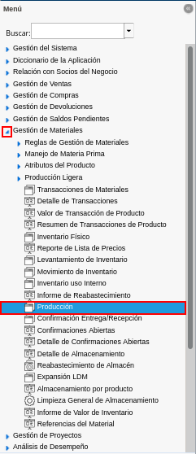
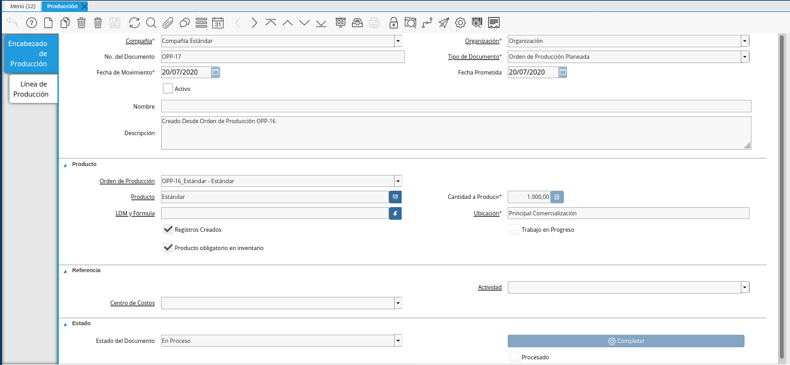
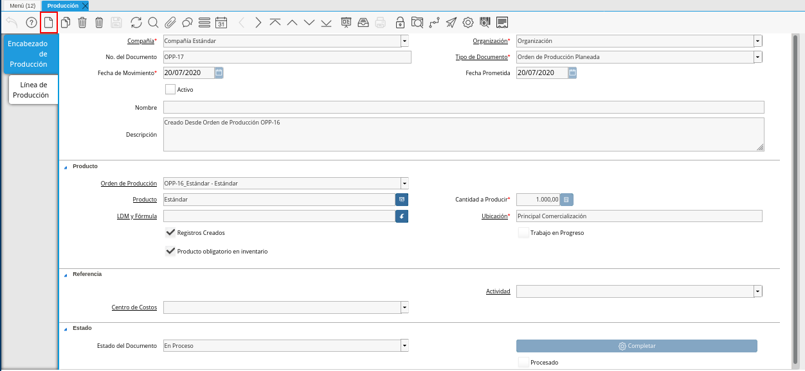
.. |Campo Organización de la Pestaña Encabezado de Producción de la Ventana Producción| image:: resources/organization-field-of-the-Production-Header-tab-of-the-Production-window.png
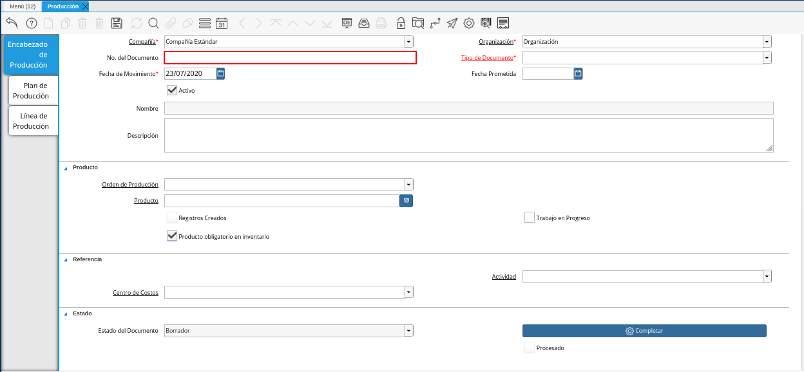
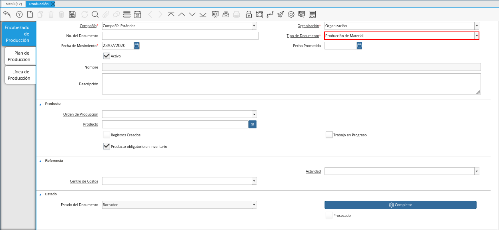
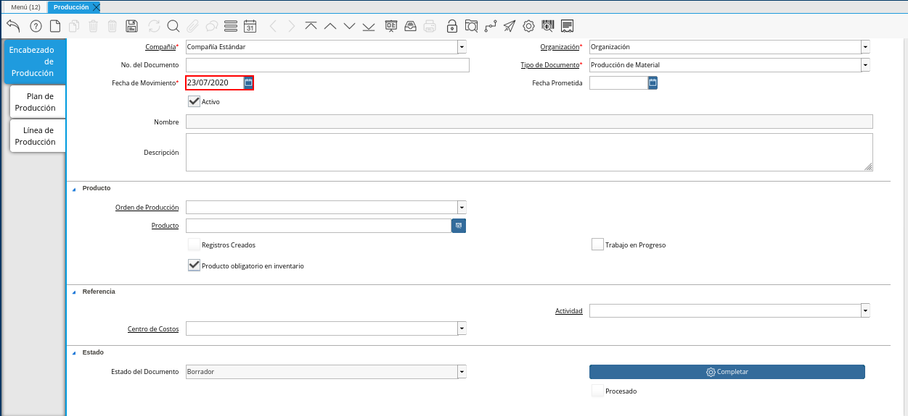
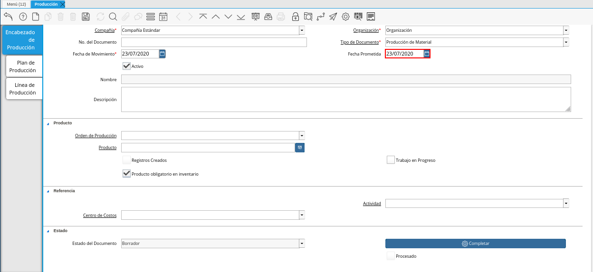
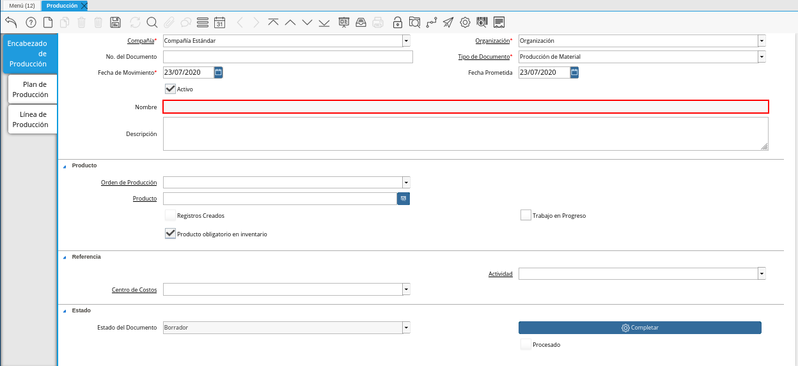
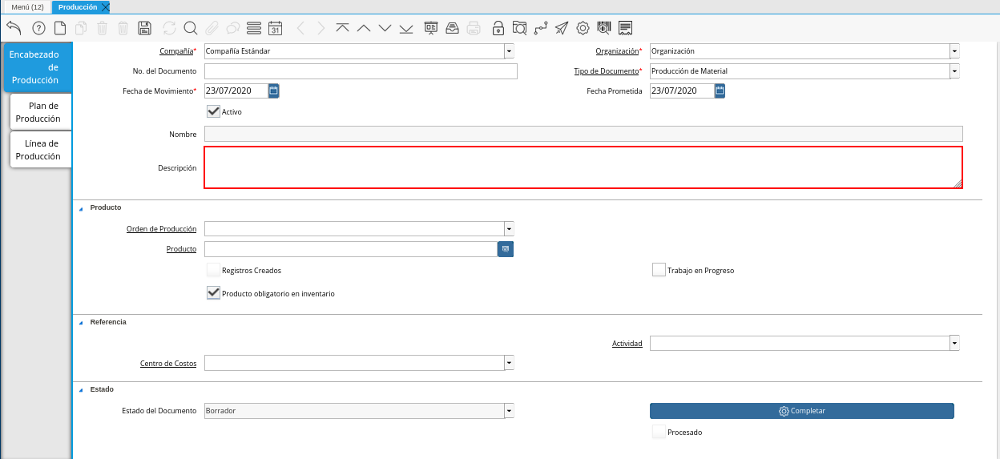
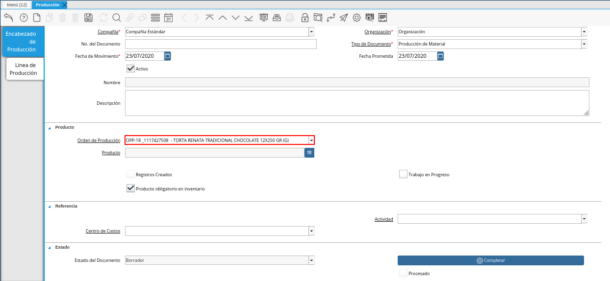
.. |Campo Producto de la Pestaña Encabezado de Producción de la Ventana Producción| image:: resources/product-field-from-the-production-header-tab-of-the-production-window.png
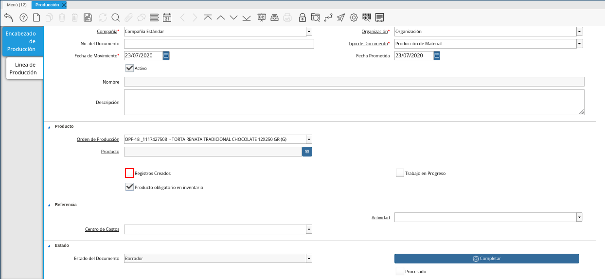
.. |Checklist Trabajo en Proceso de la Pestaña Encabezado de Producción de la Ventana Producción| image:: resources/work-in-process-checklist-from-the-production-header-tab-of-the-production-window.png
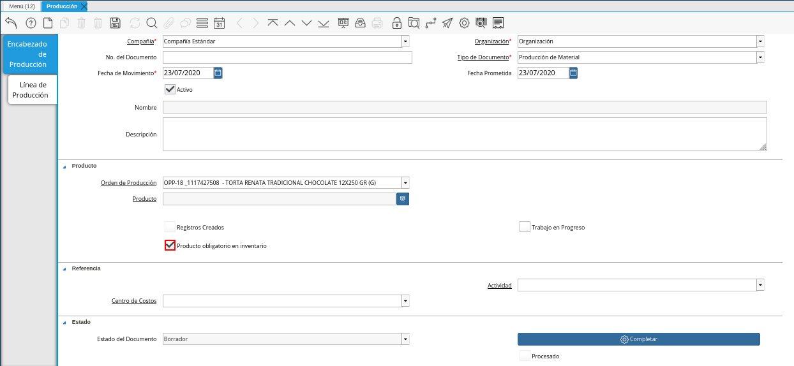
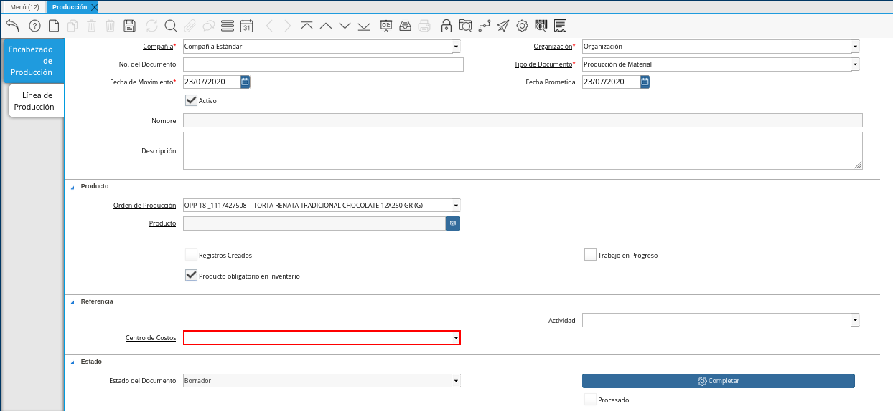
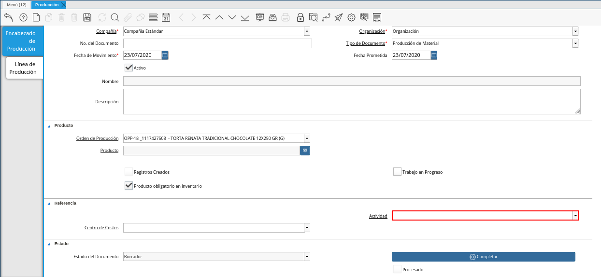
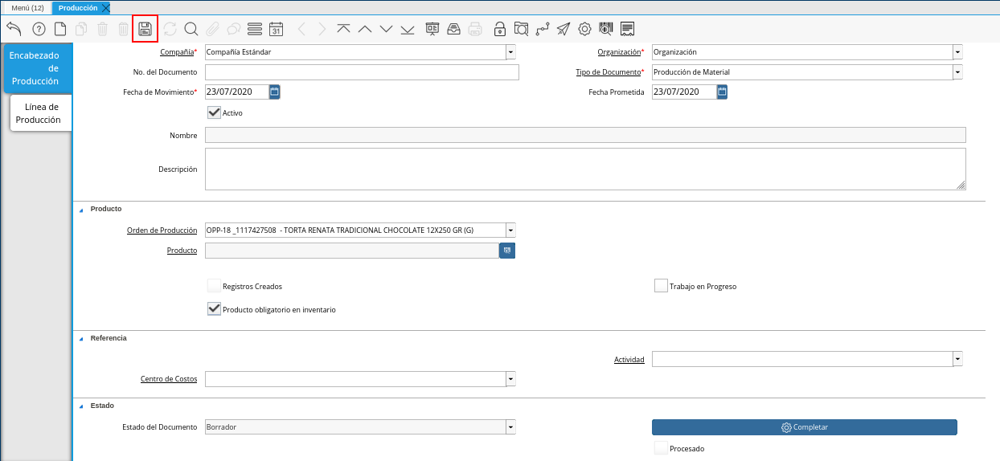
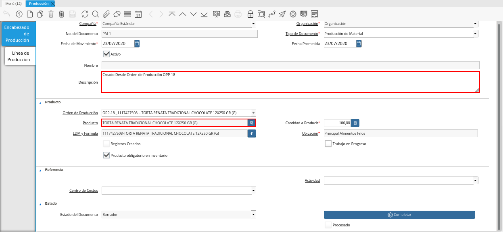
.. |Campo LDM y Fórmula del Producto de la Pestaña Encabezado de Producción de la Ventana Producción| image:: resources/ldm-field-and-product-formula-from-the-production-header-tab-of-the-production-window.png
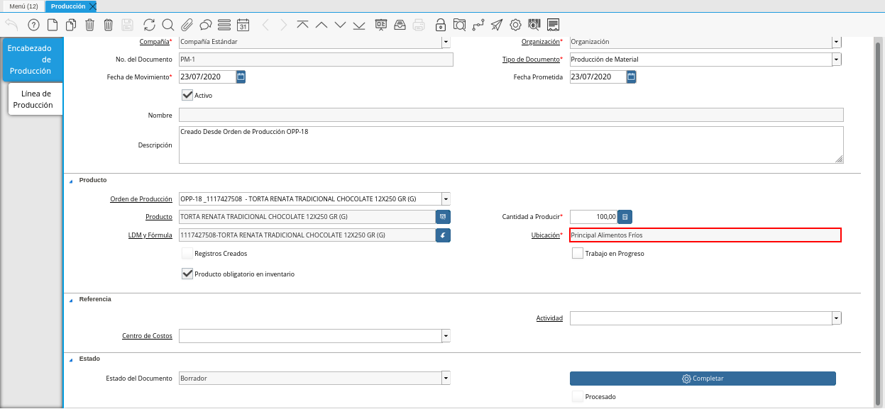
.. |Opción Completar de la Pestaña Encabezado de Producción de la Ventana Producción| image:: resources/complete-option-from-the-production-header-tab-of-the-production-window.png
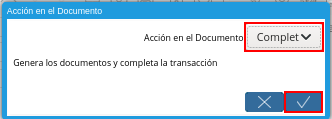

.. _documento/producción:

**Registro de Producción**
==========================

#. Ubique y seleccione en el menú de ADempiere, la carpeta "**Gestión de Materiales**", luego seleccione la ventana "**Producción**".

    |Menú de ADempiere|

    Imagen 1. Menú de ADempiere

#. Podrá visualizar la ventana "**Producción**", con diferentes registros de producción.

    |Ventana Producción|

    Imagen 2. Ventana Producción

#. Seleccione el icono "**Registro Nuevo**", ubicado en la barra de herramientas de ADempiere, para crear un nuevo registro de producción.

    |Icono Registro Nuevo de la Pestaña Encabezado de Producción de la Ventana Producción|

    Imagen 3. Icono Registro Nuevo de la Pestaña Encabezado de Producción de la Ventana Producción

    #. Seleccione en el campo "**Organización**", la organización para la cual esta realizando la orden de producción.

        |Campo Organización de la Pestaña Encabezado de Producción de la Ventana Producción|

        Imagen 4. Campo Organización de la Pestaña Encabezado de Producción de la Ventana Producción

    #. Introduzca en el campo "**No. del Documento**", el número de secuencia correspondiente al documento que esta realizando.

        |Campo No del Documento de la Pestaña Encabezado de Producción de la Ventana Producción|

        Imagen 5. Campo No del Documento de la Pestaña Encabezado de Producción de la Ventana Producción

        .. note::

            Si no es ingresado ningún valor en este campo, ADempiere tomará el número de documento correspondiente a la secuencia que tiene el tipo de documento establecido.

    #. Seleccione el tipo de documento a generar en el campo "**Tipo de Documento Destino**", la selección de este define el comportamiento del documento que se esta elaborando, dicho comportamiento se encuentra explicado en el documento :ref:`documento/tipo-documento` elaborado por `ERPyA`_. 

        |Campo Tipo de Documento de la Pestaña Encabezado de Producción de la Ventana Producción|

        Imagen 6. Campo Tipo de Documento de la Pestaña Encabezado de Producción de la Ventana Producción

    #. Seleccione en el campo "**Fecha de Movimiento**", la fecha en la cual fue realizado el movimiento.

        |Campo Fecha de Movimiento de la Pestaña Encabezado de Producción de la Ventana Producción|

        Imagen 7. Campo Fecha de Movimiento de la Pestaña Encabezado de Producción de la Ventana Producción

    #. Seleccione en el campo "**Fecha Prometida**", la fecha para la cual fue prometida la producción del producto.

        |Campo Fecha Prometida de la Pestaña Encabezado de Producción de la Ventana Producción|

        Imagen 8. Campo Fecha Prometida de la Pestaña Encabezado de Producción de la Ventana Producción

    #. Podrá visualizar que el campo "**Nombre**", donde se debe ingresar el nombre de identificación correspondiente a la producción que se encuentra realizando, se encuentra sólo lectura.

        |Campo Nombre de la Pestaña Encabezado de Producción de la Ventana Producción|

        Imagen 9. Campo Nombre de la Pestaña Encabezado de Producción de la Ventana Producción

    #. Introduzca en el campo "**Descripción**", una breve descripción correspondiente a la producción que se encuentra realizando.

        |Campo Descripción de la Pestaña Encabezado de Producción de la Ventana Producción|

        Imagen 10. Campo Descripción de la Pestaña Encabezado de Producción de la Ventana Producción

        .. note::

            Si no es ingresado ningún valor en este campo al guardar el registro, ADempiere tomará el valor "**Creado Desde Orden de Producción**", seguido del número de documento desde el cual es creado, para este caso el campo descripción queda de la siguiente forma: "**Creado Desde Orden de Producción OPP-18**.

    #. Seleccione en el campo "**Orden de Producción**", la orden de producción planeada por la cual se va a realizar la producción del producto.

        |Campo Orden de Producción de la Pestaña Encabezado de Producción de la Ventana Producción|

        Imagen 11. Campo Orden de Producción de la Pestaña Encabezado de Producción de la Ventana Producción

    #. Podrá visualizar que el campo "**Producto**", donde se debe ingresar el producto correspondiente a la producción que se requiere, se encuentra en sólo lectura ya que su valor será ingresado automáticamente desde la orden de producción seleccionada al guardar el registro de los campos de la pestaña "**Encabezado de Producción**". 

        |Campo Producto de la Pestaña Encabezado de Producción de la Ventana Producción|

        Imagen 12. Campo Producto de la Pestaña Encabezado de Producción de la Ventana Producción

    #. El checklist "**Registros Creados**", indica que fue creado el registro de producción.

        |Checklist Registros Creados de la Ventana Producción|

        Imagen 13. Checklist Registros Creados de la Ventana Producción
        
    #. Seleccione el checklist "**Trabajo en Proceso**", para indicar que la producción se encuentra en proceso.

        |Checklist Trabajo en Proceso de la Pestaña Encabezado de Producción de la Ventana Producción|

        Imagen 14. Checklist Trabajo en Proceso de la Pestaña Encabezado de Producción de la Ventana Producción

    #. El checklist "**Producto Obligatorio en Inventario**", indica que si no hay suficiente cantidad de producto en el inventario; el producto final relacionado a la lista de materiales, no es producido.

        |Checklist Producto Obligatorio en Inventario de la Pestaña Encabezado de Producción de la Ventana Producción| 

        Imagen 15. Checklist Producto Obligatorio en Inventario de la Pestaña Encabezado de Producción de la Ventana Producción

    #. Seleccione en el campo "**Centro de Costos**", el centro de costos correspondiente al registro que esta realizando.

        |Campo Centro de Costos de la Pestaña Encabezado de Producción de la Ventana Producción|

        Imagen 16. Campo Centro de Costos de la Pestaña Encabezado de Producción de la Ventana Producción

    #. Seleccione en el campo "**Actividad**", la actividad correspondiente al registro que esta realizando.

        |Campo Actividad de la Pestaña Encabezado de Producción de la Ventana Producción|

        Imagen 17. Campo Actividad de la Pestaña Encabezado de Producción de la Ventana Producción

    #. Seleccione el icono "**Guardar Cambios**", ubicado en la barra de herramientas de ADempiere, para guardar el registro de los campos de la pestaña **Producción**".

        |Icono Guardar Cambios de la Pestaña Encabezado de Producción de la Ventana Producción|

        Imagen 18. Icono Guardar Cambios de la Pestaña Encabezado de Producción de la Ventana Producción

    #. Al guardar el registro de los campos de la pestaña "**Encabezado de Producción**", podrá visualizar que los campos "**Descripción**" y "**Producto**", son cargados automáticamente, con la información de la orden de producción seleccionada en el campo "**Orden de Producción**".

        |Campos Descripción y Producto Cargados Automáticamente|

        Imagen 19. Campos Descripción y Producto Cargados Automáticamente

    #. Adicional a ello, son habilitados los siguientes campos:
    
        #. El campo "**LDM y Fórmula**", contiene la información seleccionada en el campo "**LDM y Fórmula**" de la orden de producción seleccionada en el campo "**Orden de Producción**".

            |Campo LDM y Fórmula del Producto de la Pestaña Encabezado de Producción de la Ventana Producción|

            Imagen 20. Campo LDM y Fórmula del Producto de la Pestaña Encabezado de Producción de la Ventana Producción

        #. En campo "**Ubicación**", contiene la ubicación para el almacenamiento del producto.

            |Campo Ubicación del Producto de la Pestaña Encabezado de Producción de la Ventana Producción|

            Imagen 21. Campo Ubicación del Producto de la Pestaña Encabezado de Producción de la Ventana Producción

#. Seleccione la opción "**Completar**", para completar el documento "**Producción**" realizado.

    |Opción Completar de la Pestaña Encabezado de Producción de la Ventana Producción|

    Imagen 22. Opción Completar de la Pestaña Encabezado de Producción de la Ventana Producción

#. Seleccione la acción "**Completar**" y la opción "**OK**", para completar el proceso.

    |Acción Completar y Opción OK|

    Imagen 23. Acción Completar y Opción OK de la Pestaña Producción