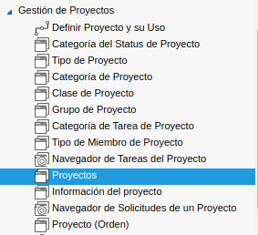
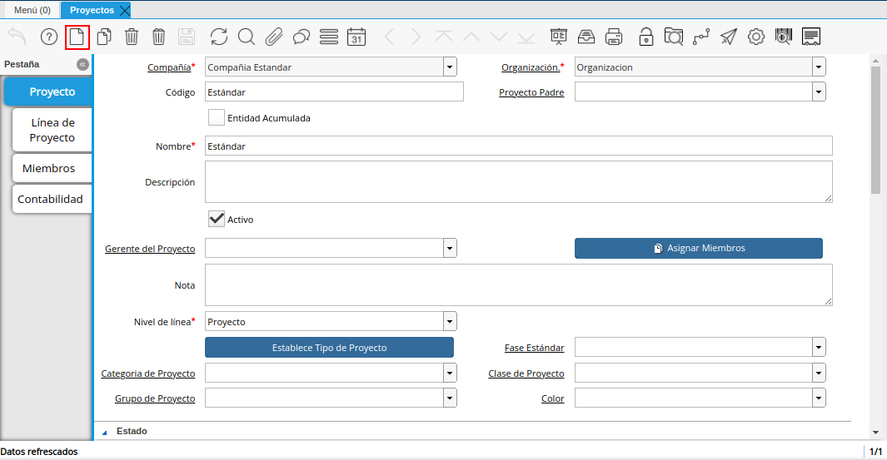
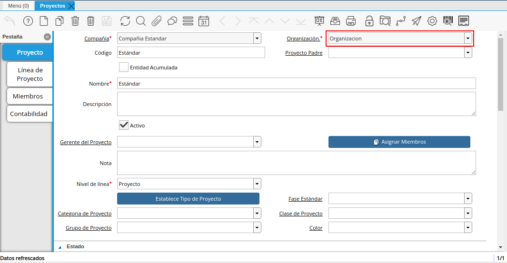
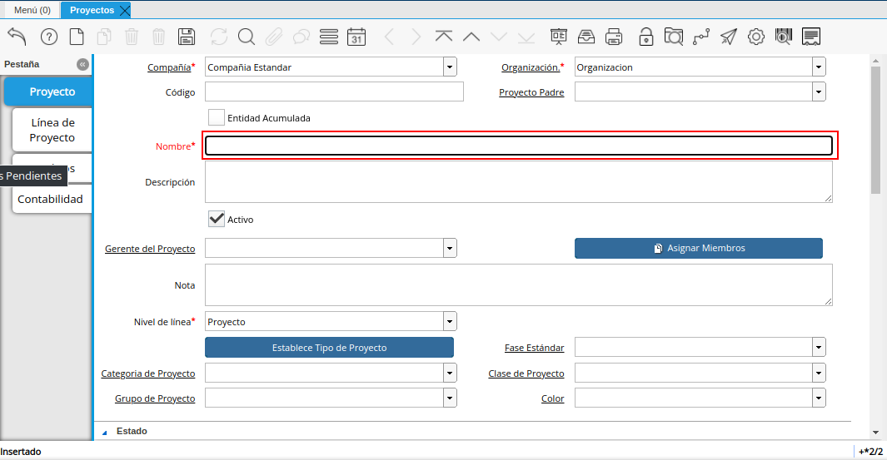
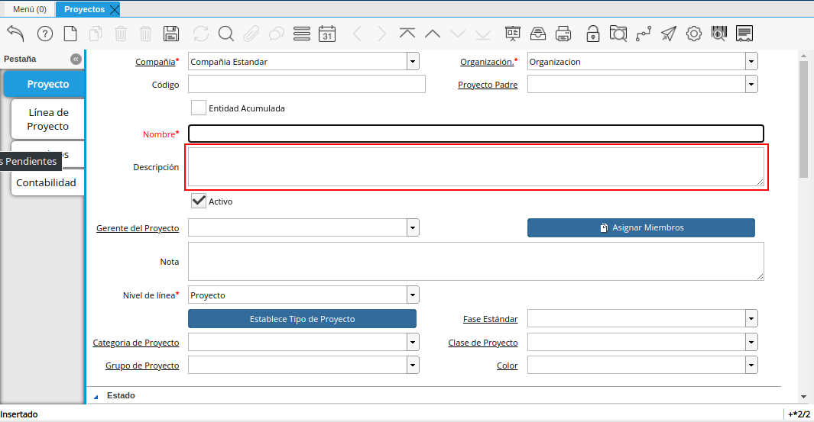
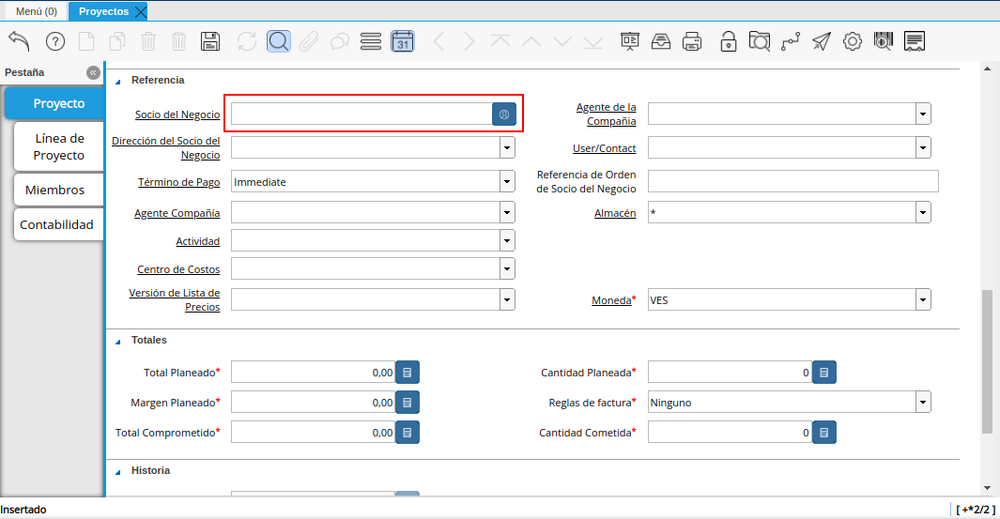

.. |ventana proyecto| image:: resources/seleccionar-archivo.png

.. |nivel linea| image:: resources/nivel-de-linea.png

.. _documento/Gestión de Proyectos:

**Proyectos**
=============

La ventana de proyectos en adempiere es usada para definir los proyectos y los posibles productos a utilizar en dicho proyecto, los cuales serán monitoreados por medio de documentos como las ordenes de venta.

**Registro de un Proyecto**

Ubique y seleccione en el menú de ADempiere, la carpeta **“Gestión de Proyectos**, luego seleccione la ventana **“Proyectos”**.

    |menú de adempiere|

    Imagen 1. Menú de ADempiere

Podrá visualizar la ventana **“Proyectos”**, con todos los registros de proyectos.

    |ventana proyecto|

    Imagen 2 Ventana Proyecto

Seleccione en el icono **“Registro Nuevo”**, ubicado en la barra de herramientas de ADempiere, para crear un nuevo registro en la ventana **“Proyectos”**.

    |nuevo proyecto|

    Imagen 3  Nuevo Registro

Seleccione en el campo **“Organización"**, la organización para la cual esta realizando el documento.

    |organizacion|

    Imagen 4  Organización

Introduzca en el campo **“Nombre”**, el nombre con el que va identificar el proyecto.

    |nombre|

    Imagen 5  Nombre

Introduzca en el campo **“Descripción”**, una breve descripción del proyecto que se encuentra realizando, no es un campo obligatorio por lo tanto es opcional.

    |descripcion|

    Imagen 6  Descripción

Seleccione en el campo **Nivel de línea** el nivel del proyecto, este campo indica como se va a manejar el proyecto que se encuentra realizando, tiene tres opciones: *Fase*, *Proyecto*, *tarea*.

    |nivel linea|

    Imagen 7  Nivel de Linea

Introduzca en el campo **Socio del Negocio** el nombre de la persona o empresa a la que se le esta relizando el proyecto.

    |socio negocio|

    Imagen 8  Socio del Negocio
