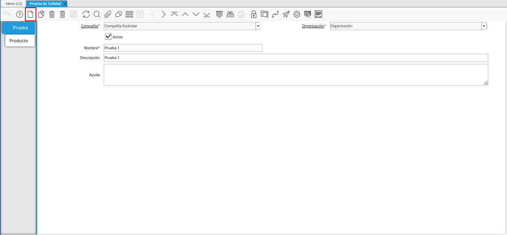
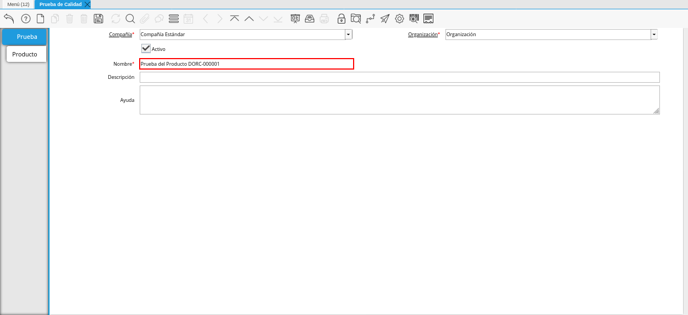
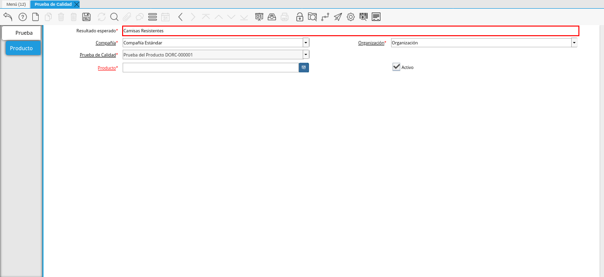
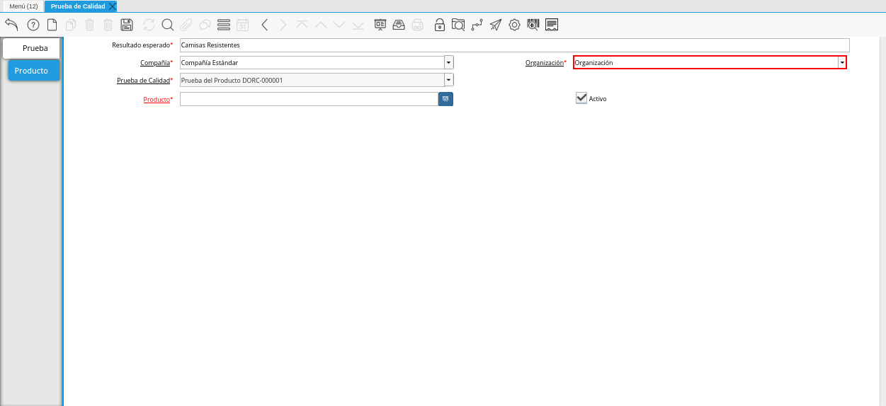

.. |Menú de ADempiere| image:: resources/quality-test-menu.png
.. |Ventana Prueba de Calidad| image:: resources/quality-test-window.png

.. |Campo Organización de la Ventana Prueba de Calidad| image:: resources/field-organization-of-the-quality-test-window.png

.. |Campo Descripción de la Ventana Prueba de Calidad| image:: resources/quality-test-window-description-field.png
.. |Icono Guardar Cambios de la Ventana Prueba de Calidad| image:: resources/icon-save-changes-from-quality-test-window.png
.. |Pestaña Producto de la Ventana Prueba de Calidad| image:: resources/product-tab-of-the-quality-test-window.png

.. |Campo Compañía de la Pestaña Producto de la Ventana Prueba de Calidad| image:: resources/company-field-of-product-tab-window-quality-test.png

.. |Campo Prueba de Calidad de la Pestaña Producto de la Ventana Prueba de Calidad| image:: resources/quality-test-field-of-the-product-tab-of-the-quality-test-window.png
.. |Campo Producto de la Pestaña Producto de la Ventana Prueba de Calidad| image:: resources/product-field-from-the-product-tab-of-the-quality-test-window.png
.. |Icono Guardar Cambios de la Pestaña Producto de la Ventana Prueba de Calidad| image:: resources/save-changes-icon-from-the-product-tab-of-the-quality-test-window.png

.. _documento/prueba-de-calidad:

**Prueba de Calidad**
=====================

#. Ubique y seleccione en el menú de ADempiere, la carpeta "**Gestión de Materiales**", luego seleccione la carpeta "**Producción Ligera**", por último seleccione la ventana "**Prueba de Calidad**".

    |Menú de ADempiere|
    
    Imagen 1. Menú de ADempiere

#. Podrá visualizar la ventana "**Prueba de Calidad**", con todos los registros de prueba de calidad de los productos.

    |Ventana Prueba de Calidad|

    Imagen 2. Ventana Prueba de Calidad

    #. Seleccione el icono "**Registro Nuevo**", ubicado en la barra de herramientas de ADempiere.

        |Icono Registro Nuevo de la Ventana Prueba de Calidad|

        Imagen 3. Icono Registro Nuevo de la Ventana Prueba de Calidad

    #. Seleccione en el campo "**Organización**", la organización para la cual se encuentra realizando el registro.

        |Campo Organización de la Ventana Prueba de Calidad|

        Imagen 4. Campo Organización de la Ventana Prueba de Calidad

    #. Introduzca en el campo "**Nombre**", el nombre correspondiente al registro que se encuentra realizando.

        |Campo Nombre de la Ventana Prueba de Calidad|

        Imagen 5. Campo Nombre de la Ventana Prueba de Calidad

    #. Introduzca en el campo "**Descripción**", una breve descripción referente al registro que se encuentra realizando.

        |Campo Descripción de la Ventana Prueba de Calidad|

        Imagen 6. Campo Descripción de la Ventana Prueba de Calidad

    #. Seleccione el icono "**Guardar Cambios**", ubicado en la barra de herramientas de ADempiere.

        |Icono Guardar Cambios de la Ventana Prueba de Calidad|

        Imagen 7. Icono Guardar Cambios de la Ventana Prueba de Calidad

#. Seleccione la pestaña "**Producto**", para realizar el registro de los campos de la pestaña.

    |Pestaña Producto de la Ventana Prueba de Calidad|

    Imagen 8. Pestaña Producto de la Ventana Prueba de Calidad

    #. Introduzca en el campo "**Resultado Esperado**", el resultado esperado de la prueba del producto.

        |Campo Resultado Esperado de la Pestaña Producto de la Ventana Prueba de Calidad|

        Imagen 9. Campo Resultado Esperado de la Pestaña Producto de la Ventana Prueba de Calidad

    #. Seleccione en el campo "**Compañía**", la compañía para la cual esta realizando el registro.

        |Campo Compañía de la Pestaña Producto de la Ventana Prueba de Calidad|

        Imagen 10. Campo Compañía de la Pestaña Producto de la Ventana Prueba de Calidad

    #. Seleccione en el campo "**Organización**", la organización para la cual esta realizando el registro.

        |Campo Organización de la Pestaña Producto de la Ventana Prueba de Calidad|

        Imagen 11. Campo Organización de la Pestaña Producto de la Ventana Prueba de Calidad

    #. Podrá visualizar en el campo "**Prueba de Calidad**", el nombre ingresado en el campo "**Nombre**", de la pestaña "**Prueba**".

        |Campo Prueba de Calidad de la Pestaña Producto de la Ventana Prueba de Calidad|

        Imagen 12. Campo Prueba de Calidad de la Pestaña Producto de la Ventana Prueba de Calidad

    #. Seleccione en el campo "**Producto**", el producto correspondiente al registro que se encuentra realizando.

        |Campo Producto de la Pestaña Producto de la Ventana Prueba de Calidad|

        Imagen 13. Campo Producto de la Pestaña Producto de la Ventana Prueba de Calidad

    #. Seleccione el icono "**Guardar Cambios**", ubicado en la barra de herramientas de ADempiere, para guardar el registro de los campos de la pestaña "**Producto**".

        |Icono Guardar Cambios de la Pestaña Producto de la Ventana Prueba de Calidad|

        Imagen 14. Icono Guardar Cambios de la Pestaña Producto de la Ventana Prueba de Calidad