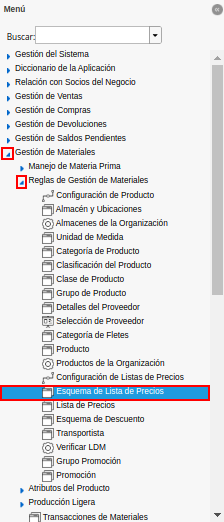
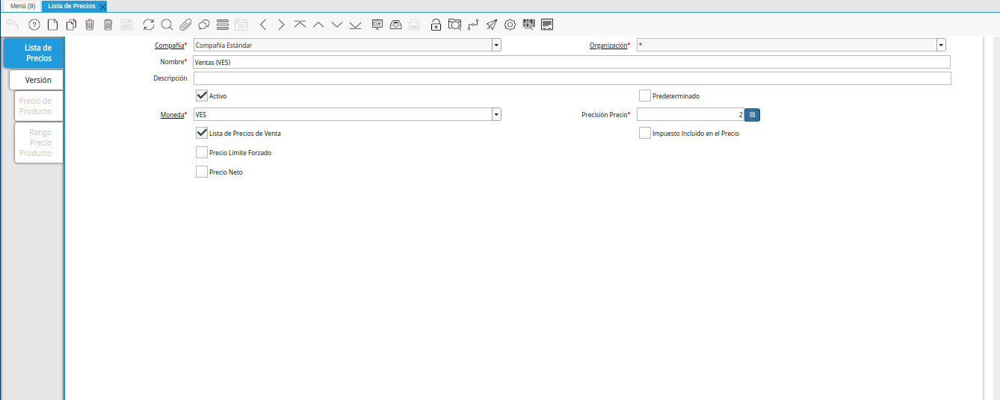
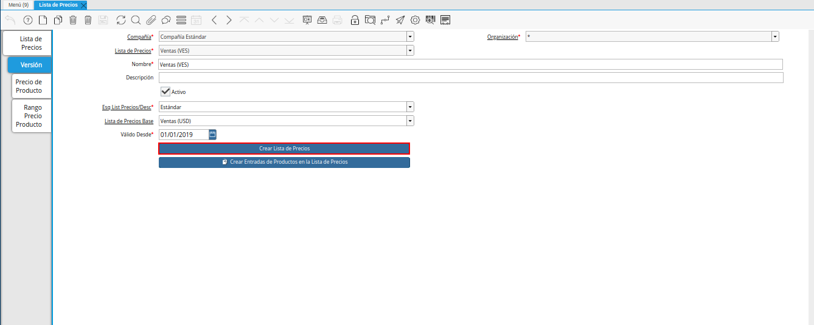

.. |ventana esquema de lista de precios| image:: resources/price-list-schema-window.png
.. |pestaña línea de esquema| image:: resources/outline-line-tab.png
.. |campo tipo de conversión| image:: resources/conversion-type-field.png
.. |campo porcentaje descuento sobre precio de lista| image:: resources/field-percentage-discount-on-list-price.png
.. |menú de adempiere 2| image:: resources/price-list-menu.png

.. |pestaña versión| image:: resources/version-tab.png
.. |campo esq list precios desc| image:: resources/field-esq-list-prices-desc.png
.. |campo lista de precios base| image:: resources/base-price-list-field.png

.. |mensaje de confirmación| image:: resources/confirmation-message.png

.. _documento/proceso-automático-lista-de-precios:

**Proceso Automático de Lsita de Precios**
==========================================

.. _documento/configuración-inicial-lista-precios:

**Configuración Inicial**
-------------------------

#. Ubique y seleccione en el menú de ADempiere, la carpeta "**Gestión de Materiales**", luego seleccione la carpeta "**Reglas de Gestión de Materiales**", por último seleccione la ventana "**Esquema de Lista de Precios**".

    |menú de adempiere|

    Imagen 1. Menú de ADempiere

#. Podrá viualizar la ventana "**Esquema de Lsita de Precios**", con el registro del esquema de lista de precios definida para la organización.

    |ventana esquema de lista de precios|

    Imagen 2. Ventana Esquema de Lista de Precios

#. Seleccione la pestaña "**Línea de Esquema**", para proceder a realizar la configuración inicial del proceso automático de lista de precios.

    |pestaña línea de esquema|

    Imagen 3. Pestaña Línea de Esquema

#. Seleccione en el campo "**Tipo de Conversión**", el tipo de conversión con el cual se va a trabajar. Para este ejemplo el tipo de conversión utilizado es "**BCV**".

    |campo tipo de conversión|

    Imagen 4. Campo Tipo de Conversión

#. En el campo "**% Descuento Sobre Precio de Lista**", se debe ingresar el porcentaje para aplicar como sobre precio.

    |campo porcentaje descuento sobre precio de lista|

    Imagen 5. Campo % Descuento Sobre Precio de Lista

.. note::

    Recuerde guardar el registro de los campos de la ventana, seleccionando el icono "**Guardar Cambios**", ubicado en la barra de herramientas de ADempiere.

.. _documento/ejecución-proceso-lista-precios:

**Ejecución del Proceso**
-------------------------

#. Ubique y seleccione en el menú de ADempiere, la carpeta "**Gestión de Materiales**", luego seleccione la carpeta "**Reglas de Gestión de Materiales**", por último seleccione la ventana "**Lista de Precios**".

    |menú de adempiere 2|

    Imagen 6. Menú de ADempiere

#. Podrá visualizar la ventana "**Lista de Precios**", donde debe ubicar el registro de la lista de precios a utilizar.

    |ventana lista de precios|

    Imagen 7. Ventana Lista de Precios

#. Seleccione la pestaña "**Versión**", para establecer la lista de precios base para la ejecución del proceso.

    |pestaña versión|

    Imagen 8. Pestaña Versión 

#. Seleccione en el campo "**Esq List Precios/Desc**", el esquema de lista de precios previamente configurado con el % de descuento de sobre precios.

    |campo Esq list precios desc|

    Imagen 9. Campo Esq. List. Precios/Desc

#. Seleccione en el campo "**Lista de Precios Base**", la lista de precios base para aplicar el % de descuento de sobre precios.

    |campo lista de precios base|

    Imagen 10. Campo Lista de Precios Base 

    .. note::

        Recuerde guardar el registro de los campos de la ventana, seleccionando el icono "**Guardar Cambios**", ubicado en la barra de herramientas de ADempiere.

#. Seleccione la opción "**Crear Lista de Precios**", para aplicar la configuración de lista de precios definida previamente.

    |crear lista de precios|

    Imagen 11. Opción Crear Lista de Precios

#. ADempiere mostrará la ventana "**Crear Lista de Precios**", con el mensaje de confimración "**Crear precios basado en parámetros de esta versión**", donde debe seleccionar la opción "**OK**" para ejecutar el proceso.

    |mensaje de confirmación|

    Imagen 12. Mensaje de Confirmación