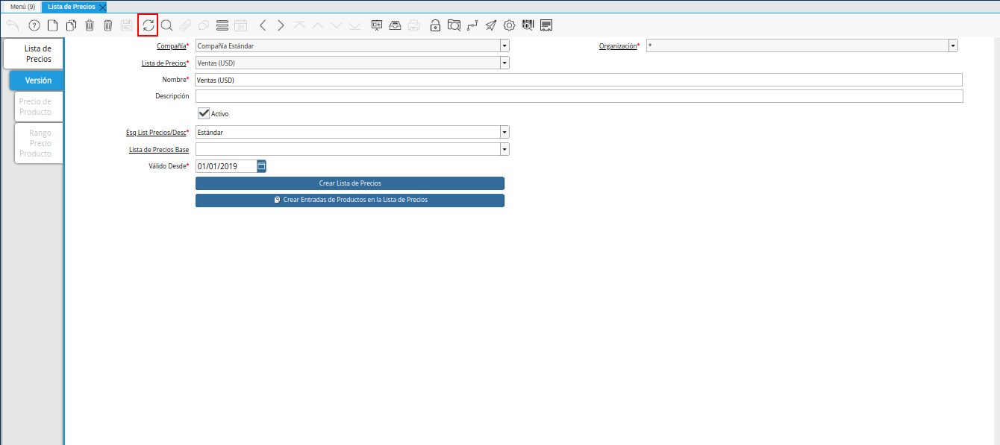

.. |menú de adempiere 2| image:: resources/price-list-menu.png
.. |ventana lista de precios| image:: resources/price-list-window-usd.png
.. |pestaña versión| image:: resources/version-tab-usd.png
.. |crear entradas de productos en lista de precios| image:: resources/create-product-entries-in-price-list.png
.. |opción crear entradas desde el proceso| image:: resources/option-create-inputs-from-process.png
.. |opción comenzar búsqueda| image:: resources/option-start-search.png
.. |ingresar precios de productos| image:: resources/enter-product-prices.png
.. |opción ok para cargar precios| image:: resources/ok-option-to-load-prices.png

.. |pestaña precio producto| image:: resources/product-price-tab.png

.. _documento/crear-entradas-de-productos-en-lista-de-precios:

**Crear Entradas de Productos en Lista de Precios**
===================================================

#. Ubique y seleccione en el menú de ADempiere, la carpeta "**Gestión de Materiales**", luego seleccione la carpeta "**Reglas de Gestión de Materiales**", por último seleccione la ventana "**Lista de Precios**".

    |menú de adempiere 2|

    Imagen 1. Menú de ADempiere

#. Podrá visualizar la ventana "**Lista de Precios**", donde debe ubicar el registro de la lista de precios a utilizar.

    |ventana lista de precios|

    Imagen 2. Ventana Lista de Precios

#. Seleccione la pestaña "**Versión**", para establecer la lista de precios de los productos.

    |pestaña versión|

    Imagen 3. Pestaña Versión 

#. Seleccione ĺa opción "**Crear Entradas de Productos en Lista de Precios**", para establecer los precios de los productos desde el proceso.

    |crear entradas de productos en lista de precios|

    Imagen 4. Opción Crear Entradas de Productos en Lista de Precios

#. También puede acceder al proceso, seleccionando la opción "**Crear Entradas de Productos en Lista de Precios**" desplegada del icono "**Proceso** ubicado en la barra de herramientas de ADempiere.

    |opción crear entradas desde el proceso|

    Imagem 5. Opción Crear Entradas de Productos en Lista de Precios desde el Icono Proceso

#. Podrá visualizar la ventana del proceso, donde debe seleccionar la opción "**Comenzar Búsqueda**" para buscar los productos registrados en ADempiere.

    |opción comenzar búsqueda|

    Imagen 5. Opción Comenzar Búsqueda

#. Al seleccionar el registro del producto se habilitan los tres (3) campos referente a los precios de los productos. Introduzca en cada uno de ellos, los diferentes precios que corresponden a la lista de precios que se encuentra realizando.

    |ingresar precios de productos|

    Imagen 6. Ingresar Precios de Productos

#. Luego de ingresar todos los precios de los productos requeridos, seleccione la opción "**OK**" para cargar dichos precios a la pestaña "**Precio Producto**".

    |opción ok para cargar precios|

    Imagen 7. Opción OK para Cargar Precios

#. Seleccione el icono "**Refrescar**", ubicado en la barra de herramientas de ADempiere, para cargar a la pestaña "**Precio Producto**", la información ingresada en la ventana del proceso "**Crear Entradas de Productos en Lista de Precios**".

    |icono refrescar|

    Imagen 8. Icono Refrescar

#. Seleccione la pestaña "**Precio Producto**", para visualizar los registros cargados desde el proceso "**Crear Entradas de Productos en Lista de Precios**".

    |pestaña precio producto|

    Imagen 9. Pestaña Precio Producto