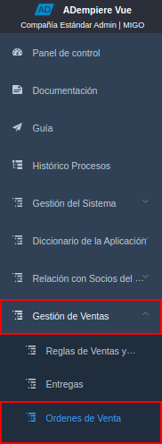
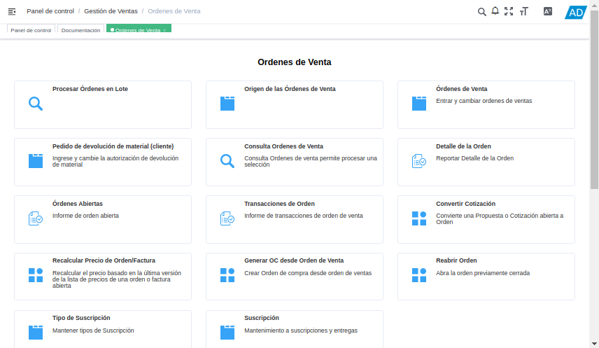
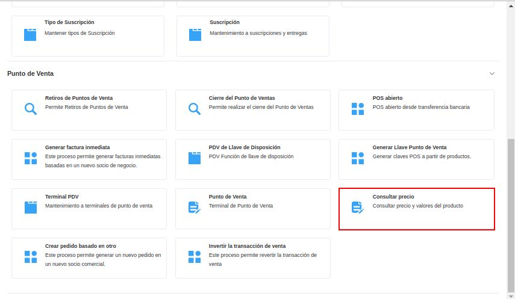

.. |Ventana Consulta de Precios| image:: resources/
.. |Campo Código del Producto| image:: resources/
.. |Campos Nombre, Precio Lista y Total del Impuesto del Producto| image:: resources/

.. _documento/consulta-precios-productos:

====================================
**Consulta de Precios de Productos**
====================================

El presente material elaborado por `ERPyA`_, pretende ofrecerle una explicación eficiente a nuestros clientes del procedimiento a seguir para consultar los precios de los productos registrados en ADempiere, en su versión 4.0.0 para la localización Venezuela.

ADempiere permite que sea realizada una búsqueda de precios de productos a través del código del mismo, en la ventana "**Consulta de Precios**". A continuación se explica de manera detallada el procedimiento a seguir para el mismo.

Ubique en el menú de ADempiere, la carpeta "**Gestión de Ventas**", luego seleccione la carpeta "**Órdenes de Venta**".

|Menú de ADempiere|

Imagen 1. Menú de ADempiere

Podrá visualizar del lado derecho de la pantalla, las diferentes opciones que contempla la ventana "**Órdenes de Venta**".

|Pantalla de ADempiere con la Información de la Carperta Órdenes de Venta|

Imagen 2. Pantalla de ADempiere con la Información de la Carperta Órdenes de Venta

Navegue entre las opciones que contempla la carpeta "**Órdenes de Venta**" y seleccione el formulario "**Consulta de Precios**", ubicado en la parte inferior de la misma.

|Ubicar la Ventana Consulta de Precios|

Imagen 3. Ubicar la Ventana Consulta de Precios

Una vez ubicado en la ventana "**Consulta de Precios**", puede apreciar diferentes campos relacionados con la información básica de los productos.

|Ventana Consulta de Precios|

Imagen 4. Ventana Consulta de Precios

Introduzca en el campo "**Código**", el código correspondiente al producto al cual se requiere consultar el precio.

|Campo Código del Producto|

Imagen 5. Campo Código del Producto

Luego de ingresar el código y seleccionar la tecla "**Enter**" en su teclado, podrá visualizar el nombre, el precio lista y precio total del impuesto del producto en los campos correspondientes.

|Campos Nombre, Precio Lista y Total del Impuesto del Producto|

Imagen 6. Campos Nombre, Precio Lista y Total del Impuesto del Producto