.. _ERPyA: http://erpya.com
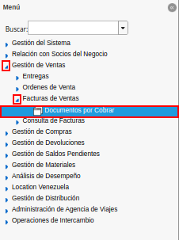
.. |Ventana Documento por Cobrar| image:: resources/document-receivable-window.png
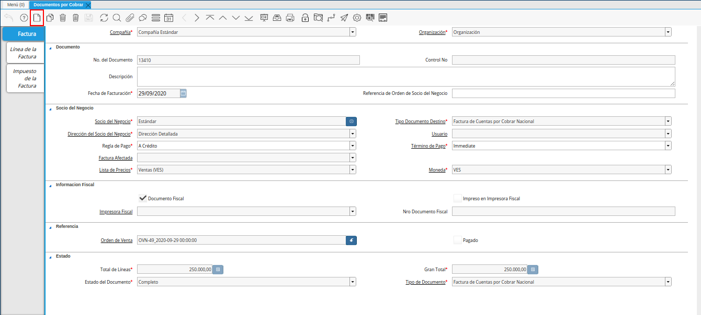
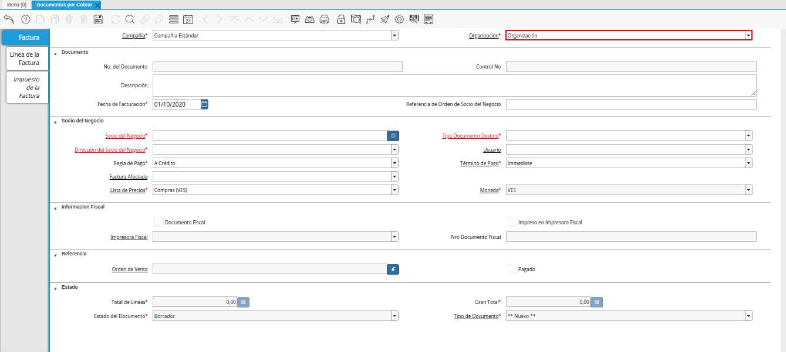
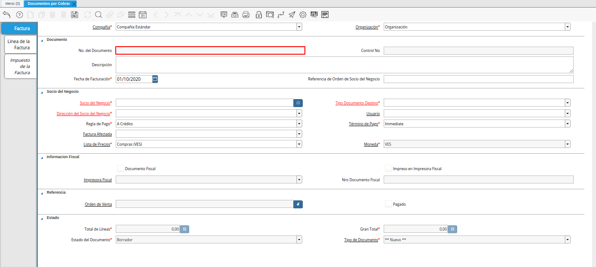
.. |campo control nro| image:: resources/control-field-number.png
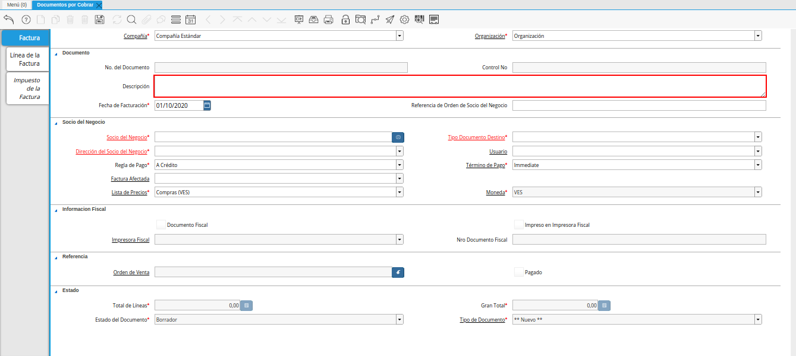
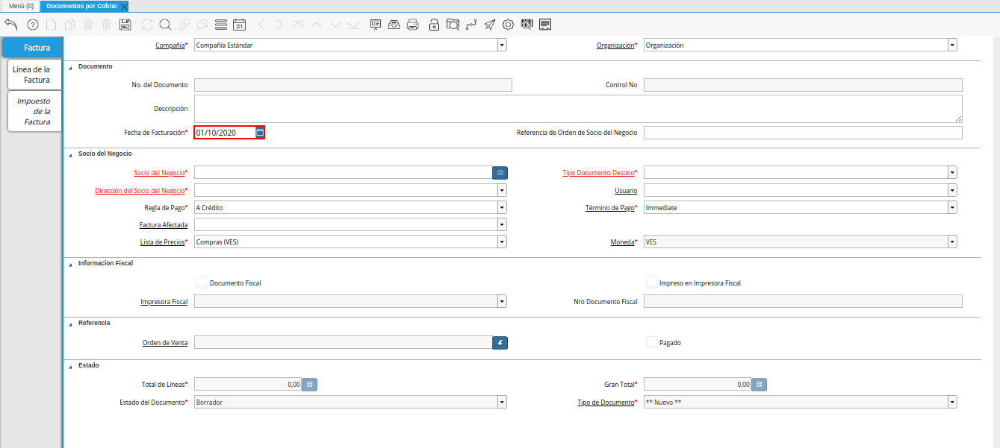
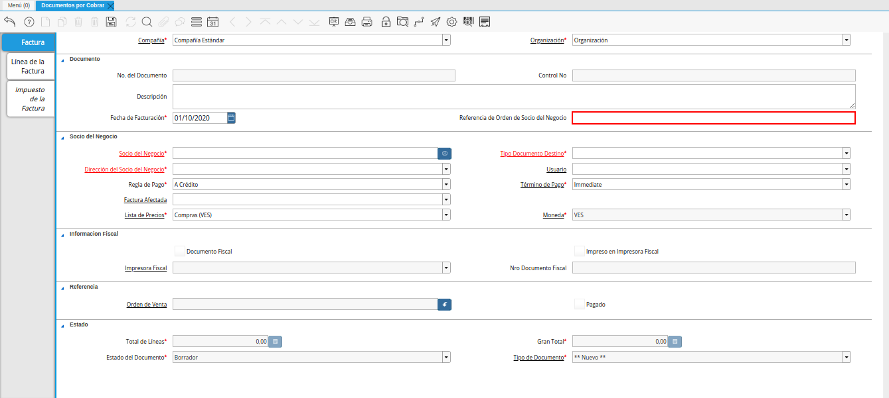
.. |Campo Socio del Negocio| image:: resources/business-partner-field.png

.. |Campo Tipo de Documento Destino nota de crédito| image:: resources/credit-memo-destination-document-type-field.png
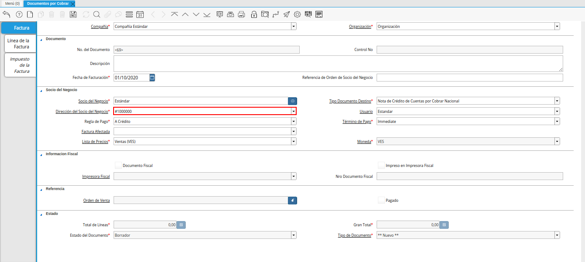
.. |campo usuario nota de crédito| image:: resources/credit-note-user-field.png
.. |campo regla de pago nota de crédito| image:: resources/credit-memo-payment-rule-field.png
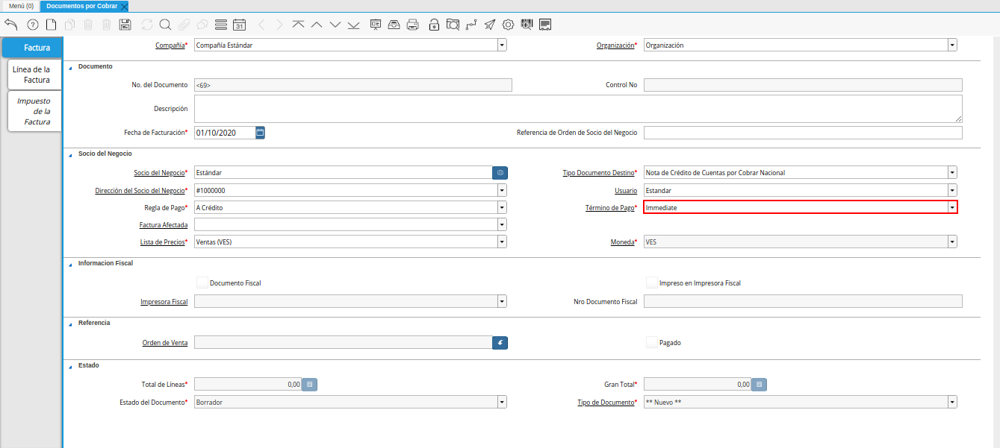
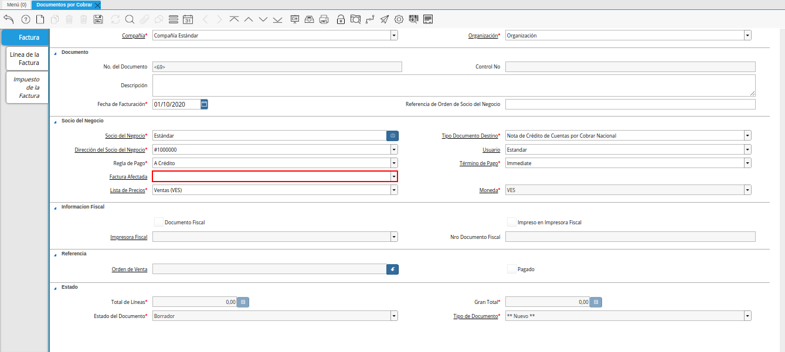
.. |Campo Lista de Precios nota de crédito| image:: resources/credit-note-price-list-field.png
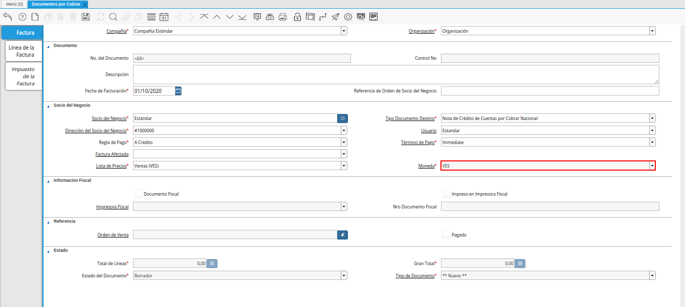
.. |checklist documento fiscal nota de crédito| image:: resources/checklist-fiscal-document-credit-note.png
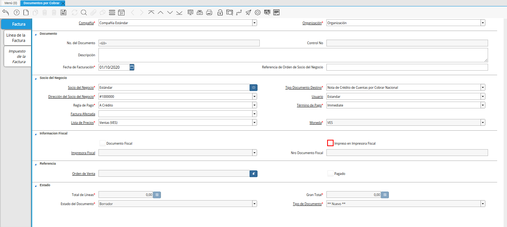
.. |campo impresora fiscal nota de crédito| image:: resources/field-fiscal-printer-credit-note.png
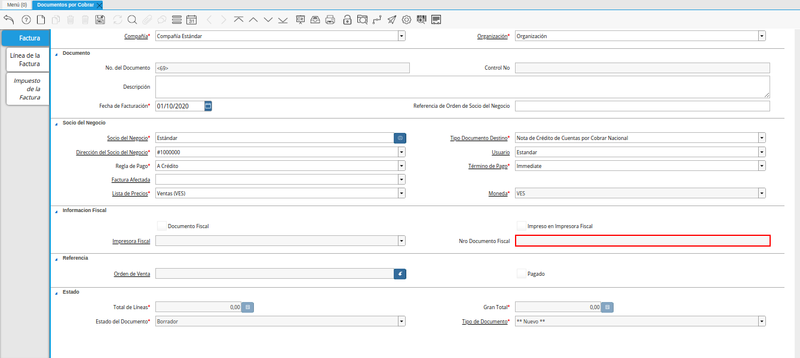
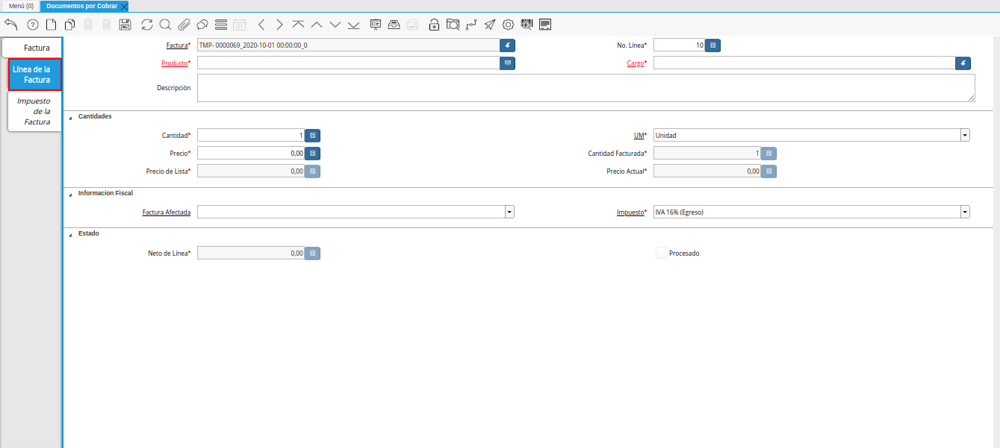
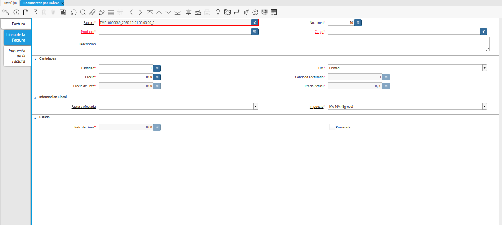
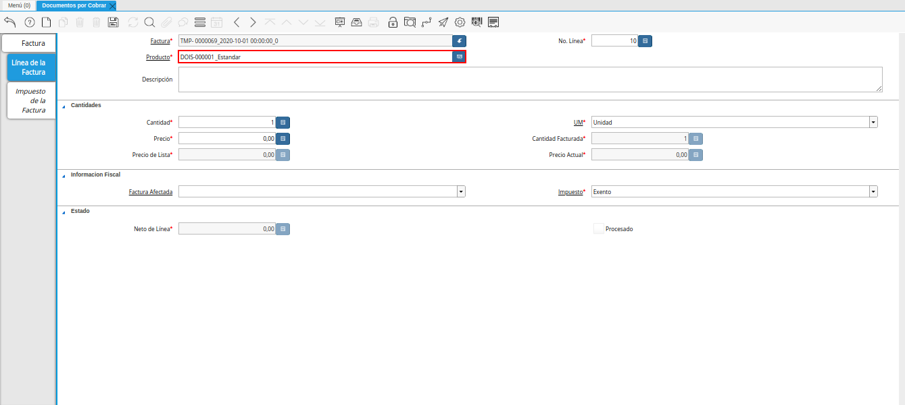
.. |Campo cargo nota de crédito| image:: resources/field-charge-credit-note.png
.. |campo descripción línea nota de crédito| image:: resources/credit-note-line-description-field.png
.. |Campo Cantidad nota de crédito| image:: resources/credit-note-amount-field.png
.. |Campo UM nota de crédito| image:: resources/field-um-credit-note.png
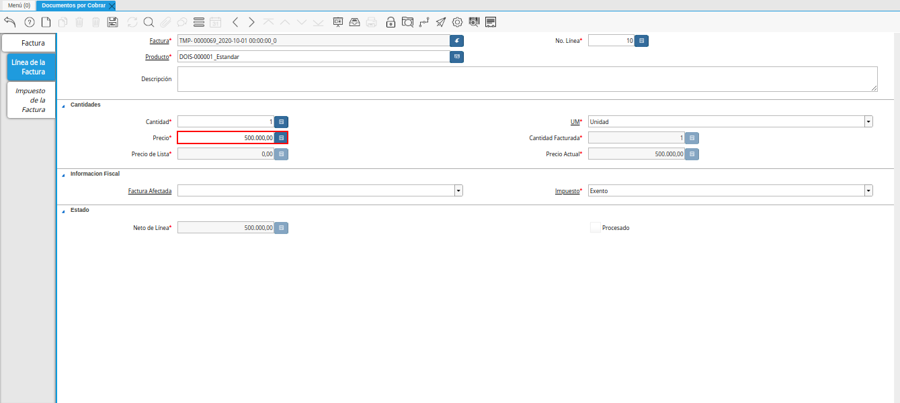
.. |campo cantidad facturada nota de crédito| image:: resources/field-amount-invoiced-credit-note.png
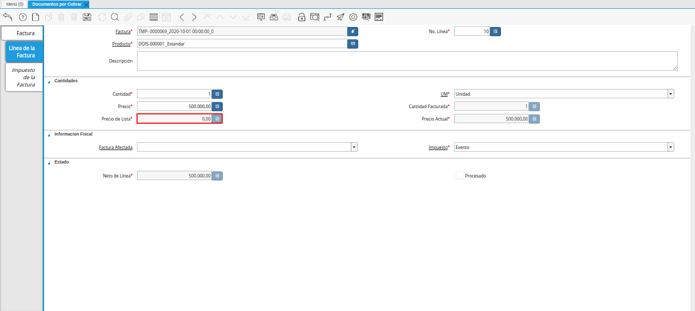
.. |campo precio actual nota de crédito| image:: resources/current-price-field-credit-note.png
.. |campo factura afectada línea nota de crédito| image:: resources/affected-invoice-field-credit-memo-line.png
.. |Campo Impuesto nota de crédito| image:: resources/credit-note-tax-field.png
.. |Campo Neto de Línea nota de crédito| image:: resources/net-field-of-credit-memo-line.png
.. |checklist procesado nota de crédito| image:: resources/credit-note-processed-checklist.png
.. |Pestaña Factura nota de crédito| image:: resources/tab-invoice-credit-note.png
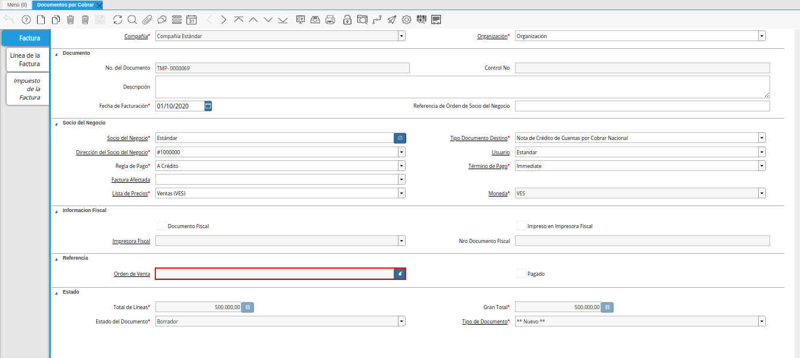
.. |checklist pagado nota de crédito| image:: resources/checklist-paid-credit-note.png
.. |campo total de líneas nota de crédito| image:: resources/total-credit-memo-lines-field.png
.. |campo gran total nota de crédito| image:: resources/grand-total-credit-note-field.png
.. |campo estado del documento nota de crédito| image:: resources/credit-memo-document-status-field.png
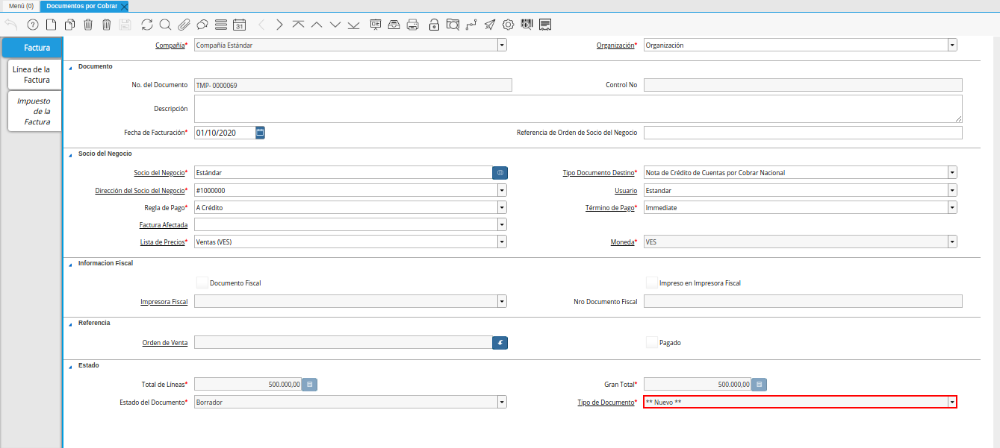
.. |opción procesar factura del icono proceso nota de crédito| image:: resources/option-process-invoice-from-credit-note-process-icon.png
.. |Acción Completar y Opción OK| image:: resources/action-complete-and-option-ok.png

.. _documento/nota-crédito-cxc:

**Nota de Crédito**
===================

Es un documento que se aplica a una factura, con la finalidad de reflejar un descuento, un cobro de un gasto incurrido de más, o alguna devolución de productos que el socio de negocio tipo cliente haya comprado.

A continuación es explicado el procedimiento para registrar en ADempiere una nota de crédito de cuentas por cobrar.

**Registro de Nota de Crédito**
-------------------------------

#. Ubique y seleccione en el menú de ADempiere, la carpeta "**Gestión de Ventas**", luego seleccione la carpeta "**Facturas de Ventas**", por último seleccione la ventana "**Documentos por Cobrar**".

    |Menú de ADempiere|

    Imagen 1. Menú de ADempiere

#. Podrá visualizar la ventana "**Documentos por Cobrar**" con los diferentes registros de documentos de cuentas por cobrar en ADempiere.

    |Ventana Documento por Cobrar|

    Imagen 2. Ventana Documento por Cobrar

#. Seleccione el icono "**Registro Nuevo**", ubicado en la barra de herramientas de ADempiere para crear un nuevo registro de factura de cuentas por cobrar.

    |Icono Registro Nuevo|

    Imagen 3. Icono Registro Nuevo

     #. Seleccione en el campo "**Organización**", la organización para la cual se encuentra realizando el documento "**Nota de Crédito CxC**".

        |Campo Organización|

        Imagen 4. Campo Organización

    #. En el campo "**No. de Documento**", no es necesario ingresarlo en forma manual, al momento de realizar un registro, ADempiere genera un número de secuencia automáticamente para el documento, al seleccionar la opción guardar del nuevo registro de documento por cobrar.

        |campo nro del documento|

        Imagen 5. Campo Nro del Documento
    
    #. En el campo "**Control Nro**", no es necesario ingresarlo en forma manual, al momento de realizar un registro, ADempiere genera un número de control para el documento, al seleccionar la opción guardar del nuevo registro de documento por cobrar.

        |campo control nro|

        Imagen 6. Campo Control Nro

    #. En el campo "**Descripción**", introduzca una breve descripción referente al documento por cobrar que se está realizando, este campo es opcional.

        |campo descripción|

        Imagen 7. Campo Descripción

    #. Introduzca en el campo "**Fecha de Facturación**", la fecha en la cual es aplicada la nota de crédito que se encuentra realizando.

        |campo fecha de facturación|

        Imagen 8. Campo Fecha de Facturación

    #. Introduzca en el campo "**Referencia de Orden de Socio del Negocio**", la referencia de orden del socio del negocio.

        |campo referencia de orden de socio del negocio|

        Imagen 9. Campo Referencia de Orden de Socio del Negocio

    #. Seleccione en el campo "**Socio del Negocio**", el socio del negocio al cual se encuentra aplicando la nota de crédito.

        |Campo Socio del Negocio|

        Imagen 10. Campo Socio del Negocio

    #. Seleccione el tipo de documento a generar en el campo "**Tipo de Documento Destino**", la selección de este define el comportamiento del documento que se está elaborando, dicho comportamiento se encuentra explicado en el documento "**Tipo de Documento**" elaborado por `ERPyA`_.

        |Campo Tipo de Documento Destino nota de crédito|

        Imagen 11. Campo Tipo de Documento Destino

    #. Seleccione en el campo "**Dirección del Socio del Negocio**", la dirección del socio del negocio seleccionado anteriormente en el campo "**Socio del Negocio**".

        |Campo Dirección del Socio del Negocio nota de crédito|

        Imagen 12. Campo Dirección del Socio del Negocio

    #. Seleccione en el campo "**Usuario**", el usuario del socio del negocio seleccionado anteriormente en el campo "**Socio del Negocio**".

        |campo usuario nota de crédito|

        Imagen 13. Campo Usuario

    #. Seleccione en el campo "**Regla de Pago**", la regla para el pago de los productos o servicios.

        |campo regla de pago nota de crédito|

        Imagen 14. Campo Regla de Pago

    #. Seleccione en el campo "**Término de Pago**",  el término que establece la condición, el método y tiempo de pago de la transacción que se encuentra realizando.

        |Campo Término de Pago nota de crédito|

        Imagen 15. Campo Término de Pago

    #. Seleccione en el campo "**Factura Afectada**", la factura a la cual le será aplicada la nota de crédito que se encuentra realizando.

        |campo factura afectada nota de crédito|

        Imagen 16. Campo Factura Afectada

    #. Seleccione en el campo "**Lista de Precios**", la lista de precios con la cual se encuentra aplicando la nota de crédito.

        |Campo Lista de Precios nota de crédito|

        Imagen 17. Campo Lista de Precios

    #. Podrá visualizar en el campo "**Moneda**", la moneda asociada a la lista de precios seleccionada en el campo "**Lista de Precios**".

        |Campo Moneda nota de crédito|

        Imagen 18. Campo Moneda

    #. El checklist "**Documento Fiscal**", indica que el registro de nota de crédito es considerado un documento fiscal y se utiliza para las facturas declaradas.

        |checklist documento fiscal nota de crédito|

        Imagen 19. Checklist Documento Fiscal

    #. El checklist "**Impreso en Impresora Fiscal**", indica que el documento es impreso en impresora fiscal.

        |checklist impreso en impresora fiscal nota de crédito|

        Imagen 20. Checklist Impreso en Impresora Fiscal

    #. Podrá visualizar en el campo "**Impresora Fiscal**", la impresora fiscal definida para la impresión del documento que se encuentra realizando.

        |campo impresora fiscal nota de crédito|

        Imagen 21. Campo Impresora Fiscal

    #. Podrá visualizar en el campo "**Nro Documento Fiscal**", el número de documento fiscal para el documento que se encuentra realizando.

        |campo nro documento fiscal nota de crédito|

        Imagen 22. Campo Nro Documento Fiscal

    .. note::

        Recuerde guardar el registro de los campos con ayuda del icono "**Guardar Cambios**", ubicado en la barra de herramientas de ADempiere.

**Línea de la Factura**
***********************

#. Seleccione la pestaña "**Línea de la Factura**" para cargar los detalles de la nota de crédito que se encuentra realizando.

    |Pestaña Línea de la Factura nota de crédito|

    Imagen 23. Pestaña Línea de la Factura

    #. Podrá visualizar en el campo "**Factura**", el número de registro al que pertenece el registro de la línea en el que se encuentra.

        |campo factura nota de crédito|

        Imagen 24. Campo Factura

    #. Seleccione en el campo "**Producto**", el producto por el cual se encuentra aplicando la nota de crédito.

        |Campo producto nota de crédito|

        Imagen 25. Campo Producto

    #. Seleccione en el campo "**Cargo**", el cargo por el cual se encuentra aplicando la nota de crédito.

        |Campo cargo nota de crédito|

        Imagen 26. Campo Cargo de la Pestaña Línea de la Factura de la Ventana Documentos por Cobrar

    #. Introduzca en el campo "**Descripción**", una breve descripción referente al registro que se encuentra realizando.

        |campo descripción línea nota de crédito|

        Imagen 26. Campo Descripción

    #. Seleccione en el campo "**Cantidad**", la cantidad relacionada al registro que se encuentra realizando.

        |Campo Cantidad nota de crédito|

        Imagen 27. Campo Cantidad

    #. Seleccione en el campo "**UM**", la unidad de medida relacionada al registro que se encuentra realizando.

        |Campo UM nota de crédito|

        Imagen 28. Campo UM

    #. Introduzca en el campo "**Precio**", el precio correspondiente a la nota de crédito que se encuentra realizando.

        |Campo Precio nota de crédito|

        Imagen 29. Campo Precio

    #. El campo "**Cantidad Facturada**, indica la cantidad de un producto que ha sido facturado.

        |campo cantidad facturada nota de crédito|

        Imagen 30. Campo Cantidad Factura

    #. El campo "**Precio de Lista**", indica el precio de lista oficial en la moneda del documento.

        |campo precio de lista nota de crédito|

        Imagen 31. Campo Precio de Lista

    #. El campo "**Precio Actual**", indica el precio para un producto en la moneda fuente.

        |campo precio actual nota de crédito|

        Imagen 32. Campo Precio Actual

    #. Seleccione en el campo "**Factura Afectada**", la factura a la cual le será aplicada la nota de crédito que se encuentra realizando.

        |campo factura afectada línea nota de crédito|

        Imagen 33. Campo Factura Afectada

    #. Seleccione en el campo "**Impuesto**", el impuesto correspondiente a la nota de crédito que se encuentra realizando.

        |Campo Impuesto nota de crédito|

        Imagen 34. Campo Impuesto

    #. Podrá visualizar en el campo "**Neto de Línea**", el resultado del cálculo del valor en el campo "**Precio**" por el valor ingresado en el campo "**Cantidad**".

        |Campo Neto de Línea nota de crédito|

        Imagen 35. Campo Neto de Línea

    #. El checklist "**Procesado**", indica que el registro fue procesado.

        |checklist procesado nota de crédito|

        Imagen 36. Checklist Procesado

    .. note::

        Recuerde guardar el registro de los campos con ayuda del icono "**Guardar Cambios**", ubicado en la barra de herramientas de ADempiere.

**Factura**
***********

#. Seleccione la pestaña principal "**Factura**", para proceder a completar el registro.

    |Pestaña Factura nota de crédito|
    
    Imagen 37. Pestaña Factura

    #. Podrá visualizar en el campo "**Orden de Venta**", la orden de venta asociada al registro que se encuentra realizando.

        |campo orden de venta nota de crédito|

        Imagen 38. Campo Orden de Venta

    #. El checklist "**Pagado**", indica que el registro ya fue pagado.

        |checklist pagado nota de crédito|

        Imagen 39. Checklist Pagado

    #. El campo "**Total de Líneas**", indica el total de todas las líneas en la moneda del documento.

        |campo total de líneas nota de crédito|

        Imagen 40. Campo Total de Líneas

    #. El campo "**Gran Total**", indica el total incluyendo impuestos y totales de fletes en la moneda del documento.

        |campo gran total nota de crédito|

        Imagen 41. Campo Gran Total

    #. El campo "**Estado del Documento**", indica el estado del documento en este momento, para cambiar el estado del documento utilice la opción "**Procesar Factura**", desplegada por el icono "**Proceso**", ubicado en la barra de herramientas de ADempiere.

        |campo estado del documento nota de crédito|

        Imagen 42. Campo Estado del Documento

    #. El campo "**Tipo de Documento**", indica el tipo de documento que determina la secuencia del documento o las reglas del proceso.

        |campo tipo de documento nota de crédito|

        Imagen 43. Campo Tipo de Documento

    #. Seleccione la opción "**Procesar Factura**", desplegada por el icono "**Proceso**", ubicado en la barra de herramientas de ADempiere.

        |opción procesar factura del icono proceso nota de crédito|

        Imagen 44. Opción Procesar Factura del Icono Proceso
    
    #. Seleccione la acción "**Completar**" y la opción "**OK**" para completar el documento.

        |Acción Completar y Opción OK|

        Imagen 45. Acción Completar y Opción OK
