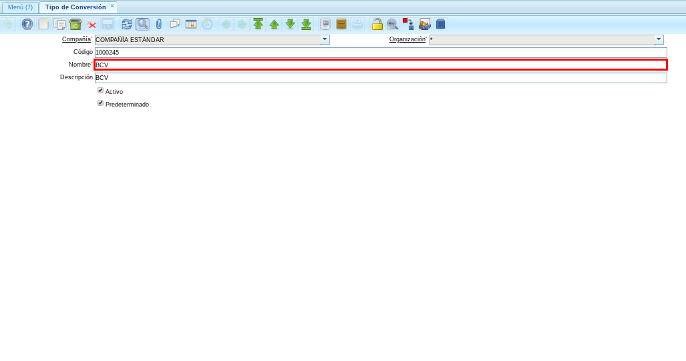

.. |Ventana Tipo de Conversión 2| image:: resources/vent-tipo-conversion4.png

.. _documento/importador-órdenes:

Importar Órdenes de Venta
=========================

El procedimiento "**Importar Órdenes**" es realizado con la finalidad de crear un registro en la ventana "**Órdenes de Venta**" con todos los registros de la ventana "**Importar Órdenes**" que contengan un mismo número de documento. Dicho número de documento es tomado en el registro de la orden de venta como número de documento.

El presente material elaborado por ERPyA, pretende ofrecerle a los usuarios una documentación específica que le permita conocer el proceso y actualizaciones realizadas en el importador de órdenes utilizada en la versión 3.7.0 de ADempiere.

Atendiendo el requerimiento principal para la importación de órdenes de venta de acuerdo al tipo de conversión, ERPyA realizó la configuración requerida de ADempiere agregando el campo "**Tipo de Conversión**" en la ventana "**Importar Órdenes**". 

La actualización consiste en importar la orden de venta en estado "**Preparar**", según el tipo de conversión seleccionado en la ventana "**Importar Órdenes**". 

Si el campo "**Tipo de Conversión**" es dejado en blanco, la importación se realiza tomando el tipo de conversión que tenga tildado el checklist "**Predeterminado**".

En el caso de que exista más de un tipo de conversión con el checklist "**Predeterminado**" tildado, la importación se realiza tomando el último registro de tipo de conversión tildado como predeterminado.

Importar Órdenes con Tipo de Conversión sin Checklist Tildado
-------------------------------------------------------------

Tipo de Conversión
******************

#. Ubique y seleccione en el menú de ADempiere, la carpeta "**Análisis de Desempeño**", luego seleccione la carpeta "**Reglas Contables**", por último seleccione la ventana "**Tipo de Conversión**".

    |Menú de ADempiere 1|

    Imagen 1. Menú de ADempiere

    #. Podrá visualizar el registro de tipo de conversión "**BCV CAMBIO**" con el checklist "**Predeterminado**" destildado.

        |Tipo de Conversión con el Checklist Predeterminado Destildado|

        Imagen 2. Registro del Tipo de Conversión con el Checklist Predeterminado Destildado

Importador de Órdenes de Venta
******************************

#. Ubique y seleccione en el menú de ADempiere, la carpeta "**Gestión del Sistema**", luego seleccione la carpeta "**Datos**", después seleccione la carpeta "**Importar Datos**", por último seleccione la ventana "**Importar Órdenes**".
    
    |Menú de ADempiere 2|

    Imagen 3. Menú de ADempiere

    #. Realice el procedimiento regular para importar órdenes de venta desde la ventana "**Importar Órdenes**", seleccionando el registro de tipo de conversión "**BCV CAMBIO**" mostrado anteriormente.

        |Registro de Importador de Órdenes con Tipo de Conversión con el Checklist Predeterminado Destildado|

        Imagen 4. Registro de Importador de Órdenes con Tipo de Conversión con el Checklist Predeterminado Destildado

Orden de Venta Importada
************************

#. Ubique y seleccione en el menú de ADempiere, la carpeta "**Gestión de Venta**", luego seleccione la carpeta "**Órdenes de Venta**", por último seleccione la ventana "**Órdenes de Venta**".

    |Menú de ADempiere 3|

    Imagen 5. Menú de ADempiere

    #. Podrá visualizar el registro de orden de venta importado desde la ventana "**Importar Órdenes**", con el tipo de conversión "**BCV CAMBIO**" mostrado anteriormente.

        |Orden de Venta Importada con Tipo de Conversión con el Checklist Predeterminado Destildado|

        Imagen 6. Orden de Venta Importada con Tipo de Conversión con el Checklist Predeterminado Destildado

Importar Órdenes con Campo Tipo de Conversión en Blanco y con Checklist Tildado
-------------------------------------------------------------------------------

Tipo de Conversión
******************

#. Ubique y seleccione en el menú de ADempiere, la carpeta "**Análisis de Desempeño**", luego seleccione la carpeta "**Reglas Contables**", por último seleccione la ventana "**Tipo de Conversión**".

    |Menú de ADempiere 1|

    Imagen 7. Menú de ADempiere

    #. Podrá visualizar el registro de tipo de conversión "**PRUEBA BCV**" con el checklist "**Predeterminado**" tildado.

        |Tipo de Conversión con el Checklist Predeterminado Tildado|
        
        Imagen 8. Tipo de Conversión con el Checklist Predeterminado Tildado

Importador de Órdenes de Venta
******************************

#. Ubique y seleccione en el menú de ADempiere, la carpeta "**Gestión del Sistema**", luego seleccione la carpeta "**Datos**", después seleccione la carpeta "**Importar Datos**", por último seleccione la ventana "**Importar Órdenes**".
    
    |Menú de ADempiere 2|

    Imagen 9. Menú de ADempiere

    #. Realice el procedimiento regular para importar órdenes de venta desde la ventana "**Importar Órdenes**", dejando el campo "**Tipo de Conversión**" vacío.

        |Registro de Importador de Órdenes con Campo Tipo de Conversión en Blanco y con Checklist Tildado|

        Imagen 10. Registro de Importador de Órdenes con Campo Tipo de Conversión en Blanco y con Checklist Tildado

Orden de Venta Importada
************************

#. Ubique y seleccione en el menú de ADempiere, la carpeta "**Gestión de Venta**", luego seleccione la carpeta "**Órdenes de Venta**", por último seleccione la ventana "**Órdenes de Venta**".

    |Menú de ADempiere 3|

    Imagen 11. Menú de ADempiere

    #. Podrá visualizar el registro de orden de venta importado desde la ventana "**Importar Órdenes**", con el tipo de conversión "**PRUEBA BCV**" mostrado anteriormente.

        |Orden de Venta Importada con Tipo de Conversión con el Checklist Predeterminado Tildado|

        Imagen 12. Orden de Venta Importada con Tipo de Conversión con el Checklist Predeterminado Tildado

Importar Órdenes con Campo Tipo de Conversión en Blanco y con Checklist Tildado en varios Tipos de Conversión
-------------------------------------------------------------------------------------------------------------

Tipo de Conversión
******************

#. Ubique y seleccione en el menú de ADempiere, la carpeta "**Análisis de Desempeño**", luego seleccione la carpeta "**Reglas Contables**", por último seleccione la ventana "**Tipo de Conversión**".

    |Menú de ADempiere 1|

    Imagen 13. Menú de ADempiere

    #. Podrá visualizar el registro de tipo de conversión "**BCV**" con el checklist "**Predeterminado**" tildado.

        |Ventana Tipo de Conversión 1| 

        Imagen 14. Tipo de Conversión BCV con el Checklist Predeterminado Tildado

        #. El mismo posee las siguientes actualizaciones, donde es resaltada la más reciente.

            |Actualizaciones del Tipo de Conversión 1| 

            Imagen 15. Actualizaciones del Tipo de Conversión BCV con el Checklist Predeterminado Tildado

    #. De igual manera podrá visualizar el registro de tipo de conversión "**PRUEBA BCV**" con el checklist "**Predeterminado**" tildado.

        |Ventana Tipo de Conversión 2| 

        Imagen 16. Tipo de Conversión PRUEBA BCV con el Checklist Predeterminado Tildado

        #. El mismo posee las siguientes actualizaciones, donde es resaltada la más reciente.

            |Actualizaciones del Tipo de Conversión 2| 

            Imagen 17. Actualizaciones del Tipo de Conversión PRUEBA BCV con el Checklist Predeterminado Tildado

Importador de Órdenes de Venta
******************************

#. Ubique y seleccione en el menú de ADempiere, la carpeta "**Gestión del Sistema**", luego seleccione la carpeta "**Datos**", después seleccione la carpeta "**Importar Datos**", por último seleccione la ventana "**Importar Órdenes**".
    
    |Menú de ADempiere 2|

    Imagen 18. Menú de ADempiere

    #. Realice el procedimiento regular para importar órdenes de venta desde la ventana "**Importar Órdenes**", dejando el campo "**Tipo de Conversión**" vacío.

        |Registro de Importador de Órdenes con Campo Tipo de Conversión en Blanco y con Checklist Tildado 2| 

        Imagen 19. Registro de Importador de Órdenes con Campo Tipo de Conversión en Blanco y con Checklist Tildado

Orden de Venta Importada
************************

#. Ubique y seleccione en el menú de ADempiere, la carpeta "**Gestión de Venta**", luego seleccione la carpeta "**Órdenes de Venta**", por último seleccione la ventana "**Órdenes de Venta**".

    |Menú de ADempiere 3|

    Imagen 20. Menú de ADempiere

    #. Podrá visualizar el registro de orden de venta importado desde la ventana "**Importar Órdenes**", con el tipo de conversión "**BCV**" mostrado anteriormente.

        |Orden de Venta Importada con Tipo de Conversión con el Checklist Predeterminado Tildado 2|

        Imagen 21. Orden de Venta Importada con Tipo de Conversión con el Checklist Predeterminado Tildado

.. note::

    La importación se realiza tomando el tipo de conversión al cual se le haya actualizado recientemente el checklist "**Predeterminado**".