.. _ERPyA: http://erpya.com
.. |Menú de ADempiere| image:: resources/menu-generate-invoice-from-order-lines.png
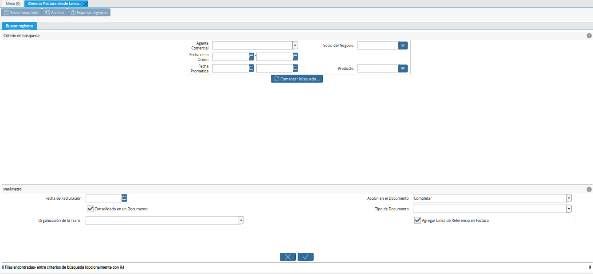
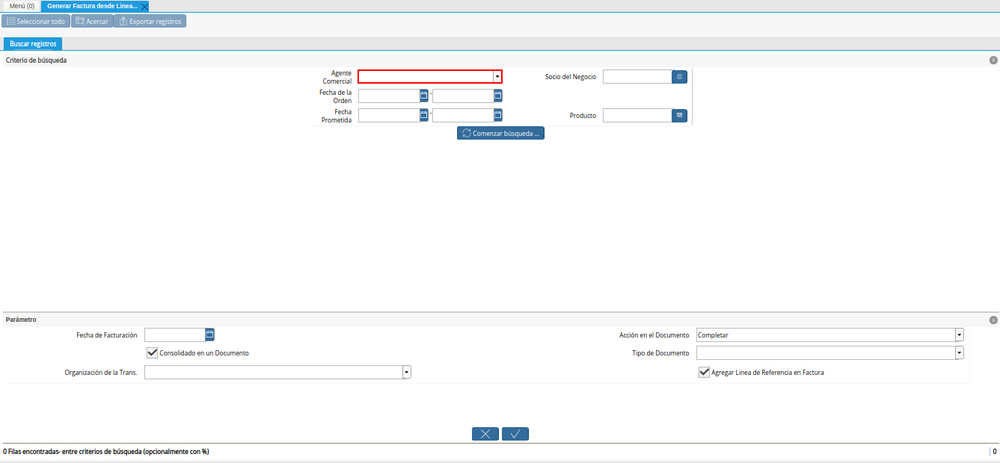
.. |Campo Fecha de la Orden de la Ventana Generar Factura desde Líneas de la Orden| image:: resources/order-date-field-of-the-generate-invoice-window-from-order-lines.png
.. |Campo Fecha Prometida de la Ventana Generar Factura desde Líneas de la Orden| image:: resources/promised-date-field-of-the-generate-invoice-window-from-order-lines.png
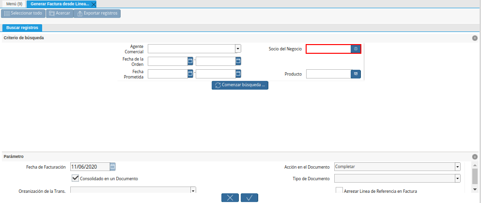
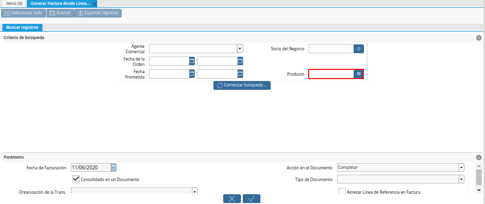
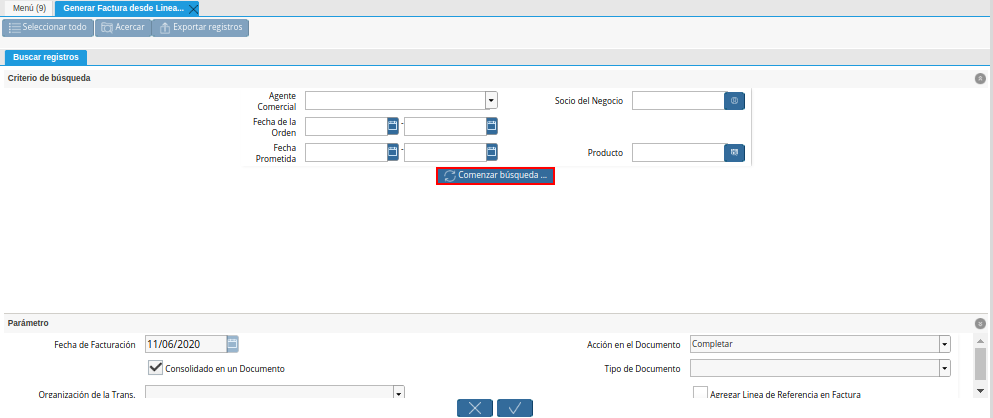
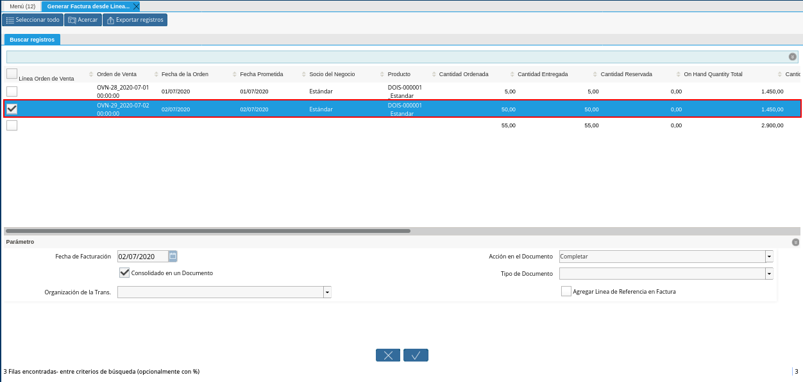
.. |Campo Fecha de Facturación de la Ventana Generar Factura desde Líneas de la Orden| image:: resources/billing-date-field-of-the-generate-invoice-from-order-lines-window.png
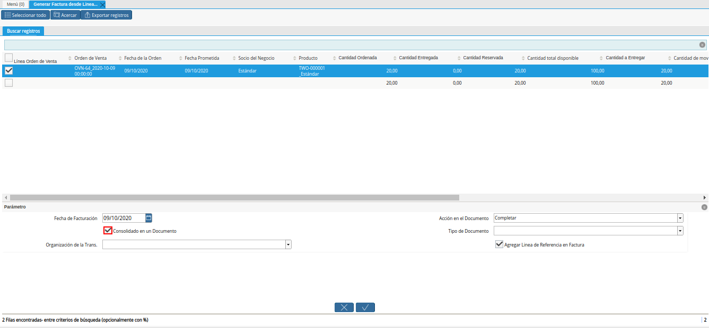
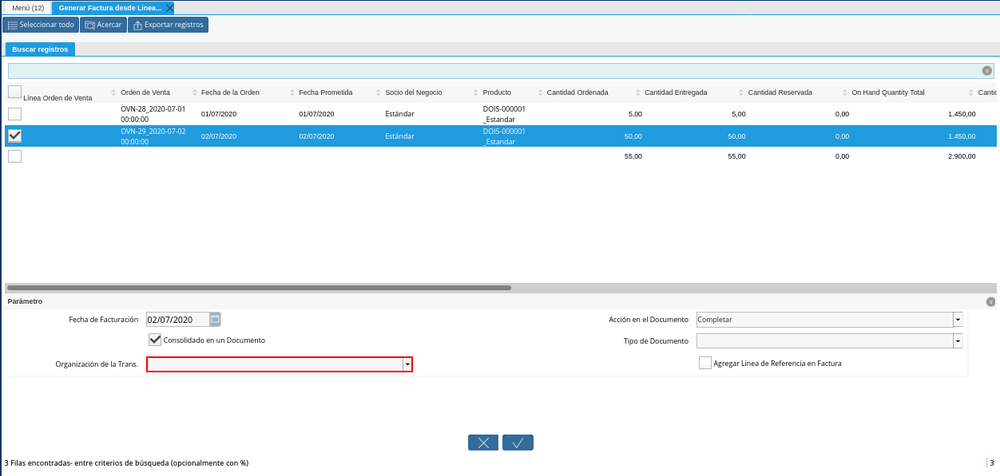
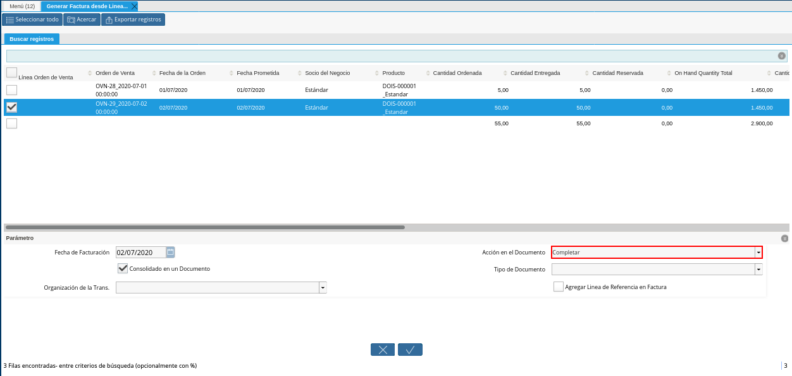
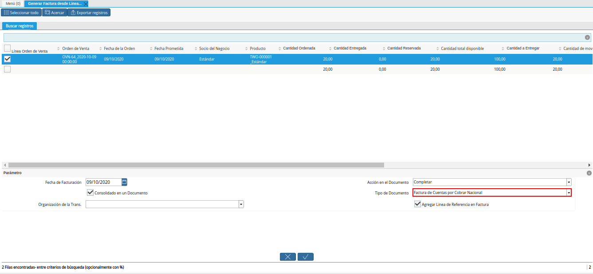
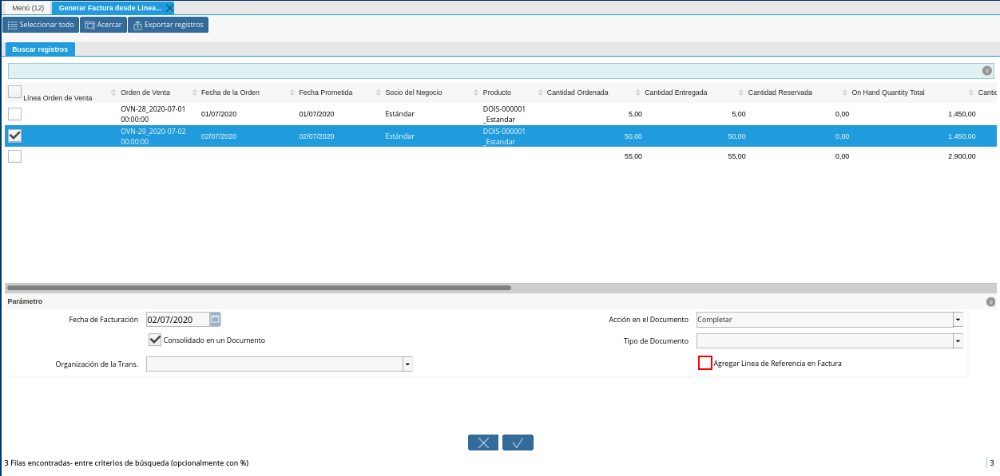

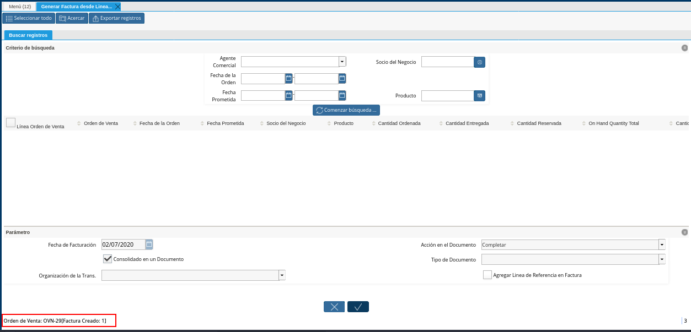
.. |Consulta de Facturas Generadas| image:: resources/query-invoices-generated-from-the-smart-search-window-generate-invoice-from-order-lines.png
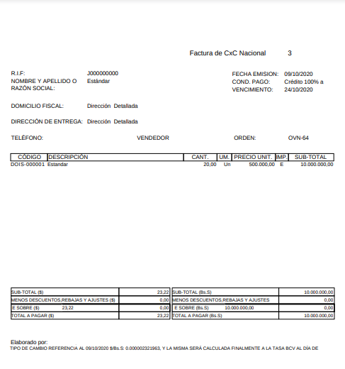
.. _documento/generar-factura-desde-líneas-de-la-orden:

**Generar Factura desde Líneas de la Orden**
============================================

#. Ubique y seleccione en el menú de ADempiere, la carpeta "**Gestión de Ventas**", luego seleccione la carpeta "**Facturas de Ventas**", por último seleccione la ventana "**Genera Factura desde Líneas de la Orden**".

    |Menú de ADempiere|

    Imagen 1. Menú de ADempiere

#. Podrá visualizar la ventana "**Genera Factura desde Líneas de la Orden**" y proceder al llenado de los campos correspondientes para filtrar la búsqueda.

    |Ventana Generar Factura desde Líneas de la Orden|

    Imagen 2. Ventana Generar Factura desde Líneas de la Orden

    #. Seleccione en el campo "**Agente Comercial**", el agente comercial por el cual se va a filtrar la búsqueda.

        |Campo Agente Comercial de la Ventana Generar Factura desde Líneas de la Orden|

        Imagen 3. Campo Agente Comercial de la Ventana Generar Factura desde Líneas de la Orden

    #. Seleccione en el campo "**Fecha de la Orden**", la fecha de orden por la cual se va a filtrar la búsqueda.

        |Campo Fecha de la Orden de la Ventana Generar Factura desde Líneas de la Orden|
        
        Imagen 4. Campo Fecha de la Orden de la Ventana Generar Factura desde Líneas de la Orden

    #. Seleccione en el campo "**Fecha Prometida**", la fecha prometida por la cual se va a filtrar la búsqueda.

        |Campo Fecha Prometida de la Ventana Generar Factura desde Líneas de la Orden|

        Imagen 5. Campo Fecha Prometida de la Ventana Generar Factura desde Líneas de la Orden

    #. Seleccione en el campo "**Socio del Negocio**", el socio del negocio por el cual se va a filtrar la búsqueda.

        |Campo Socio del Negocio de la Ventana Generar Factura desde Líneas de la Orden|

        Imagen 6. Campo Socio del Negocio de la Ventana Generar Factura desde Líneas de la Orden
    
    #. Seleccione en el campo "**Producto**", el producto por cual se va a filtrar la búsqueda.

        |Campo Producto de la Ventana Generar Factura desde Líneas de la Orden|

        Imagen 7. Campo Producto de la Ventana Generar Factura desde Líneas de la Orden

        .. note::

            La selección del producto puede realizarce ingresando en el campo "**Producto**", el "**Código**" del producto requerido. De igual manera, se puede realizar la búsqueda ingresando el "**Código de Barra**" o "**UPC/EAN**" en lugar del código del producto.

    #. Seleccione la opción "**Comenzar Búsqueda**", para realizar la búsqueda de la información en base a los campos seleccionados.

        |Opción Comenzar Búsqueda de la Ventana Generar Factura desde Líneas de la Orden|

        Imagen 8. Opción Comenzar Búsqueda de la Ventana Generar Factura desde Líneas de la Orden

        #. Seleccione las líneas de la orden desde las cuales requiere que sea generada la factura.

            |Selección de Líneas de la Orden de la Ventana Generar Factura desde Líneas de la Orden|

            Imagen 9. Selección de Líneas de la Orden de la Ventana Generar Factura desde Líneas de la Orden

    #. Seleccione en el campo "**Fecha de Facturación**", la fecha en la cual se esta realizando la facturación.

        |Campo Fecha de Facturación de la Ventana Generar Factura desde Líneas de la Orden|

        Imagen 10. Campo Fecha de Facturación de la Ventana Generar Factura desde Líneas de la Orden

    #. Podrá visualizar que el checklist "**Consolidado en un Documento**", se encuentra tildado por defecto.

        |Checklist Consolidado en un Documento de la Ventana Generar Factura desde Líneas de la Orden|

        Imagen 11. Checklist Consolidado en un Documento de la Ventana Generar Factura desde Líneas de la Orden

    #. Seleccione en el campo "**Organización de la Trans**", la organización para la cual esta generando la factura.

        |Campo Organización de la Trans de la Ventana Generar Factura desde Líneas de la Orden|

        Imagen 12. Campo Organización de la Trans de la Ventana Generar Factura desde Líneas de la Orden

    #. Seleccione en el campo "**Acción en el Documento**", la acción con la cual se generará la factura.

        |Campo Acción en el Documento de la Ventana Generar Factura desde Líneas de la Orden|

        Imagen 13. Campo Acción en el Documento de la Ventana Generar Factura desde Líneas de la Orden

    #. Seleccione el tipo de documento a generar en el campo "**Tipo de Documento Destino**", la selección de este define el comportamiento del documento que se esta elaborando, dicho comportamiento se encuentra explicado en el documento :ref:`documento/tipo-documento` elaborado por `ERPyA`_.

        |Campo Tipo de Documento Destino de la Ventana Generar Factura desde Líneas de la Orden|

        Imagen 14. Campo Tipo de Documento Destino de la Ventana Generar Factura desde Líneas de la Orden

    #. Seleccione el checklist "**Agregar Línea de Referencia en Factura**", para que las líneas de referencia sean agregadas a la factura.

        |Checklist Agregar Línea de Referencia en Factura de la Ventana Generar Factura desde Líneas de la Orden|

        Imagen 15. Checklist Agregar Línea de Referencia en Factura de la Ventana Generar Factura desde Líneas de la Orden

    #. Seleccione la opción "**OK**", para generar el documento en base a lo seleccionado en los campos anteriormente explicados.

        |Opción OK de la Ventana Generar Factura desde Líneas de la Orden|

        Imagen 16. Opción OK de la Ventana Generar Factura desde Líneas de la Orden

#. Podrá visualizar en la parte inferior de la ventana "**Genera Factura desde Líneas de la Orden**", el resultado del proceso realizado anteriormente.

    |Resultado del Proceso|

    Imagen 17. Resultado del Proceso Realizado

**Consultar Facturas Generadas**
--------------------------------

#. Al consultar el registro en la ventana "**Documentos por Cobrar**", puede visualizar la factura de cuentas por cobrar generada desde la línea de la orden.

    |Consulta de Facturas Generadas|

    Imagen 18. Consulta de Facturas Generadas

**Imprimir Facturas Generadas**
-------------------------------

#. Al imprimir el registro en la ventana "**Documentos por Cobrar**", seleccionando el icono "**Imprimir**" ubicado en la barra de herramientas de ADempiere, podrá visualizar de la siguiente manera la factura de ventas generada desde la línea de la orden. 

    |Imprimir Facturas Generadas|

    Imagen 19. Imprimir Facturas Generadas