.. _ERPyA: http://erpya.com
.. |Menú de ADempiere| image:: resources/menu-document-receivable.png
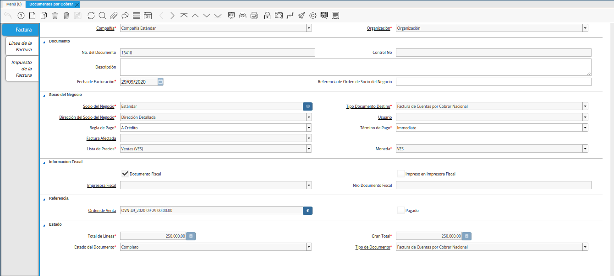
.. |Icono Registro Nuevo| image:: resources/new-record-icon.png
.. |Campo Organización| image:: resources/organization-field.png

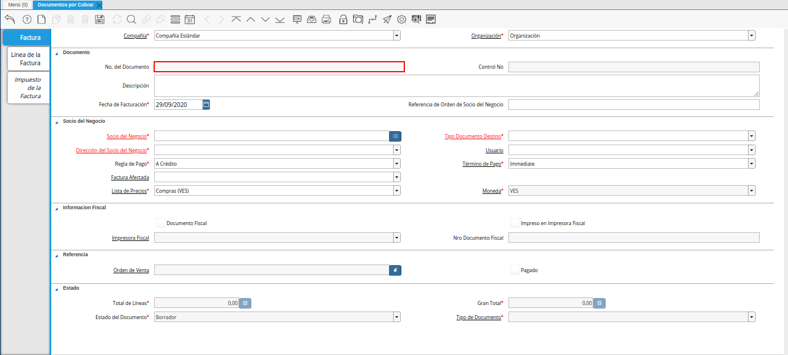
.. |campo control nro| image:: resources/control-field-number.png
.. |campo descripción| image:: resources/description-field.png
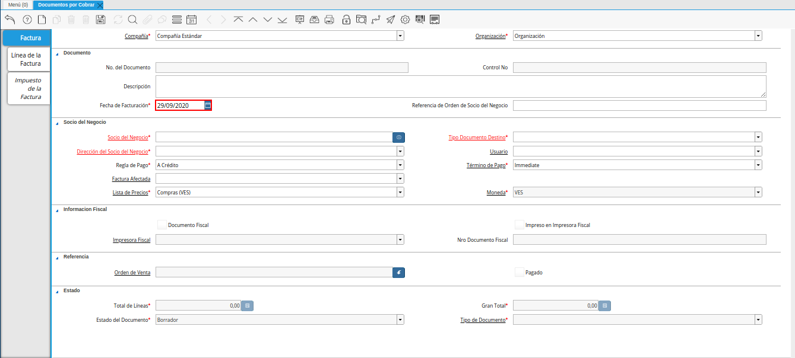
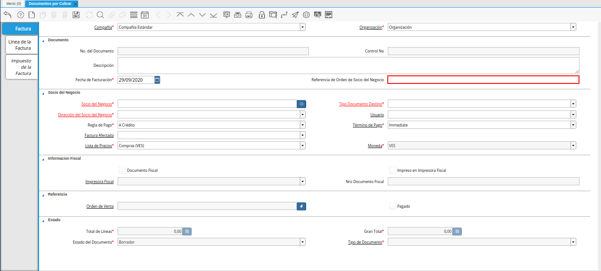
.. |Campo Socio del Negocio| image:: resources/business-partner-field.png
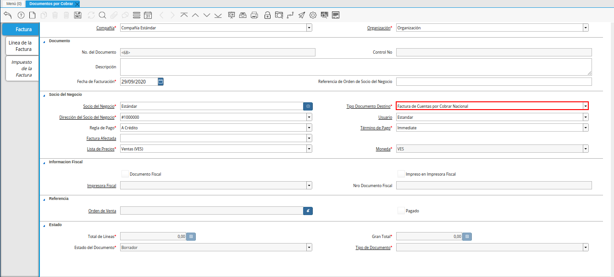
.. |Campo Dirección del Socio del Negocio| image:: resources/business-partner-address-field.png
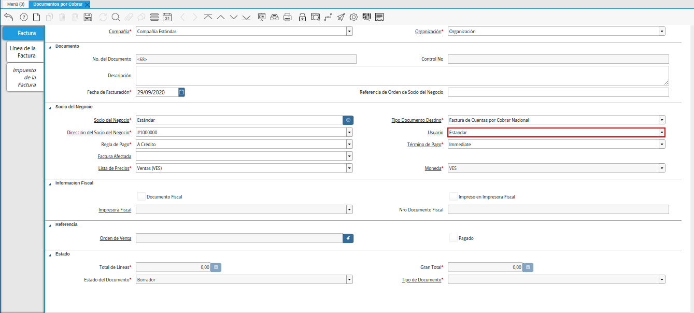
.. |campo regla de pago| image:: resources/payment-rule-field.png
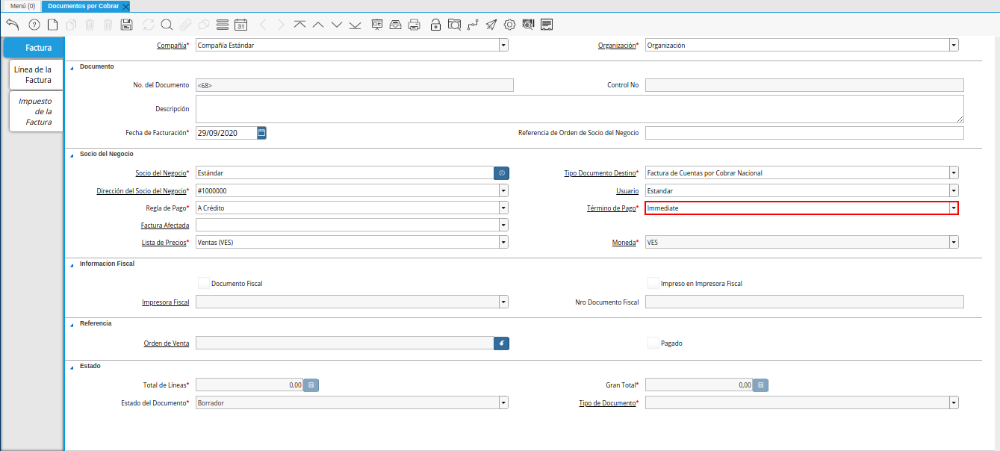
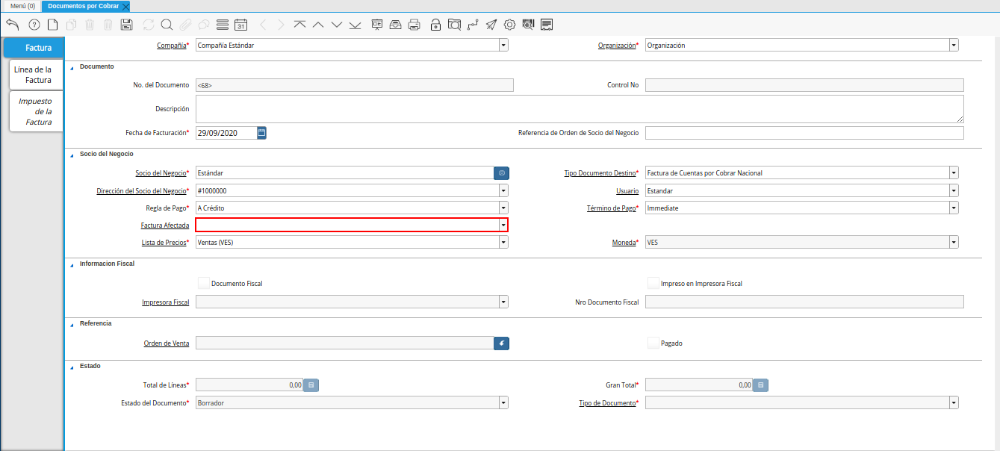
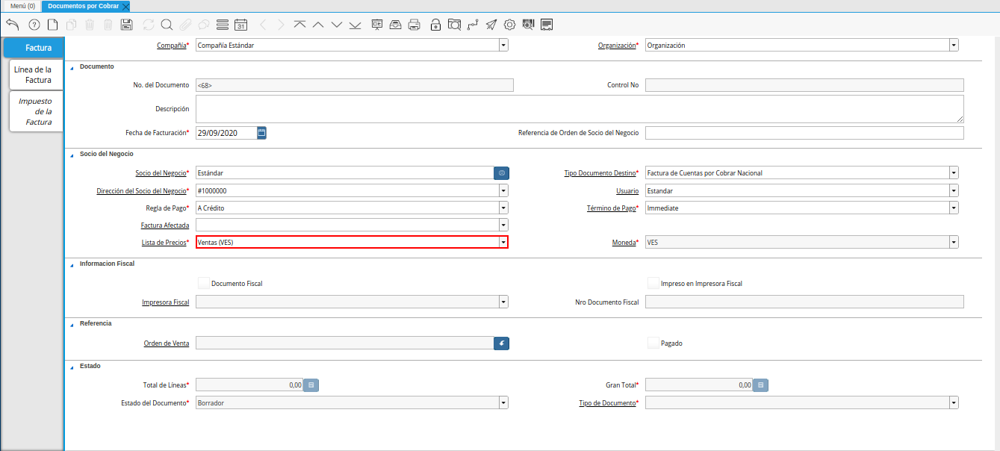
.. |Campo Moneda| image:: resources/currency-field.png
.. |checklist documento fiscal| image:: resources/tax-document-checklist.png
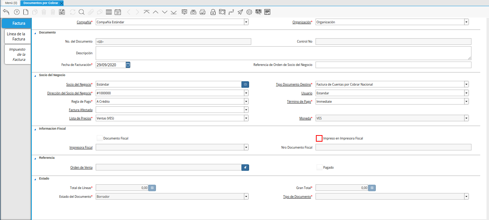
.. |campo impresora fiscal| image:: resources/fiscal-printer-field.png
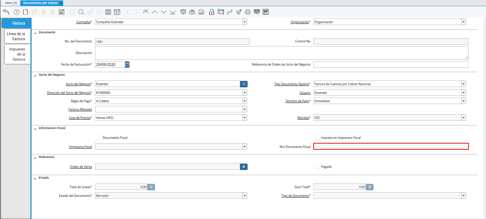
.. |Pestaña Línea de la Factura| image:: resources/invoice-line-tab.png
.. |campo factura| image:: resources/invoice-field.png
.. |Campo Producto| image:: resources/product-field.png
.. |campo descripción| image:: resources/description-field.png
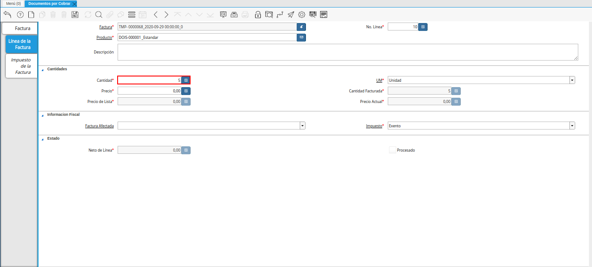
.. |Campo UM| image:: resources/field-um.png
.. |Campo Precio| image:: resources/price-field.png
.. |campo cantidad facturada| image:: resources/invoiced-amount-field.png
.. |campo precio de lista| image:: resources/list-price-field.png
.. |campo precio actual| image:: resources/current-price-field.png
.. |campo factura afectada| image:: resources/affected-invoice-field.pnf
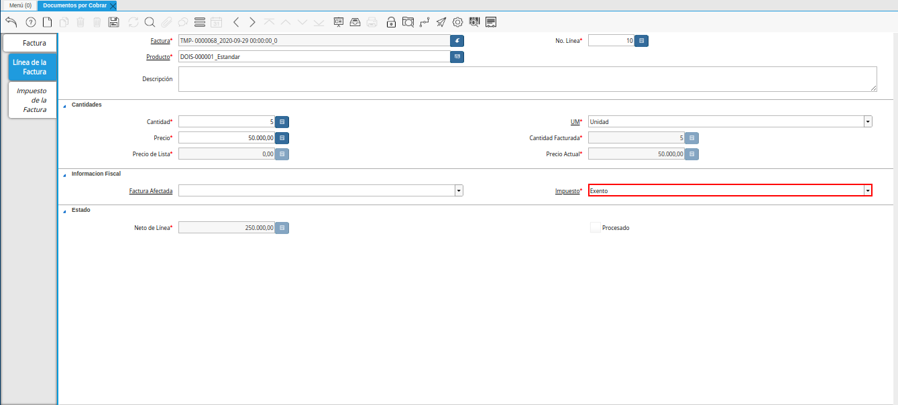
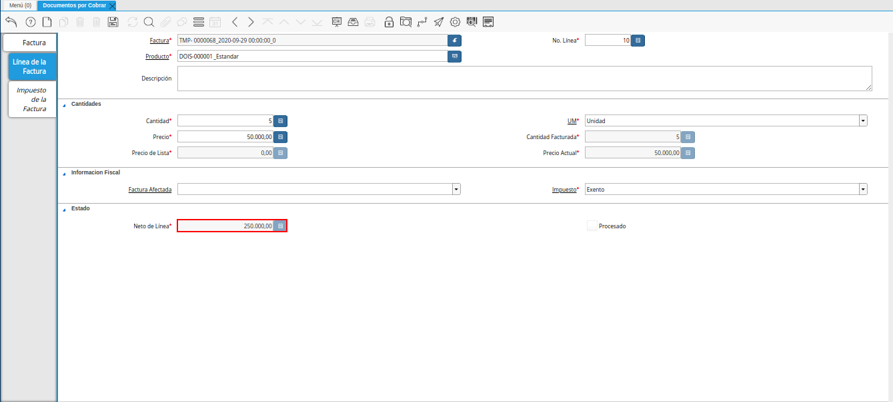
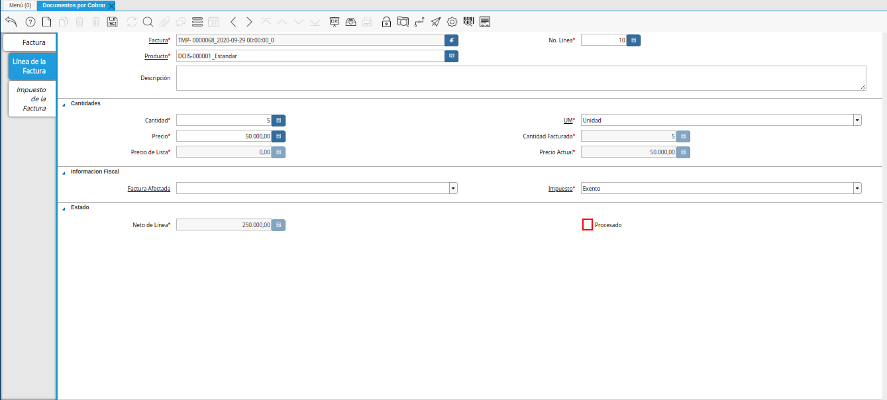
.. |Pestaña Factura| image:: resources/invoice-tab.png
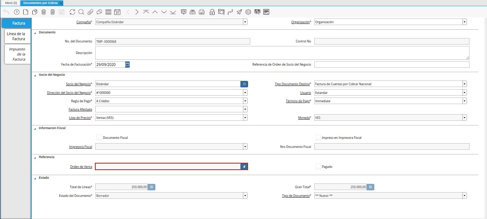
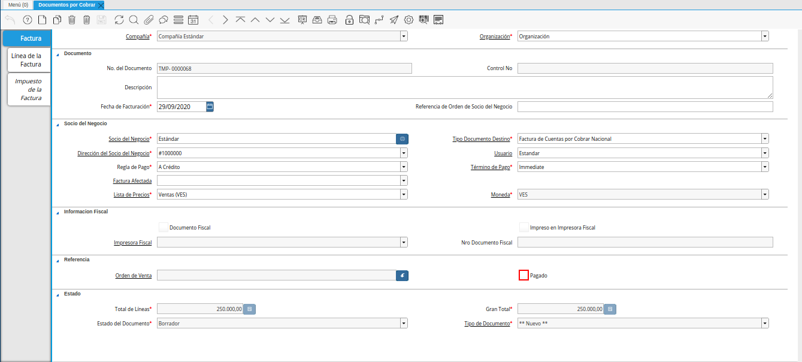
.. |campo total de líneas| image:: resources/total-field-of-lines.png
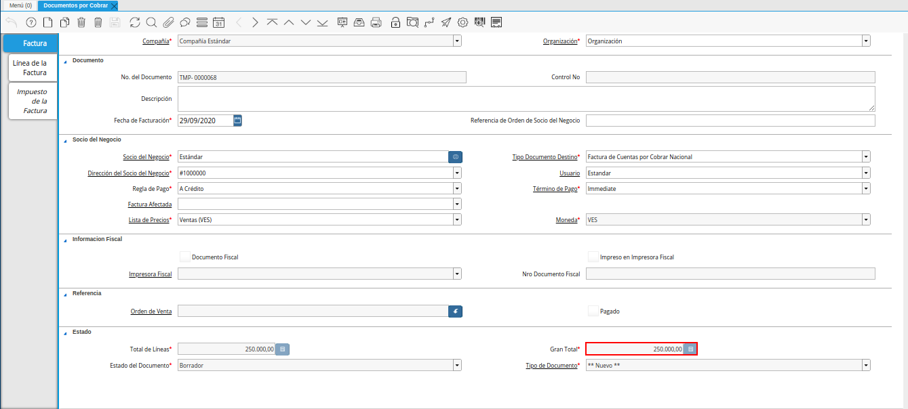
.. |campo estado del documento| image:: resources/document-status-field.png
.. |campo tipo de documento| image:: resources/document-type-field.png
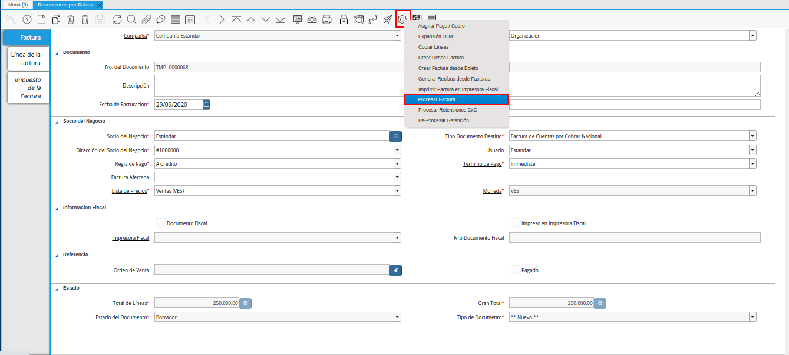
.. |Acción Completar y Opción OK| image:: resources/action-complete-and-option-ok.png

.. _documento/documento-por-cobrar:

**Registro de Documento por Cobrar**
====================================

#. Ubique y seleccione en el menú de ADempiere, la carpeta "**Gestión de Ventas**", luego seleccione la carpeta "**Facturas de Ventas**", por último seleccione la ventana "**Documentos por Cobrar**".

    |Menú de ADempiere|

    Imagen 1. Menú de ADempiere

#. Podrá visualizar la ventana "**Documentos por Cobrar**" con los diferentes registros de documentos de cuentas por cobrar en ADempiere.

    |Ventana Documento por Cobrar|

    Imagen 2. Ventana Documento por Cobrar

#. Seleccione el icono "**Registro Nuevo**", ubicado en la barra de herramientas de ADempiere para crear un nuevo registro de factura de cuentas por cobrar.

    |Icono Registro Nuevo|

    Imagen 3. Icono Registro Nuevo

    #. Seleccione en el campo "**Organización**", la organización para la cual esta realizando el documento por cobrar.

        |Campo Organización|

        Imagen 4. Campo Organización

    #. En el campo "**No. de Documento**", no es necesario ingresarlo en forma manual, al momento de realizar un registro, ADempiere genera un número de secuencia automáticamente para el documento, al seleccionar la opción guardar del nuevo registro de documento por cobrar.

        |campo nro del documento|

        Imagen 5. Campo Nro del Documento
    
    #. En el campo "**Control Nro**", no es necesario ingresarlo en forma manual, al momento de realizar un registro, ADempiere genera un número de control para el documento, al seleccionar la opción guardar del nuevo registro de documento por cobrar.

        |campo control nro|

        Imagen 6. Campo Control Nro

    #. En el campo "**Descripción**", introduzca una breve descripción referente al documento por cobrar que se está realizando, este campo es opcional.

        |campo descripción|

        Imagen 7. Campo Descripción

    #. Introduzca en el campo "**Fecha de Facturación**", la fecha en la cual se realiza la venta y facturación del producto o servicio.

        |campo fecha de facturación|

        Imagen 8. Campo Fecha de Facturación

    #. Introduzca en el campo "**Referencia de Orden de Socio del Negocio**", la referencia de orden del socio del negocio.

        |campo referencia de orden de socio del negocio|

        Imagen 9. Campo Referencia de Orden de Socio del Negocio

    #. Seleccione en el campo "**Socio del Negocio**", el socio del negocio cliente al cual se le realiza la venta del producto o servicio.

        |Campo Socio del Negocio|

        Imagen 10. Campo Socio del Negocio

    #. Seleccione el tipo de documento a generar en el campo "**Tipo de Documento Destino**", la selección de este define el comportamiento del documento que se está elaborando, dicho comportamiento se encuentra explicado en el documento "**Tipo de Documento**" elaborado por `ERPyA`_.

        |Campo Tipo de Documento Destino|

        Imagen 11. Campo Tipo de Documento Destino

    #. Seleccione en el campo "**Dirección del Socio del Negocio**", la dirección de localización del socio del negocio cliente al cual se le realiza la venta del producto o servicio.

        |Campo Dirección del Socio del Negocio|

        Imagen 12. Campo Dirección del Socio del Negocio

    #. Seleccione en el campo "**Usuario**", el usuario de contacto con el socio del negocio cliente al cual se le realizará la venta.

        |campo usuario|

        Imagen 13. Campo Usuario

    #. Seleccione en el campo "**Regla de Pago**", la regla para el pago de los productos o servicios.

        |campo regla de pago|

        Imagen 14. Campo Regla de Pago

    #. Seleccione en el campo "**Término de Pago**", el término o la condición establecida para el pago del producto o servicio.

        |Campo Término de Pago|

        Imagen 15. Campo Término de Pago

    #. Seleccione en el campo "**Factura Afectada**", la factura afectada para ser asignada automáticamente al registro que se encuentra realizando.

        |campo factura afectada|

        Imagen 16. Campo Factura Afectada

    #. Seleccione en el campo "**Lista de Precios**", la lista de precios que será utilizada para la venta del producto o servicio.

        |Campo Lista de Precios|

        Imagen 17. Campo Lista de Precios

    #. Podrá visualizar en el campo "**Moneda**", la moneda utilizada para la venta del producto o servicio, esta va a depender de la lista de precios seleccionada.

        |Campo Moneda|

        Imagen 18. Campo Moneda

    #. El checklist "**Documento Fiscal**", indica que el registro de documento por cobrar es considerado un documento fiscal y se utiliza para las facturas declaradas.

        |checklist documento fiscal|

        Imagen 19. Checklist Documento Fiscal

    #. El checklist "**Impreso en Impresora Fiscal**", indica que el registro de documento por cobrar es impreso en impresora fiscal.

        |checklist impreso en impresora fiscal|

        Imagen 20. Checklist Impreso en Impresora Fiscal

.. |campo impresora fiscal| image:: resources/fiscal-printer-field.png

.. |Pestaña Línea de la Factura| image:: resources/invoice-line-tab.png
.. |campo factura| image:: resources/invoice-field.png
.. |Campo Producto| image:: resources/product-field.png
.. |campo descripción| image:: resources/description-field.png

.. |Campo UM| image:: resources/field-um.png
.. |Campo Precio| image:: resources/price-field.png
.. |campo cantidad facturada| image:: resources/invoiced-amount-field.png
.. |campo precio de lista| image:: resources/list-price-field.png
.. |campo precio actual| image:: resources/current-price-field.png
.. |campo factura afectada| image:: resources/affected-invoice-field.pnf

.. |Pestaña Factura| image:: resources/invoice-tab.png

.. |campo total de líneas| image:: resources/total-field-of-lines.png

.. |campo estado del documento| image:: resources/document-status-field.png
.. |campo tipo de documento| image:: resources/document-type-field.png

.. |Acción Completar y Opción OK|

#. Seleccione la pestaña "**Línea de la Factura**" y proceda al llenado de los campos correspondientes.

    |Pestaña Línea de la Factura|

    Imagen 13. Pestaña Línea de la Factura

    #. Seleccione en el campo "**Producto**", el producto o servicio que será vendido al socio del negocio cliente.

        |Campo Producto|

        Imagen 14. Campo Producto

    #. Seleccione en el campo "**Cantidad**", la cantidad de productos o servicios que serán vendidos al socio del negocio cliente.

        |Campo Cantidad|

        Imagen 15. Campo Cantidad

    #. Seleccione en el campo "**UM**", la unidad de medida del producto que será vendido al socio del negocio cliente.

        |Campo UM|

        Imagen 16. Campo UM

    #. Podrá visualizar en el campo "**Precio**", el precio unitario del producto o servicio seleccionado para la venta al socio del negocio cliente.

        |Campo Precio|

        Imagen 17. Campo Precio

    #. Seleccione en el campo "**Impuesto**", el impuesto correspondiente a la venta del producto o servicio seleccionado.

        |Campo Impuesto|

        Imagen 18. Campo Impuesto

    #. Podrá visualizar en el campo "**Neto de Línea**", el resultado del cálculo del valor en el campo "**Precio**" por el valor ingresado en el campo "**Cantidad**".

        |Campo Neto de Línea|

        Imagen 19. Campo Neto de Línea

    .. note::

        Recuerde guardar el registro de los campos con ayuda del icono "**Guardar Cambios**", ubicado en la barra de herramientas de ADempiere.

#. Seleccione la pestaña principal "**Factura**" y luego seleccione la opción "**Completar**" ubicada en la parte inferior del documento por cobrar.

    |Pestaña Factura|

    Imagen 20. Pestaña Factura

    #. Seleccione la acción "**Completar**" y la opción "**OK**" para completar el documento.

        |Acción Completar y Opción OK|

        Imagen 21. Acción Completar y Opción OK