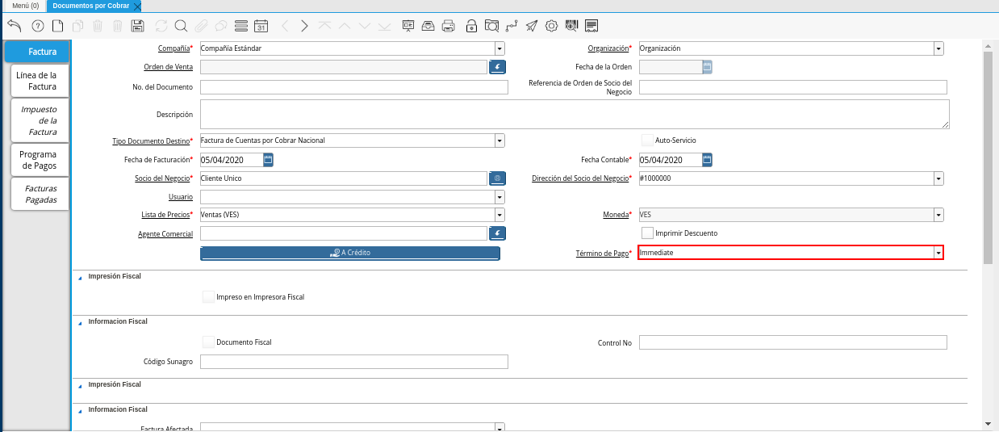

.. |Campo Lista de Precios| image:: resources/campo-lista-precios.png

.. |Campo UM| image:: resources/campo-um.png

.. _documento/documento-por-cobrar:

**Crear Documentos por Pagar**
==============================

#. Ubique y seleccione en el menú de ADempiere, la carpeta "**Gestión de Ventas**", luego seleccione la carpeta "**Facturas de Ventas**", por último seleccione la ventana "**Documentos por Cobrar**".

    |Menú de ADempiere|

    Imagen 1. Menú de ADempiere

#. Podrá visualizar la ventana "**Documentos por Cobrar**" con los diferentes registros de documentos de cuentas por cobrar en ADempiere.

    |Ventana Documento por Cobrar|

    Imagen 2. Ventana Documento por Cobrar

    #. Seleccione el icono "**Registro Nuevo**", ubicado en la barra de herramientas de ADempiere para crear un nuevo registro de factura de cuentas por cobrar.

        |Icono Registro Nuevo|

        Imagen 3. Icono Registro Nuevo

    #. Seleccione en el campo "**Organización**", la organización para la cual esta realizando el documento por cobrar.

        |Campo Organización|

        Imagen 4. Campo Organización

    #. Seleccione el tipo de documento a generar en el campo "**Tipo de Documento Destino**", la selección de este define el comportamiento del documento que se está elaborando, dicho comportamiento se encuentra explicado en el documento :ref:`documento/tipo-documento` elaborado por ERPyA.

        |Campo Tipo de Documento Destino|

        Imagen 5. Campo Tipo de Documento Destino

    #. Introduzca en el campo "**Fecha de Facturación**", la fecha en la cual se realiza la venta y facturación del producto o servicio.

        |Campo Fecha de Facturación|

        Imagen 6. Campo Fecha de Facturación

    #. Introduzca en el campo "**Fecha Contable**", la fecha en la cual se realiza la venta y facturación del producto o servicio.

        |Campo Fecha Contable|

        Imagen 7. Campo Fecha Contable

    #. Seleccione en el campo "**Socio del Negocio**", el socio del negocio cliente al cual se le realiza la venta del producto o servicio.

        |Campo Socio del Negocio|

        Imagen 8. Campo Socio del Negocio

    #. Seleccione en el campo "**Dirección del Socio del Negocio**", la dirección de localización del socio del negocio cliente al cual se le realiza la venta del producto o servicio.

        |Campo Dirección del Socio del Negocio|

        Imagen 9. Campo Dirección del Socio del Negocio

    #. Seleccione en el campo "**Lista de Precios**", la lista de precios que será utilizada para la venta del producto o servicio.

        |Campo Lista de Precios|

        Imagen 10. Campo Lista de Precios

    #. Podrá visualizar en el campo "**Moneda**", la moneda utilizada para la venta del producto o servicio, esta va a depender de la lista de precios seleccionada.

        |Campo Moneda|

        Imagen 11. Campo Moneda

    #. Seleccione en el campo "**Término de Pago**", el término o la condición establecida para el pago del producto o servicio.

        |Campo Término de Pago|

        Imagen 12. Campo Término de Pago

    .. note::

        Recuerde guardar el registro de los campos con ayuda del icono "**Guardar Cambios**", ubicado en la barra de herramientas de ADempiere.

#. Seleccione la pestaña "**Línea de la Factura**" y proceda al llenado de los campos correspondientes.

    |Pestaña Línea de la Factura|

    Imagen 13. Pestaña Línea de la Factura

    #. Seleccione en el campo "**Producto**", el producto o servicio que será vendido al socio del negocio cliente.

        |Campo Producto|

        Imagen 14. Campo Producto

    #. Seleccione en el campo "**Cantidad**", la cantidad de productos o servicios que serán vendidos al socio del negocio cliente.

        |Campo Cantidad|

        Imagen 15. Campo Cantidad

    #. Seleccione en el campo "**UM**", la unidad de medida del producto que será vendido al socio del negocio cliente.

        |Campo UM|

        Imagen 16. Campo UM

    #. Podrá visualizar en el campo "**Precio**", el precio unitario del producto o servicio seleccionado para la venta al socio del negocio cliente.

        |Campo Precio|

        Imagen 17. Campo Precio

    #. Seleccione en el campo "**Impuesto**", el impuesto correspondiente a la venta del producto o servicio seleccionado.

        |Campo Impuesto|

        Imagen 18. Campo Impuesto

    #. Podrá visualizar en el campo "**Neto de Línea**", el resultado del cálculo del valor en el campo "**Precio**" por el valor ingresado en el campo "**Cantidad**".

        |Campo Neto de Línea|

        Imagen 19. Campo Neto de Línea

    .. note::

        Recuerde guardar el registro de los campos con ayuda del icono "**Guardar Cambios**", ubicado en la barra de herramientas de ADempiere.

#. Seleccione la pestaña principal "**Factura**" y luego seleccione la opción "**Completar**" ubicada en la parte inferior del documento por cobrar.

    |Pestaña Factura|

    Imagen 20. Pestaña Factura

    #. Seleccione la acción "**Completar**" y la opción "**OK**" para completar el documento.

        |Acción Completar y Opción OK|

        Imagen 21. Acción Completar y Opción OK