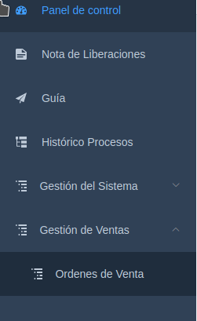
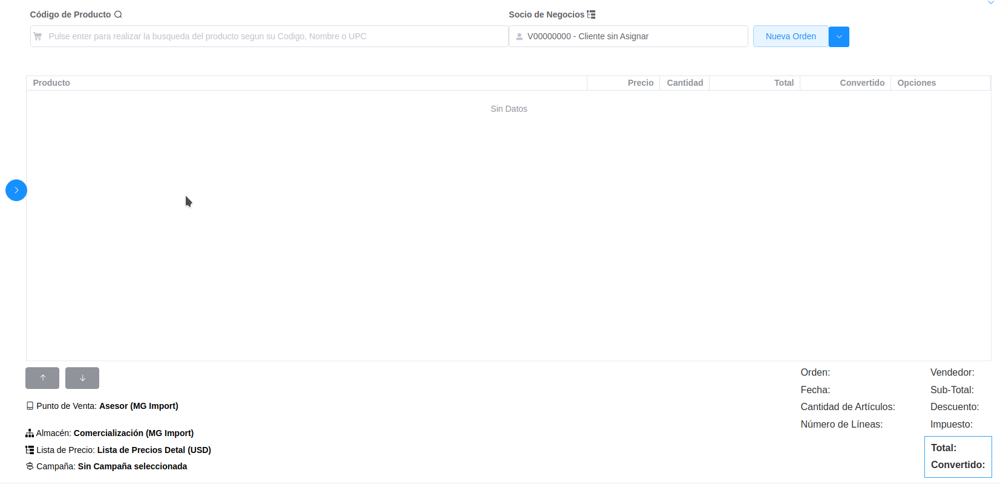
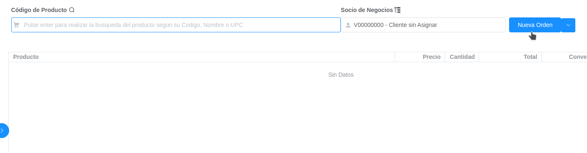
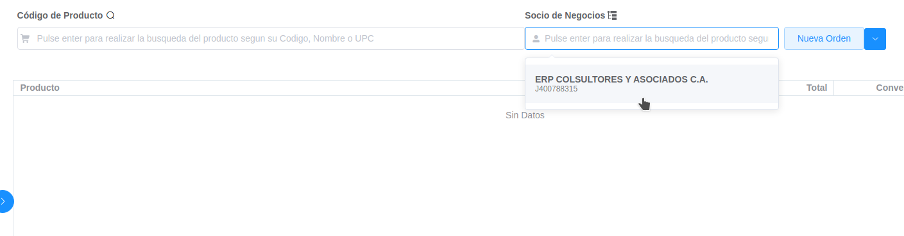
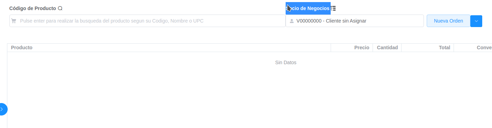
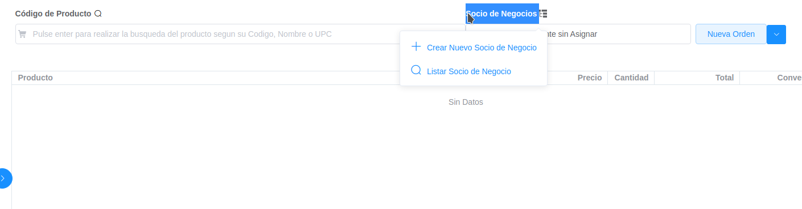
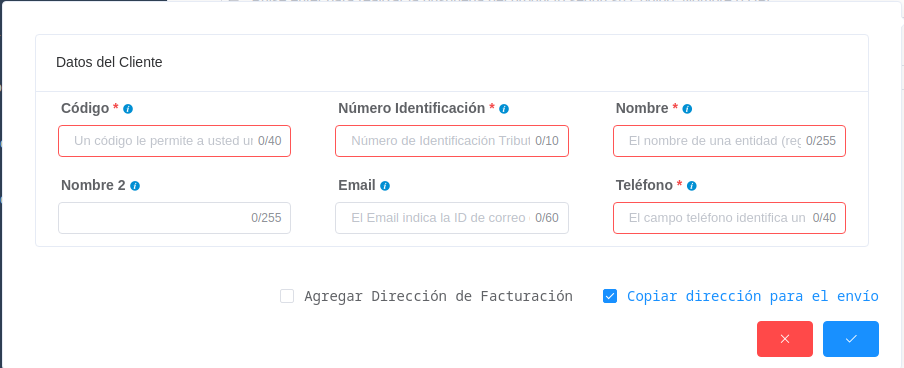
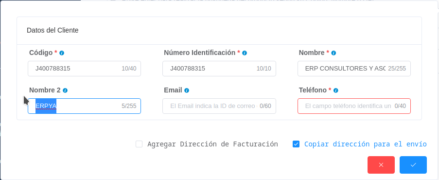
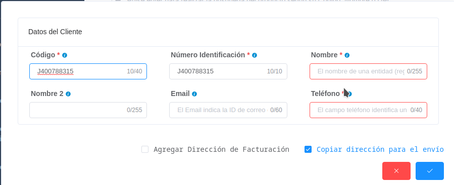
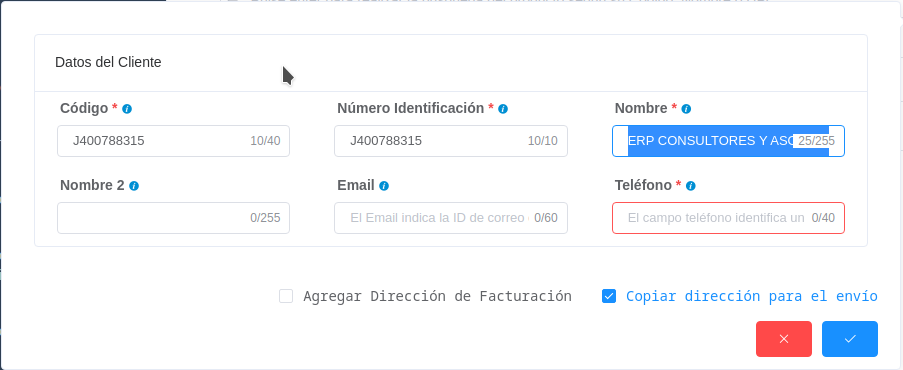

.. _ERPyA: http://erpya.com

    emailbpartner.png
    phonebpartner.png
    addlocationbpartner.png
    reflocationbpartner.png
.. |Campo Dirección del Socio del Negocio| image:: resources/campo-direccion-socio-cliente.png
.. |Campo Lista de Precios| image:: resources/campo-lista-precios.png
.. |Campo Moneda| image:: resources/campo-moneda.png
.. |Campo Término de Pago| image:: resources/campo-termino-pago.png
.. |Pestaña Línea de la Factura| image:: resources/pest-linea-factura.png
.. |Campo Producto| image:: resources/campo-producto.png
.. |Campo Cantidad| image:: resources/campo-cantidad.png
.. |Campo UM| image:: resources/campo-um.png
.. |Campo Precio| image:: resources/campo-precio.png
.. |Campo Impuesto| image:: resources/campo-impuesto.png
.. |Campo Neto de Línea| image:: resources/campo-neto-linea.png
.. |Pestaña Factura| image:: resources/pest-factura.png
.. |Acción Completar y Opción OK| image:: resources/completar-factura.png

    

.. _documento/puntodeventa-ui:

**Registro de Pedido**
======================

Ubique y seleccione en el menú de ADempiere, la carpeta "**Gestión de Ventas**", luego seleccione la carpeta "**Grstión de Ventas**", por último seleccione la ventana "**Punto de Ve0000000000nta**".

    |Menú de ADempiere|

    Imagen 1. Menú de ADempiere

Podrá visualizar la ventana "**Punto de Venta**" en ADempiere.

    |Ventana POS|

    Imagen 2. Ventana Punto de Venta

    Seleccione el icono "**Nueva Orden**", ubicado en la barra de herramientas superior derecha.

        |Icono Registro Nuevo|

        Imagen 3. Icono Registro Nueva Orden

    Si desea relacionar su venta a un cliente fiscalmente, puede seleccionar un cliente existente o crear un nuevo cliente:

        Para seleccionar cliente existente, proceda a tipear el nombre, RIF o cédula del cliente  como lo muetras la Imagen.

            |Campo Cliente Existente|

            Imagen 4. Búsqueda de Cliente

            Para seleccionar cliente existente, proceda a tipear el nombre, RIF o cédula del cliente  como lo muetras la Imagen.

                |Campo Nuevo Cliente|

                Imagen 4. Nuevo Cliente
        
        Seleccione la opción "**Crear Nuevo Socio de Negocio**".

            |Opción Socio de Negocio|

            Imagen 5. Opción Nuevo Cliente

            A continuación Seleccione la opción "**Crear Nuevo Socio de Negocio**", y se desplegará la siguiente ventana.

                |Ventana Crear Socio de Negocio|
                
                Imagen 6. Ventana Crear Socio de Negocio

                A continuación indique el código del cliente (Cédula/RIF) en el campo "**Código**".
                    
                    |Codigo Cliente|
                    
                    Imagen 7. Código Socio de Negocio

                    .. warning::

                        ADempiere actualiza de modo automático el campo "**Número Identificación**", este campo es utilizado para reportes fiscales (Ejemplo:IGTF).

                A continuación indique el nombre o razón social del cliente en el campo "**Nombre**".
                    
                    |Nombre Cliente|
                    
                    Imagen 7. Nombre Socio de Negocio
                

    