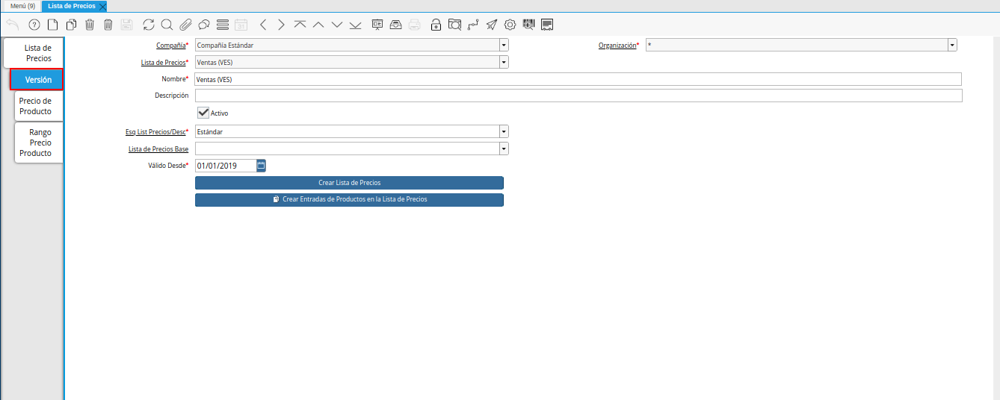
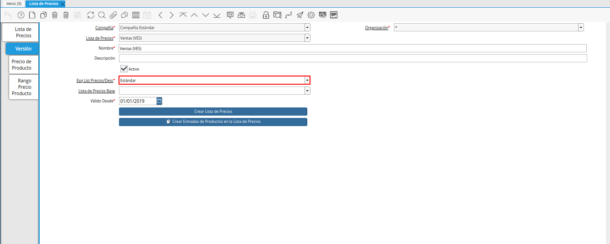
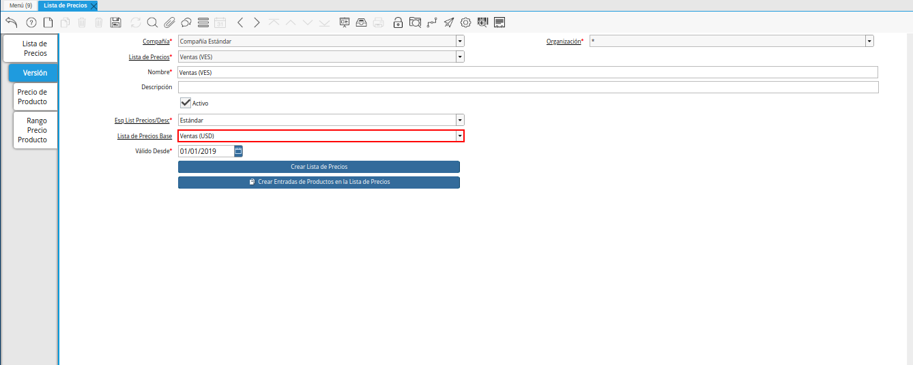
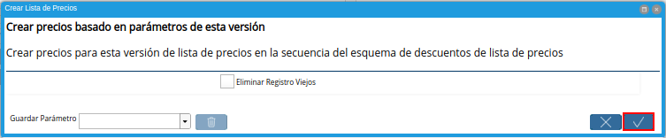

.. |menú de adempiere 2| image:: resources/price-list-menu.png
.. |ventana lista de precios| image:: resources/price-list-window.png

.. |crear lista de precios| image:: resources/create-price-list.png
.. |opción crear lista de precios desde el proceso| image:: resources/option-create-price-list-from-process.png

.. _documento/proceso-automático-lista-de-precios:

**Proceso Automático de Lista de Precios**
==========================================

.. _documento/crear-lista-precios:

**Crear Lista de Precios**
--------------------------

#. Ubique y seleccione en el menú de ADempiere, la carpeta "**Gestión de Materiales**", luego seleccione la carpeta "**Reglas de Gestión de Materiales**", por último seleccione la ventana "**Lista de Precios**".

    |menú de adempiere 2|

    Imagen 6. Menú de ADempiere

#. Podrá visualizar la ventana "**Lista de Precios**", donde debe ubicar el registro de la lista de precios a utilizar.

    |ventana lista de precios|

    Imagen 7. Ventana Lista de Precios

#. Seleccione la pestaña "**Versión**", para establecer la lista de precios base para la ejecución del proceso.

    |pestaña versión|

    Imagen 8. Pestaña Versión 

#. Seleccione en el campo "**Esq List Precios/Desc**", el esquema de lista de precios previamente configurado con el % de descuento de sobre precios.

    |campo Esq list precios desc|

    Imagen 9. Campo Esq. List. Precios/Desc

#. Seleccione en el campo "**Lista de Precios Base**", la lista de precios base para aplicar el % de descuento de sobre precios.

    Este campo no es obligatorio y permite generar la lista de precios en base a otra.

    |campo lista de precios base|

    Imagen 10. Campo Lista de Precios Base 

    .. note::

        Recuerde guardar el registro de los campos de la ventana, seleccionando el icono "**Guardar Cambios**", ubicado en la barra de herramientas de ADempiere.

#. Seleccione la opción "**Crear Lista de Precios**", para aplicar la configuración de lista de precios definida previamente.

    |crear lista de precios|

    Imagen 11. Opción Crear Lista de Precios

#. También puede acceder al proceso, seleccionando la opción "**Crear Lista de Precios**" desplegada del icono "**Proceso** ubicado en la barra de herramientas de ADempiere.

    |opción crear lista de precios desde el proceso|

    Imagem 12. Opción Crear Lista de Precios desde el Icono Proceso

#. ADempiere mostrará la ventana "**Crear Lista de Precios**", con el mensaje de confimración "**Crear precios basado en parámetros de esta versión**", donde debe seleccionar la opción "**OK**" para ejecutar el proceso.

    |mensaje de confirmación|

    Imagen 13. Mensaje de Confirmación