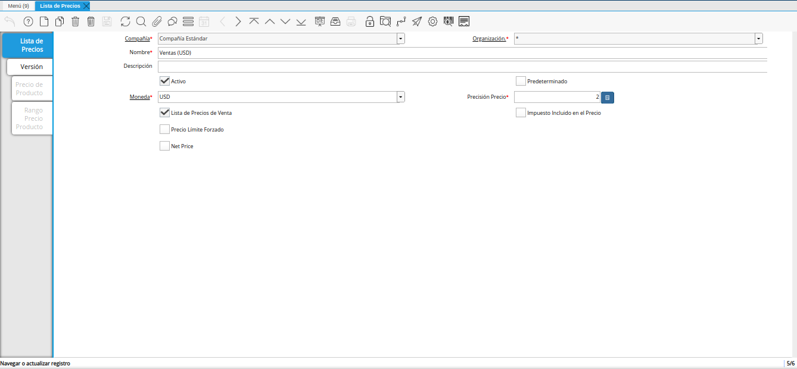
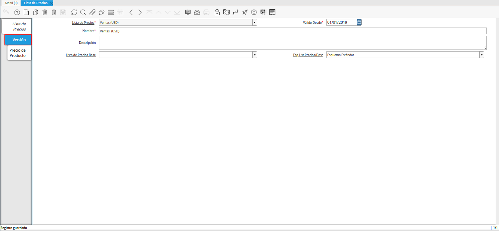
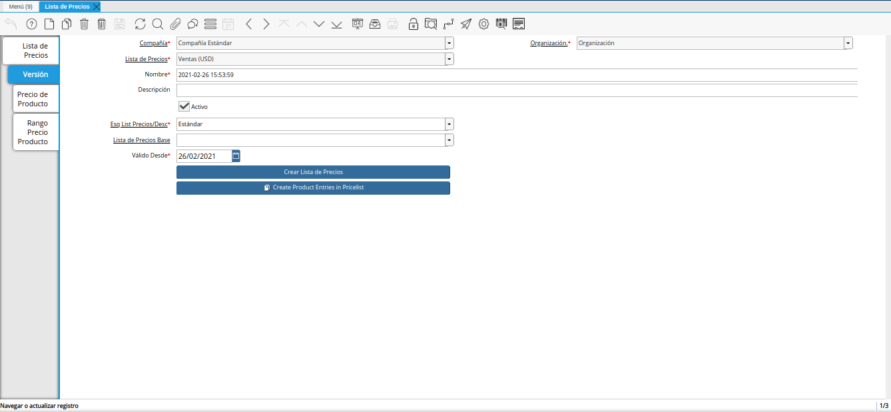
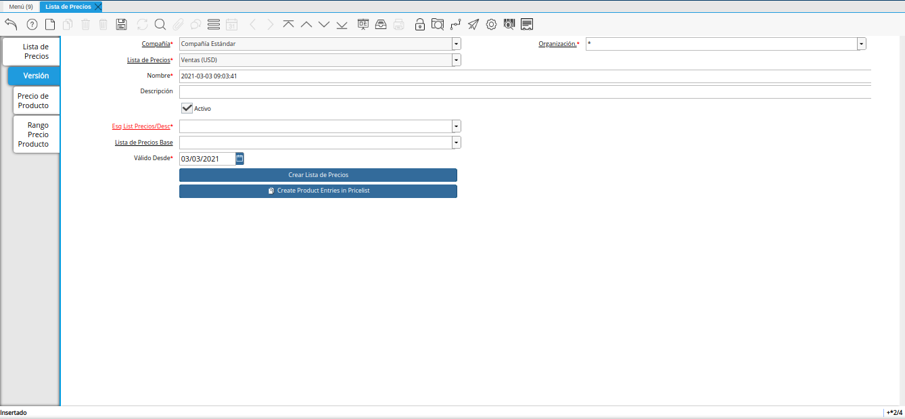
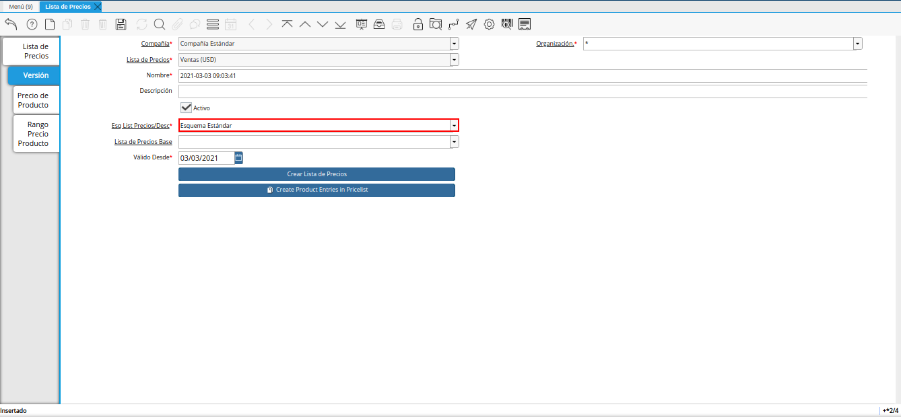
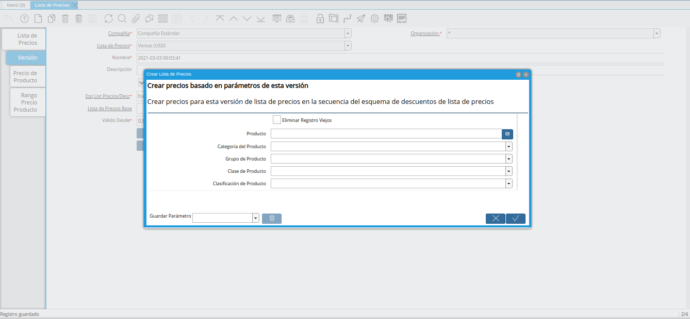
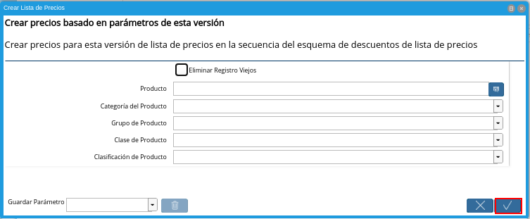
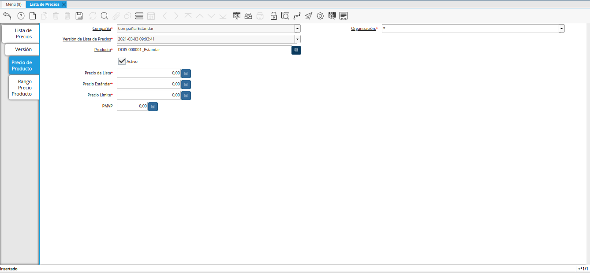
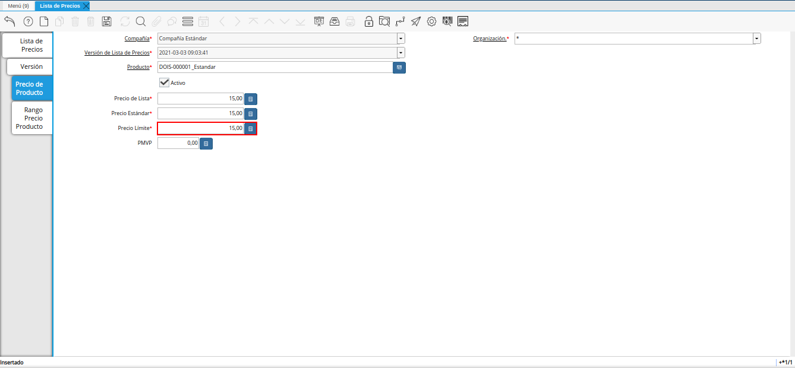

.. |menú de lista de precios| image:: resources/price-list-menu.png
.. |ventana lista de precios| image:: resources/price-list-window.png

.. |campo válido desde para lista de precios base| image:: resources/valid-from-field-for-base-price-list.png

.. |campo descripción para lista de precios base| image:: resources/description-field-for-base-price-list.png

.. |icono guardar cambios de la pestaña precio de producto| image:: resources/: En donde puede generar la lista a un producto específicoicon-save-changes-of-the-product-price-tab.png

.. _documento/configuración-de-lista-de-precios-base:

**Configuración de Lista de Precios Base**
==========================================

Ubique y seleccione en el menú de ADempiere, la carpeta "**Gestión de Materiales**", luego seleccione la carpeta "**Reglas de Gestión de Materiales**", por último seleccione la ventana "**Lista de Precios**". 

    |menú de lista de precios|

    Imagen 1. Menú de ADempiere

Podrá visualizar la ventana "**Lista de Precios**", con todos los registros de listas de precios de compras y ventas.

    |ventana lista de precios|

    Imagen 2. Ventana Lista de Precios

    .. warning::

        La información de los campos que contiene la pestaña "**Lista de Precios**", no debe ser modificada por ningún motivo. De igual manera, no se debe tildar o destildar ningún check de los que contiene dicha pestaña.

Ubique el registro de lista de precios de "**Ventas (USD)**".

    |registro de ventas usd para lista de precios base|

    Imagen 3. Lista de Precios Ventas (USD)

Seleccione la pestaña "**Versión**", para crear la versión de lista de precios base.

    |pestaña versión para lista de precios base|

    Imagen 4. Pestaña Versión

Seleccione el icono "**Registro Nuevo**", ubicado en la barra de herramientas de ADempiere.

    |icono registro nuevo para lista de precios base|

    Imagen 5. Icono Registro Nuevo 

Seleccione en el campo "**Válido Desde**", la fecha de inicio del periodo de validez del registro que se encuentra realizando.

    |campo válido desde para lista de precios base|

    Imagen 6. Campo Válido Desde

Introduzca en el campo "**Nombre**", el nombre correspondiente a la versión de lista de precios que se encuentra creando.

    Este campo contiene como nombre por defecto, la fecha y la hora en el cual fue creado el registro.

    |campo nombre para lista de precios base|

    Imagen 7. Campo Nombre

Introduzca en el campo "**Descripción**", una breve descripción correspondiente al registro que se encuentra realizando.

    |campo descripción para lista de precios base|

    Imagen 8. Campo Descripción

Seleccione en el campo "**Esq List Precios/Desc**", el esquema de descuento correspondiente.

    |campo esquema de lista de precios descuento para lista de precios base|

    Imagen 9. Campo Esq List Precios/Desc

Seleccione el icono "**Guardar Cambios**", ubicado en la barra de herramientas de ADempiere.

    |icono guardar cambios para lista de precios base|

    Imagen 10. Icono Guardar Cambios

    .. note::
    
        Para cargar los precios de los productos en la lista de precios base, puede realizar desde la opción "**Crear Lista de Precios**", o de manera manual desde la pestaña "**Precio del Producto**".

.. _documento/paso-crear-precios-desde-crear-lista-de-precios:

**Crear Precios desde Crear Lista de Precios**
----------------------------------------------

Para cargar los precios de los productos desde la opción "**Crear Lista de Precios**", debe realizar lo siguiente.

    Esta opción permite crear los precios de los productos desde la última orden de compra procesada, basandose en el tipo de conversión, descuento y margen de ganancia, previamente configurado en el esquema de descuento. 

    Si los precios de los productos se encuentran en una moneda diferente a la moneda de la compañía, ADempiere toma los precios de la pestaña "**Precio de Compras**" de cada producto y en base a la moneda que este asociada a dicha pestaña y a la moneda de la lista de precios, toma la configuración del esquema de lista de precios, realizando la conversión a la tasa de la fecha que tenga la versión de lista de precios y aplica el descuento o margen de ganancia configurado en el mismo (si lo tiene), para finalmente cargar dichos precios a la lista de precios.

    Seleccione la opción "**Crear Lista de Precios**", desplegada por el icono "**Proceso**", ubicado en la barra de herramientas de ADempiere.

        |opción crear lista de precios para lista de precios base|

        Imagen 11. Opción Crear Lista de Precios de Icono Proceso

    Podrá visualizar la ventana "**Crear Lista de Precios**", en donde podrá crear la lista de precios filtrando por los parámetros que se indican a continuación:
            
        - Productos
        - Grupo de Producto
        - Categoría de Producto
        - Clase de Producto
        - Clasificación de Producto

    Si no desea filtrar por ninguno de estos parámetros se generará la lista de todos los productos que presenten la configuración detallada anteriormente. También puede eliminar los registros de sus listas de precios anteriores.

        |ventana crear lista de precios para lista de precios base|

        Imagen 12. Ventana Crear Lista de Precios

    Seleccione la opción "**OK**", para ejecutar el proceso y generar la lista de precios en base a lo seleccionado.

        |opción ok de la ventana crear lista de precios para lista de precios base|

        Imagen 13. Opción OK

    .. note::

        Para verificar los precios de los productos puede seleccionar la pestaña "**Precio de Producto**", de la ventana "**Lista de Precios**", de la versión previamente creada.

.. _documento/paso-crear-precios-desde-pestaña-precio-de-producto:

**Crear Precios desde Pestaña Precio de Producto**
--------------------------------------------------

Para cargar los precios de los productos de manera manual, debe realizar lo siguiente.

    Seleccione la pestaña "**Precio de Producto**" y proceda a llenar los campos correspondientes.

        |pestaña precio del producto para lista de precios base|

        Imagen 14. Pestaña Precio del Producto

    Seleccione en el campo "**Producto**", el producto correspondiente al registro.

        |campo producto de la pestaña precio de producto|

        Imagen 15. Campo Producto

    Introduzca en el campo "**Precio de Lista**", el precio de lista del producto.

        El precio de lista es el precio de lista oficial en la moneda del documento.

        |campo precio de lista de la pestaña precio de producto|

        Imagen 16. Campo Precio de Lista 

    Introduzca en el campo "**Precio Estándar**", el precio estándar del producto.

        El precio estándar indica el precio estándar o normal para un producto en esta lista de precios.

        |campo precio estándar de la pestaña precio de producto|

        Imagen 17. Campo Precio Estándar

    Introduzca en el campo "**Precio Límite**", el precio límite del producto.

        El límite de precio indica el precio más bajo para un producto establecido en la moneda de la lista de precio.

        |campo precio límite de la pestaña precio de producto|

        Imagen 18. Campo Precio Límite 

    Introduzca en el campo "**PMVP**", el PMVP del producto.

        El PMVP indica el precio marcado de venta al público.

        |campo pmvp de la pestaña precio de producto|

        Imagen 19. Campo PMVP

    Seleccione el icono "**Guardar Cambios**", ubicado en la barra de herramientas de ADempiere.

        |icono guardar cambios de la pestaña precio de producto|

        Imagen 20. Icono Guardar Cambios 
