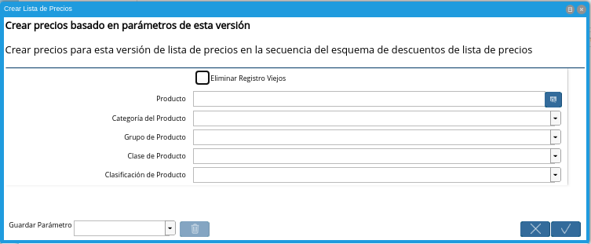

.. |menú de lista de precios| image:: resources/price-list-menu.png
.. |ventana lista de precios| image:: resources/price-list-window.png
.. |registro de ventas usd para lista de precios base| image:: resources/usd-sales-record-for-base-price-list.png
.. |pestaña versión para lista de precios base| image:: resources/version-tab-for-base-price-list.png
.. |icono registro nuevo para lista de precios base| image:: resources/new-record-icon-for-base-price-list.png
.. |campo organización para lista de precios base| image:: resources/organization-field-for-base-price-list.png
.. |campo nombre para lista de precios base| image:: resources/name-field-for-base-price-list.png
.. |campo descripción para lista de precios base| image:: resources/description-field-for-base-price-list.png
.. |campo esquema de lista de precios descuento para lista de precios base| image:: resources/discount-price-list-schema-field-for-base-price-list.png
.. |campo válido desde para lista de precios base| image:: resources/valid-from-field-for-base-price-list.png
.. |icono guardar cambios para lista de precios base| image:: resources/save-changes-icon-for-base-price-list.png
.. |opción crear lista de precios para lista de precios base| image:: resources/option-create-price-list-for-base-price-list.png

.. |campo producto de la ventana crear lista de precios para lista de precios base| image:: resources/product-field-of-the-create-price-list-window-for-base-price-list.png
.. |campo categoría del producto de la ventana crear lista de precios para lista de precios base| image:: resources/product-category-field-of-the-create-price-list-window-for-base-price-list.png
.. |campo grupo de producto de la ventana crear lista de precios para lista de precios base| image:: resources/product-group-field-of-the-create-price-list-window-for-base-price-list.png
.. |campo clase de producto de la ventana crear lista de precios para lista de precios base| image:: resources/product-class-field-of-the-create-price-list-window-for-base-price-list.png
.. |campo clasificación de producto de la ventana crear lista de precios para lista de precios base| image:: resources/product-classification-field-of-the-create-price-list-window-for-base-price-list.png

.. |pestaña precio del producto para lista de precios base| image:: resources/product-price-tab-for-base-price-list.png
.. |campo producto de la pestaña precio de producto| image:: resources/product-field-of-the-product-price-tab.png
.. |campo precio de lista de la pestaña precio de producto| image:: resources/list-price-field-of-the-product-price-tab.png
.. |campo precio estándar de la pestaña precio de producto| image:: resources/standard-price-field-of-the-product-price-tab.png
.. |campo precio límite de la pestaña precio de producto| image:: resources/limit-price-field-of-the-product-price-tab.png
.. |campo pmvp de la pestaña precio de producto| image:: resources/pmvp-field-of-the-product-price-tab.png
.. |icono guardar cambios de la pestaña precio de producto| image:: resources/icon-save-changes-of-the-product-price-tab.png

.. _documento/configuración-de-lista-de-precios-base:

**Configuración de Lista de Precios Base**
==========================================

#. Ubique y seleccione en el menú de ADempiere, la carpeta "**Gestión de Materiales**", luego seleccione la carpeta "**Reglas de Gestión de Materiales**", por último seleccione la ventana "**Lista de Precios**". 

    |menú de lista de precios|

    Imagen 1. Menú de ADempiere

#. Podrá visualizar la ventana "**Lista de Precios**", con todos los registros de listas de precios de compras y ventas.

    |ventana lista de precios|

    Imagen 2. Ventana Lista de Precios

    .. warning::

        La información de los campos que contiene la pestaña "**Lista de Precios**", no debe ser modificada por ningún motivo. De igual manera, no se debe tildar o destildar ningún check de los que contiene dicha pestaña.

#. Ubique el registro de lista de precios de "**Ventas (USD)**".

    |registro de ventas usd para lista de precios base|

    Imagen 3. Lista de Precios Ventas (USD)

#. Seleccione la pestaña "**Versión**", para crear la versión de lista de precios base.

    |pestaña versión para lista de precios base|

    Imagen 4. Pestaña Versión

#. Seleccione el icono "**Registro Nuevo**", ubicado en la barra de herramientas de ADempiere.

    |icono registro nuevo para lista de precios base|

    Imagen 5. Icono Registro Nuevo 

#. Seleccione en el campo "**Organización**", la organización para la cual se encuentra realizando el registro.

    |campo organización para lista de precios base|

    Imagen 6. Campo Organización

    .. note::

        La organización seleccionada en la lista de precios, debe coincidir con la organización seleccionada en la tasa de cambio creada a la fecha. Si la lista de precios esta creada con organización (*), las tasas de cambio a utilizar deben estar creadas con organización (*).

#. Introduzca en el campo "**Nombre**", el nombre correspondiente a la versión de lista de precios que se encuentra creando.

    Este campo contiene como nombre por defecto, la fecha y la hora en el cual fue creado el registro.

    |campo nombre para lista de precios base|

    Imagen 7. Campo Nombre

#. Introduzca en el campo "**Descripción**", una breve descripción correspondiente al registro que se encuentra realizando.

    |campo descripción para lista de precios base|

    Imagen 8. Campo Descripción

#. Seleccione en el campo "**Esq List Precios/Desc**", el esquema de descuento correspondiente.

    |campo esquema de lista de precios descuento para lista de precios base|

    Imagen 9. Campo Esq List Precios/Desc

#. Seleccione en el campo "**Válido Desde**", la fecha de inicio del periodo de validez del registro que se encuentra realizando.

    |campo válido desde para lista de precios base|

    Imagen 10. Campo Válido Desde

#. Seleccione el icono "**Guardar Cambios**", ubicado en la barra de herramientas de ADempiere.

    |icono guardar cambios para lista de precios base|

    Imagen 11. Icono Guardar Cambios

    .. note::
    
        Para cargar los precios de los productos en la lista de precios base, puede realizar desde la opción "**Crear Lista de Precios**", o de manera manual desde la pestaña "**Precio del Producto**".

.. _documento/paso-crear-precios-desde-crear-lista-de-precios:

**Crear Precios desde Crear Lista de Precios**
----------------------------------------------

#. Para cargar los precios de los productos desde la opción "**Crear Lista de Precios**", debe realizar lo siguiente.

    Esta opción permite crear los precios de los productos desde la última orden de compra procesada, basandose en el tipo de conversión, descuento y margen de ganancia, previamente configurado en el esquema de descuento. 

    Si los precios de los productos se encuentran en una moneda diferente a la moneda de la compañía, ADempiere toma los precios de la pestaña "**Compras**" de cada producto y en base a la moneda que este asociada a dicha pestaña y a la moneda de la lista de precios, toma la configuración del esquema de lista de precios, realizando la conversión a la tasa de la fecha que tenga la versión de lista de precios y aplica el descuento o margen de ganancia configurado en el mismo (si lo tiene), para finalmente cargar dichos precios a la lista de precios.

    #. Seleccione la opción "**Crear Lista de Precios**".

        |opción crear lista de precios para lista de precios base|

        Imagen 12. Opción Crear Lista de Precios

        .. note::

            También puede acceder al proceso, seleccionando la opción "**Crear Lista de Precios**" desplegada del icono "**Proceso** ubicado en la barra de herramientas de ADempiere.

    #. Podrá visualizar la ventana "**Crear Lista de Precios**", con diferentes campos que permiten generar la lista de precios en base a lo requerido por el usuario.

        |ventana crear lista de precios para lista de precios base|

        Imagen 13. Ventana Crear Lista de Precios

    #. Seleccione en el campo "**Producto**", el producto por el cual requiere generar la lista de precios.

        Si no es seleccionado ningún valor en este campo, se genera la lista de precios con todos los productos.

        |campo producto de la ventana crear lista de precios para lista de precios base|

        Imagen 14. Campo Producto

    #. Seleccione en el campo "**Categoría del Producto**", la categoría del producto por la cual requiere generar la lista de precios.

        Si no es seleccionado ningún valor en este campo, se genera la lista de precios con todas las categorías de productos.

        |campo categoría del producto de la ventana crear lista de precios para lista de precios base|

        Imagen 15. Campo Categoría del Producto

    #. Seleccione en el campo "**Grupo de Producto**", el grupo de producto por el cual requiere generar la lista de precios.

        Si no es seleccionado ningún valor en este campo, se genera la lista de precios con todos los grupos de productos.

        |campo grupo de producto de la ventana crear lista de precios para lista de precios base|

        Imagen 16. Campo Grupo de Producto

    #. Seleccione en el campo "**Clase de Producto**", la clase de producto por la cual requiere generar la lista de precios.

        Si no es seleccionado ningún valor en este campo, se genera la lista de precios con todas las clases de productos.

        |campo clase de producto de la ventana crear lista de precios para lista de precios base|

        Imagen 17. Campo Clase de Producto

    #. Seleccione en el campo "**Clasificación de Producto**", la clasificación por la cual requiere generar la lista de precios.

        Si no es seleccionado ningún valor en este campo, se genera la lista de precios con todas las clasificaciones de productos.

        |campo clasificación de producto de la ventana crear lista de precios para lista de precios base|

        Imagen 18. Campo Clasificación de Producto

    #. Seleccione la opción "**OK**", para ejecutar el proceso y generar la lista de precios en base a lo seleccionado.

        |opción ok de la ventana crear lista de precios para lista de precios base|

        Imagen 19. Opción OK

    .. note::

        Para verificar los precios de los productos puede seleccionar la pestaña "**Precio de Producto**", de la ventana "**Lista de Precios**", de la versión previamente creada.

.. _documento/paso-crear-precios-desde-pestaña-precio-de-producto:

**Crear Precios desde Pestaña Precio de Producto**
--------------------------------------------------

#. Para cargar los precios de los productos de manera manual, debe realizar lo siguiente.

    #. Seleccione la pestaña "**Precio de Producto**" y proceda a llenar los campos correspondientes.

        |pestaña precio del producto para lista de precios base|

        Imagen 20. Pestaña Precio del Producto

    #. Seleccione en el campo "**Producto**", el producto correspondiente al registro.

        |campo producto de la pestaña precio de producto|

        Imagen 21. Campo Producto

    #. Introduzca en el campo "**Precio de Lista**", el precio de lista del producto.

        El precio de lista es el precio de lista oficial en la moneda del documento.

        |campo precio de lista de la pestaña precio de producto|

        Imagen 22. Campo Precio de Lista 

    #. Introduzca en el campo "**Precio Estándar**", el precio estándar del producto.

        El precio estándar indica el precio estándar o normal para un producto en esta lista de precios.

        |campo precio estándar de la pestaña precio de producto|

        Imagen 23. Campo Precio Estándar

    #. Introduzca en el campo "**Precio Límite**", el precio límite del producto.

        El límite de precio indica el precio más bajo para un producto establecido en la moneda de la lista de precio.

        |campo precio límite de la pestaña precio de producto|

        Imagen 24. Campo Precio Límite 

    #. Introduzca en el campo "**PMVP**", el PMVP del producto.

        El PMVP indica el precio marcado de venta al público.

        |campo pmvp de la pestaña precio de producto|

        Imagen 25. Campo PMVP

    #. Seleccione el icono "**Guardar Cambios**", ubicado en la barra de herramientas de ADempiere.

        |icono guardar cambios de la pestaña precio de producto|

        Imagen 26. Icono Guardar Cambios 
