.. |menú de lista de precios| image:: resources/price-list-menu.png
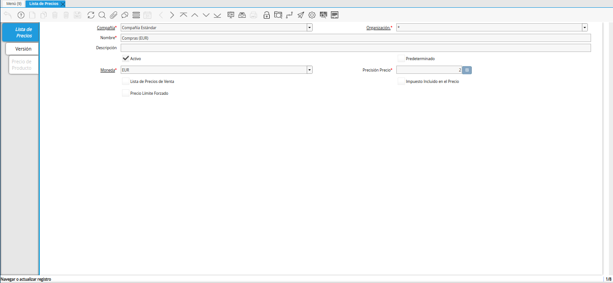
.. |registro de ventas ves para lista de precios desde última oc procesada| image:: resources/ves-sales-record-for-price-list-since-last-oc-processed.png
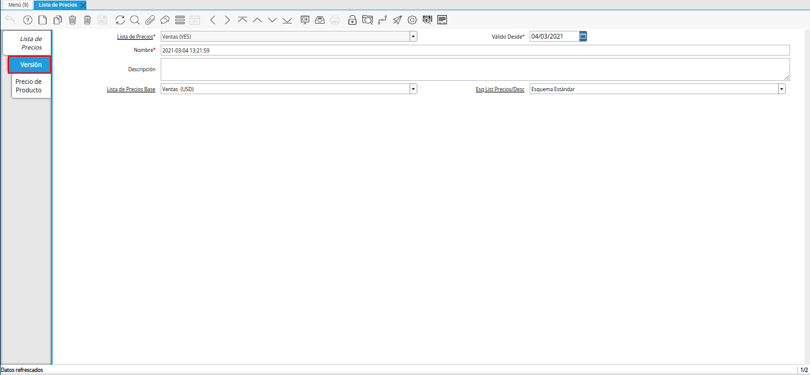
.. |icono registro nuevo para lista de precios desde última oc procesada| image:: resources/new-record-icon-for-price-list-since-last-oc-processed.png
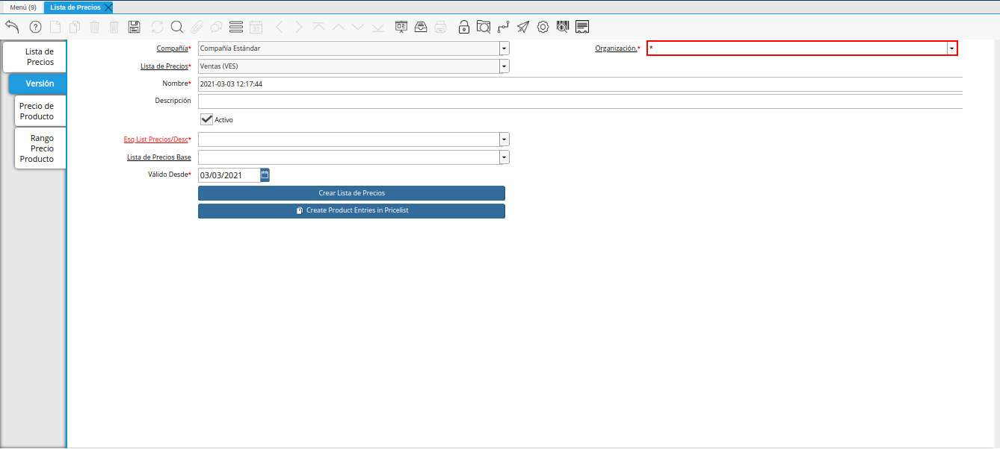
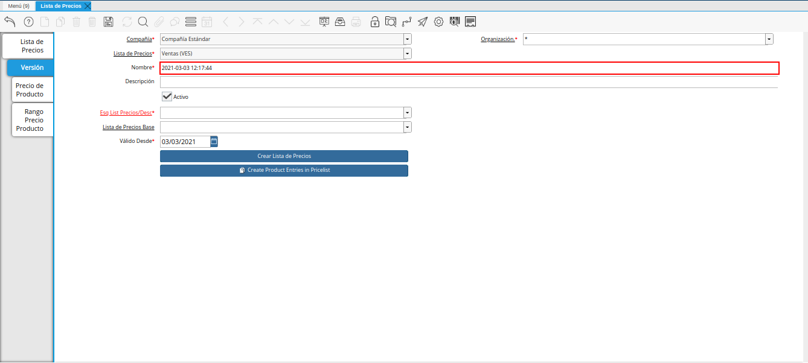
.. |campo descripción para lista de precios desde última oc procesada| image:: resources/description-field-for-price-list-since-last-oc-processed.png
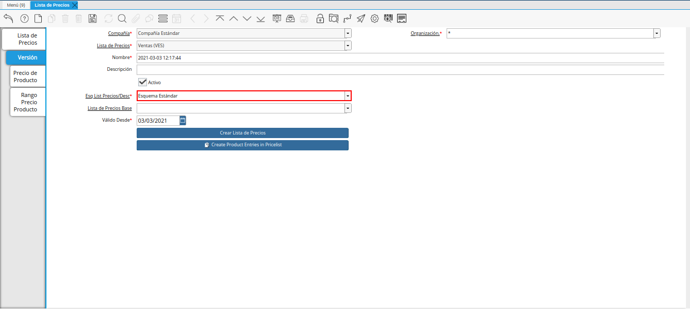
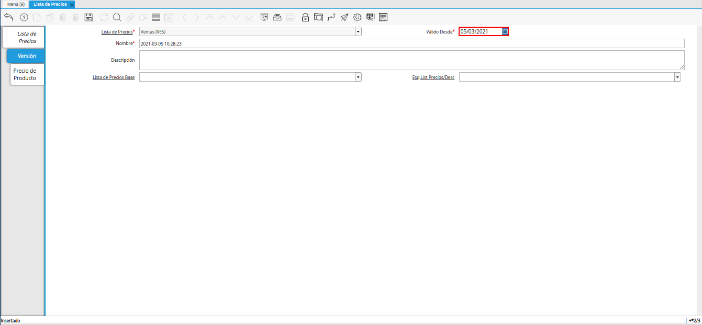
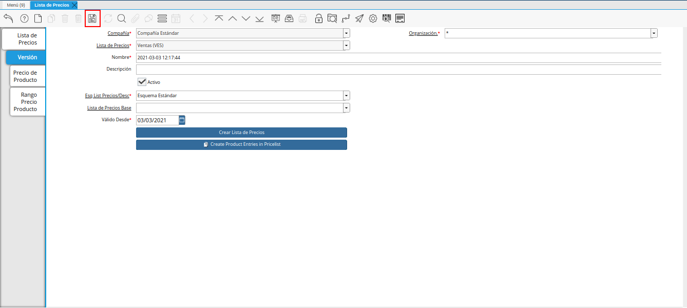
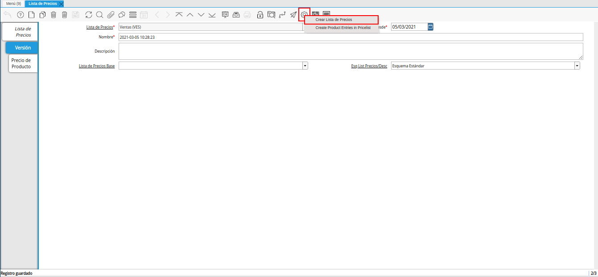
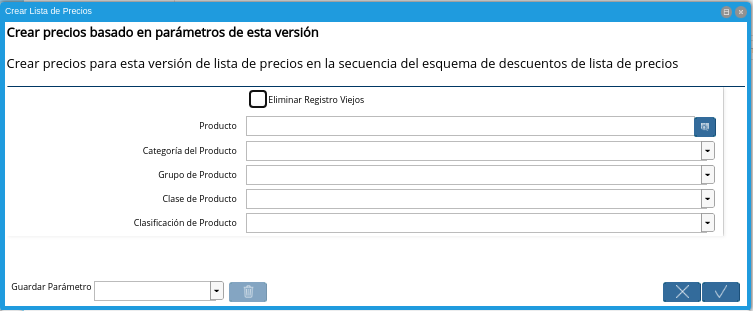
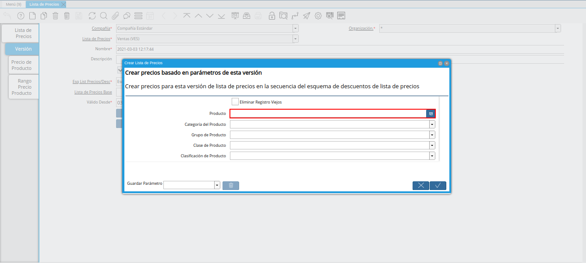
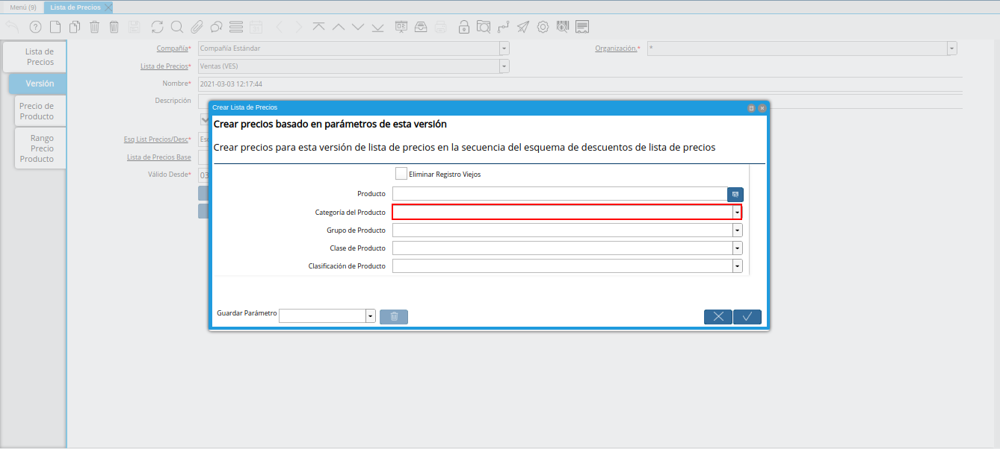
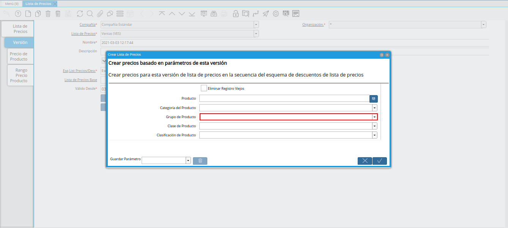
.. |campo clase de producto de la ventana crear lista de precios para lista de precios desde última oc procesada| image:: resources/product-class-field-of-the-create-price-list-window-for-price-list-since-last-oc-processed.png
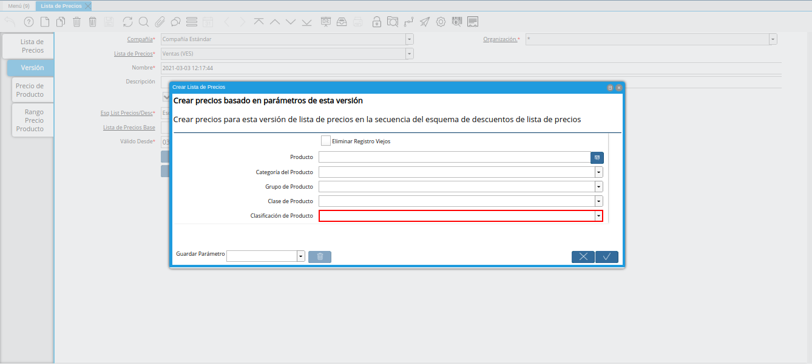
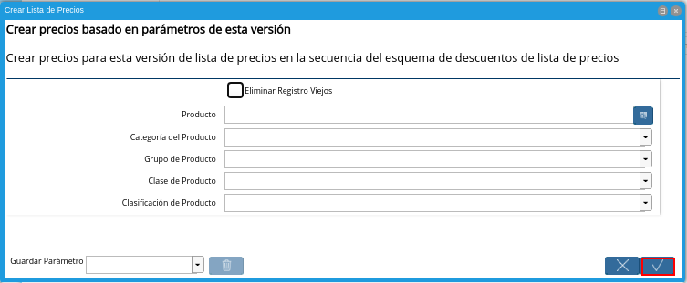
.. |pestaña precio de producto para la lista de precios desde última oc procesada| image:: resources/product-price-tab-for-the-price-list-since-last-oc-processed.png

.. _documento/crear-lista-de-precios-desde-última-oc-procesada:

**Crear Lista de Precios desde Última OC Procesada**
====================================================

Para ejemplificar el caso de creación de una lista de precios desde la última orden de compra procesada, se tiene la siguiente configuración en el esquema de lista de precios:

    - **Tipo de Conversión:** BCV
    - **Categoría del Producto:** Suministro de Dotaciones 
    - **% Descuento Sobre Precio de Lista:** -20,0
    - **% Descuento Sobre Precio Estándar:** -20,0
    - **% Descuento Sobre Precio Límite:** -20,0

Adicional a ello, se tiene la orden de compra "**OCN-27**", elaborada en moneda "**USD**". La misma cuenta con el producto "**DOIS-000001_Estandar**", en la cual su precio de compra es "**12,00**".

    .. note::

        El producto debe estar incluido en una orden de compra y dicha orden debe estar en estado "**Completo**". Recuerde que al completar la orden de compra, los precios de compra de los productos son cargados a la pestaña "**Compras**" de cada producto incluido en la orden.

De igual manera, se tiene la tasa de cambio de "**VES**" a "**USD**" y viceversa, con monto de "**1.877.000,00**", a la fecha "**03/03/2021**".

En base a las especificaciones nombradas anteriormente, se procede a explicar el procedimiento a seguir para generar la lista de precios desde la última orden de compra procesada.

#. Ubique y seleccione en el menú de ADempiere, la carpeta "**Gestión de Materiales**", luego seleccione la carpeta "**Reglas de Gestión de Materiales**", por último seleccione la ventana "**Lista de Precios**". 

    |menú de lista de precios|

    Imagen 1. Menú de ADempiere

#. Podrá visualizar la ventana "**Lista de Precios**", con todos los registros de listas de precios de compras y ventas.

    |ventana lista de precios|

    Imagen 2. Ventana Lista de Precios

    .. warning::

        La información de los campos que contiene la pestaña "**Lista de Precios**", no debe ser modificada por ningún motivo. De igual manera, no se debe tildar o destildar ningún check de los que contiene dicha pestaña.

#. Ubique el registro de lista de precios de "**Ventas (VES)**".

    |registro de ventas ves para lista de precios desde última oc procesada|

    Imagen 3. Lista de Precios Ventas (VES)

#. Seleccione la pestaña "**Versión**".

    |pestaña versión para lista de precios desde última oc procesada|

    Imagen 4. Pestaña Versión

#. Seleccione el icono "**Registro Nuevo**", ubicado en la barra de herramientas de ADempiere.

    |icono registro nuevo para lista de precios desde última oc procesada|

    Imagen 5. Icono Registro Nuevo 

#. Seleccione en el campo "**Organización**", la organización para la cual se encuentra realizando el registro.

    |campo organización para lista de precios desde última oc procesada|

    Imagen 6. Campo Organización

    .. note::

        La organización seleccionada en la lista de precios, debe coincidir con la organización seleccionada en la tasa de cambio creada a la fecha. Si la lista de precios esta creada con organización (*), las tasas de cambio a utilizar deben estar creadas con organización (*).

#. Introduzca en el campo "**Nombre**", el nombre correspondiente a la versión de lista de precios que se encuentra creando.

    Este campo contiene como nombre por defecto, la fecha y la hora en el cual fue creado el registro.

    |campo nombre para lista de precios desde última oc procesada|

    Imagen 7. Campo Nombre

#. Introduzca en el campo "**Descripción**", una breve descripción correspondiente al registro que se encuentra realizando.

    |campo descripción para lista de precios desde última oc procesada|

    Imagen 8. Campo Descripción

#. Seleccione en el campo "**Esq List Precios/Desc**", el esquema de descuento correspondiente.

    |campo esquema de lista de precios descuento para lista de precios desde última oc procesada|

    Imagen 9. Campo Esq List Precios/Desc

#. Seleccione en el campo "**Válido Desde**", la fecha de inicio del periodo de validez del registro que se encuentra realizando.

    |campo válido desde para lista de precios desde última oc procesada|

    Imagen 10. Campo Válido Desde

#. Seleccione el icono "**Guardar Cambios**", ubicado en la barra de herramientas de ADempiere.

    |icono guardar cambios para lista de precios desde última oc procesada|

    Imagen 11. Icono Guardar Cambios

#. Seleccione la opción "**Crear Lista de Precios**".

    Esta opción permite crear los precios de los productos desde la última orden de compra procesada, basandose en el tipo de conversión, descuento y margen de ganancia, previamente configurado en el esquema de descuento. 

    Si los precios de los productos se encuentran en una moneda diferente a la moneda de la compañía, ADempiere toma los precios de la pestaña "**Compras**" de cada producto y en base a la moneda que este asociada a dicha pestaña y a la moneda de la lista de precios, toma la configuración del esquema de lista de precios, realizando la conversión a la tasa de la fecha que tenga la versión de lista de precios y aplica el descuento o margen de ganancia configurado en el mismo (si lo tiene), para finalmente cargar dichos precios a la lista de precios.

    |opción crear lista de precios para lista de precios desde última oc procesada|

    Imagen 12. Opción Crear Lista de Precios

    .. note::

        También puede acceder al proceso, seleccionando la opción "**Crear Lista de Precios**" desplegada del icono "**Proceso** ubicado en la barra de herramientas de ADempiere.

#. Podrá visualizar la ventana "**Crear Lista de Precios**", con diferentes campos que permiten generar la lista de precios en base a lo requerido por el usuario.

    |ventana crear lista de precios para lista de precios desde última oc procesada|

    Imagen 13. Ventana Crear Lista de Precios

#. Seleccione en el campo "**Producto**", el producto por el cual requiere generar la lista de precios.

    Si no es seleccionado ningún valor en este campo, se genera la lista de precios con todos los productos.

    |campo producto de la ventana crear lista de precios para lista de precios desde última oc procesada|

    Imagen 14. Campo Producto

#. Seleccione en el campo "**Categoría del Producto**", la categoría del producto por la cual requiere generar la lista de precios.

    Si no es seleccionado ningún valor en este campo, se genera la lista de precios con todas las categorías de productos.

    |campo categoría del producto de la ventana crear lista de precios para lista de precios desde última oc procesada|

    Imagen 15. Campo Categoría del Producto

#. Seleccione en el campo "**Grupo de Producto**", el grupo de producto por el cual requiere generar la lista de precios.

    Si no es seleccionado ningún valor en este campo, se genera la lista de precios con todos los grupos de productos.

    |campo grupo de producto de la ventana crear lista de precios para lista de precios desde última oc procesada|

    Imagen 16. Campo Grupo de Producto

#. Seleccione en el campo "**Clase de Producto**", la clase de producto por la cual requiere generar la lista de precios.

    Si no es seleccionado ningún valor en este campo, se genera la lista de precios con todas las clases de productos.

    |campo clase de producto de la ventana crear lista de precios para lista de precios desde última oc procesada|

    Imagen 17. Campo Clase de Producto

#. Seleccione en el campo "**Clasificación de Producto**", la clasificación por la cual requiere generar la lista de precios.

    Si no es seleccionado ningún valor en este campo, se genera la lista de precios con todas las clasificaciones de productos.

    |campo clasificación de producto de la ventana crear lista de precios para lista de precios desde última oc procesada|

    Imagen 18. Campo Clasificación de Producto

#. Seleccione la opción "**OK**", para ejecutar el proceso y generar la lista de precios en base a lo seleccionado.

    |opción ok de la ventana crear lista de precios para lista de precios desde última oc procesada|

    Imagen 19. Opción OK

#. Seleccione la pestaña "**Precio de Producto**" para verificar los precios de los productos, creados desde la pestaña "**Compras**" de cada producto.

    |pestaña precio de producto para la lista de precios desde última oc procesada|

    Imagen 20. Pestaña Precio de Producto

    .. note::

        El resultado a obtener por producto en el ejemplo expuesto anteriormente sería:

        - **Precio de Compra del Producto (DOIS-000001_Estandar):** 12,00

        - **Tasa de Cambio:** 1.877.000,00

        - **Margen de Gancia por Categoría (Suministro de Dotaciones):** 20%

        - **Resultado de Operación:**

            - Precio de Compra del Producto (DOIS-000001_Estandar) * Tasa de Cambio = **Precio de Compra Convertido**

            - Precio de Compra Convertido + Margen de Gancia por Categoría (Suministro de Dotaciones) = **Precio del Producto (DOIS-000001_Estandar) para la Venta**

        - **Ejemplo:**

            - 12,00 * 1.877.000,00 = **22.524.000,00**

            - 22.524.000,00 + 20% = **27.028.800,00**