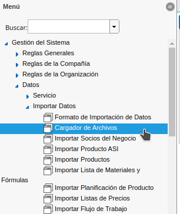
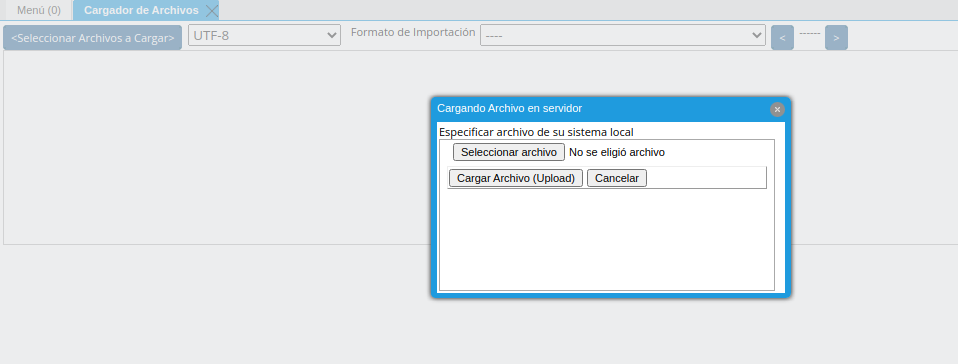
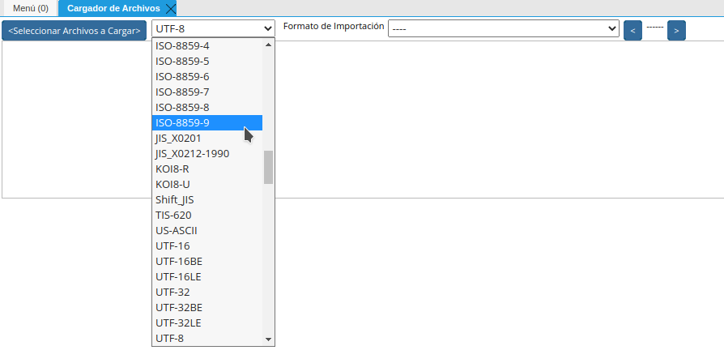
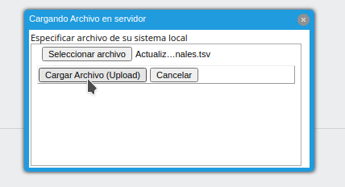
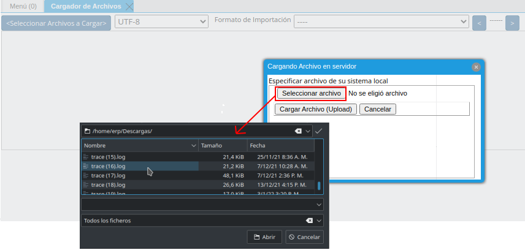
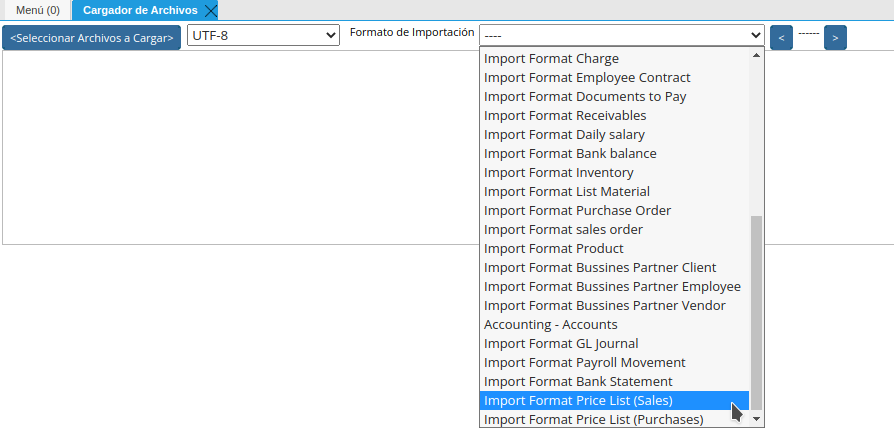

.. _documento/importar-lista-de-precios:

**Importar Lista de Precios**
=============================

Ubique y seleccione en el menú de ADempiere, la carpeta "**Gestión de Sistema**", seleccione la carpeta "**Datos**", luego seleccione la carpeta "**Importar Datos**", por último seleccione la ventana "**Cargador de Archivo**".

    |menú de adempiere|

    Imagen 1. Menú de ADempiere

A continuación se mostrará la siguiente ventana

    |ventana cargador de archivo|

    Imagen 2. Ventana Cargador de Archivo

Seleccionar la codíficación de caracteres, elegir la opcion **"ISO-8859-9"**

    |caracteres|

    Imagen 3. codíficación de caracteres.

Cargar el archivo a importar bajo la extension .tsv, para ello de clic en el boton **Seleccionar Archivos a Cargar**, seleccione la opcion **"Seleccionar archivo"**, allí debe ubicar el archivo que va importar, le mostrará la siguiente pantalla.

    |cargar archivo|

    Imagen 4. Cargar Archivo.

Una vez cargado el archivo dar clic en el boton **"Cargar Archivo(Upload)"**.

    |archivo|

    Imagen 5. Archivo a Cargar

Elegir el formato de importación correspondiente.

    |formato de importacion|

    Imagen 6. Formato de importación.

Una vez cargado el archivo, dar clic en el ok. Al completar la carga deben aparecer una ventana en donde se indica la cantidad de lineas que contiene el archivos y las lineas que subieron.

**Importar Lista de Precio**
============================
