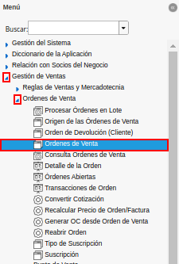
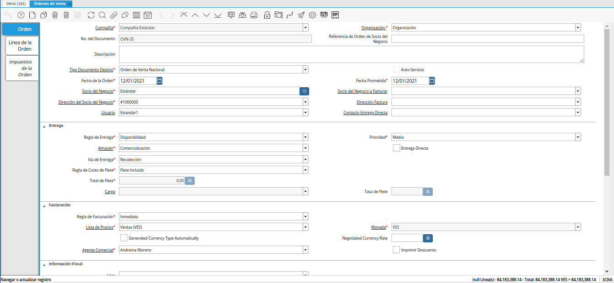
.. |icono registro nuevo de la ventana órdenes de venta| image:: resources/new-record-icon-in-the-sales-orders-window.png
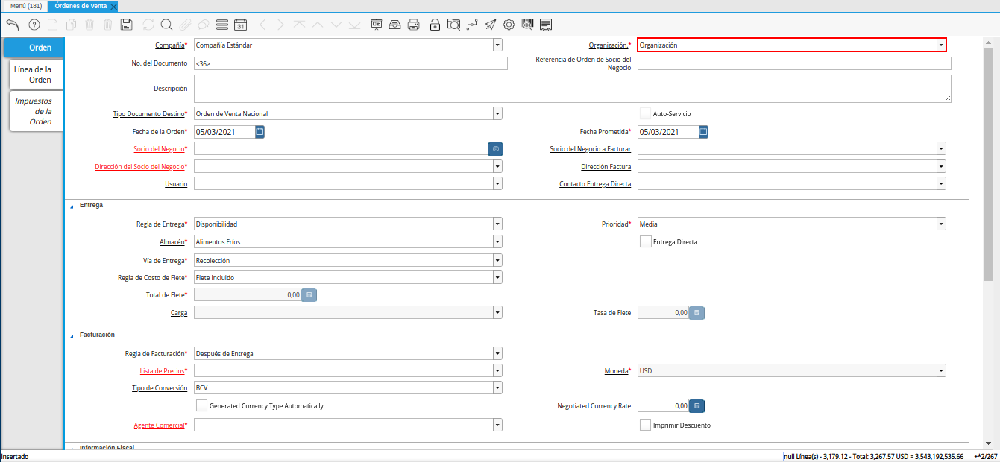
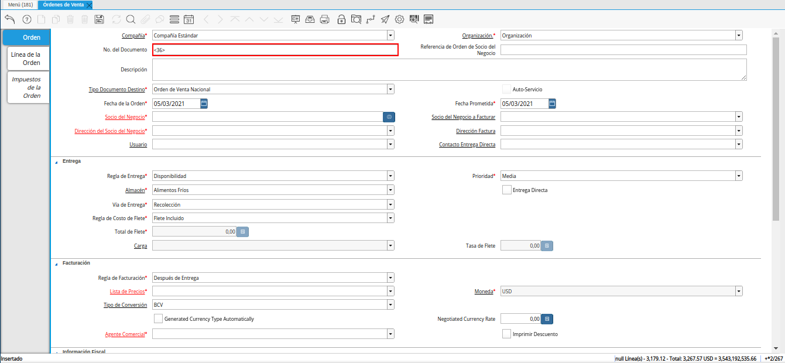
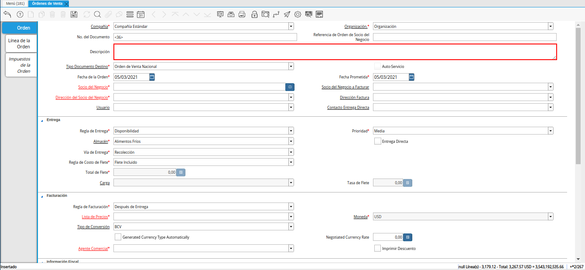
.. |campo tipo de documento de la ventana órdenes de venta| image:: resources/document-type-field-of-the-sales-orders-window.png
.. |campo fecha de la orden de la ventana órdenes de venta| image:: resources/order-date-field-of-the-sales-orders-window.png
.. |campo socio del negocio de la ventana órdenes de venta| image:: resources/business-partner-field-of-the-sales-orders-window.png
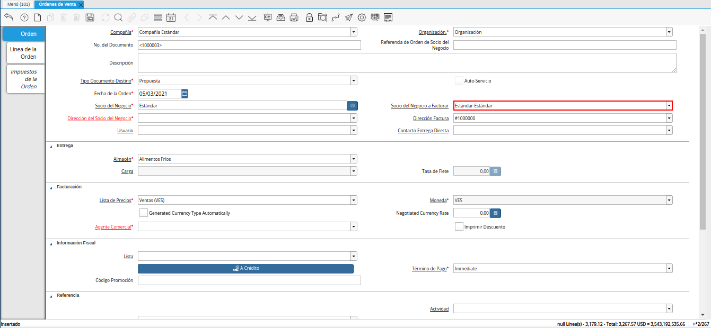

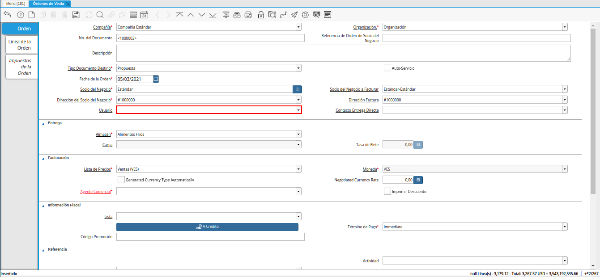
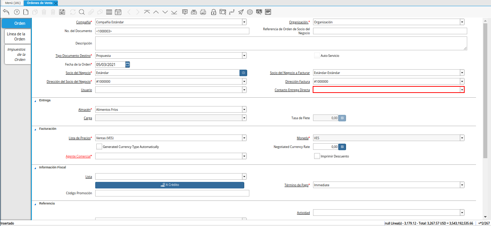
.. |campo almacén de la ventana órdenes de venta| image:: resources/warehouse-field-of-the-sales-orders-window.png
.. |campo lista de precios de la ventana órdenes de venta| image:: resources/price-list-field-of-the-sales-orders-window.png
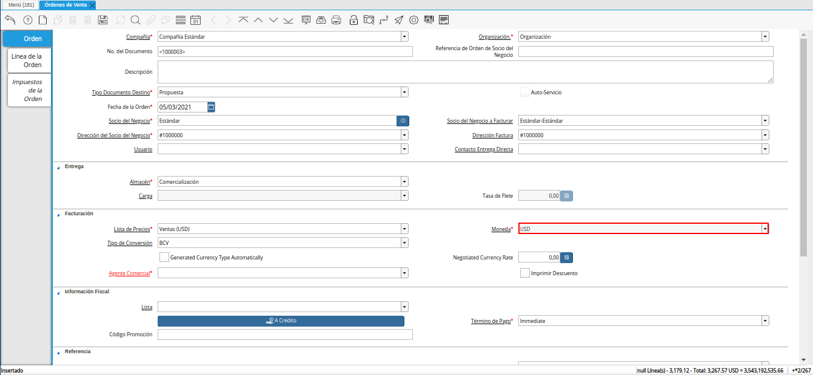
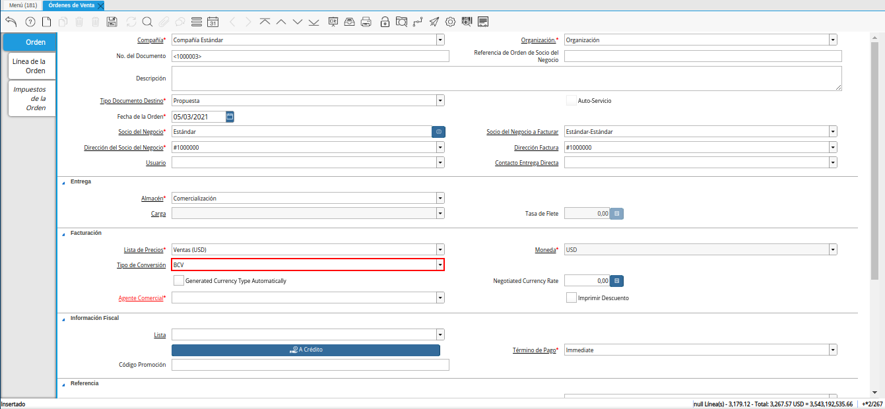
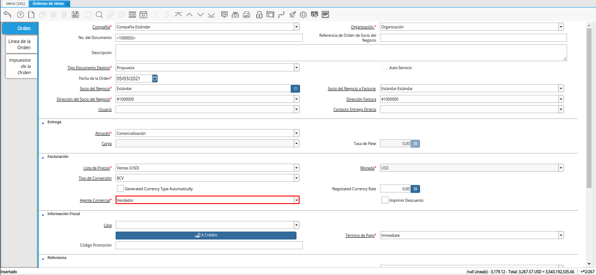

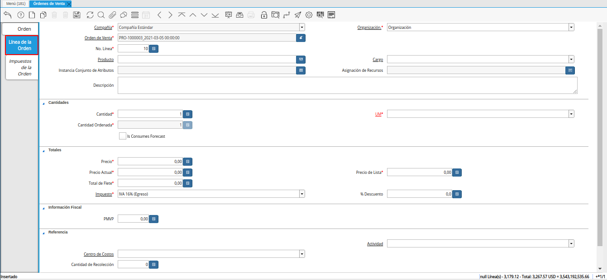
.. |campo producto de la pestaña línea de la orden de la ventana órdenes de venta| image:: resources/product-field-of-the-order-line-tab-of-the-sales-orders-window.png
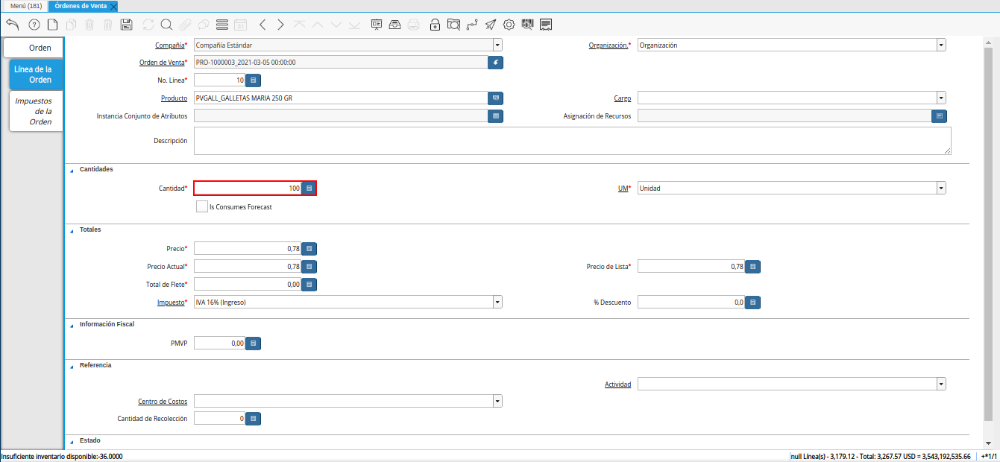
.. |campo unidad de medida de la pestaña línea de la orden de la ventana órdenes de venta| image:: resources/unit-of-measure-field-on-the-order-line-tab-of-the-sales-orders-window.png
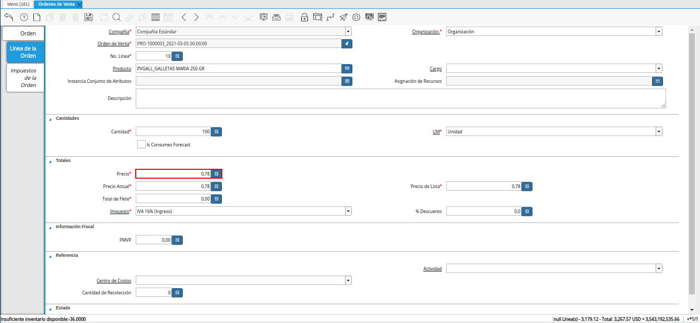
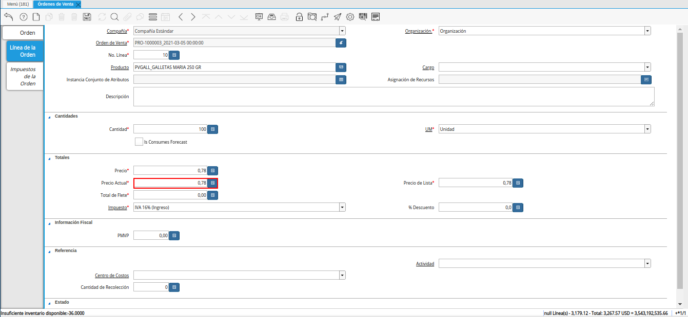
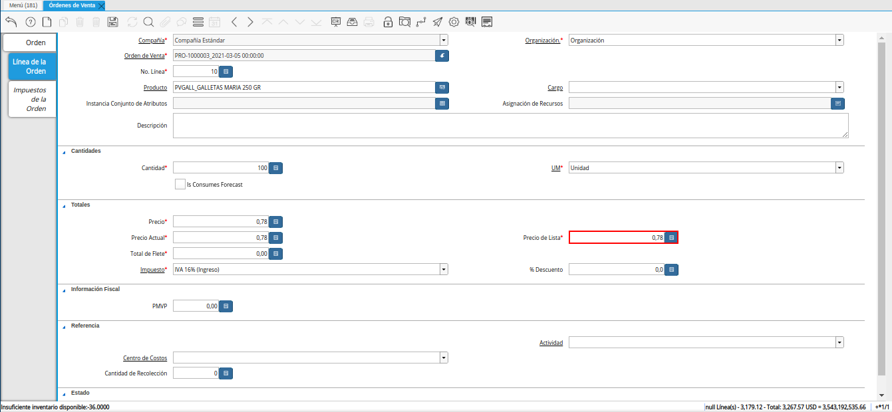
.. |campo neto de línea de la pestaña línea de la orden de la ventana órdenes de venta| image:: resources/net-line-field-of-the-order-line-tab-of-the-sales-orders-window.png
.. |icono guardar cambios de la pestaña línea de la orden de la ventana órdenes de venta| image:: resources/save-changes-icon-on-the-order-line-tab-of-the-sales-orders-window.png
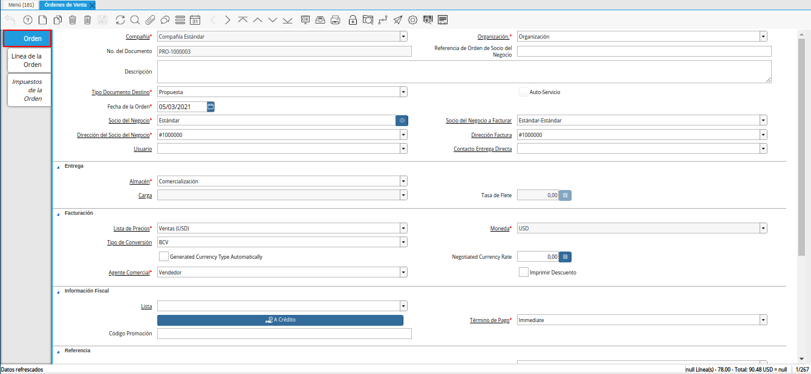
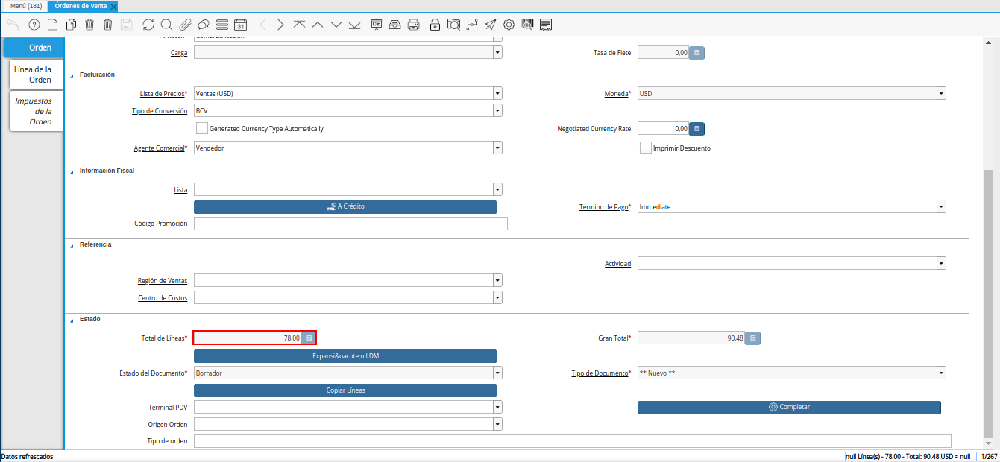
.. |campo gran total de la ventana órdenes de venta| image:: resources/grand-total-field-of-the-sales-orders-window.png
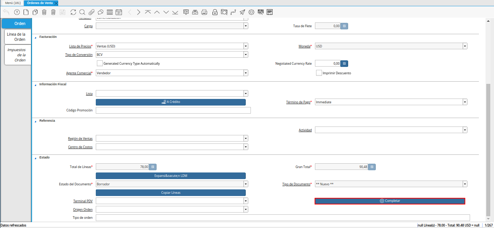
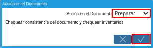

.. _documento/propuesta:

**Registro de Propuesta**
=========================

#. Ubique y seleccione en el menú de ADempiere, la carpeta "**Gestión de Ventas**", luego seleccione la carpeta "**Órdenes de Venta**" y por último seleccione la ventana "**Órdenes de Venta**".

    |menú de propuesta|

    Imagen 1. Menú de ADempiere

#. Podrá visualizar la ventana "**Órdenes de Venta**", con los diferentes registros realizados en dicha ventana.

    |ventana órdenes de venta|

    Imagen 2. Órdenes de Venta

#. Seleccione el icono "**Registro Nuevo**", ubicado en la barra de herramientas de ADempiere.

    |icono registro nuevo de la ventana órdenes de venta|

    Imagen 3. Icono Registro Nuevo

#. Seleccione en el campo "**Organización**", la organización para la cual se encuentra realizando el registro.

    |campo organización de la ventana órdenes de venta|

    Imagen 4. Campo Organización

#. Introduzca en el campo "**No. del Documento**", el número de documento correspondiente al registro que se encuentra realizando.

    Si no es ingresado ningún valor en este campo, al guardar el registro ADempiere toma el número de secuencia establecido para el documento.

    |campo número del documento de la ventana órdenes de venta|

    Imagen 5. Campo No. del Documento

#. Introduzca en el campo "**Descripción**", una breve descripción referente al registro que se encuentra realizando.

    |campo descripción de la ventana órdenes de venta|

    Imagen 6. Campo Descripción

#. Seleccione el tipo de documento a generar en el campo "**Tipo de Documento Destino**", la selección de este define el comportamiento del documento que se esta elaborando, dicho comportamiento se encuentra explicado en el documento **Tipo de Documento** elaborado por `ERPyA`_.

    |campo tipo de documento de la ventana órdenes de venta|

    Imagen 7. Campo Tipo de Documento

#. Seleccione en el campo "**Fecha de la Orden**", la fecha en la que se encuentra realizando el documento.

    |campo fecha de la orden de la ventana órdenes de venta|

    Imagen 8. Campo Fecha de la Orden

#. Seleccione en el campo "**Socio del Negocio**", el socio del negocio correspondiente al registro que se encuentra realizando.

    |campo socio del negocio de la ventana órdenes de venta|

    Imagen 9. Campo Socio del Negocio

#. Seleccione en el campo "**Socio del Negocio a Facturar**", el socio del negocio a facturar correspondiente al registro que se encuentra realizando.

    |campo socio del negocio a facturar de la ventana órdenes de venta|

    Imagen 10. Campo Socio del Negocio a Facturar

#. Seleccione en el campo "**Dirección del Socio del Negocio**", la dirección de localización del socio del negocio.

    |campo dirección del socio del negocio de la ventana órdenes de venta|

    Imagen 11. Campo Dirección del Socio del Negocio

#. Seleccione en el campo "**Dirección Factura**", la dirección de localización para la factura.

    |campo dirección factura de la ventana órdenes de venta|

    Imagen 12. Campo Dirección Factura

#. Seleccione en el campo "**Usuario**", el usuario correspondiente al registro que se encuentra realizando.

    |campo usuario de la ventana órdenes de venta|

    Imagen 13. Campo Usuario

#. Seleccione en el campo "**Contacto Entrega Directa**", el contacto de entrega directa del socio del negocio correspondiente al registro que se encuentra realizando.

    |campo contacto entrega directa de la ventana órdenes de venta|

    Imagen 14. Campo Contacto Entrega Directa

#. Seleccione en el campo "**Almacén**", el almacén correspondiente al registro que se encuentra realizando.

    |campo almacén de la ventana órdenes de venta|

    Imagen 15. Campo Almacén

#. Seleccione en el campo "**Lista de Precios**", la lista de precios correspondiente al registro que se encuentra realizando.

    |campo lista de precios de la ventana órdenes de venta|

    Imagen 16. Campo Lista de Precios

#. Podrá visualizar en el campo "**Moneda**", la moneda asociada a la lista de precios seleccionada.

    |campo moneda de la ventana órdenes de venta|

    Imagen 17. Campo Moneda

#. Seleccione en el campo "**Tipo de Conversión**", el tipo de conversión correspondiente al registro que se encuentra realizando.

    |campo tipo de conversión de la ventana órdenes de venta|

    Imagen 18. Campo Tipo de Conversión

#. Seleccione en el campo "**Agente Comercial**", el agente comercial correspondiente al registro que se encuentra realizando.

    |campo agente comercial de la ventana órdenes de venta|

    Imagen 19. Campo Agente Comercial

#. Seleccione el icono "**Guardar Cambios**", ubicado en la barra de herramientas de ADempiere.

    |icono guardar cambios de la ventana órdenes de venta|

    Imagen 20. Icono Guardar Cambios

#. Seleccione la pestaña "**Línea de la Orden**" y proceda al llenado de los campos correspondientes.

    |pestaña línea de la orden de la ventana órdenes de venta|

    Imagen 21. Pestaña Línea de la Orden

#. Seleccione en el campo "**Producto**", el producto correspondiente al registro que se encuentra realizando.

    |campo producto de la pestaña línea de la orden de la ventana órdenes de venta|

    Imagen 22. Campo Producto

#. Introduzca en el campo "**Cantidad**", la cantidad correspondiente al registro que se encuentra realizando.

    |campo cantidad de la pestaña línea de la orden de la ventana órdenes de venta|

    Imagen 23. Campo Cantidad

#. Seleccione en el campo "**UM**", la unidad de medida correspondiente al registro que se encuentra realizando.

    |campo unidad de medida de la pestaña línea de la orden de la ventana órdenes de venta|

    Imagen 24. Campo Unidad de Medida

#. Podrá visualizar en el campo "**Precio**", el precio del producto seleccionado en base a la unidad de medida seleccionada.

    |campo precio de la pestaña línea de la orden de la ventana órdenes de venta|

    Imagen 25. Campo Precio 

#. Podrá visualizar en el campo "**Precio Actual**", el precio unitario del producto seleccionado.

    |campo precio actual de la pestaña línea de la orden de la ventana órdenes de venta|

    Imagen 26. Campo Precio Actual

#. Podrá visualizar en el campo "**Precio de Lista**", el precio de lista oficial del producto en la moneda del documento.

    |campo precio de lista de la pestaña línea de la orden de la ventana órdenes de venta|

    Imagen 27. Campo Precio de Lista

#. Podrá visualizar en el campo "**Neto de Línea**", el monto total a pagar por el producto sin impuestos.

    |campo neto de línea de la pestaña línea de la orden de la ventana órdenes de venta|

    Imagen 28. Campo Neto de Línea

#. Seleccione el icono "**Guardar Cambios**", ubicado en la barra de herramientas de ADempiere.

    |icono guardar cambios de la pestaña línea de la orden de la ventana órdenes de venta|

    Imagen 29. Icono Guardar Cambios

#. Seleccione la pestaña principal "**Orden**", para proceder a preparar el documento.

    |pestaña principal orden de la ventana órdenes de venta|

    Imagen 30. Pestaña Principal Orden

#. En el campo "**Total de Líneas**", podrá visualizar el total de todas las líneas (sin impuestos) que contiene el documento.

    |campo total de líneas de la ventana órdenes de venta|

    Imagen 31. Campo Total de Líneas

#. En el campo "**Gran Total**", podrá visualizar el total de todas las líneas (con impuestos) que contiene el documento.

    |campo gran total de la ventana órdenes de venta|

    Imagen 32. Campo Gran Total

#. Seleccione la opción "**Completar**", para procesar la orden.

    |opción completar de la ventana órdenes de venta|

    Imagen 33. Opción Completar

#. Seleccione la acción "**Preparar**" y la opción "**OK**".

    |acción preparar y opción ok de la ventana órdenes de venta|

    Imagen 34. Acción Preparar y Opción OK