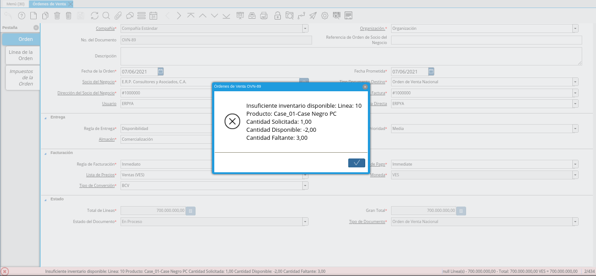
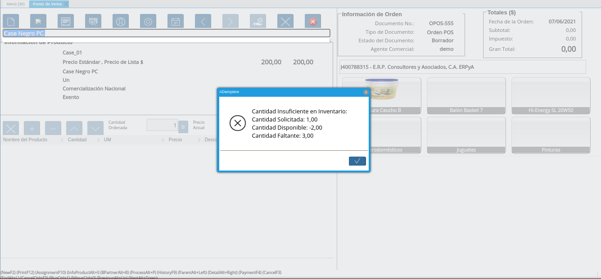

.. _ERPyA: http://erpya.com
.. |check validar disponibilidad| image:: resources/check-validate-availability.png

.. _documento/validación-de-inventario-en-orden-de-venta:

**Validación de Inventario en Orden de Venta**
==============================================

Para validar la existencia de disponibilidad de los productos en las ventas por medio de las órdenes de venta, ya sea desde la ventana "**Órdenes de Venta**" o desde el formulario "**Punto de Venta**", `ERPyA`_ realizó una actualización en los tipos de documentos de órdenes de venta. Dicha actualización consta de un check que establece como regla principal la existencia en almacén de los productos cargados a la orden.

    |check validar disponibilidad|

    Imagen 1. Check Validar Disponibilidad

.. note::

    El check "**Validar Disponibilidad**", en los tipos de documentos se encuentra destildado por defecto, permitiendo que sea completado el registro de la orden de venta desde la ventana "**Órdenes de Venta**" o desde el formulario "**Punto de Venta**", sin validar que tengan existencia en almacén los productos cargados a la orden de venta.

La validación se realiza en las órdenes de ventas por medio del check "**Validar Disponibilidad**", que se encuentra en el tipo de documento utilizado para generar dicha orden. Para que la validación funcione se debe considerar lo siguiente:

- El tipo de documento debe estar marcado como "**Validar Disponibilidad**".

- La línea de la orden de venta debe tener cantidades mayores a cero.

- Sólo aplica para lineas de órdenes con productos asociados.

- El registro del producto debe tener tildado el check "**Almacenado**".

- El almacén utilizado para la validación es el que se encuentra en la linea de la orden de venta.

.. note::

    Esta configuración no aplica para las **Órdenes de Devolución**

**Comportamiento del Check Tildado**
------------------------------------

Cuando el check se encuentra tildado, ADempiere sólo permitirá completar el registro de la orden de venta desde la ventana "**Órdenes de Venta**", si todos los productos tienen disponibilidad en el almacén con el que se este trabajando. De no tener existencia, será mostrado el siguiente mensaje:

    |registro desde ventana órdenes de venta|

    Imagen 2. Registro desde Ventana Órdenes de Venta

    .. note::

        Para crear una orden de venta desde la ventana "**Órdenes de Venta**", puede consultar el material :ref:`documento/orden-de-venta`.

De igual manera, al estar tildado el check sólo será agregado el producto a la línea de la orden de venta desde el formulario "**Punto de Venta**", si el producto seleccionado tiene disponibilidad en el almacén con el que se este trabajando.

    |registro desde formulario punto de venta|

    Imagen 3. Registro desde Formulario Punto de Venta

    .. note::

        Para crear una orden de venta desde el formulario "**Punto de Venta**", puede consultar el material :ref:`documento/punto-de-venta`.