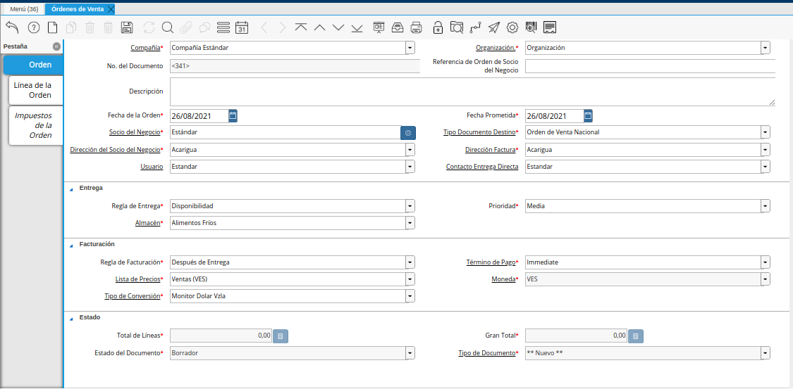

.. _ERPyA: http://erpya.com
.. |menú de adempiere| image:: resources/sales-order-menu.png

.. |campo fecha de la orden de la orden de venta no fiscal| image:: resources/non-fiscal-sales-order-order-date-field.png
.. |campo socio del negocio de la orden de venta no fiscal| image:: resources/business-partner-field-of-the-non-tax-sales-order.png
.. |campo tipo de documento destino de la orden de venta no fiscal| image:: resources/destination-document-type-field-of-the-non-fiscal-sales-order.png
.. |campo fecha prometida de la orden de venta no fiscal| image:: resources/non-fiscal-sales-order-promised-date-field.png
.. |campo dirección del socio del negocio de la orden de venta no fiscal| image:: resources/field-address-of-the-business-partner-of-the-non-fiscal-sales-order.png
.. |campo dirección factura de la orden de venta no fiscal| image:: resources/invoice-address-field-of-the-non-fiscal-sales-order.png
.. |campo usuario de la orden de venta no fiscal| image:: resources/user-field-of-the-non-fiscal-sales-order.png
.. |campo contacto entrega directa de la orden de venta no fiscal| image:: resources/contact-field-direct-delivery-of-the-non-fiscal-sales-order.png
.. |campo regla de entrega de la orden de venta no fiscal| image:: resources/non-fiscal-sales-order-delivery-rule-field.png
.. |campo prioridad de la orden de venta no fiscal| image:: resources/priority-field-of-the-non-fiscal-sales-order.png
.. |campo almacén de la orden de venta no fiscal| image:: resources/warehouse-field-of-the-non-fiscal-sales-order.png
.. |campo regla de facturación de la orden de venta no fiscal| image:: resources/non-fiscal-sales-order-billing-rule-field.png
.. |campo término de pago de la orden de venta no fiscal| image:: resources/non-fiscal-sales-order-payment-term-field.png
.. |campo lista de precios de la orden de venta no fiscal| image:: resources/non-fiscal-sales-order-price-list-field.png
.. |campo moneda de la orden de venta no fiscal| image:: resources/non-fiscal-sales-order-currency-field.png
.. |campo tipo de conversión de la orden de venta no fiscal| image:: resources/non-tax-sales-order-conversion-type-field.png
.. |icono guardar cambios de la orden de venta no fiscal| image:: resources/icon-save-changes-of-the-non-fiscal-sales-order.png
.. |pestaña línea de la orden de la orden de venta no fiscal| image:: resources/non-tax sales-order-order-line-tab.png
.. |campo producto de la orden de venta no fiscal| image:: resources/product-field-of-the-non-fiscal-sales-order.png
.. |campo descripción de la línea de la orden de venta no fiscal| image:: resources/description-field-of-the-non-fiscal-sales-order-line.png
.. |campo cantidad de la orden de venta no fiscal| image:: resources/non-fiscal-sales-order-quantity-field.png
.. |campo unidad de medida de la orden de venta no fiscal| image:: resources/non-fiscal-sales-order-unit-of-measure-field.png
.. |campo precio de la orden de venta no fiscal| image:: resources/non-fiscal-sales-order-price-field.png
.. |campo cantidad ordenada de la orden de venta no fiscal| image:: resources/ordered-quantity-field-of-the-non-fiscal-sales-order.png
.. |campo porcentaje de descuento de la orden de venta no fiscal| image:: resources/discount-percentage-field-of-the-non-tax-sales-order.png
.. |campo impuesto de la orden de venta no fiscal| image:: resources/tax-field-of-the-non-tax-sales-order.png
.. |campo cantidad reservada de la orden de venta no fiscal| image:: resources/reserved-quantity-field-of-the-non-fiscal-sales-order.png
.. |campo cantidad entregada de la orden de venta no fiscal| image:: resources/field-quantity-delivered-of-the-non-fiscal-sales-order.png
.. |campo cantidad facturada de la orden de venta no fiscal| image:: resources/invoiced-quantity-field-of-the-non-fiscal-sales-order.png
.. |campo pmvp de la orden de venta no fiscal| image:: resources/pmvp-field-of-the-non-fiscal-sales-order.png
.. |campo neto de línea de la orden de venta no fiscal| image:: resources/net-field-of-non-tax-sales-order-line.png
.. |check procesado de la orden de venta no fiscal| image:: resources/non-fiscal-sales-order-processed-check.png
.. |pestaña impuestos de la orden de venta no fiscal| image:: resources/tax-tab-of-the-non-tax-sales-order.png
.. |pestaña principal de la orden de venta no fiscal| image:: resources/main-tab-of-the-non-fiscal-sales-order.png
.. |campo total de líneas de la orden de venta no fiscal| image:: resources/total-field-of-non-fiscal-sales-order-lines.png
.. |campo gran total de la orden de venta no fiscal| image:: resources/non-fiscal-sales-order-grand-total-field.png
.. |campo estado del documento de la orden de venta no fiscal| image:: resources/status-field-of-the-non-fiscal-sales-order-document.png
.. |campo tipo de documento de la orden de venta no fiscal| image:: resources/non-fiscal-sales-order-document-type-field.png
.. |opción procesar orden del icono proceso de la orden de venta no fiscal| image:: resources/option-process-icon-order-process-non-fiscal-sales-order.png
.. |opción completar| image:: resources/option-complete.png

.. _documento/orden-de-venta-no-fiscal:

**Orden de Venta (No Fiscal)**
==============================

Las órdenes de venta no fiscales son conocidas como pedidos de clientes, las mismas no requieren que se genere una factura fiscal

La siguiente documentación está orientada al registro de aquellas ventas en las cuales no requieren una factura fiscal. En este caso, simplemente se debe realizar el registro de una "**Orden de Venta No Fiscal**", estas ordenes de ventas son conocidas como pedidos de clientes, a los cuales no se les genera una factura fiscal si no una nota de entrega.

Para generar en ADempiere una orden de venta no fiscal, se debe contar de manera obligatoria con lo siguiente:

- Debe existir el registro del socio del negocio cliente, con sus respectivos datos y dirección de localización. Es decir, se debe tener toda la información solicitada en las pestañas "**Socio del Negocio**", "**Cliente**" y "**Localización**" de la ventana "**Socio del Negocio**".

    .. note::

        Puede consultar el material :ref:`documento/socio-cliente`, para conocer el procedimiento de registro del socio.

- El registro del producto de la venta, debe tener activo el check "**Vendido**". Adicional a ello, debe tener establecida la categoría de impuesto del mismo y estar asociado a lista de precio de ventas (VES, USD, EUR, entre otros). De no estar asociado a una lista de precios, ADempiere no permitirá que el producto sea cargado a la línea de la orden de venta.

    .. note::

        Puede consultar el material :ref:`documento/producto` y :ref:`src/adempiere/quote-to-invoice/price-list`, para conocer los respectivos procesos.

Luego de verificar lo indicado anteriormente, se procede a crear el registro de la orden de venta no fiscal, realizando lo que a continuación se explica.

Ubique y seleccione en el menú de ADempiere, la carpeta "**Gestión de Venta**", luego seleccione la carpeta "**Órdenes de Venta**", por último seleccione la ventana "**Órdenes de Venta**".

    |menú de adempiere|

    Imagen 1. Menú de ADempiere

Podrá visualizar la ventana "**Órdenes de Venta**", con todos los registros de órdenes de venta que contiene ADempiere.

    |ventana órdenes de venta|

    Imagen 2. Ventana Órdenes de Venta

Seleccione el icono "**Registro Nuevo**", ubicado en la barra de herramientas de ADempiere.

    |icono registro nuevo|

    Imagen 3. Icono Registro Nuevo

Seleccione en el campo "**Organización**", la organización para la cual se encuentra realizando el registro.

    |campo organización de la orden de venta no fiscal|

    Imagen 4. Campo Organización

Introduzca en el campo "**Descripción**", una breve descripción referente al registro de orden de venta que se encuentra realizando.

    |campo descripción de la orden de venta no fiscal|

    Imagen 5. Campo Descripción

Seleccione en el campo "**Fecha de la Orden**", la fecha de elaboración del documento "**Orden de Venta No Fiscal**".

    |campo fecha de la orden de la orden de venta no fiscal|

    Imagen 6. Campo Fecha de la Orden

Seleccione en el campo "**Socio del Negocio**", el socio del negocio cliente al cual se le realizará la venta.

    |campo socio del negocio de la orden de venta no fiscal|

    Imagen 7. Campo Socio del Negocio

Seleccione el tipo de documento a generar en el campo "**Tipo de Documento Destino**", la selección de este define el comportamiento del documento que se esta elaborando, dicho comportamiento se encuentra explicado en el documento "**Tipo de Documento**" elaborado por `ERPyA`_.

    |campo tipo de documento destino de la orden de venta no fiscal|

    Imagen 8. Campo Tipo de Documento Destino

Seleccione en el campo "**Fecha Prometida**", la fecha prometida del documento "**Orden de Venta No Fiscal**".

    |campo fecha prometida de la orden de venta no fiscal|

    Imagen 9. Campo Fecha Prometida

Seleccione en el campo "**Dirección del Socio del Negocio**", la dirección de localización del socio del negocio.

    |campo dirección del socio del negocio de la orden de venta no fiscal|

    Imagen 10. Campo Dirección del Socio del Negocio

Seleccione en el campo "**Dirección Factura**", la dirección a ser impresa en la factura para la entrega del producto.

    |campo dirección factura de la orden de venta no fiscal|

    Imagen 11. Campo Dirección Factura

Seleccione en el campo "**Usuario**", el usuario de contacto con el socio del negocio cliente al cual se le realizará la venta.

    |campo usuario de la orden de venta no fiscal|

    Imagen 12. Campo Usuario

Seleccione en el campo "**Contacto Entrega Directa**", el usuario de contacto con el socio del negocio cliente al cual se le realizará la venta.

    |campo contacto entrega directa de la orden de venta no fiscal|

    Imagen 13. Campo Contacto Entrega Directa

Seleccione en el campo "**Regla de Entrega**", la regla de entrega para el documento que se encuentra realizando.

    |campo regla de entrega de la orden de venta no fiscal|

    Imagen 14. Campo Regla de Entrega

Seleccione en el campo "**Prioridad**", la prioridad del documento que se encuentra realizando.

    |campo prioridad de la orden de venta no fiscal|

    Imagen 15. Campo Prioridad

Seleccione en el campo "**Almacén**", el almacén donde se encuentra el producto que se va a vender.

    |campo almacén de la orden de venta no fiscal|

    Imagen 16. Campo Almacén

Seleccione en el campo "**Regla de Facturación**", la regla de facturación para el documento que se encuentra realizando.

    |campo regla de facturación de la orden de venta no fiscal|

    Imagen 17. Campo Regla de Facturación

Seleccione en el campo "**Término de Pago**", el término de pago para el documento que se encuentra realizando.

    |campo término de pago de la orden de venta no fiscal|

    Imagen 18. Campo Término de Pago

Seleccione en el campo "**Lista de Precios**", la lista de precios que será utilizada para la venta de los productos al socio del negocio cliente.

    |campo lista de precios de la orden de venta no fiscal|

    Imagen 19. Campo Lista de Precios

    .. note::

        La lista de precios que se selecciona, define la moneda con la cual se genera el documento que se encuentra realizando. De igual manera, los productos de la venta deben estar asociados a la lista de precios que sea seleccionada.

Podrá visualizar en el campo "**Moneda**", la moneda que será utilizada para la venta de los productos al socio del negocio cliente.

    |campo moneda de la orden de venta no fiscal|

    Imagen 20. Campo Moneda

Seleccione en el campo "**Tipo de Conversión**", el tipo de conversión que será utilizado para la venta de los productos al socio del negocio cliente.

    |campo tipo de conversión de la orden de venta no fiscal|

    Imagen 21. Campo Tipo de Conversión

    .. note::

        El tipo de conversión se maneja si se selecciona una lista de precios diferente a la moneda base de la compañía, este tipo de conversión deberá tener cargada la tasa que se maneje ese día para las ventas. Puede consultar el material :ref:`documento/conversión-monetaria-manual`, para más información sobre las tasas de cambio.

Seleccione el icono "**Guardar Cambios**", ubicado en la barra de herramientas de ADempiere.

    |icono guardar cambios de la orden de venta no fiscal|

    Imagen 22. Icono Guardar Cambios

    .. note::

        Al guardar el registro de la pestaña principal "**Orden**", se establece de manera automática el número de documento definido en la secuencia del tipo de documento seleccionado.

Seleccione la pestaña "**Línea de la Orden**", y proceda a llenar los campos correspondientes.

    |pestaña línea de la orden de la orden de venta no fiscal|

    Imagen 23. Pestaña Línea de la Orden

Seleccione en el campo "**Producto**", el producto que va a vender al socio del negocio cliente.

    .. note::

        El producto se puede agregar al ingresar el código del producto en el campo "**Producto**" o al seleccionar el icono que se encuentra del lado derecho del campo. Dicho icono permite seleccionar uno (1) o más productos.

    |campo producto de la orden de venta no fiscal|

    Imagen 24. Campo Producto

.. note::

    Si es un servicio el que se ofrece, se debe seleccionar el servicio en el campo "**Cargo**".

Introduzca en el campo "**Descripción**", una breve descripción sobre el producto seleccionado para la venta.

    |campo descripción de la línea de la orden de venta no fiscal|

    Imagen 25. Campo Descripción

Seleccione en el campo "**Cantidad**", la cantidad a vender del producto seleccionado.

    |campo cantidad de la orden de venta no fiscal|

    Imagen 26. Campo Cantidad

Seleccione en el campo "**UM**", la unidad de medida a vender del producto seleccionado.

    |campo unidad de medida de la orden de venta no fiscal|

    Imagen 27. Campo UM

Introduzca en el campo "**Precio**", el precio por unidad de medida del producto seleccionado para la venta.

    .. note::

        ADempiere automáticamente te muestra el precio asociado a la lista de precio seleccionada anteriormente, pero es editable.

    |campo precio de la orden de venta no fiscal|

    Imagen 28. Campo Precio

El campo "**Cantidad Ordenada**", indica la cantidad de un producto que fue ordenada.

    |campo cantidad ordenada de la orden de venta no fiscal|

    Imagen 29. Campo Cantidad Ordenada

Introduzca en el campo "**% Descuento**", el descuento aplicado a la venta.

    |campo porcentaje de descuento de la orden de venta no fiscal|

    Imagen 30. Campo % Descuento

Seleccione en el campo "**Impuesto**", el impuesto a ser aplicado al producto seleccionado.

    |campo impuesto de la orden de venta no fiscal|

    Imagen 31. Campo Impuesto

El campo "**Cantidad Reservada**", indica la cantidad del producto que ha sido reservado para otras órdenes.

    |campo cantidad reservada de la orden de venta no fiscal|

    Imagen 32. Campo Cantidad Reservada

El campo "**Cantidad Entregada**", indica la cantidad de un producto que ha sido entregado.

    |campo cantidad entregada de la orden de venta no fiscal|

    Imagen 33. Campo Cantidad Entrega

El campo "**Cantidad Facturada**", indica la cantidad de un producto que ha sido facturado.

    |campo cantidad facturada de la orden de venta no fiscal|

    Imagen 34. Campo Cantidad Facturada

El campo "**PMVP**", indica el precio marcado de venta al público.

    |campo pmvp de la orden de venta no fiscal|

    Imagen 35. Campo PMVP

Podrá apreciar en el campo "**Neto de Línea**", el monto neto del producto por la cantidad ingresada.

    |campo neto de línea de la orden de venta no fiscal|

    Imagen 36 Campo Neto de Línea

El check "**Procesado**", indica que un documento ha sido procesado.

    |check procesado de la orden de venta no fiscal|

    Imagen 37. Check Procesado

.. warning::

    Recuerde guardar el registro de la pestaña "**Línea de la Orden**" con el icono "**Guardar Cambios**" de la barra de herramientas de ADempiere, antes de cambiar a la pestaña principal "**Orden**".

Para visualizar el calculo total de los impuestos que se le asocien a la orden de venta, puede dirigirse a la pestaña "**Impuestos de la Orden**", La misma refleja el impuesto que se esta calculando, el total base del impuesto que corresponde a la sumatoria total de las líneas de la factura sin impuesto y el total del impuesto que corresponde a la sumatoria total del impuesto de todas las líneas de la factura.

    |pestaña impuestos de la orden de venta no fiscal|

    Imagen 38. Pestaña Impuestos de la Orden

Regrese a la pestaña principal "**Orden**" para completar el documento que se encuentra realizando.

    |pestaña principal de la orden de venta no fiscal|

    Imagen 39. Pestaña Principal Orden

El campo "**Total de Líneas**", indica el total de todas las líneas en la moneda del documento.

    |campo total de líneas de la orden de venta no fiscal|

    Imagen 40. Campo Total de Líneas

El campo "**Gran Total**", indica el total del documento incluyendo impuestos y totales de fletes.

    |campo gran total de la orden de venta no fiscal|

    Imagen 41. Campo Gran Total

El campo "**Estado del Documento**", indica el estado del documento en este momento, para cambiar el estado del documento utilice la opción "**Procesar Orden**", desplegada por el icono "**Proceso**", ubicado en la barra de herramientas de ADempiere.

    |campo estado del documento de la orden de venta no fiscal|

    Imagen 42. Campo Estado del Documento

El campo "**Tipo de Documento**", indica el tipo de documento que determina la secuencia del documento o las reglas del proceso.

    |campo tipo de documento de la orden de venta no fiscal|

    Imagen 43. Campo Tipo de Documento

Seleccione la opción "**Procesar Orden**", desplegada por el icono "**Proceso**", ubicado en la barra de herramientas de ADempiere.

    |opción procesar orden del icono proceso de la orden de venta no fiscal|

    Imagen 44. Opción Procesar Orden del Icono Proceso

Seleccione la acción "**Completar**" y la opción "**OK**", para completar el documento "**Orden de Venta No Fiscal**".

    |opción completar|

    Imagen 45. Acción Completar y Opción OK

.. note::

    El registro del documento solamente es válido cuando se encuentra en estado "**Completo**". Si la misma se encuentra en otro estado de documento, no estará disponible para generar un documento por cobrar, entrega u otro.
