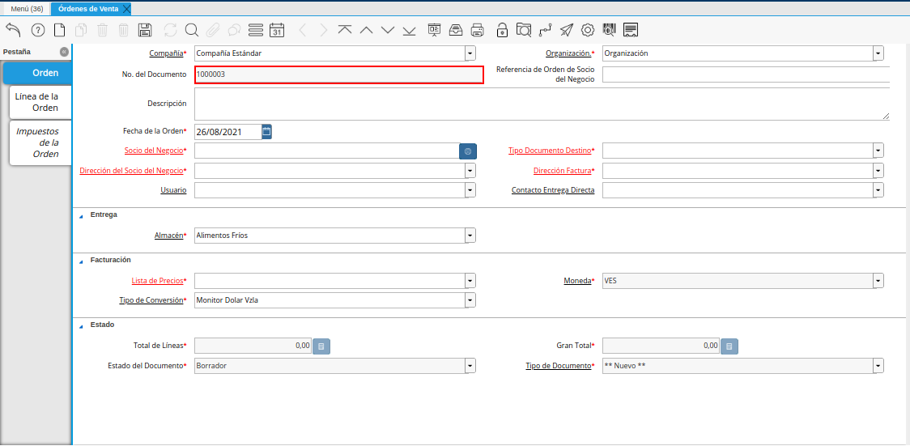
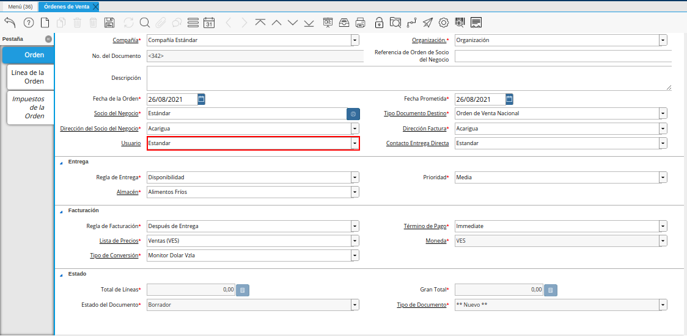
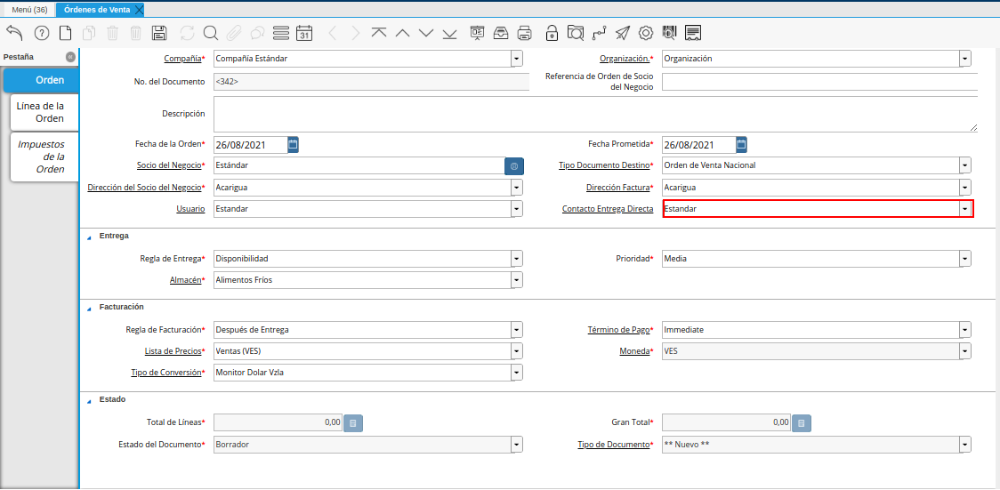
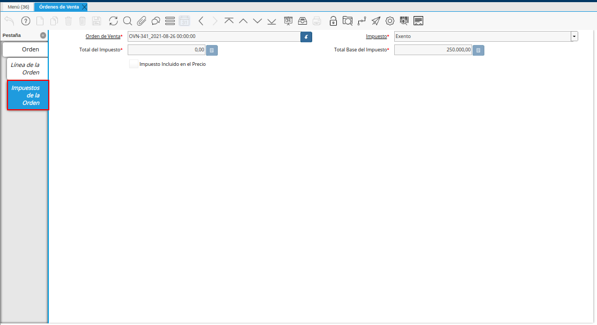
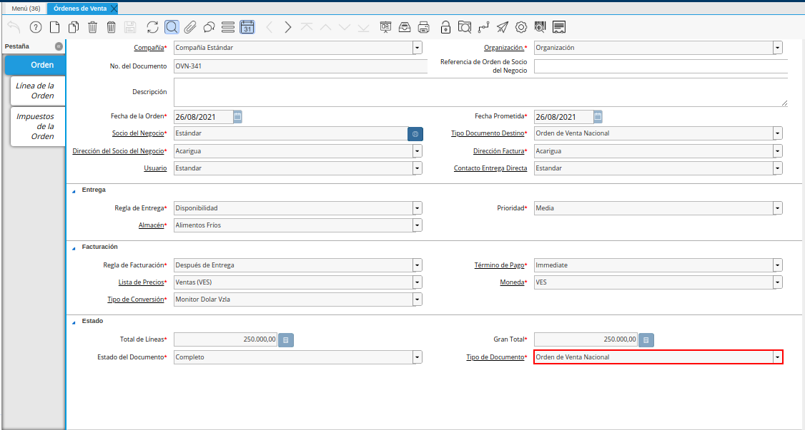
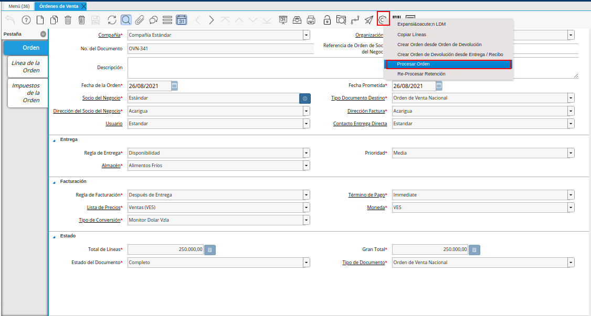
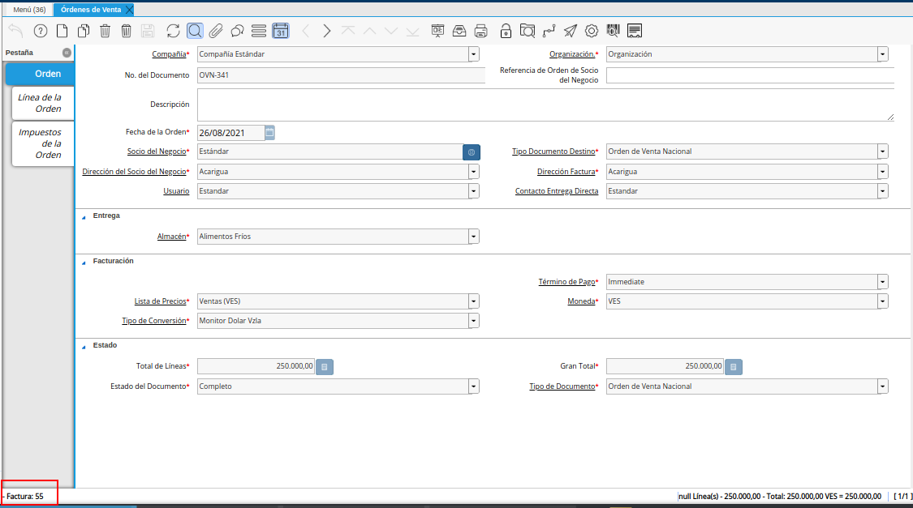
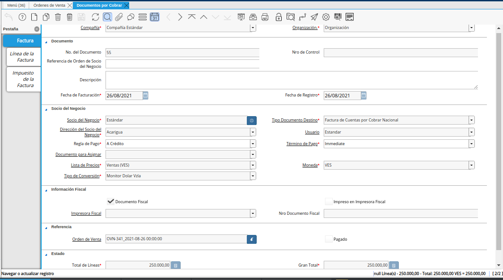

.. _ERPyA: http://erpya.com
.. |Menú de ADempiere| image:: resources/sales-order-menu.png
.. |Ventana Órdenes de Venta| image:: resources/sell-order-window.png
.. |Icono Registro Nuevo| image:: resources/new-record-icon.png

.. |línea de la orden de la ventana órdenes de venta| image:: resources/sales-order-window-order-line.png
.. |Campo Producto| image:: resources/product-field.png
.. |Campo Descripción| image:: resources/description-field.png
.. |Campo Cantidad| image:: resources/quantity-field.png
.. |Campo UM| image:: resources/field-um.png
.. |Campo Precio| image:: resources/price-field.png
.. |campo cantidad ordenada de la ventana órdenes de venta| image:: resources/ordered-quantity-field-of-the-sales-orders-window.png
.. |campo descuento de la ventana órdenes de venta| image:: resources/discount-field-of-the-sales-orders-window.png
.. |Campo Impuesto| image:: resources/imposed-field.png
.. |campo cantidad reservada de la ventana órdenes de venta| image:: resources/reserved-quantity-field-of-the-sales-orders-window.png
.. |campo cantidad entregada de la ventana órdenes de venta| image:: resources/delivered-quantity-field-of-the-sales-orders-window.png
.. |campo cantidad facturada de la ventana órdenes de venta| image:: resources/invoiced-quantity-field-of-the-sales-orders-window.png
.. |campo pmvp de la ventana órdenes de venta| image:: resources/pmvp-field-of-the-sales-orders-window.png
.. |Campo Neto de Línea| image:: resources/net-field-of-line.png

.. |campo procesado de la ventana órdenes de venta| image:: resources/processed-field-of-the-sales-orders-window.png

.. |campo estado del documento| image:: resources/document-status-field.png

.. _documento/orden-de-venta:

**Registro de Orden de Venta**
==============================

Las órdenes de venta son aquellos documentos en donde adquirimos un compromido de venta de los productos que comercializamos con nuestros clientes, en ADempiere es necesaria que exista dicha orden para poder que se generar una factura fiscal

En la presente documentación usted podrá visualizar un paso a paso detallado de cómo registrar una orden de venta. En este caso, trabajaremos con una "**Orden de Venta Nacional**", y según el proceso que usted tenga configurado está orden de venta podrá generarle automáticamente un "**Documento por Cobrar**".

Para generar en ADempiere una orden de venta, se debe contar de manera obligatoria con lo siguiente:

- Debe existir el registro del socio del negocio cliente, con sus respectivos datos y dirección de localización. Es decir, se debe tener toda la información solicitada en las pestañas "**Socio del Negocio**", "**Cliente**" y "**Localización**" de la ventana "**Socio del Negocio**".

    .. note::

        Puede consultar el material :ref:`documento/socio-cliente`, para conocer el procedimiento de registro del socio.

- El registro del producto de la venta, debe tener activo el check "**Vendido**". Adicional a ello, debe tener establecida la categoría de impuesto del mismo y estar asociado a lista de precio de ventas (VES, USD, EUR, entre otros). De no estar asociado a una lista de precios, ADempiere no permitirá que el producto sea cargado a la línea de la orden de venta.

    .. note::

        Puede consultar el material :ref:`documento/producto` y :ref:`src/adempiere/quote-to-invoice/price-list`, para conocer los respectivos procesos.

Luego de verificar lo indicado anteriormente, se procede a crear el registro de la orden de venta, realizando lo que a continuación se explica.

Ubique y seleccione en el menú de ADempiere la carpeta "**Gestión de Ventas**", luego seleccione la carpeta "**Órdenes de Venta**", por último seleccione la ventana "**Órdenes de Venta**".

    |Menú de ADempiere|

    Imagen 1. Menú de ADempiere

Podrá visualizar la ventana "**Órdenes de Venta**", con todos los registros de órdenes de venta cargados a ADempiere.

    |Ventana Órdenes de Venta|

    Imagen 2. Ventana Órdenes de Venta

Seleccione el icono "**Registro Nuevo**" en la barra de herramientas de ADempiere, para realizar un nuevo documento.

    |Icono Registro Nuevo|

    Imagen 3. Icono Registro Nuevo

    Seleccione en el campo "**Organización**", la organización para la cual esta realizando el documento "**Orden de Venta**".

        |Campo Organización|

        Imagen 4. Campo Organización

        .. warning::

            El valor en el campo organización debe ser diferente del símbolo (*) ya que estás son transacciones que deben realizarse por organización.

    En el campo "**No. de Documento**", no es necesario ingresarlo en forma manual, al momento de realizar un registro, ADempiere genera un número de secuencia automáticamente para el documento, al seleccionar la opción guardar del nuevo registro de orden de venta.

        |campo nro del documento de la ventana órdenes de venta|

        Imagen 5. Campo No. del Documento

    Introduzca en el campo "**Referencia de Orden de Socio del Negocio**", la referencia de orden del socio del negocio.

        |campo referencia de orden de socio del negocio de la ventana órdenes de venta|

        Imagen 6. Campo Referencia de Orden de Socio del Negocio

    En el campo "**Descripción**", introduzca una breve descripción referente a la orden de venta que se está realizando, este campo es opcional.

        |campo descripción de la ventana órdenes de venta|

        Imagen 7. Campo Descripción

    Seleccione en el campo "**Fecha de la Orden**", la fecha de elaboración del documento "**Orden de Venta**".

        |campo fecha de la orden de la ventana órdenes de venta|

        Imagen 8. Campo Fecha de la Orden

    Seleccione en el campo "**Socio del Negocio**", el socio del negocio cliente al cual se le realizará la venta.

        |Campo Socio del Negocio|

        Imagen 9. Campo Socio del Negocio

    Seleccione el tipo de documento a generar en el campo "**Tipo de Documento Destino**", la selección de este define el comportamiento del documento que se esta elaborando, dicho comportamiento se encuentra explicado en el documento "**Tipo de Documento**" elaborado por `ERPyA`_.

        |Campo Tipo de Documento|

        Imagen 10. Campo Tipo de Documento Destino

    Seleccione en el campo "**Dirección del Socio del Negocio**", la dirección de localización del socio del negocio.

        |Campo Dirección del Socio del Negocio|

        Imagen 11. Campo Dirección del Socio del Negocio

    Seleccione en el campo "**Dirección Factura**", la dirección a ser impresa en la factura para la entrega del producto.

        |Campo Dirección Factura|

        Imagen 12. Campo Dirección Factura

    Seleccione en el campo "**Usuario**", el usuario de contacto con el socio del negocio cliente al cual se le realizará la venta.

        |Campo Usuario|

        Imagen 13. Campo Usuario

    Seleccione en el campo "**Contacto Entrega Directa**", el usuario de contacto con el socio del negocio cliente al cual se le realizará la venta.

        |Campo Contacto Entrega Directa|

        Imagen 14. Campo Contacto Entrega Directa

    Posteriormenente en el grupo de campo de "**ENTREGA**" usted puede visualizar los datos necesarios para realizar la entrega de la venta realizada.

    Seleccione en el campo "**Regla de Entrega**", la opción de cómo serán entregados los productos y servicios al socio del negocio cliente, entre las diferentes formas que posee disponible.

        |Campo Regla de Entrega|

        Imagen 15. Campo Regla de Entrega

    Seleccione en el campo "**Prioridad**" el nivel de prioridad que requiere su entrega, entre los distintos niveles que el campo tendrá disponible.

        |Campo Prioridad|

        Imagen 16. Campo Prioridad
        
    Seleccione en el campo "**Almacén**", el almacén donde se encuentra el producto que se va a vender.

        |Campo Almacén|

        Imagen 17. Campo Almacén

    En el grupo de campo de "**FACTURACIÓN** encontrará los datos precargados para realizar una futura facturación del la orden de venta que está realizando.

    Seleccione en el campo "**Regla de Facturación**", la regla de facturación entre las distintas que posee disponible para realizar la facturación de su orden de venta.

        |Campo Regla de Facturación|

        Imagen 18.Campo Regla de Facturación

    Seleccione en el campo "**Lista de Precios**", la lista de precios que será utilizada para la venta de los productos al socio del negocio cliente.

        |Campo Lista de Precios|

        Imagen 19. Campo Lista de Precios

        .. note::

            La lista de precios que se selecciona, define la moneda con la cual se genera el documento que se encuentra realizando. De igual manera, los productos de la venta deben estar asociados a la lista de precios que sea seleccionada.

    Seleccione en el campo "**Tipo de Conversión**", el tipo de conversión a utilizar para realizar para esta negociación, eso es fundamental para posteriores cobros que usted reciba

        |Campo Tipo de Conversión|

        Imagen 20. Campo Tipo de Conversión

        .. note::

            El tipo de conversión se maneja si se selecciona una lista de precios diferente a la moneda base de la compañía, este tipo de conversión deberá tener cargada la tasa que se maneje ese día para las ventas. Puede consultar el material :ref:`documento/conversión-monetaria-manual`, para más información sobre las tasas de cambio

    Seleccione en el campo "**Término de Pago**", las condiciones de pago que indican el método y tiempo de pago para esta transacción.

        |campo término de pago|

        Imagen 21. Campo Término de Pago

    Seleccione en el campo "**Moneda**", la moneda que será utilizada para la venta de los productos al socio del negocio cliente.

        |Campo Moneda|

        Imagen 22. Campo Moneda

    .. warning::

        Recuerde guardar el registro de la ventana, seleccionando el icono "**Guardar Cambios**" ubicado en la barra de herramientas, una vez guardado el nuevo registro, podrá avanzar a la pestaña "**Línea de la Orden**".

Seleccione la pestaña "**Línea de la Orden**" y proceda a seleccionar el "**Producto o Servicio**" a vender. Si la orden de venta contiene varios productos, el campo "**Nro. de Línea**", indicará el orden y despliegue de los mismos dentro del documento. Una vez que guarde el primer producto, deberá seleccionar el icono "**Registro Nuevo**", incrementando así el número de líneas por productos en el documento.

    .. warning::

        El campo "**Orden de Venta**", viene precargado de la pestaña principal "**Orden**".

    |línea de la orden de la ventana órdenes de venta|

    Imagen 23. Pestaña Línea de la Orden

    Seleccione en el campo "**Producto**", el producto a vender al socio del negocio cliente.

        |Campo Producto|

        Imagen 24. Campo Producto

        .. note::

            Si es un servicio el que se ofrece, se debe seleccionar el servicio en el campo "**Cargo**".

    Introduzca en el campo "**Descripción**", una breve descripción sobre el producto o servicio seleccionado para la venta.

        |Campo Descripción|

        Imagen 25. Campo Descripción

    Seleccione en el campo "**Cantidad**", la cantidad a vender del producto o servicio seleccionado.

        |Campo Cantidad|

        Imagen 26. Campo Cantidad

    Seleccione en el campo "**UM**", la unidad de medida a vender del producto o servicio seleccionado.

        |Campo UM|

        Imagen 27. Campo UM

    Introduzca en el campo "**Precio**", el precio por unidad de medida del producto o servicio seleccionado para la venta.

        |Campo Precio|

        Imagen 28. Campo Precio

        .. note::

        ADempiere automáticamente te muestra el precio asociado a la lista de precio seleccionada anteriormente,  de no ser así te indicará que tu producto no tiene establecido un precio en la lista de precios seleccionada.

    El campo "**Cantidad Ordenada**", indica la cantidad de un producto que fue ordenada.

        |campo cantidad ordenada de la ventana órdenes de venta|

        Imagen 29. Campo Cantidad Ordenada

    Introduzca en el campo "**% Descuento**", el descuento aplicado a la venta.
    
        El campo "**% Descuento**", indica el descuento aplicado o tomado como un porcentaje.

        |campo descuento de la ventana órdenes de venta|

        Imagen 30. Campo Descuento

    Seleccione en el campo "**Impuesto**", el impuesto a ser aplicado al producto o servicio seleccionado.

        |Campo Impuesto|

        Imagen 31. Campo Impuesto

    El campo "**Cantidad Reservada**, indica la cantidad del producto que ha sido reservado para otras órdenes.

        |campo cantidad reservada de la ventana órdenes de venta|

        Imagen 32. Campo Cantidad Reservada

    El campo "**Cantidad Entregada**, indica la cantidad de un producto que ha sido entregado.

        |campo cantidad entregada de la ventana órdenes de venta|

        Imagen 33. Campo Cantidad Entregada

    El campo "**Cantidad Facturada**, indica la cantidad de un producto que ha sido facturado.

        |campo cantidad facturada de la ventana órdenes de venta|

        Imagen 34. Campo Cantidad Facturada

    El campo "**PMVP**, indica el precio marcado de venta al público.

        |campo pmvp de la ventana órdenes de venta|

        Imagen 35. Campo PMVP

    Podrá apreciar en el campo "**Neto de Línea**", el monto neto del producto por la cantidad ingresada.

        |Campo Neto de Línea|

        Imagen 36. Campo Neto de Línea

    El checklkist "**Procesado**, indica que un documento ha sido procesado.

        |campo procesado de la ventana órdenes de venta|

        Imagen 37. Campo Procesado

    .. warning::

        Recuerde guardar el registro de la pestaña "**Línea de la Orden**" con el icono "**Guardar Cambios**" de la barra de herramientas de ADempiere, antes de cambiar a la ventana principal "**Orden**".

Para visualizar el calculo total de los impuestos que se le asocien a la orden de venta, puede dirigirse a la pestaña "**Impuestos de la Orden**", La misma refleja el impuesto que se esta calculando, el total base del impuesto que corresponde a la sumatoria total de las líneas de la factura sin impuesto y el total del impuesto que corresponde a la sumatoria total del impuesto de todas las líneas de la factura.

    |pestaña impuestos de la orden de venta fiscal|
    
        Imagen 38. Pestaña Impuestos de la Orden

Regrese a la pestaña principal "**Orden**" para completar el documento que se encuentra realizando.

    |pestaña orden|

    Imagen 39. Pestaña Orden

    El campo "**Total de Líneas**", indica el total de todas las líneas en la moneda del documento.

        |campo total de líneas|

        Imagen 40. Campo Total del Líneas

    El campo "**Gran Total**", indica el total del documento incluyendo impuestos y totales de fletes.

        |campo gran total|

        Imagen 41. Campo Gran Total

    El campo "**Estado del Documento**", indica el estado del documento en este momento, para cambiar el estado del documento utilice la opción "**Procesar Orden**", desplegada por el icono "**Proceso**", ubicado en la barra de herramientas de ADempiere.

        |campo estado del documento|

        Imagen 42. Campo Estado de Documento

    El campo "**Tipo de Documento**", indica el tipo de documento que determina la secuencia del documento o las reglas del proceso.

        |campo tipo de documento|

        Imagen 43. Campo Tipo de Documento

Seleccione la opción "**Procesar Orden**", desplegada por el icono "**Proceso**", ubicado en la barra de herramientas de ADempiere.

    |opción procesar orden en el icono proceso|

    Imagen 44. Opción Procesar Orden en el Icono Proceso

Seleccione la acción "**Completar**" y la opción "**OK**", para completar el documento "**Orden de Venta**".

    |Opción Completar|

    Imagen 45. Opción Completar

    .. note::

    El registro del documento solamente es válido cuando se encuentra en estado "**Completo**". Si la misma se encuentra en otro estado de documento, no estará disponible para generar un documento por cobrar, entrega u otro.

Si en su proceso está configurado para que al completar la "**Orden de Venta**" se genere automaticamente el "**Documento por Cobrar**" asociado a esa orden de se cumplirá el siguiente procedimiento: 

    Al completar el documento "**Orden de Venta**", se genera de manera automática y en estado "**Completo**", el documento de factura por cobrar con la orden de venta asociada.

    |factura generada|

    Imagem 46. Número de Factura Generada

Dicha factura por cobrar se puede visualizar en la ventana "**Documentos por Cobrar**", al buscar la misma por el número de documento generado en la parte inferior izquierda de la ventana "**Órdenes de Venta**".

    |consulta factura generada|

    Imagen 47. Consulta de Factura Generada

Si por el contrario en su proceso no está configurado para que se generé automáticamente la factura, puede realizar posterior su documento por cobrar en la ventana "**Documento por Cobrar**". Para conocer cómo realizar este documento puede consultar el material :ref:`documento/factura-desde-líneas-de-la-orden`