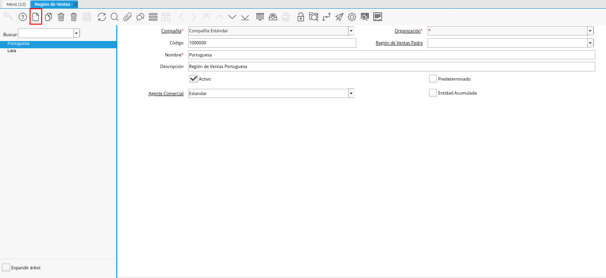
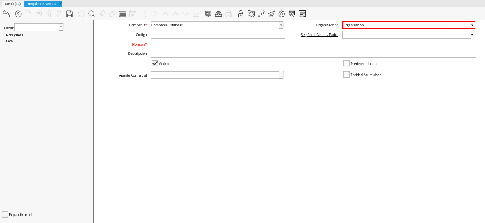
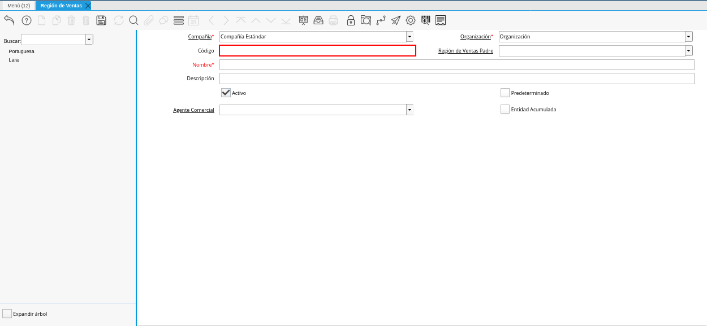
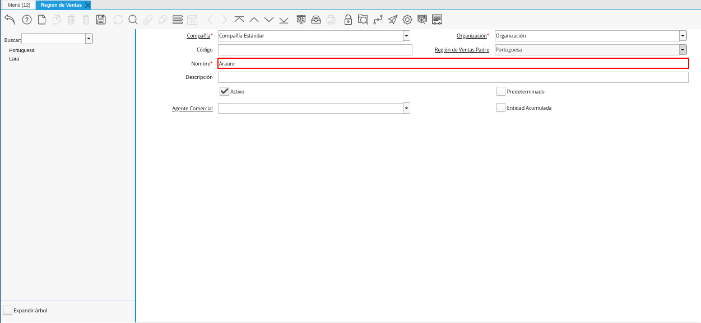
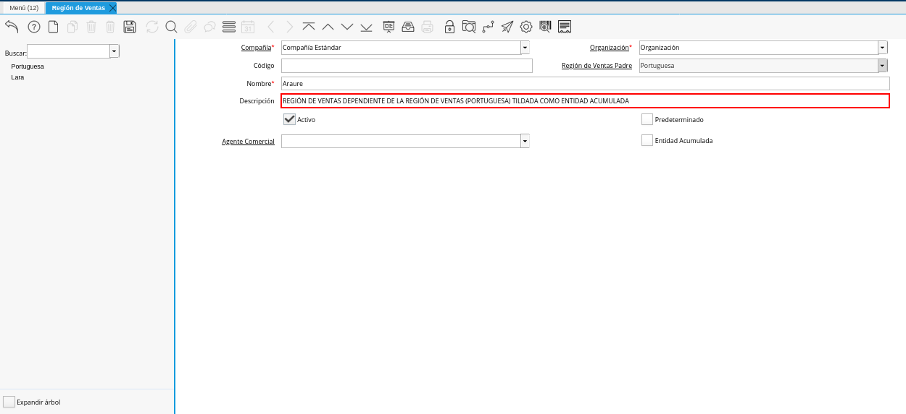
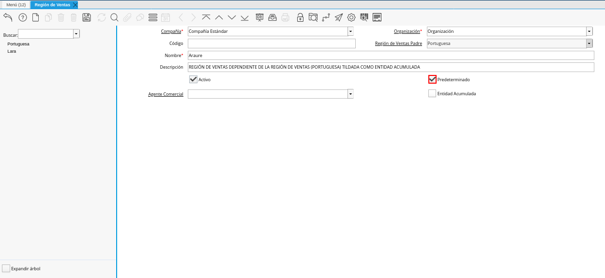
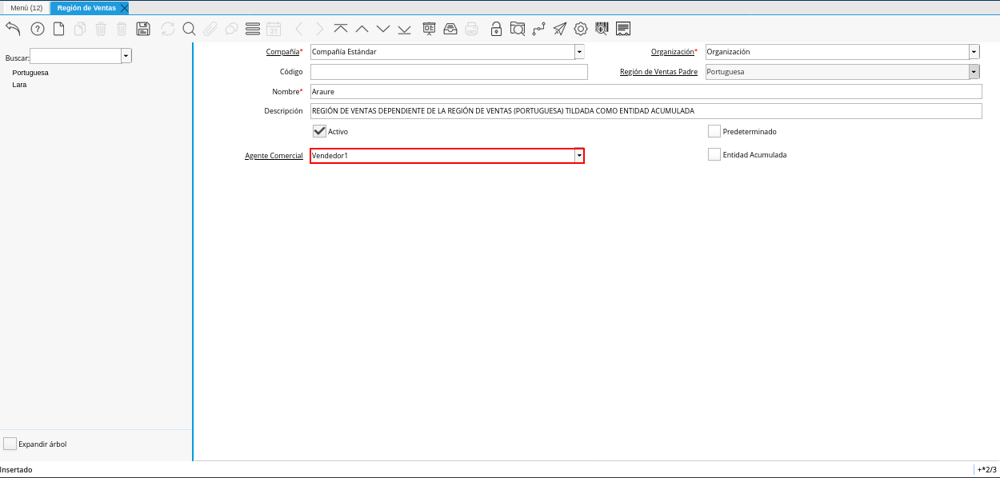
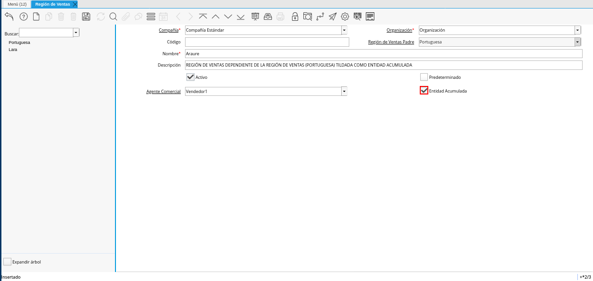
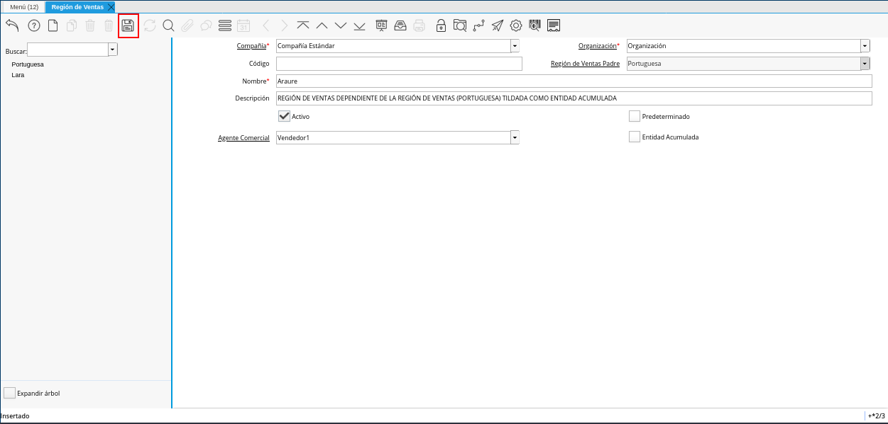
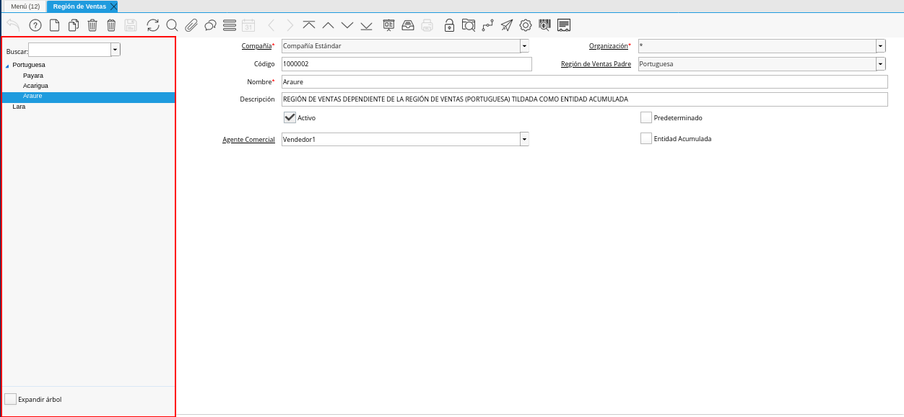

.. |Menú de ADempiere| image:: resources/sales-region-menu.png
.. |Ventana Región de Ventas| image:: resources/sales-region-window.png

.. |Campo Región de Ventas Padre de la Ventana Región de Ventas| image:: resources/sales-region-field-parent-of-sales-region-window.png

.. |Asignar Región de Ventas a Localización| image:: resources/assign-sales-region-to-location.png

.. _documento/región-de-ventas:

**Registro de Región de Ventas**
================================

#. Ubique y seleccione en el menú de ADempiere, la carpeta "**Gestión de Ventas**", luego seleccione la carpeta "**Reglas de Ventas y Mercadotecnia**", por último seleccione la ventana "**Región de Ventas**".

    |Menú de ADempiere|
    
    Imagen 1. Menú de ADempiere

#. Podrá visualizar la ventana "**Región de Ventas**", con todos los registros de las diferentes regiones de venta que abarca la compañía u organización.

    |Ventana Región de Ventas|

    Imagen 2. Ventana Región de Ventas

#. Seleccione el icono "**Registro Nuevo**", ubicado en la barra de herramientas de ADempiere.

    |Icono Registro Nuevo de la Ventana Región de Ventas|

    Imagen 3. Icono Registro Nuevo de la Ventana Región de Ventas

#. Seleccione en el campo "**Organización**", la organización para la cual se encuentra definiendo la región de ventas.

    |Campo Organización de la Ventana Región de Ventas|

    Imagen 4. Campo Organización de la Ventana Región de Ventas

#. Introduzca en el campo "**Código**", el código de identificación correspondiente a la región de ventas que se encuentra definiendo.

    |Campo Código de la Ventana Región de Ventas|

    Imagen 5. Campo Código de la Ventana Región de Ventas

    .. note::

        Si no es ingresado ningún valor en este campo, ADempiere tomará el número de secuencia definida para el registro.

#. Seleccione en el campo "**Región de Ventas Padre**", la región de ventas padre correspondiente a la región de ventas que se encuentra definiendo.

    |Campo Región de Ventas Padre de la Ventana Región de Ventas|

    Imagen 6. Campo Región de Ventas Padre de la Ventana Región de Ventas

#. Introduzca en el campo "**Nombre**", el nombre de identificación correspondiente a la región de ventas que se encuentra definiendo.

    |Campo Nombre de la Ventana Región de Ventas|

    Imagen 7. Campo Nombre de la Ventana Región de Ventas

#. Introduzca en el campo "**Descripción**", una breve descripción referente a la región de ventas que se encuentra definiendo.

    |Campo Descripción de la Ventana Región de Ventas|

    Imagen 8. Campo Descripción de la Ventana Región de Ventas

#. Seleccione el checklist "**Predeterminado**", para indicar como predeterminada la región de ventas que se encuentra definiendo.

    |Checklist Predeterminado de la Ventana Región de Ventas|

    Imagen 9. Checklist Predeterminado de la Ventana Región de Ventas

#. Seleccione en el campo "**Agente Comercial**", el agente comercial correspondiente a la región de ventas que se encuentra definiendo.

    |Campo Agente Comercial de la Ventana Región de Ventas|

    Imagen 10. Campo Agente Comercial de la Ventana Región de Ventas

#. Seleccione el checklist "**Entidad Acumulada**", para indicar que el registro de región de ventas que se encuentra definiendo es una entidad acumulada.

    |Checklist Entidad Acumulada de la Ventana Región de Ventas|

    Imagen 11. Checklist Entidad Acumulada de la Ventana Región de Ventas

#. Seleccione el icono "**Guardar Cambios**", ubicado en la barra de herramientas de ADempiere, para guardar el registro de los campos de la ventana "**Región de Ventas**".

    |Icono Guardar Cambios de la Ventana Región de Ventas|

    Imagen 12. Icono Guardar Cambios de la Ventana Región de Ventas

#. Al culminar el procedimiento de registro de regiones de ventas en ADempiere, podrá visualizar del lado izquierdo de la ventana, el resultado del árbol formado por los diferentes registros realizados.

    |Árbol de Regiones de Ventas de la Ventana Región de Ventas|

    Imagen 13. Árbol de Regiones de Ventas de la Ventana Región de Ventas

**Asignar Región de Ventas a Localización**
-------------------------------------------

Para asignar una región de ventas a la localización del socio del negocio cliente, se debe realizar el procedimiento explicado en el documento de :ref:`documento/socio-cliente`, elaborado por `ERPyA`_, específicamente en la subsección del documento :ref:`documento/pestaña-localización-del-cliente`, donde se indica que se debe seleccionar en el campo "**Región de Ventas**", la región o área de ventas en la que se encuentra localizado el socio del negocio cliente.

    |Asignar Región de Ventas a Localización|

    Imagen 14. Asignar Región de Ventas a Localización
