.. _ERPyA: http://erpya.com
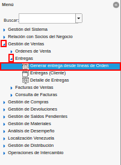
.. |Ventana Generar Entrega desde Líneas de la Orden| image:: resources/window-generate-delivery-from-order-lines.png
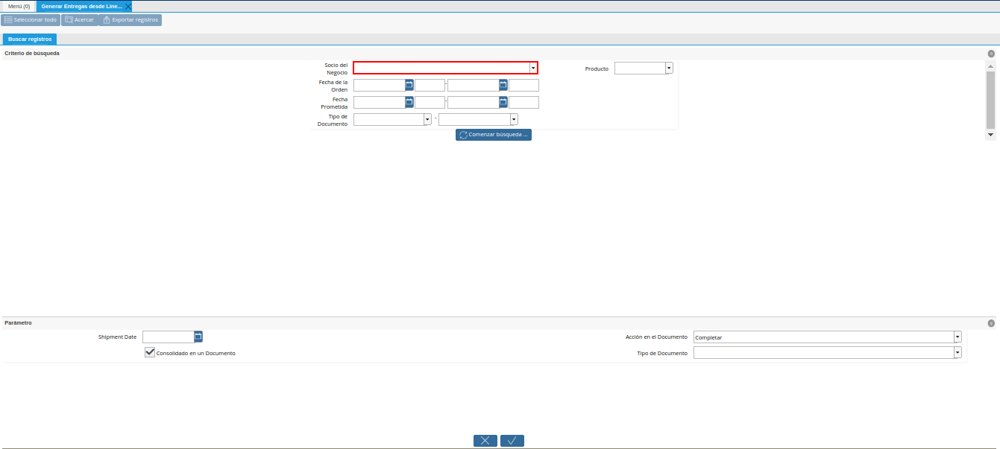
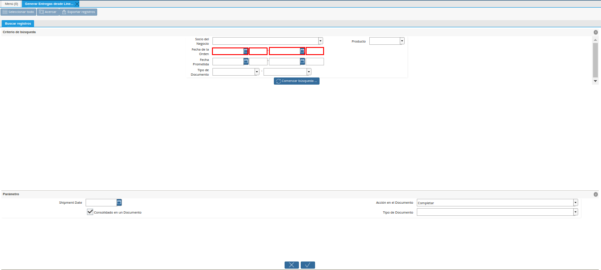
.. |Campo Fecha Prometida de la Ventana Generar Entrega desde Líneas de la Orden| image:: resources/promised-date-field-of-the-generate-delivery-from-order-lines-window.png
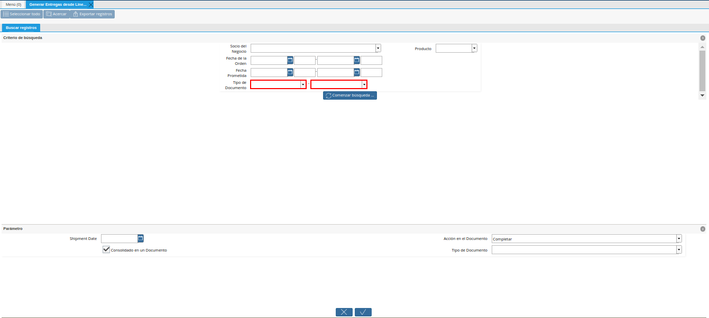
.. |Campo Producto de la Ventana Generar Entrega desde Líneas de la Orden| image:: resources/product-field-of-the-generate-delivery-from-order-lines-window.png
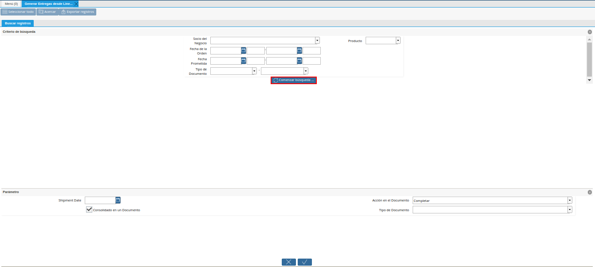
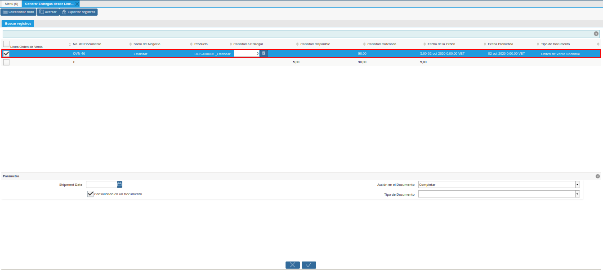
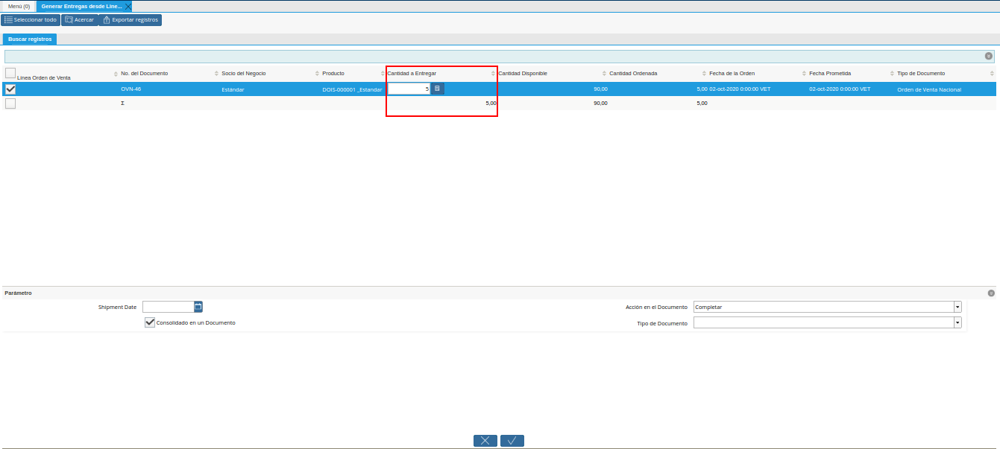
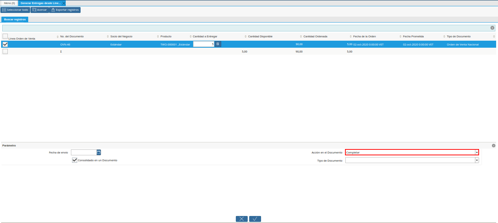
.. |Campo Fecha de Envio de la Ventana Generar Entrega desde Líneas de la Orden| image:: resources/shipment-date-field-of-the-generate-delivery-from-order-lines-window.png
.. |Campo Tipo de Documento de la Ventana Generar Entrega desde Líneas de la Orden| image:: resources/document-type-field-of-the-generate-delivery-from-order-lines-window.png
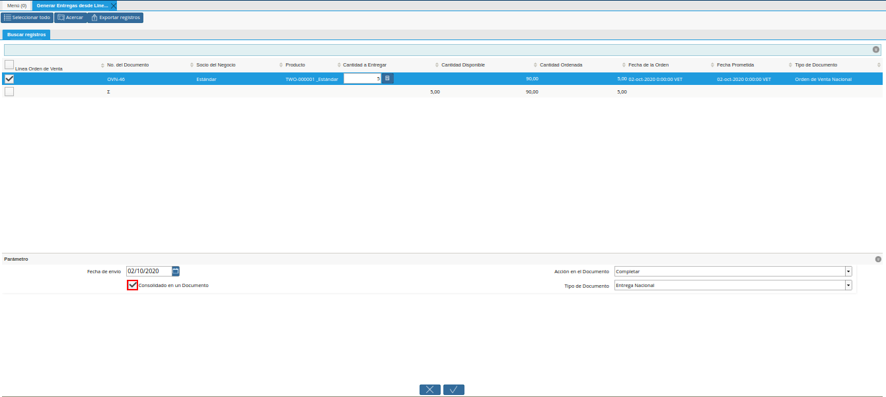
.. |Opción OK de la Ventana Generar Entrega desde Líneas de la Orden| image:: resources/ok-option-of-the-window-generate-delivery-from-order-lines.png
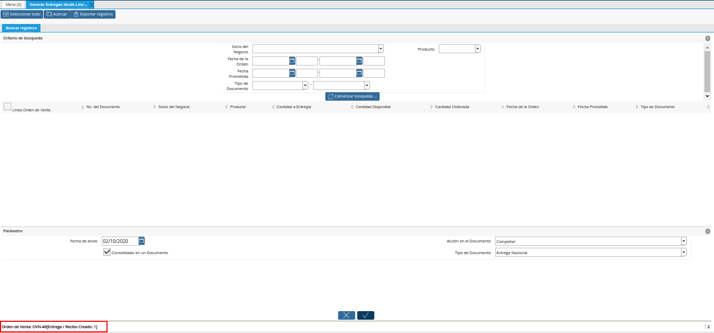
.. |Ventana Encontrar Registro Entrega| image:: resources/find-delivery-record-window.png
.. |Pestaña Avanzado de la Ventana Encontrar Registro Entrega| image:: resources/advanced-tab-of-the-find-delivery-record-window.png
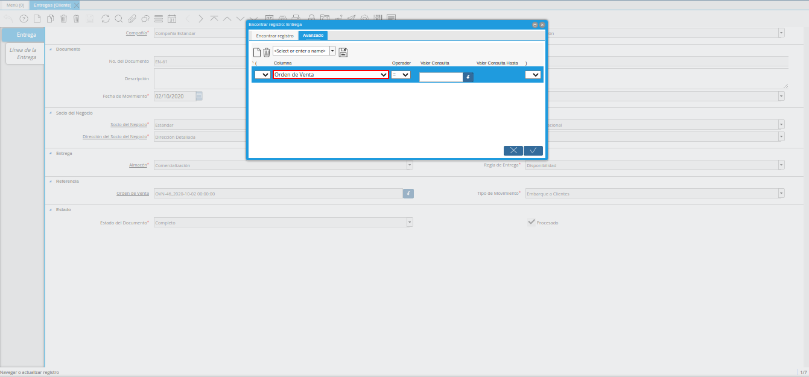
.. |Número de Orden de Venta en la Ventana Encontrar Registro Entrega| image:: resources/sales-order-number-in-the-find-delivery-record-window.png
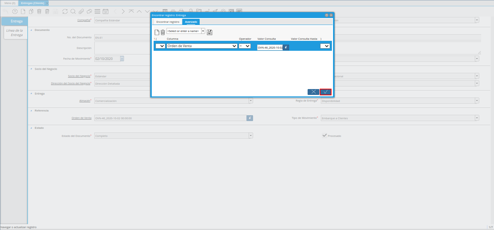
.. |Documento de Entrega Generada| image:: resources/check-generated-deliveries.png
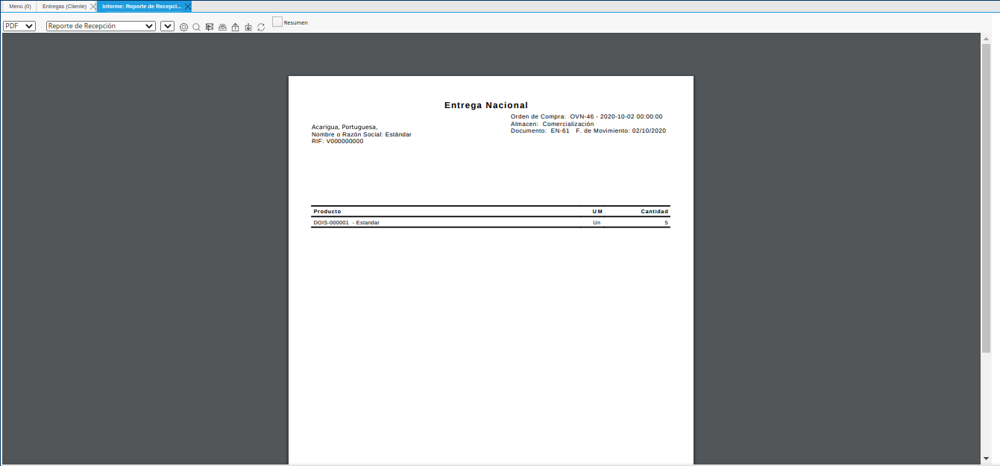

.. _documento/generar-entrega-desde-líneas-de-la-orden:

**Generar Entrega desde Líneas de la Orden**
============================================

#. Ubique y seleccione en el menú de ADempiere, la carpeta "**Gestión de Ventas**", luego seleccione la carpeta "**Entregas**", por último seleccione la ventana "**Generar Entrega desde Líneas de la Orden**".

    |Menú de ADempiere|

    Imagen 1. Menú de ADempiere

#. Podrá visualizar la ventana "**Generar Entrega desde Líneas de la Orden**" y proceder al llenado de los campos correspondientes para filtrar la búsqueda.

    |Ventana Generar Entrega desde Líneas de la Orden|

    Imagen 2. Ventana Generar Entrega desde Líneas de la Orden

    #. Seleccione en el campo "**Socio del Negocio**", el socio del negocio por el cual se va a filtrar la búsqueda.

        |Campo Socio del Negocio de la Ventana Generar Entrega desde Líneas de la Orden|

        Imagen 3. Campo Socio del Negocio de la Ventana Generar Entrega desde Líneas de la Orden

    #. Seleccione en el campo "**Fecha de la Orden**", la fecha de orden por la cual se va a filtrar la búsqueda.

        |Campo Fecha de la Orden de la Ventana Generar Entrega desde Líneas de la Orden|
        
        Imagen 4. Campo Fecha de la Orden de la Ventana Generar Entrega desde Líneas de la Orden

    #. Seleccione en el campo "**Fecha Prometida**", la fecha prometida por la cual se va a filtrar la búsqueda.

        |Campo Fecha Prometida de la Ventana Generar Entrega desde Líneas de la Orden|

        Imagen 5. Campo Fecha Prometida de la Ventana Generar Entrega desde Líneas de la Orden

    #. Seleccione en el campo "**Tipo de Documento**", el tipo de documento por el cual se va a filtrar la búsqueda.

        |Filtro Tipo de Documento de la Ventana Generar Entrega desde Líneas de la Orden|

        Imagen 6. Campo Tipo de Documento de la Ventana Generar Entrega desde Líneas de la Orden
    
    #. Seleccione en el campo "**Producto**", el producto por cual se va a filtrar la búsqueda.

        |Campo Producto de la Ventana Generar Entrega desde Líneas de la Orden|

        Imagen 7. Campo Producto de la Ventana Generar Entrega desde Líneas de la Orden

        .. note::

            La selección del producto puede realizarce ingresando en el campo "**Producto**", el "**Código**" del producto requerido. De igual manera, se puede realizar la búsqueda ingresando el "**Código de Barra**" o "**UPC/EAN**" en lugar del código del producto.

    #. Seleccione la opción "**Comenzar Búsqueda**", para realizar la búsqueda de la información en base a los campos seleccionados.

        |Opción Comenzar Búsqueda de la Ventana Generar Entrega desde Líneas de la Orden|

        Imagen 8. Opción Comenzar Búsqueda de la Ventana Generar Entrega desde Líneas de la Orden

        #. Seleccione las líneas de la orden desde las cuales requiere que sea generada la factura.

            |Selección de Líneas de la Orden de la Ventana Generar Entrega desde Líneas de la Orden|

            Imagen 9. Selección de Líneas de la Orden de la Ventana Generar Entrega desde Líneas de la Orden

        #. En el caso de que la cantidad a entregar sea menos que la cantidad ordenada, se debe ingresar en la columna "**Cantidad a Entregar**", la cantidad a entregar correspondiente al registro de la línea del producto.

            |Columna Cantidad a Entregar de la Ventana Generar Entrega desde Líneas de la Orden|

            Imagen 10. Columna Cantidad a Entregar de la Ventana Generar Entrega desde Líneas de la Orden

            .. note::

                Para el ejemplo presentado, la cantidad ordenada del producto "**Azucar**" es "**20**", pero la cantidad a entregar del mismo será "**15**".

    #. Seleccione en el campo "**Acción en el Documento**", la acción con la cual se generará el documento de entrega.

        |Campo Acción en el Documento de la Ventana Generar Entrega desde Líneas de la Orden|

        Imagen 11. Campo Acción en el Documento de la Ventana Generar Entrega desde Líneas de la Orden

    #. Seleccione en el campo "**Fecha de Envio**", la fecha en la cual se realizará la entrega.

        |Campo Fecha de Envio de la Ventana Generar Entrega desde Líneas de la Orden|

        Imagen 12. Campo Fecha de Envio de la Ventana Generar Entrega desde Líneas de la Orden

    #. El campo "**Tipo de Documento**", se encuentra vacío y de sólo lectura ya que el tipo de documento a generar lo define la orden de venta seleccionada. De igual manera, el tipo de documento define el comportamiento del documento que se esta elaborando, dicho comportamiento se encuentra explicado en el documento "**Tipo de Documento**" elaborado por `ERPyA`_.

        |Campo Tipo de Documento de la Ventana Generar Entrega desde Líneas de la Orden|

        Imagen 13. Campo Tipo de Documento de la Ventana Generar Entrega desde Líneas de la Orden

    #. Podrá visualizar que el checklist "**Consolidado en un Documento**", se encuentra tildado por defecto.

        |Checklist Consolidado en un Documento de la Ventana Generar Entrega desde Líneas de la Orden|

        Imagen 14. Checklist Consolidado en un Documento de la Ventana Generar Entrega desde Líneas de la Orden

    #. Seleccione la opción "**OK**", para generar el documento en base a lo seleccionado en los campos anteriormente explicados.

        |Opción OK de la Ventana Generar Entrega desde Líneas de la Orden|

        Imagen 15. Opción OK de la Ventana Generar Entrega desde Líneas de la Orden

#. Podrá visualizar en la parte inferior izquierda de la ventana "**Generar Entrega desde Líneas de la Orden**", el resultado del proceso anteriormente realizado, en la cual se indica la orden de venta con su respectivo número de documento, utilizada para generar la entrega desde la línea de la misma.

    |Resultado de la Entrega Generada desde Líneas de la Orden|

    Imagen 16. Resultado de la Entrega Generada desde Líneas de la Orden

**Consultar Entregas Generadas**
--------------------------------

#. Para consultar la entrega generada en la ventana "**Entregas (Cliente)**", debe seleccionar el icono "**Encontrar Registro**" ubicado en la barra de herramientas de ADempiere, para luego visualizar la ventana "**Encontrar Registro: Entrega**".

    |Ventana Encontrar Registro Entrega|

    Imagen 17. Ventana Encontrar Registro Entrega

    #. Seleccione la pestaña "**Avanzado**", para filtrar la búsqueda por la orden de venta.

        |Pestaña Avanzado de la Ventana Encontrar Registro Entrega|

        Imagen 18. Pestaña Avanzado de la Ventana Encontrar Registro Entrega

    #. Seleccione en el campo correspondiente a la "**Columna**", la opción "**Orden de Venta**", para filtrar la búsqueda por la orden de venta.

        |Opción Orden de Venta de la Ventana Encontrar Registro Entrega|

        Imagen 19. Opción Orden de Venta de la Ventana Encontrar Registro Entrega

    #. Luego introduzca en el campo correspondiente al "**Valor Consulta**", el número de documento de la orden de venta utilizado para generar la entrega.

        |Número de Orden de Venta en la Ventana Encontrar Registro Entrega|

        Imagen 20. Número de Orden de Venta en la Ventana Encontrar Registro Entrega

    #. Por último, seleccione la opción "**OK**", para realizar la búsqueda.

        |Opción OK de la Ventana Encontrar Registro Entrega|

        Imagen 21. Opción OK de la Ventana Encontrar Registro Entrega

#. Podrá visualizar el documento de entrega generado desde las líneas de la orden seleccionada. El mismo es generado en el estado seleccionado en el campo "**Acción del Documento**", de la ventana "**Generar Entrega desde Líneas de la Orden**".

    |Documento de Entrega Generada|

    Imagen 22. Documento de Entrega Generada

**Imprimir Entregas Generadas**
-------------------------------

#. Para imprimir el registro de la entrega generada en la ventana "**Entregas (Cliente)**", seleccione el icono "**Imprimir**" ubicado en la barra de herramientas de ADempiere. Luego podrá visualizar de la siguiente manera la entrega generada desde las líneas de la orden. 

    |Imprimir Entregas Generadas|

    Imagen 23. Imprimir Entregas Generadas