.. _ERPyA: http://erpya.com
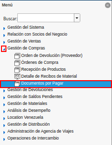
.. |ventana documentos por pagar| image:: resources/payable-documents-window.png
.. |icono registro nuevo de la ventana documentos por pagar| image:: resources/new-registration-icon-in-the-documents-payable-window.png
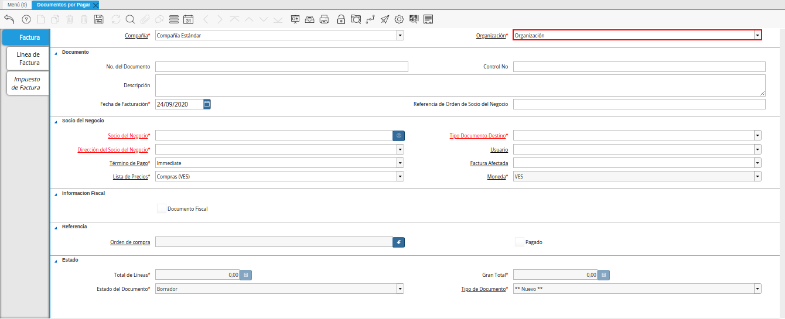
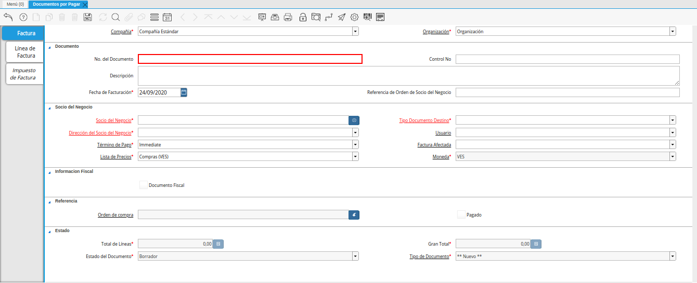
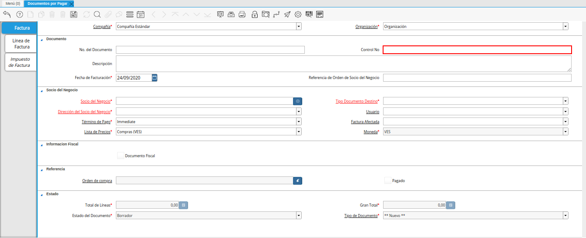
.. |campo descripcion de la ventana documentos por pagar| image:: resources/field-description-of-the-window-documents-payable.png
.. |campo fecha de facturacion de la ventana documentos por pagar| image:: resources/invoice-date-field-of-the-documents-payable-window.png
.. |campo referencia de orden de socio del negocio de la ventana documentos por pagar| image:: resources/business-partner-order-reference-field-of-the-payables-window.png
.. |campo socio del negocio de la ventana documentos por pagar| image:: resources/business-partner-field-of-payables-window.png

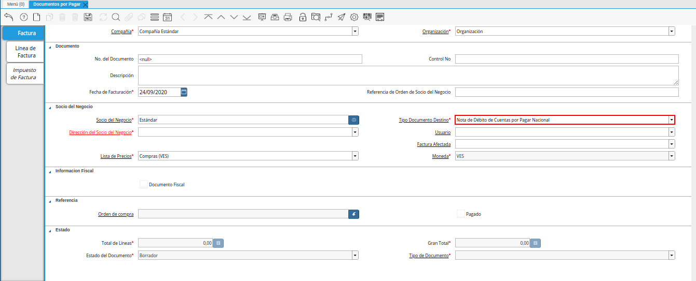
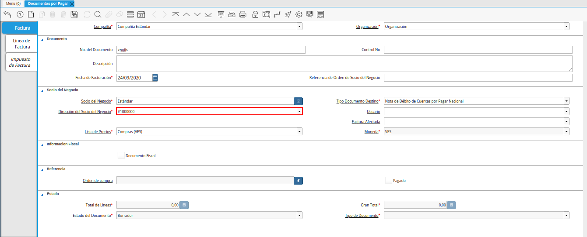
.. |campo usuario de la ventana documentos por pagar débito| image:: resources/user-field-of-documents-payable-debit-window.png
.. |campo factura afectada de la ventana documentos por pagar débito| image:: resources/affected-invoice-field-of-the-documents-payable-debit-window.png
.. |campo lista de precios de la ventana documentos por pagar débito| image:: resources/debit-payable-documents-window-price-list-field.png
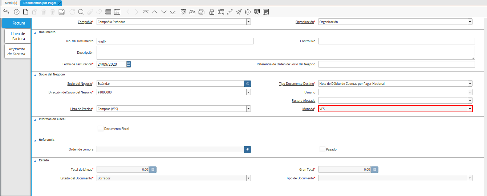
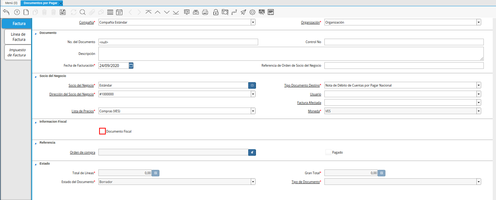
.. |pestaña linea de factura de la ventana documentos por pagar débito| image:: resources/invoice-line-tab-of-the-documents-payable-debit-window.png
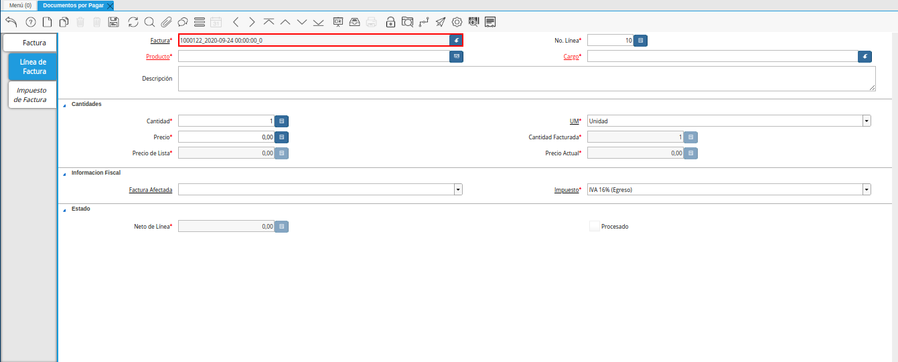
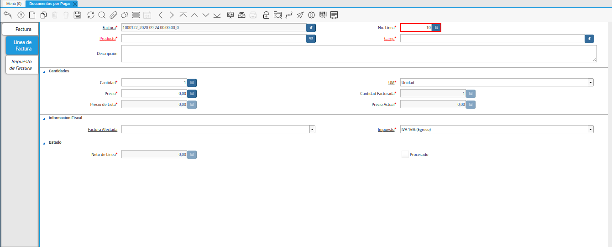
.. |campo producto de la pestaña linea de factura débito| image:: resources/product-field-of-the-debit-invoice-line-tab.png
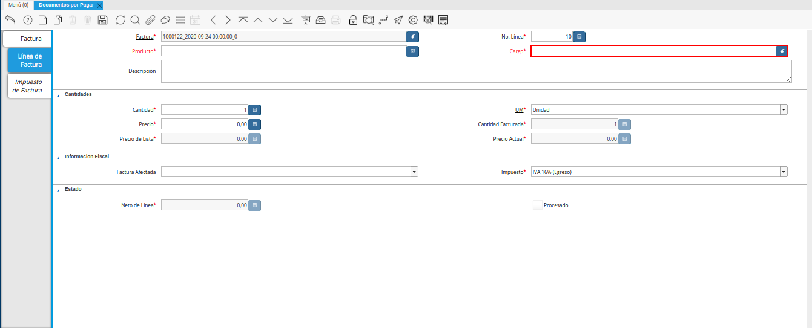
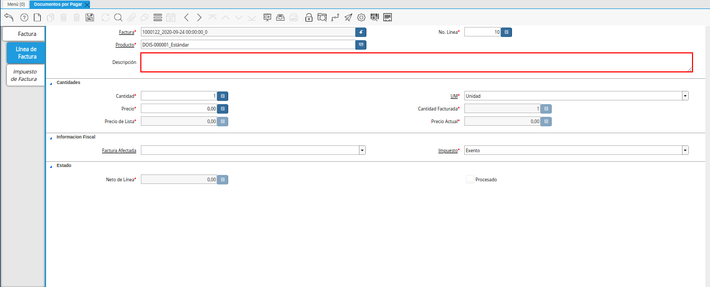
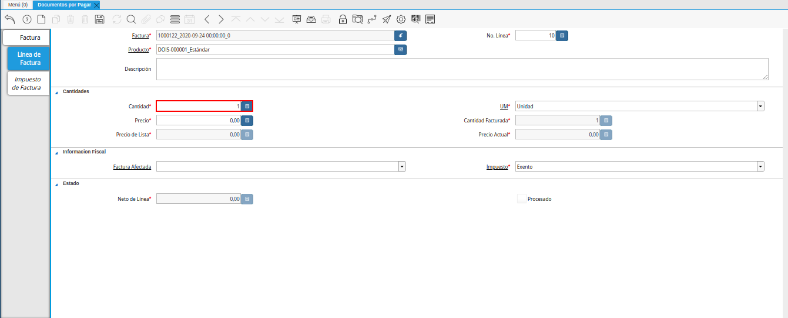
.. |campo um de la pestaña linea de factura débito| image:: resources/um-field-of-the-debit-invoice-line-tab.png
.. |campo precio de la pestaña linea de factura débito| image:: resources/price-field-of-the-debit-invoice-line-tab.png
.. |campo cantidad facturada de la pestaña linea de factura débito| image:: resources/invoiced-amount-field-of-the-debit-invoice-line-tab.png
.. |campo precio de lista de la pestaña linea de factura débito| image:: resources/list-price-field-of-the-debit-invoice-line-tab.png
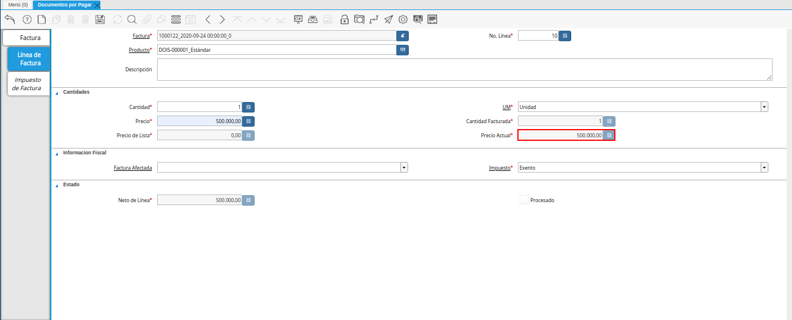
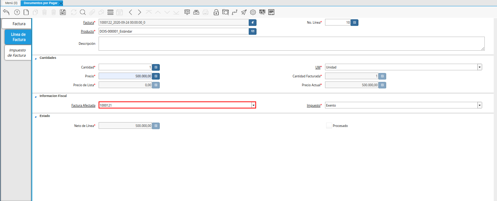
.. |campo impuesto de la pestaña linea de factura débito| image:: resources/tax-field-of-the-debit-invoice-line-tab.png
.. |campo neto de linea de la pestaña linea de factura débito| image:: resources/net-line-field-of-the-debit-invoice-line-tab.png
.. |checklist procesado de la pestaña linea de factura débito| image:: resources/checklist-processed-from-the-debit-invoice-line-tab.png
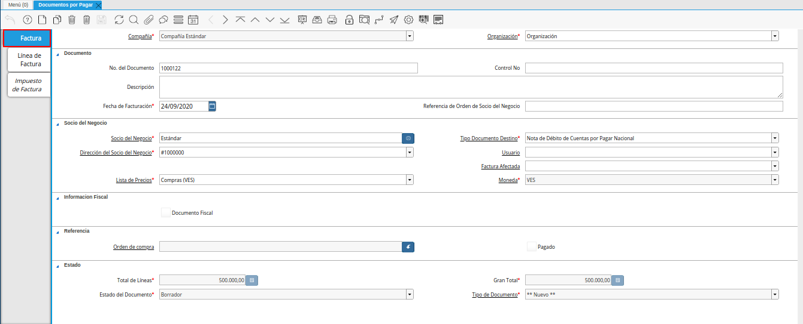
.. |campo orden de compra de la ventana documentos por pagar débito| image:: resources/purchase-order-field-of-the-documents-payable-debit-window.png
.. |checklist pagado de la ventana documentos por pagar débito| image:: resources/paid-checklist-from-the-documents-payable-debit-window.png
.. |campo total lineas de la ventana documentos por pagar débito| image:: resources/total-field-lines-of-the-window-documents-payable-debit.png
.. |campo gran total de la ventana documentos por pagar débito| image:: resources/grand-total-field-of-documents-payable-debit-window.png
.. |campo estado del documento de la ventana documentos por pagar débito| image:: resources/document-status-field-of-the-documents-payable-debit-window.png
.. |campo tipo de documento en la ventana documentos por pagar débito| image:: resources/document-type-field-in-the-documents-payable-debit-window.png
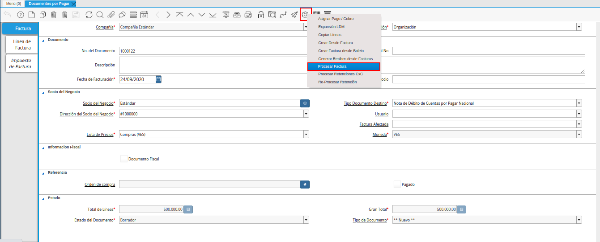
.. |completar documento| image:: resources/complete-document.png

.. _documento/nota-de-débito-cxp:

**Nota de Débito**
==================

Es un documento que se aplica a una factura para aumentar el monto de la misma, una nota de débito se podría realizar bajo el concepto de gastos administrativos y siempre nace de un documento afectado como una factura o una nota de débito.

A continuación es explicado el procedimiento para generar en ADempiere, una nota de débito de cuentas por pagar.

**Registro de Nota de Débito**
------------------------------

#. Ubique en el menú de ADempiere, la carpeta "**Gestión de Compras**", luego seleccione la ventana "**Documentos por Pagar**", adjunto imagen para referencia.

    |menu documentos por pagar|

    Imagen 1. Menú de ADempiere

#. Podrá visualizar la ventana "**Documentos por Pagar**", con todos los registros que contiene ADempiere referente a documentos por pagar.

    |ventana documentos por pagar|

    Imagen 2. Ventana Documentos por Pagar 

#. Seleccione la opción "**Registro Nuevo**" en la barra de herramientas de ADempiere, para crear un documento nuevo en la ventana "**Documentos por Pagar**".

    |icono registro nuevo de la ventana documentos por pagar|

    Imagen 3. Registro Nuevo

    #. Seleccione en el campo "**Organización**", la organización para la cual se encuentra realizando la nota de débito, el valor en el mismo debe ser diferente del símbolo (*).

        |campo organizacion de la ventana documentos por pagar|

        Imagen 4. Campo Organización

    #. En el campo "**No. de Documento**", no es necesario ingresarlo en forma manual, al momento de realizar un registro, ADempiere genera un número de secuencia automáticamente para el documento, al seleccionar la opción guardar del nuevo registro de documento por pagar.

        |campo nro del documento de la ventana documentos por pagar|

        Imagen 5. Campo No. del Documento

    #. Introduzca en el campo "**Contol No**", el número de control fiscal correspondiente al registro que se encuentra realizando.

        |campo control nro de la ventana documentos por pagar|

        Imagen 6. Campo Control No.

    #. Introduzca en el campo "**Descripción**", una breve descripción con respecto al documento que se encuentra realizando.

        |campo descripcion de la ventana documentos por pagar|

        Imagen 7. Campo Descripción

    #. Seleccione en el campo "**Fecha de Facturación**", la fecha en la cual es realizado el documento.

        |campo fecha de facturacion de la ventana documentos por pagar|

        Imagen 8. Campo Fecha de Facturación

    #. En el campo "**Referencia de Orden de Socio del Negocio**", se puede ingresar la referencia de orden del socio del negocio para esta transacción específica. Frecuentemente los números de orden de compras se dan para ser impresas en las facturas como una referencia más fácil.

        |campo referencia de orden de socio del negocio de la ventana documentos por pagar|

        Imagen 9. Campo Referencia de Orden de Socio del Negocio

    #. Seleccione en el campo "**Socio del Negocio**", el socio del negocio al cual le esta aplicando la nota de débito.

        |campo socio del negocio de la ventana documentos por pagar|

        Imagen 10. Campo Socio del Negocio

    #. Seleccione el tipo de documento a generar en el campo "**Tipo de Documento**", la selección de este define el comportamiento del documento que se esta elaborando, dicho comportamiento se encuentra explicado en el documento "**Tipo de Documento**" elaborado por `ERPyA`_.

        |campo tipo de documento de la ventana documentos por pagar débito|

        Imagen 11. Campo Tipo de Documento

    #. Podrá visualizar en el campo "**Dirección de Socio del Negocio**", la dirección del socio del negocio seleccionado anteriormente en el campo "**Socio del Negocio**".

        |campo direccion del socio del negocio de la ventana documentos por pagar débito|

        Imagen 12. Campo Dirección del Socio del Negocio

    #. De igual manera, puede visualizar en el campo "**Usuario**", el usuario en ADempiere del socio del negocio seleccionado anteriormente.

        |campo usuario de la ventana documentos por pagar débito|

        Imagen 13. Campo Usuario

    #. Seleccione en el campo "**Factura Afectada**", la factura a la cual requiere aplicar la nota de débito que se encuentra realizando para ser asignada automáticamente al registro que se encuentra realizando.

        |campo factura afectada de la ventana documentos por pagar débito|

        Imagen 14. Campo Factura Afectada

    #. Seleccione en el campo "**Lista de Precios**", la lista de precios con la cual requiere generar la nota de débito.

        |campo lista de precios de la ventana documentos por pagar débito|

        Imagen 15. Campo Lista de Precios

    #. Podrá visualizar en el campo "**Moneda**", la moneda definida para la lista de precios seleccionada.

        |campo moneda de la ventana documentos por pagar débito|

        Imagen 16. Campo Moneda

    #. El checklist "**Documento Fiscal**", indica que el registro en el que se encuentra es un documento fiscal.

        |checklist documento fiscal de la ventana documentos por pagar débito|

        Imagen 17. Checklist Documento Fiscal

.. note::

    Recuerde guardar el registro de los campos de la ventana antes de cambiar a otra pestaña. Esto se puede realizar seleccionando el icono "**Guardar Cambios**", ubicado en la barra de herramientas de ADempiere.

**Línea de la Factura**
-----------------------

#. Seleccione la pestaña "**Línea de Factura**", para proceder a cargar los productos o servicios correspondientes a la nota de débito que se encuentra realizando.

    |pestaña linea de factura de la ventana documentos por pagar débito|

    Imagen 18. Pestaña Línea de Factura

    #. Podrá visualizar en el campo "**Factura**", el número de registro de la nota de débito al que pertenece la línea que se encuentra realizando.

        |campo factura de la pestaña linea de factura débito|

        Imagen 19. Campo Factura

    #. De igual manera, podrá visualizar en el campo "**No. Línea**", el número de línea correspondiente al registro en el cual se encuentra ubicado.

        |campo nro linea de la pestaña linea de factura débito|

        Imagen 20. Campo No. del Documento

    #. Seleccione en el campo "**Producto**", el producto por el cual se encuentra aplicando la nota de débito.

        |campo producto de la pestaña linea de factura débito|

        Imagen 21. Campo Producto

        .. warning::

            Si la nota de crédito es por un concepto especial, como es el caso de descuento en precio o diferencia cambiaria, sustituya el producto por un cargo que justifique la nota.

    #. Seleccione en el campo "**Cargo**", el cargo por el cual se encuentra aplicando la nota de débito.

        |campo cargo de la pestaña linea de factura débito|

        Imagen 22. Campo Cargo

    #. Introduzca en el campo "**Descripción**", una breve descripción referente al registro que se encuentra realizando.

        |campo descripcion de la pestaña linea de factura débito|

        Imagen 23. Campo Descripción

    #. Seleccione en el campo "**Cantidad**", la cantidad correspondiente al registro que se encuentra realizando.

        |campo cantidad de la pestaña linea de factura débito|

        Imagen 24. Campo Cantidad

    #. Seleccione en el campo "**UM**", la unidad de medida relacionada al registro que se encuentra realizando.

        |campo um de la pestaña linea de factura débito|

        Imagen 25. Campo UM

    #. Introduzca en el campo "**Precio**", el precio correspondiente a la nota de débito que se encuentra realizando.

        |campo precio de la pestaña linea de factura débito|

        Imagen 26. Campo Precio

        .. note::

            El precio ingreso es convertido al precio real basado en la conversión de la unidad de medida seleccionada en el campo "**UM**".

    #. Podrá visualizar en el campo "**Cantidad Facturada**", la cantidad facturada correspondiente al registro que se encuentra realizando.

        |campo cantidad facturada de la pestaña linea de factura débito|

        Imagen 27. Campo Cantidad Facturada

    #. Introduzca en el campo "**Precio de Lista**", el precio oficial correspondiente a la nota de débito que se encuentra realizando.

        |campo precio de lista de la pestaña linea de factura débito|

        Imagen 28. Campo Precio de Lista

        .. note::

            El precio actual indica el precio oficial para un producto en la moneda fuente. 

    #. Podrá visualizar en el campo "**Precio Actual**", el precio unitario correspondiente a la nota de débito que se encuentra realizando.

        |campo precio actual de la pestaña linea de factura débito|

        Imagen 29. Precio Actual

        .. note::

            El precio actual indica el precio para un producto en la moneda fuente.

    #. Seleccione en el campo "**Factura Afectada**", la factura afectada para ser asignada automáticamente a la nota de débito que se encuentra realizando.

        |campo factura afectada de la pestaña linea de factura débito|

        Imagen 30. Campo Factura Afectada

    #. Seleccione en el campo "**Impuesto**", el impuesto a aplicar al registro o línea de registro que se encuentra realizando.

        |campo impuesto de la pestaña linea de factura débito|

        Imagen 31. Campo Impuesto

    #. Podra visualizar en el campo "**Neto de Línea**", el total neto de la línea basado en la cantidad y el precio actual.

        |campo neto de linea de la pestaña linea de factura débito|

        Imagen 32. Campo Neto de Línea

        .. note::
    
            El total neto de la línea se obtiene de la operación (Cantidad * Precio Actual) sin fletes ni cargos. Cualquier cargo adicional o flete no es incluido.

    #. El checklkist "**Procesado**", indica que un documento ha sido procesado.

        |checklist procesado de la pestaña linea de factura débito|

        Imagen 33. Checklist Procesado

.. note::

    Recuerde guardar el registro de los campos de la ventana antes de cambiar a otra pestaña. Esto se puede realizar seleccionando el icono "**Guardar Cambios**", ubicado en la barra de herramientas de ADempiere.

**Factura**
-----------

#. Regrese a la ventana principal "**Factura**", ubicando la parte inferior de la nota de débito.

    |pestaña principal factura débito|

    Imagen 34. Pestaña Principal Factura

    #. En el campo "**Orden de Compra**", se muestra el número de documento de la orden de compra asociada al documento por pagar.

        |campo orden de compra de la ventana documentos por pagar débito|

        Imagen 35. Campo Orden de Compra

    #. El checklist "**Pagado**", indica que el documento ya fue pagado.

        |checklist pagado de la ventana documentos por pagar débito|

        Imagen 36. Checklist Pagado

    #. Podrá visualizar en el campo "**Total de Líneas**", la sumatoria total de todos los netos de línea sin impuestos ni cargos, que contiene la nota de débito que se encuentra realizando.

        |campo total lineas de la ventana documentos por pagar débito|

        Imagen 37. Campo Total de Líneas

    #. De igual manera, podrá visualizar en el campo "**Gran Total**", la sumatoria de todos los montos reflejados en el campo "**Total de la Línea**", de todas las líneas que contiene la nota de débito que se encuentra realizando.

        |campo gran total de la ventana documentos por pagar débito|

        Imagen 38. Campo Gran Total

        .. note::

            El gran total identifica el total incluyendo impuestos y totales de fletes en la moneda del documento.

    #. El campo "**Estado del Documento**", indica el estado del documento en este momento, para cambiar el estado del documento utilice la opción "**Procesar Factura**", desplegada por el icono "**Proceso**", ubicado en la barra de herramientas de ADempiere.

        |campo estado del documento de la ventana documentos por pagar débito|

        Imagen 39. Campo Estado del Documento

    #. El campo "**Tipo de Documento**", indica el tipo de documento que determina la secuencia del documento o las reglas del proceso.

        |campo tipo de documento en la ventana documentos por pagar débito|

        Imagen 40. Campo Tipo de Documento

    #. Seleccione la opción "**Procesar Factura**", desplegada por el icono "**Proceso**", ubicado en la barra de herramientas de ADempiere.

        |opcion procesar factura del icono proceso débito|

        Imagen 41. Opción Procesar Factura del Icono Proceso

    #. Seleccione la acción "**Completar**" y la opción "**OK**", para completar el documento "**Nota de débito de CxP**".

        |completar documento|

        Imagen 42. Completar Documento