.. _ERPyA: http://erpya.com

.. |Menú de ADempiere| image:: resources/documents-payable-menu.png
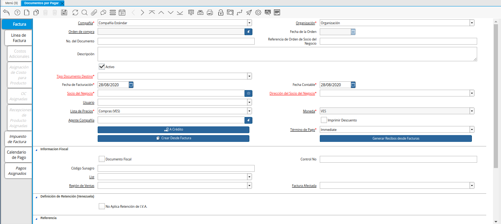
.. |Icono Registro Nuevo de la Ventana Documentos por Pagar desde Orden de Compra| image:: resources/new-record-icon-in-the-documents-payable-from-purchase-order-window.png
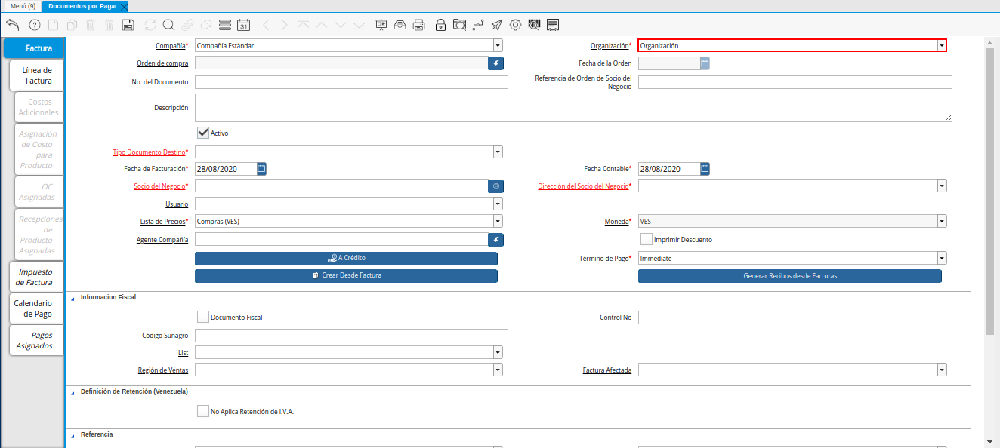
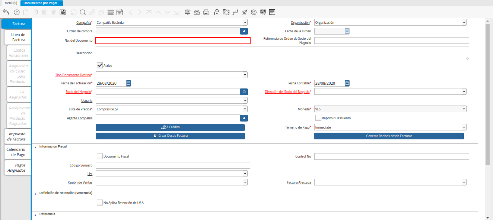
.. |Campo Descripción de la Ventana Documentos por Pagar desde Orden de Compra| image:: resources/window-description-field-documents-payable-from-purchase-order.png
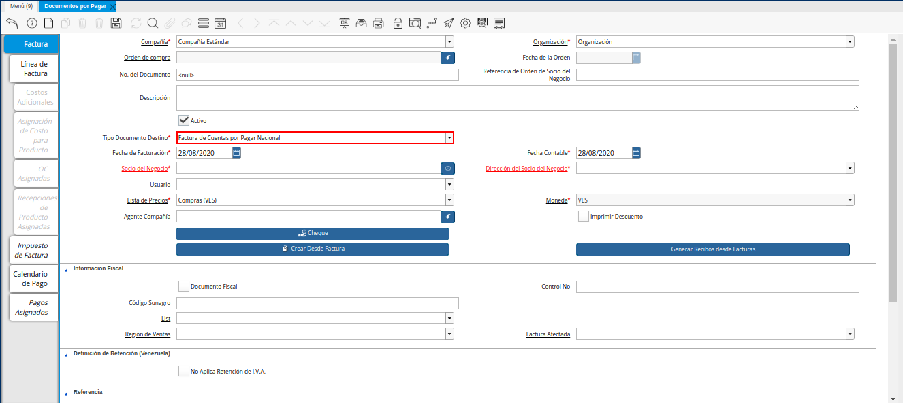
.. |Campo Fecha de Facturación de la Ventana Documentos por Pagar desde Orden de Compra| image:: resources/billing-date-field-of-the-documents-payable-from-purchase-order-window.png
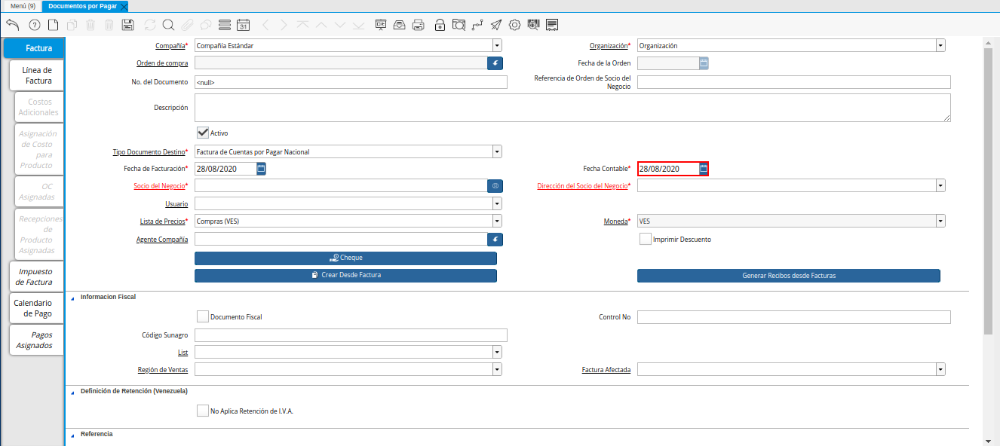
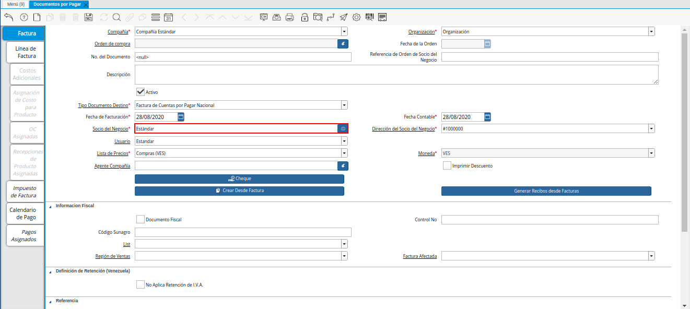
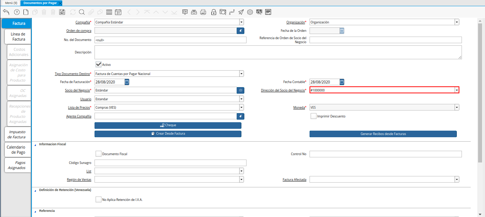
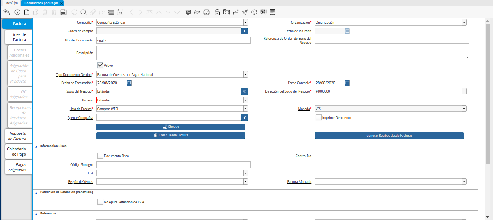
.. |Campo Lista de Precios de la Ventana Documentos por Pagar desde Orden de Compra| image:: resources/price-list-field-of-the-documents-payable-from-purchase-order-window.png

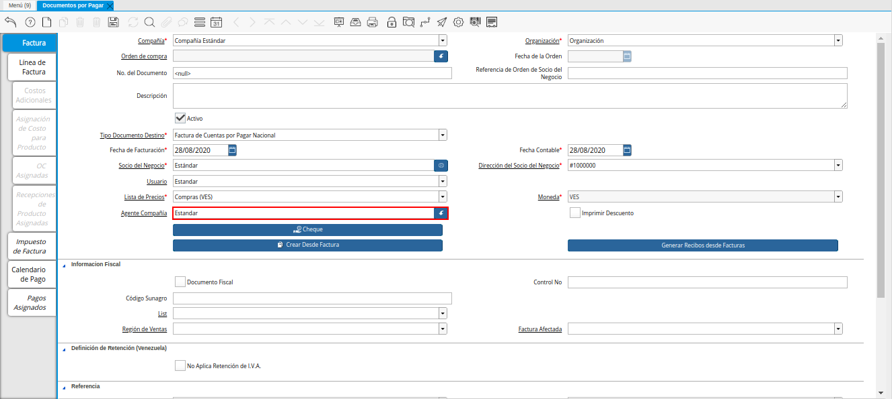
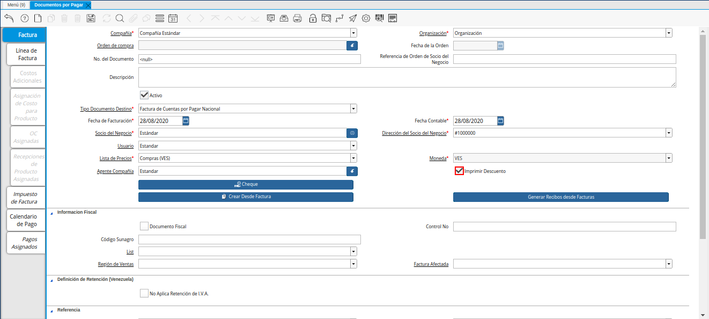
.. |Icono Guardar Cambios de la Ventana Documentos por Pagar desde Orden de Compra| image:: resources/icon-save-changes-of-the-window-documents-payable-from-purchase-order.png
.. |Opción Crear Desde Factura de la Ventana Documentos por Pagar desde Orden de Compra| image:: resources/option-create-from-invoice-of-the-window-documents-payable-from-purchase-order.png
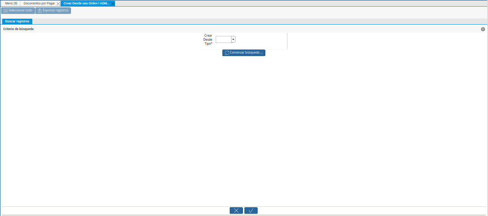
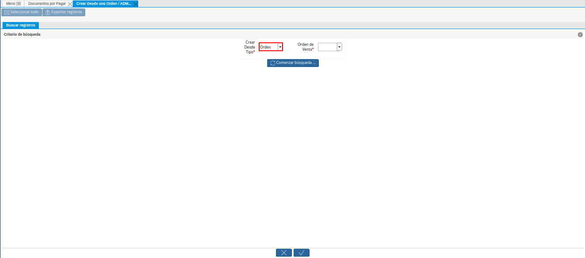
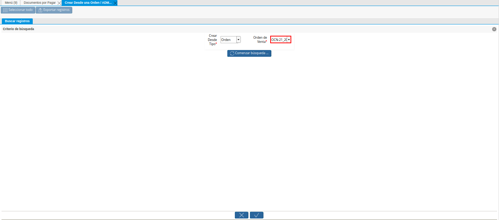
.. |Opción Comenzar Búsqueda de la Ventana Crear Desde una Orden ADM Factura Recepción en una Factura| image:: resources/option-start-window-search-create-from-an-order-adm-invoice-receipt-in-an-invoice.png
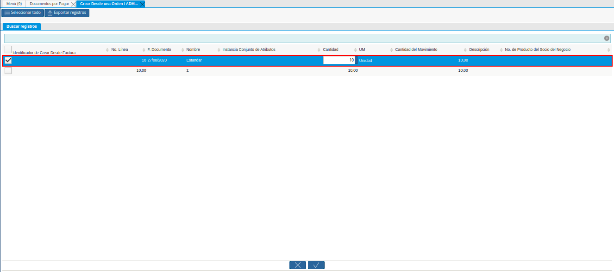
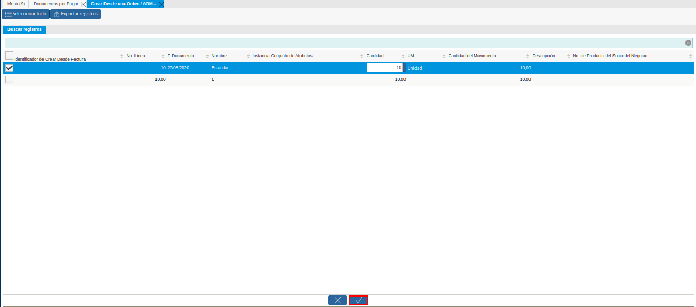
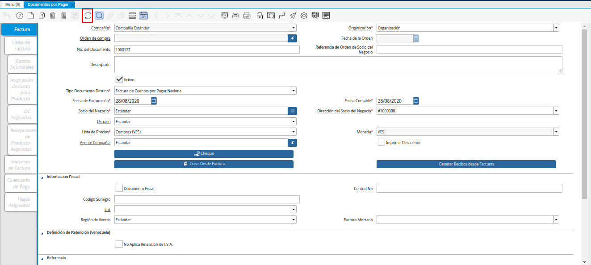
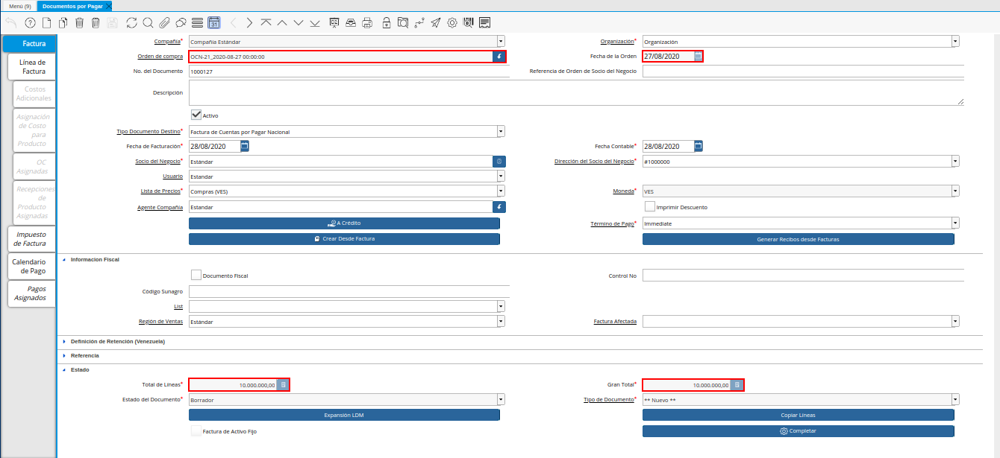
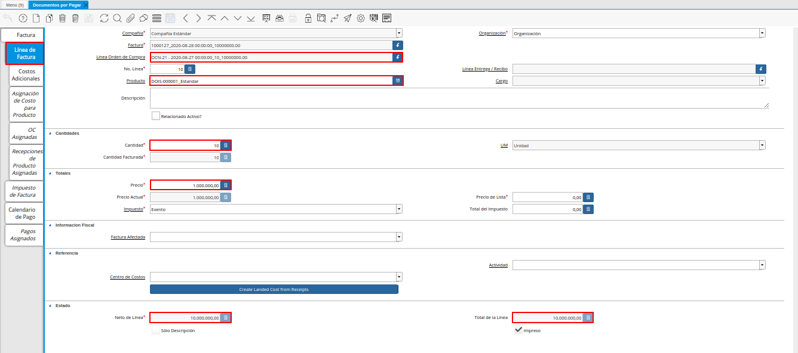
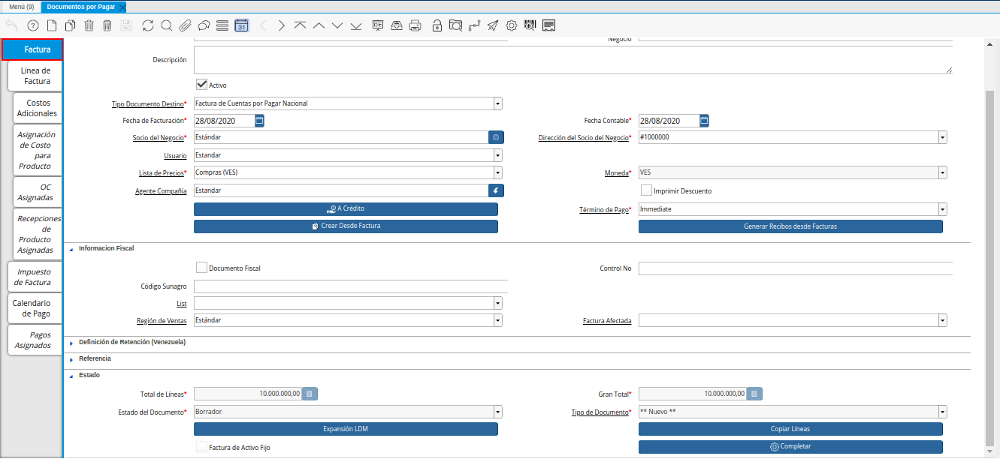
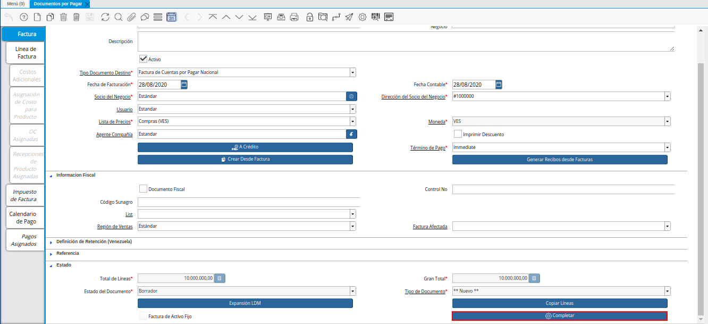
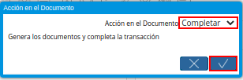

.. _documento/documento-por-pagar-desde-orden-de-compra:

**Crear Factura desde Orden de Compra**
=======================================

#. Ubique en el menú de ADempiere la carpeta "**Gestión de Compras**", luego seleccione la ventana "**Documentos por Pagar**", adjunto imagen para referencia.

   |Menú de ADempiere|

   Imagen 1. Menú de ADempiere

#. Podrá visualizar la ventana "**Documentos por Pagar**", con todos los registros de documentos por pagar que se encuentran 
en ADempiere.

    |Ventana Documentos por Pagar desde Orden de Compra|

    Imagen 2. Ventana Documentos por Pagar 

#. Seleccione el icono "**Registro Nuevo**", ubicado en la barra de herramientas de ADempiere para crear un nuevo registro.

    |Icono Registro Nuevo de la Ventana Documentos por Pagar desde Orden de Compra|

    Imagen 3. Icono Registro Nuevo de la Ventana Documentos por Pagar

    #. Seleccione en el campo "**Organización**", la organización para la cual se encuentra realizando el documento por pagar.

        |Campo Organización de la Ventana Documentos por Pagar desde Orden de Compra|

        Imagen 4. Campo Organización de la Ventana Documentos por Pagar desde Orden de Compra

    #. Introduzca en el campo "**No. del Documento**", el número de documento correspondiente al registro que se encuentra realizando.

        |Campo Nro Documento de la Ventana Documentos por Pagar desde Orden de Compra|

        Imagen 5. Campo No del Documento de la Ventana Documentos por Pagar desde Orden de Compra

        .. note::

            Si no es ingresado ningún valor en este campo, ADempiere tomará el número de secuencia establecido para para el tipo de documento seleccionado.

    #. Introduzca en el campo "**Descripción**", una breve descripción con respecto al documento que se encuentra realizando.

        |Campo Descripción de la Ventana Documentos por Pagar desde Orden de Compra|

        Imagen 6. Campo Descripción de la Ventana Documentos por Pagar desde Orden de Compra

    #. Seleccione el tipo de documento a generar en el campo "**Tipo de Documento Destino**", la selección de este define el comportamiento del documento que se esta elaborando, dicho comportamiento se encuentra explicado en el documento **Tipo de Documento** elaborado por `ERPyA`_.

        |Campo Tipo de Documento Destino de la Ventana Documentos por Pagar desde Orden de Compra|

        Imagen 7. Campo Tipo de Documento Destino de la Ventana Documentos por Pagar desde Orden de Compra

    #. Seleccione en el campo "**Fecha de Facturación**", la fecha que posee el documento por pagar en físico.

        |Campo Fecha de Facturación de la Ventana Documentos por Pagar desde Orden de Compra|

        Imagen 8. Campo Fecha de Facturación de la Ventana Documentos por Pagar desde Orden de Compra

    #. Seleccione en el campo "**Fecha Contable**", la fecha en la cual se encuentra realizando el registro del documento.

        |Campo Fecha Contable de la Ventana Documentos por Pagar desde Orden de Compra|

        Imagen 9. Campo Fecha Contable de la Ventana Documentos por Pagar desde Orden de Compra

    #. Seleccione en el campo "**Socio del Negocio**", el socio del negocio proveedor por el cual es realizado el documento por pagar.

        |Campo Socio del Negocio de la Ventana Documentos por Pagar desde Orden de Compra|

        Imagen 10. Campo Socio del Negocio de la Ventana Documentos por Pagar desde Orden de Compra

    #. Podrá visualizar en el campo "**Dirección del Socio del Negocio**", la dirección de localización del socio del negocio seleccionado anteriormente.

        |Campo Dirección del Socio del Negocio de la Ventana Documentos por Pagar desde Orden de Compra|

        Imagen 11. Campo Dirección del Socio del Negocio de la Ventana Documentos por Pagar desde Orden de Compra

    #. De igual manera, podrá visualizar en el campo "**Usuario**", el usuario dentro de ADempiere del socio del negocio seleccionado.

        |Campo Usuario de la Ventana Documentos por Pagar desde Orden de Compra|

        Imagen 12. Campo Usuario de la Ventana Documentos por Pagar desde Orden de Compra

    #. Seleccione en el campo "**Lista de Precios**", la lista de precios utilizada para el documento por pagar que se encuentra realizando.

        |Campo Lista de Precios de la Ventana Documentos por Pagar desde Orden de Compra|

        Imagen 13. Campo Lista de Precios de la Ventana Documentos por Pagar desde Orden de Compra

    #. Podrá visualizar en el campo "**Moneda**", la moneda definida para la lista de precios seleccionada anteriormente.

        |Campo Moneda de la Ventana Documentos por Pagar desde Orden de Compra|

        Imagen 14. Campo Moneda de la Ventana Documentos por Pagar desde Orden de Compra

    #. Seleccione en el campo "**Agente Compañía**", el agente comercial relacionado con el documento por pagar que se encuentra realizando.

        |Campo Agente Compañía de la Ventana Documentos por Pagar desde Orden de Compra|

        Imagen 15. Campo Agente Compañía de la Ventana Documentos por Pagar desde Orden de Compra

    #. Seleccione el checklist "**Imprimir Descuento**", para imprimir el descuento en la factura y la orden asociada al documento por pagar que se encuentra realizando.

        |Checklist Imprimir Descuento de la Ventana Documentos por Pagar desde Orden de Compra|

        Imagen 16. Checklist Imprimir Descuento de la Ventana Documentos por Pagar desde Orden de Compra

    #. Seleccione el icono "**Guardar Cambios**", ubicado en la barra de herramientas de ADempiere, para guardar el registro de los campos de la ventana "**Documentos por Pagar**".

        |Icono Guardar Cambios de la Ventana Documentos por Pagar desde Orden de Compra|

        Imagen 17. Icono Guardar Cambios de la Ventana Documentos por Pagar desde Orden de Compra

    #. Seleccione la opción "**Crear Desde Factura**", para crear el documento por pagar desde una orden de compra.

        |Opción Crear Desde Factura de la Ventana Documentos por Pagar desde Orden de Compra|

        Imagen 18. Opción Crear Desde Factura de la Ventana Documentos por Pagar desde Orden de Compra

        #. Podrá visualizar la ventana "**Crear Desde una Orden/ADM/Factura/Recepción en una Factura**", con el campo "**Crear Desde Tipo**" y la opción "**Conenzar Búsqueda**", para filtrar de búsqueda según lo que sea seleccionado en dicho campo.

            |Ventana Crear Desde una Orden ADM Factura Recepción en una Factura|

            Imagen 19. Ventana Crear Desde una Orden ADM Factura Recepción en una Factura

        #. Seleccione en el campo "**Crear Desde Tipo**", la opción "**Orden**", para crear el documento por pagar desde una orden de compra.

            |Campo Crear Desde Tipo de la Ventana Crear Desde una Orden ADM Factura Recepción en una Factura|

            Imagen 20. Campo Crear Desde Tipo de la Ventana Crear Desde una Orden ADM Factura Recepción en una Factura

        #. Al seleccionar la opción "**Orden**", se habilita el campo "**Orden de Venta**", para seleccionar la orden de compra desde la cual se requiere crear el documento por pagar.

            |Campo Orden de Venta de la Ventana Crear Desde una Orden ADM Factura Recepción en una Factura|

            Imagen 21. Campo Orden de Venta de la Ventana Crear Desde una Orden ADM Factura Recepción en una Factura

        #. Seleccione la opción "**Comenzar Búsqueda**", para realizar la búsqueda de los registros en ADempiere según lo seleccionado anteriormente.

            |Opción Comenzar Búsqueda de la Ventana Crear Desde una Orden ADM Factura Recepción en una Factura|

            Imagen 22. Opción Comenzar Búsqueda de la Ventana Crear Desde una Orden ADM Factura Recepción en una Factura

        #. Seleccione el registro de la orden de compra desde la cual requiere crear el documento por pagar que se encuentra realizando.

            |Selección de Orden de Compra en la Ventana Crear Desde una Orden ADM Factura Recepción en una Factura|

            Imagen 23. Selección de Orden de Compra en la Ventana Crear Desde una Orden ADM Factura Recepción en una Factura

        #. Seleccione la opción "**OK**", para cargar a la ventana "**Documento por Pagar**", la información de la orden de compra seleccionada.

            |Opción OK de la Ventana Crear Desde una Orden ADM Factura Recepción en una Factura|

            Imagen 24. Opción OK de la Ventana Crear Desde una Orden ADM Factura Recepción en una Factura

    #. El proceso regresa a la ventana "**Documentos por Pagar**", donde se debe seleccionar el icono "**Refrescar**", ubicado en la barra de herramientas de ADempiere, para actualizar los campos en dicha ventana y sean visualizados los datos cargados desde el proceso anteriormente explicado.

        |Icono Refrecar de la Ventana Documentos por Pagar desde Orden de Compra|

        Imagen 25. Icono Refrecar de la Ventana Documentos por Pagar desde Orden de Compra

    #. Podrá visualizar los datos de la orden de compra cargados a la ventana "**Documentos por Pagar**".

        |Datos de la Orden de Compra en la Ventana Documentos por Pagar desde Orden de Compra|

        Imagen 26. Datos de la Orden de Compra en la Ventana Documentos por Pagar desde Orden de Compra

    #. Sin embargo, puede seleccionar la pestaña "**Línea de Factura**", para visualizar los productos que contiene la orden de compra seleccionada.

        |Pestaña Línea de Factura de la Ventana Documentos por Pagar desde Orden de Compra|

        Imagen 27. Pestaña Línea de Factura de la Ventana Documentos por Pagar desde Orden de Compra

    #. Seleccione la pestaña principal "**Factura**", para ubicar la opción "**Completar**", en la parte inferior derecha del documento.

        |Pestaña Principal Factura de la Ventana Documentos por Pagar desde Orden de Compra|

        Imagen 28. Pestaña Principal Factura de la Ventana Documentos por Pagar desde Orden de Compra

    #. Seleccione la opción "**Completar**", para completar el registro realizado en la ventana "**Documentos por Pagar**".

        |Opción Completar de la Ventana Documentos por Pagar desde Orden de Compra|

        Imagen 29. Opción Completar de la Ventana Documentos por Pagar desde Orden de Compra

        #. Seleccione la acción "**Completar**" y la opción "**OK**", para culminar el procedimiento.

            |Acción Completar y Opción OK de la Ventana Documentos por Pagar desde Orden de Compra|

            Imagen 30. Acción Completar y Opción OK de la Ventana Documentos por Pagar desde Orden de Compra
