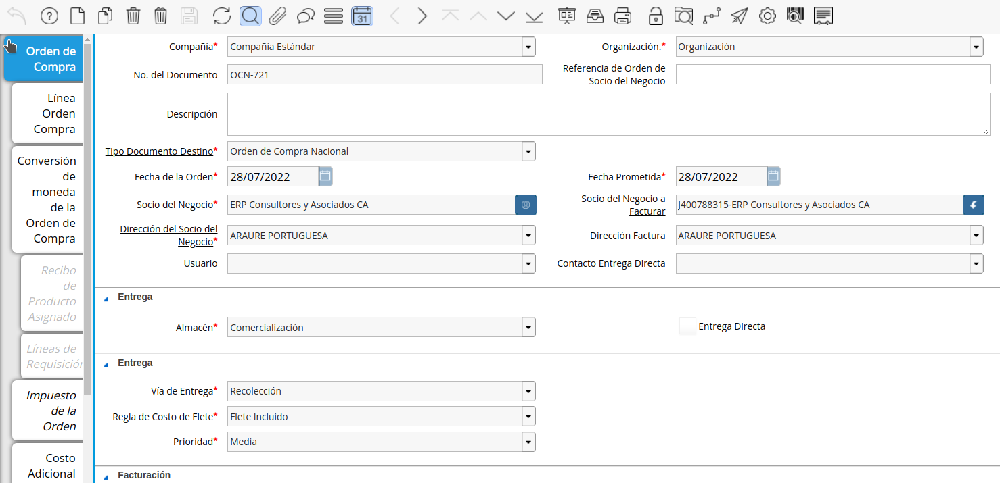
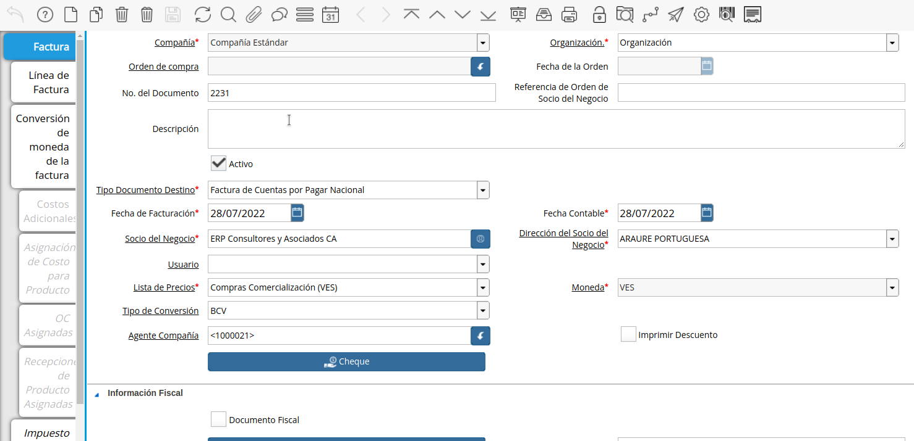
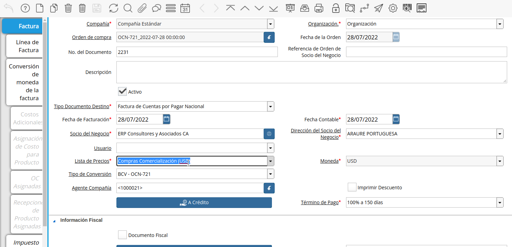
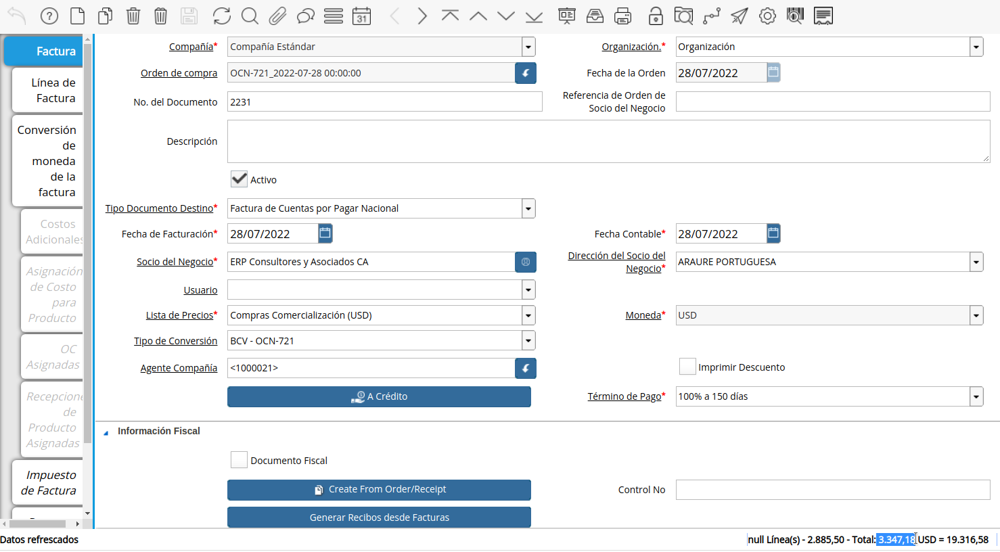

.. _ERPyA: http://erpya.com

.. |Process Convert| image:: resources/excuteprocessconvert.png

.. _documento/documento-por-pagar-convertido:

**Conversión de Factura Automática**
====================================

Cree una orden de compra de forma habitual con divisas, de no conocer el procedimiento puede consultar el material :ref:`documento/orden-de-compra`, para este ejemplo hemos realizado una orden con moneda USD.
   
   |PO USD|

   Imagen 1. Orden de Compra

Cree un documento por pagar de manera habitual, de no conocer el procedimiento puede consultar el material :ref:`documento/documento-por-pagar-desde-orden-de-compra`, para este ejemplo realizaremos una factura en BS para convertirla. 
   
   |Invoice VES|

   Imagen 2. Factura

Tome como salvedad los siguientes campos importantes para el proceso:

   Seleccione la opción "**Crear Desde Orden/Recibo**", para crear el documento por pagar desde una orden de compra.

   Seleccione la orden creada inicialmente, al ejecutar el proceso verá que son cambiados automáticamente los campos "**Lista de Precio**", "**Moneda**" y "**Tipo de Conversión**".

   |Invoice Convert|

   Imagen 3. Lista de Precio

   Proceda a cambiar de manera manual la "**Lista de Precio**" y el "**Tipo de Conversión**" de ser necesario, recuerde, que el "**Tipo de Conversión**" determina la tasa de cambio con la que se realizará la conversión del documento.

Ejecute el proceso "**Recalcular Tasa Para Lineas de la Factura**" que realiza la conversión del documento por pagar, ubicado en la barra de herramientas.

   |Process Convert|

   Imagen 4. Proceso Convertir Documento

La ejecución del proceso dejará como resultado las lineas del documento convertidas, los impuestos y el gran total, evitando así tener que realizar la conversión de forma manual.

Sabiendo que el ejemplo es de una Orden de Compra de 500 USD con un  16% de IVA quedando un total de 580 USD, al crear la factura y convertir con una tasa de 5,771 el resultado convertido debe ser 3.347,18.

   |Result Convert|

   Imagen 5. Factura Convertida

