.. _ERPyA: http://erpya.com
.. |menu documentos por pagar| image:: resources/documents-payable-menu.png
.. |ventana documentos por pagar| image:: resources/payable-documents-window.png
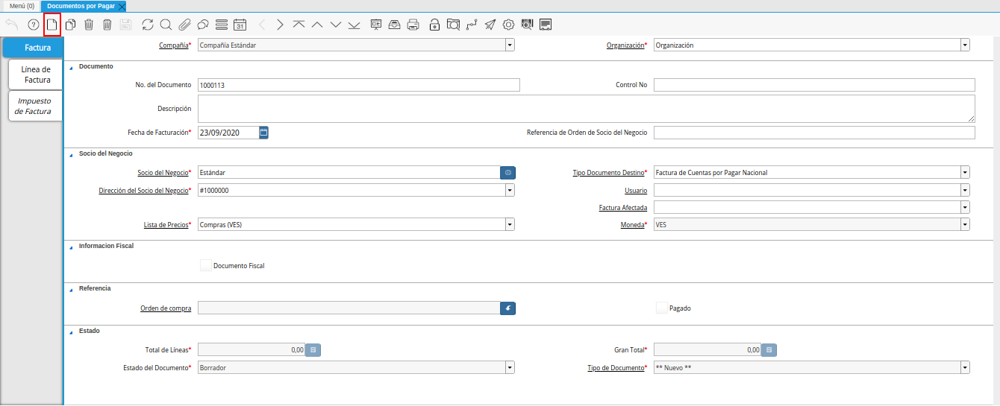
.. |campo organizacion de la ventana documentos por pagar| image:: resources/window-organization-field-documents-payable.png
.. |campo nro del documento de la ventana documentos por pagar| image:: resources/document-number-field-of-the-papers-payable-window.png

.. |campo descripcion de la ventana documentos por pagar| image:: resources/field-description-of-the-window-documents-payable.png
.. |campo fecha de facturacion de la ventana documentos por pagar| image:: resources/invoice-date-field-of-the-documents-payable-window.png
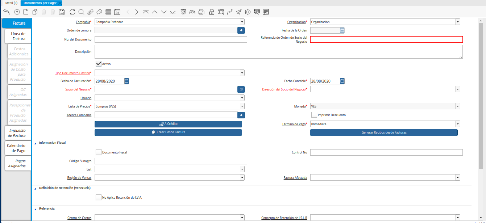
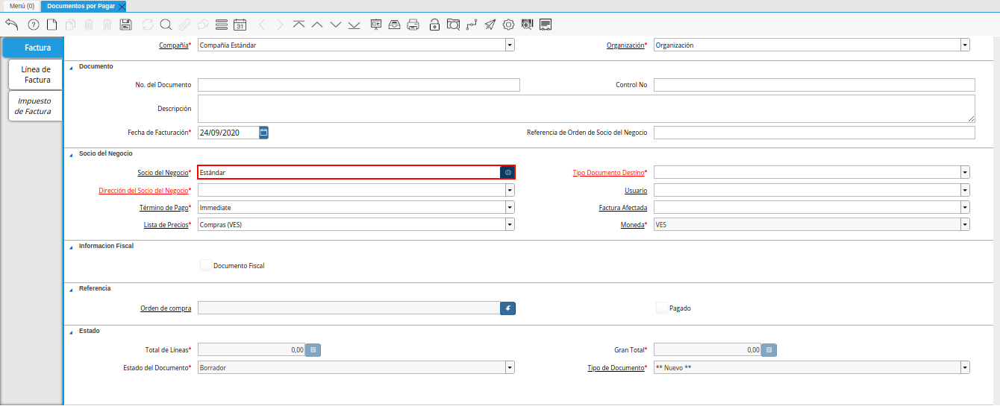
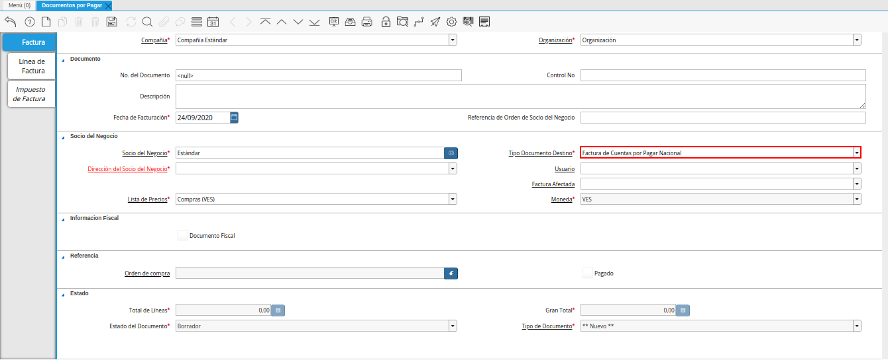
.. |campo direccion del socio del negocio de la ventana documentos por pagar| image:: resources/business-partner-address-field-of-the-papers-payable-window.png
.. |campo usuario de la ventana documentos por pagar| image:: resources/user-field-of-the-documents-payable-window.png
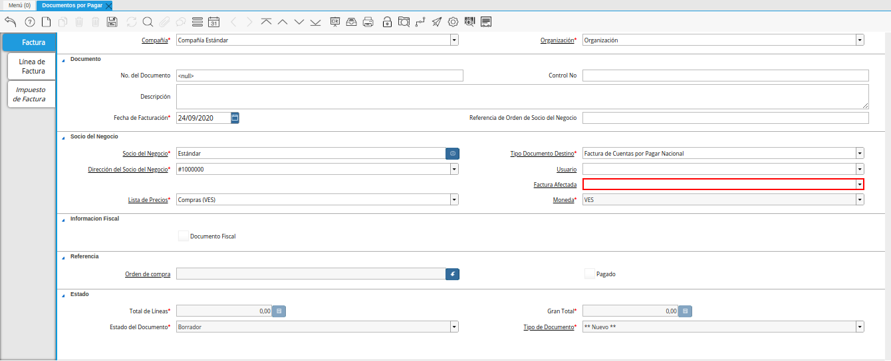
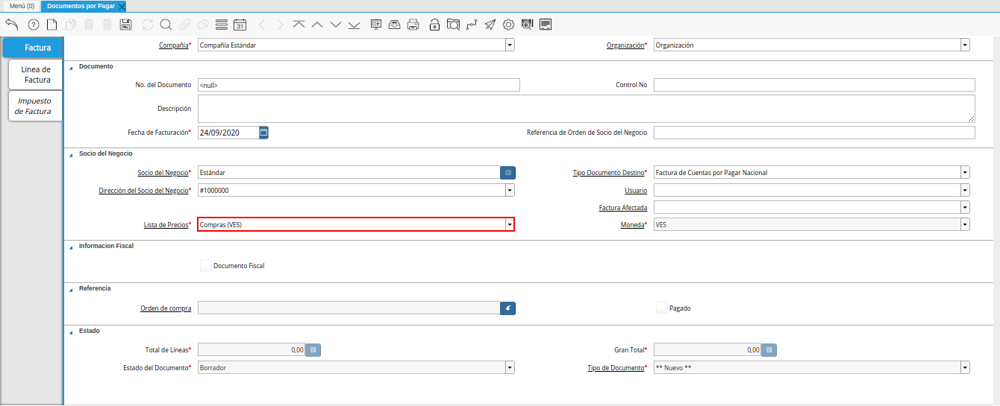
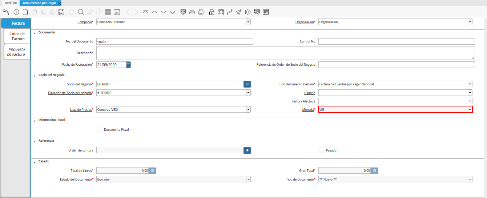
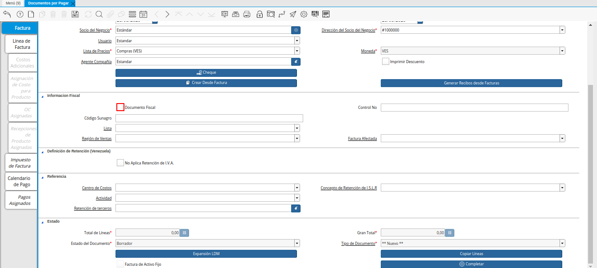
.. |opcion crear desde para factura desde recepcion del icono proceso| image:: resources/option-create-from-for-invoice-from-reception-of-the-process-icon.png
.. |ventana crear desde factura| image:: resources/create-from-invoice-window.png
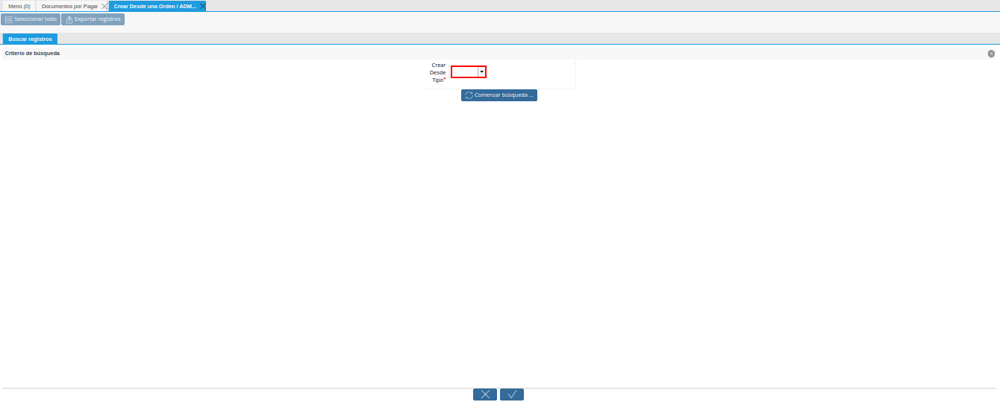
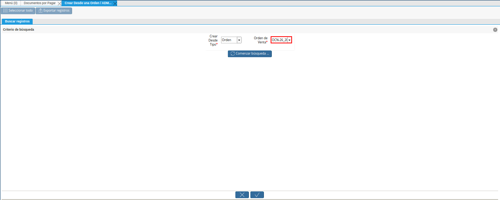
.. |opcion comenzar busqueda de orden de la ventana crear desde| image:: resources/option-start-window-order-search-create-from.png
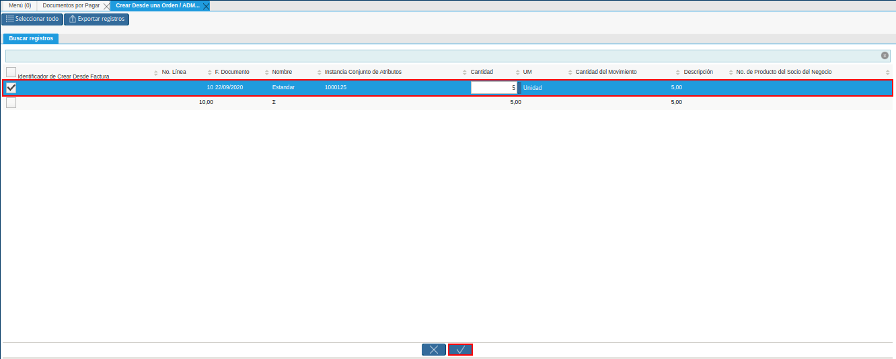
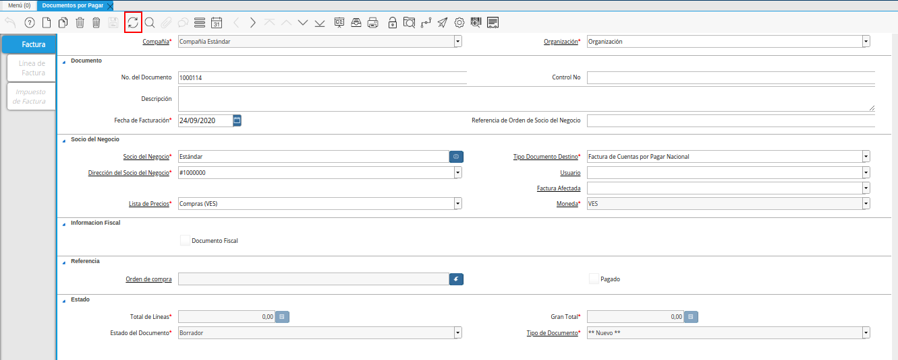
.. |pestaña linea de factura para entrega de la ventana documentos por pagar| image:: resources/invoice-line-tab-for-delivery-of-the-documents-payable-window.png
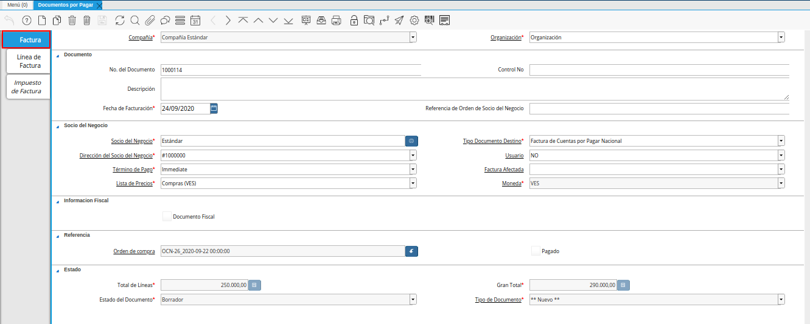
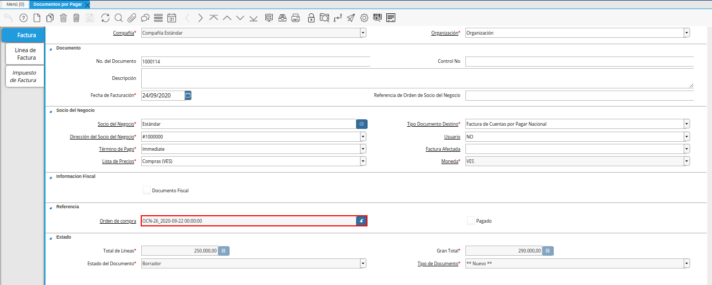
.. |checklist pagado de la ventana documentos por pagar| image:: resources/paid-checklist-from-the-payable-papers-window.png
.. |campo total lineas de la ventana documentos por pagar| image:: resources/total-field-lines-of-the-window-documents-payable.png
.. |campo gran total de la ventana documentos por pagar| image:: resources/grand-total-field-of-the-papers-payable-window.png
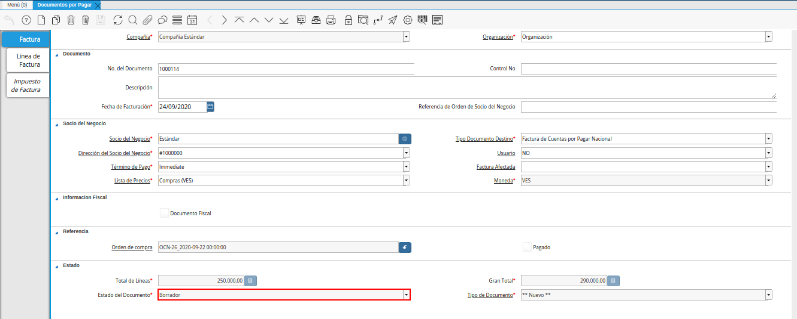
.. |campo tipo de documento en la ventana documentos por pagar| image:: resources/document-type-field-in-the-documents-payable-window.png
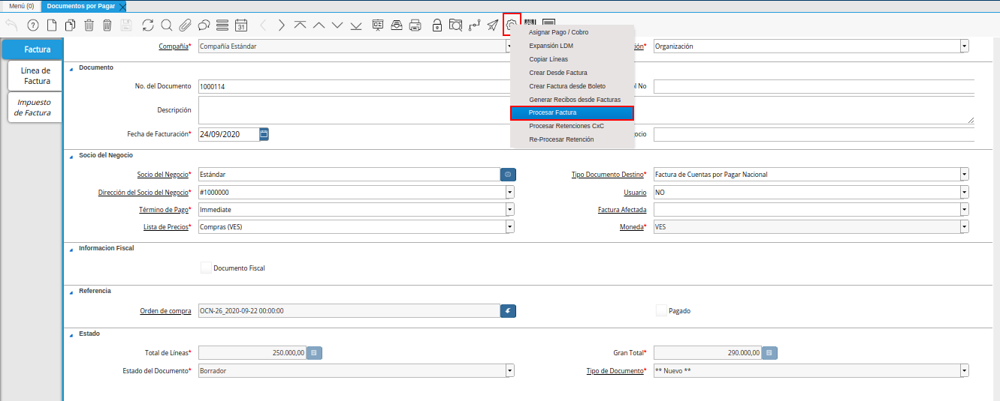
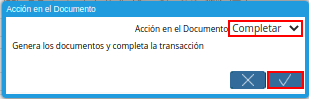

.. _documento/factura-desde-orden:

**Registro de Factura desde Orden**
===================================

#. Ubique en el menú de ADempiere, la carpeta "**Gestión de Compras**", luego seleccione la ventana "**Documentos por Pagar**", adjunto imagen para referencia.

    |menu documentos por pagar|

    Imagen 1. Menú de ADempiere

#. Podrá visualizar la ventana "**Documentos por Pagar**", con todos los registros que contiene ADempiere referente a documentos por pagar.

    |ventana documentos por pagar|

    Imagen 2. Ventana Documentos por Pagar 

#. Seleccione la opción "**Registro Nuevo**" en la barra de herramientas de ADempiere, para crear un documento nuevo en la ventana "**Documentos por Pagar**".

    |icono registro nuevo de la ventana documentos por pagar|

    Imagen 2. Registro Nuevo

    #. Seleccione en el campo "**Organización**", la organización para la cual se esta realizando el documento por pagar de productos o servicios, el valor en el mismo debe ser diferente del símbolo (*).

        |campo organizacion de la ventana documentos por pagar|

        Imagen 3. Campo Organización

    #. En el campo "**No. de Documento**", no es necesario ingresarlo en forma manual, al momento de realizar un registro, ADempiere genera un número de secuencia automáticamente para el documento, al seleccionar la opción guardar del nuevo registro de documento por pagar.

        |campo nro del documento de la ventana documentos por pagar|

        Imagen 4. Campo No. del Documento

    #. Introduzca en el campo "**Control No**", el número de control fiscal establecido para el documento que se encuentra realizando.

        |campo control nro de la ventana documentos por pagar|

        Imagen 5. Campo Control No.

    #. Introduzca en el campo "**Descripción**", una breve descripción referente al documento por pagar que se encuentra realizando.

        |campo descripcion de la ventana documentos por pagar|

        Imagen 6. Campo Descripción

    #. Seleccione en el campo "**Fecha Facturación**", la fecha que posee el documento por pagar en físico.

        |campo fecha de facturacion de la ventana documentos por pagar|

        Imagen 7. Campo Fecha de Facturación

    #. En el campo "**Referencia de Orden de Socio del Negocio**", se puede ingresar la referencia de orden del socio del negocio para esta transacción específica. Frecuentemente los números de orden de compras se dan para ser impresas en las facturas como una referencia más fácil. Un número estándar puede ser definido en la ventana "**Socio del Negocio (Cliente)**".

        |campo referencia de orden de socio del negocio de la ventana documentos por pagar|

        Imagen 8. Campo Referencia de Orden de Socio del Negocio

    #. Seleccione el socio del negocio proveedor en el campo "**Socio del Negocio**".

        |campo socio del negocio de la ventana documentos por pagar|

        Imagen 9. Campo Socio del Negocio

    #. Seleccione el tipo de documento a generar en el campo "**Tipo de Documento**", la selección de este define el comportamiento del documento que se esta elaborando, dicho comportamiento se encuentra explicado en el documento "**Tipo de Documento**" elaborado por `ERPyA`_.

        |campo tipo de documento de la ventana documentos por pagar|

        Imagen 10. Campo Tipo de Documento

    #. Podrá visualizar en el campo "**Dirección del Socio del Negocio**", la dirección de localización del socio del negocio proveedor.

        |campo direccion del socio del negocio de la ventana documentos por pagar|

        Imagen 11. Campo Dirección del Socio del Negocio

    #. De igual manera, puede visualizar en el campo "**Usuario**", el usuario en ADempiere del socio del negocio seleccionado anteriormente.

        |campo usuario de la ventana documentos por pagar|

        Imagen 12. Campo Usuario

    #. Seleccione en el campo "**Factura Afectada**", la factura afectada para ser asignada automáticamente al registro que se encuentra realizando.

        |campo factura afectada de la ventana documentos por pagar|

        Imagen 13. Campo Factura Afectada

    #. Seleccione en el campo "**Lista de Precios**", la lista de precios con la cual requiere generar el documento por pagar.

        |campo lista de precios de la ventana documentos por pagar|

        Imagen 14. Campo Lista de Precios

    #. Podrá visualizar en el campo "**Moneda**", la moneda definida para la lista de precios seleccionada.

        |campo moneda de la ventana documentos por pagar|

        Imagen 15. Campo Moneda

    #. El checklist "**Documento Fiscal**", indica que el registro de documento por pagar es considerado un documento fiscal y se utiliza para las facturas declaradas.

        |checklist documento fiscal de la ventana documentos por pagar|

        Imagen 16. Checklist Documento Fiscal

        .. note::

            Recuerde guardar el registro de los campos de la ventana antes de cambiar a otra pestaña. Esto se puede realizar seleccionando el icono "**Guardar Cambios**", ubicado en la barra de herramientas de ADempiere.

    #. Seleccione la opción "**Crear Desde Factura**", desplegada por el icono "**Proceso**", ubicado en la barra de herramientas de ADempiere.

        |opcion crear desde para factura desde recepcion del icono proceso|
        
        Imagen 17. Opción Crear Desde Factura del Icono Proceso

    #. Podrá visualizar la ventana "**Crear Desde una Orden / ADM / Factura / Recepción en una Factura**", que permite crear un documento por pagar desde una orden, autorización de devolución, factura o recepción.

        |ventana crear desde factura|

        Imagem 18. Ventana Crear Desde una Orden / ADM / Factura / Recepción en una Factura

        #. Seleccione en el campo "**Crear Desde Tipo**", la opción desde la cual requiere generar el documento por pagar. Para este ejemplo es utilizada la opción "**Orden**".

            |campo crear desde tipo de la ventana crear desde|

            Imagen 19. Campo Crear Desde Tipo

        #. Seleccione en el campo "**Orden de Venta**", el número de documento correspondiente a la orden desde la cual requiere generar el documento por pagar.

            |campo orden de venta de la ventana crear desde|

            Imagen 20. Campo Orden de Venta

        #. Seleccione la opción "**Comenzar Búsqueda**", para filtar la información en base a lo seleccionado anteriormente.

            |opcion comenzar busqueda de orden de la ventana crear desde|

            Imagen 21. Opción Comenzar Búsqueda

        #. Seleccione el registro de la orden y la opción "**OK**", para cargar a la ventana "**Documentos por Pagar**", la información del registro seleccionado.

            |seleccion de orden y opcion ok de la ventana crear desde|

            Imagen 22. Selección de Registro y Opción OK

    #. Seleccione el icono "**Refrescar**", ubicado en la barra de herramientas de ADempiere, para refrescar la ventana "**Documentos por Pagar**" y sea cargada la información de la orden.

        |icono refrescar de la ventana documentos por pagar|

        Imagen 23. Icono Refrescar

**Línea de la Factura**
-----------------------

#. Seleccione la pestaña "**Línea de Factura**", para confirmar la información cargada desde la ventana "**Crear Desde una Orden / ADM / Factura / Recepción en una Factura**", correspondientes al documento por pagar que se encuentra realizando.

    |pestaña linea de factura para entrega de la ventana documentos por pagar|

    Imagen 24. Pestaña Línea de Factura

**Factura**
-----------

#. Regrese a la ventana principal "**Factura**", para completar el documento por pagar que se encuentra realizando.

    |pestaña principal factura|

    Imagen 25. Pestaña Principal Factura

    #. En el campo "**Orden de Compra**", se muestra el número de documento de la orden de compra asociada al documento por pagar.

        |campo orden de compra de la ventana documentos por pagar|

        Imagen 26. Campo Orden de Compra

    #. El checklist "**Pagado**", indica si el documento ya fue pagado.

        |checklist pagado de la ventana documentos por pagar|

        Imagen 27. Checklist Pagado

    #. Podrá visualizar en el campo "**Total de Líneas**", la sumatoria total de todos los netos de línea sin impuestos ni cargos, que contiene el documento por pagar.

        |campo total lineas de la ventana documentos por pagar|

        Imagen 28. Campo Total de Líneas

    #. De igual manera, podrá visualizar en el campo "**Gran Total**", la sumatoria de todos los montos reflejados en el campo "**Total de la Línea**", de todas las líneas que contiene el documento por pagar.

        |campo gran total de la ventana documentos por pagar|

        Imagen 29. Campo Gran Total

        .. note::

            El gran total identifica el total incluyendo impuestos y totales de fletes en la moneda del documento.

    #. El campo "**Estado del Documento**", indica el estado del documento en este momento, para cambiar el estado del documento utilice la opción "**Procesar Orden**", desplegada por el icono "**Proceso**", ubicado en la barra de herramientas de ADempiere.

        |campo estado del documento de la ventana documentos por pagar|

        Imagen 30. Campo Estado del Documento

    #. El campo "**Tipo de Documento**", indica el tipo de documento que determina la secuencia del documento o las reglas del proceso.

        |campo tipo de documento en la ventana documentos por pagar|

        Imagen 31. Campo Tipo de Documento

    #. Seleccione la opción "**Procesar Factura**", desplegada por el icono "**Proceso**", ubicado en la barra de herramientas de ADempiere.

        |opcion procesar factura del icono proceso|

        Imagen 32. Opción Procesar Factura del Icono Proceso

    #. Seleccione la acción "**Completar**" y la opción "**OK**", para completar el documento "**Orden de Compra**".

        |completar documento|

        Imagen 33. Completar Documento
