.. _ERPyA: http://erpya.com
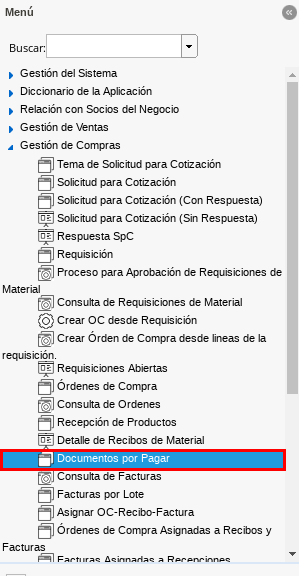
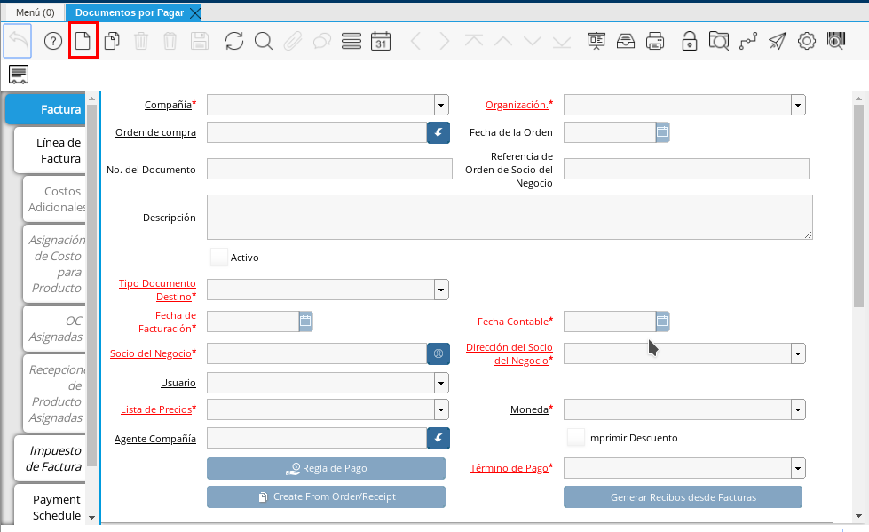
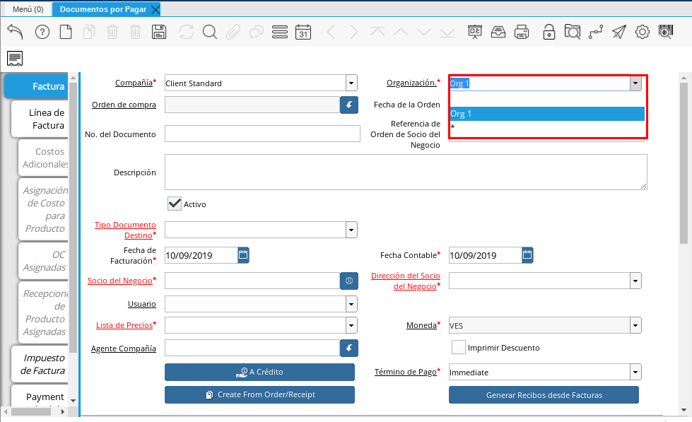
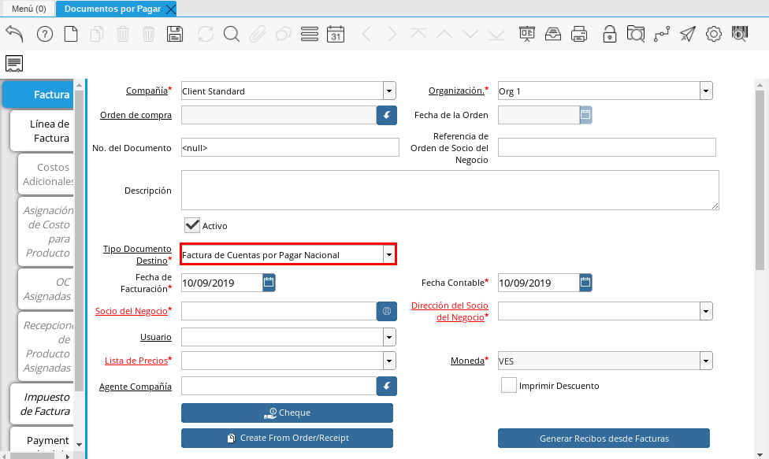
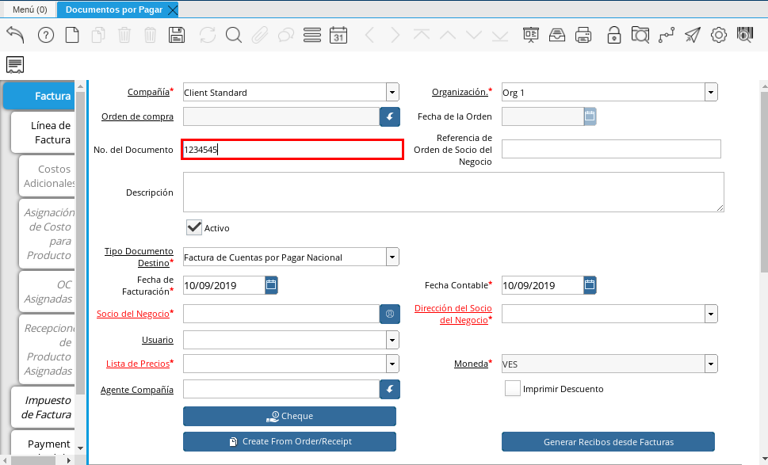
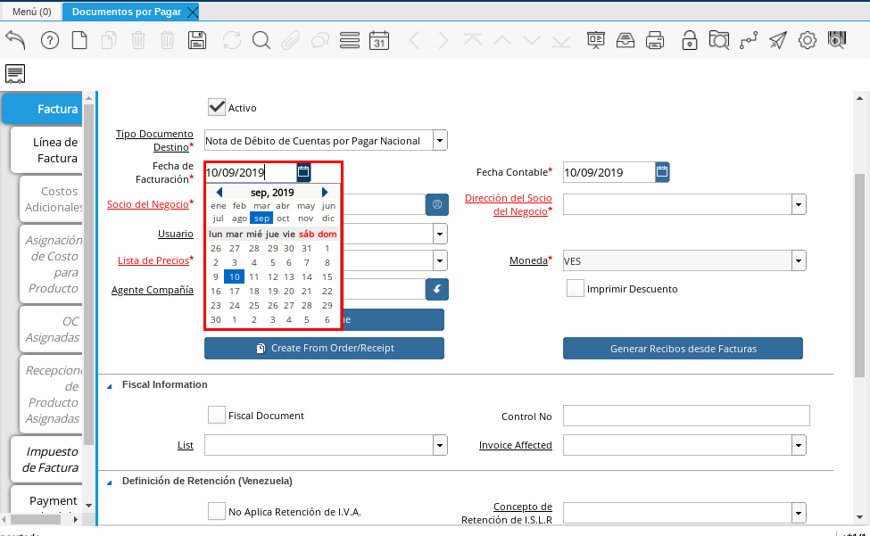
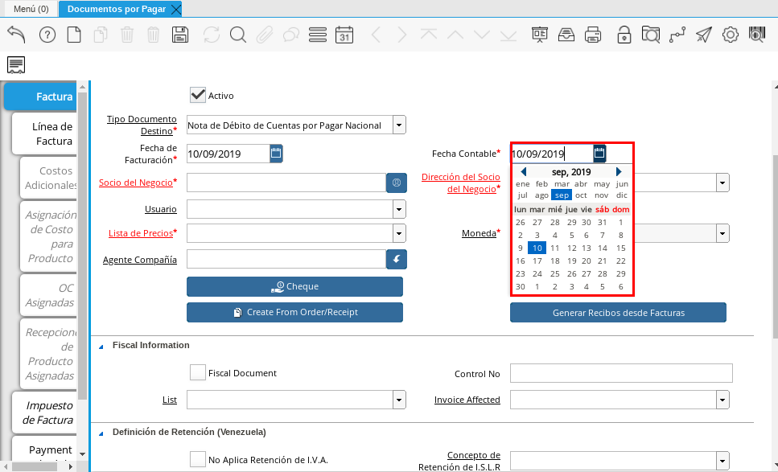
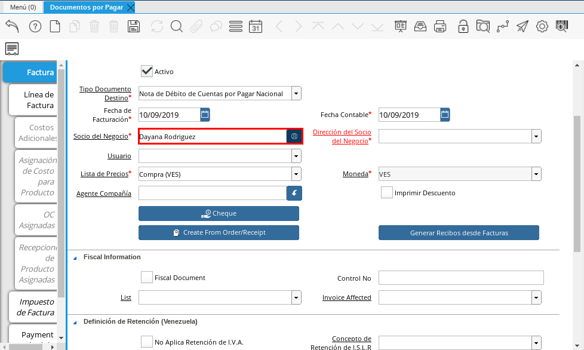
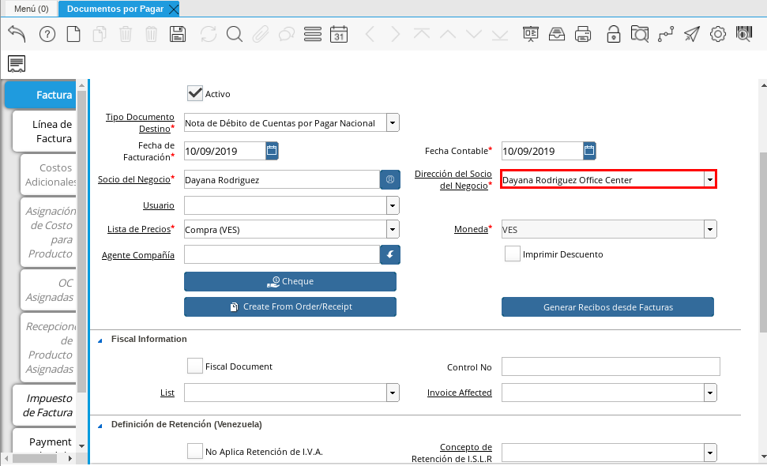
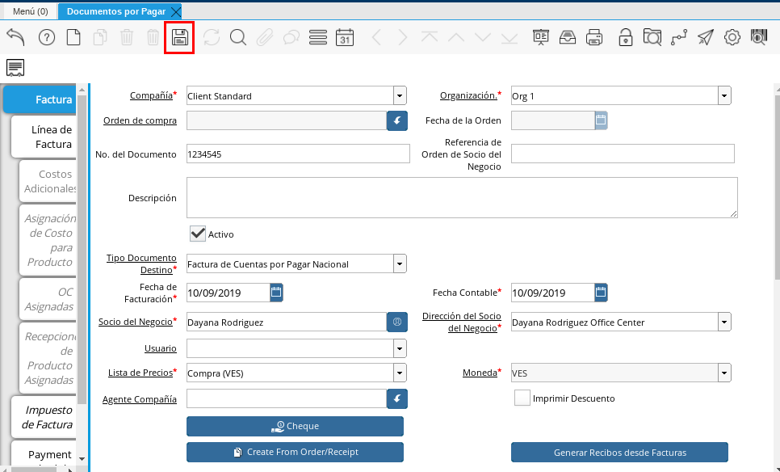
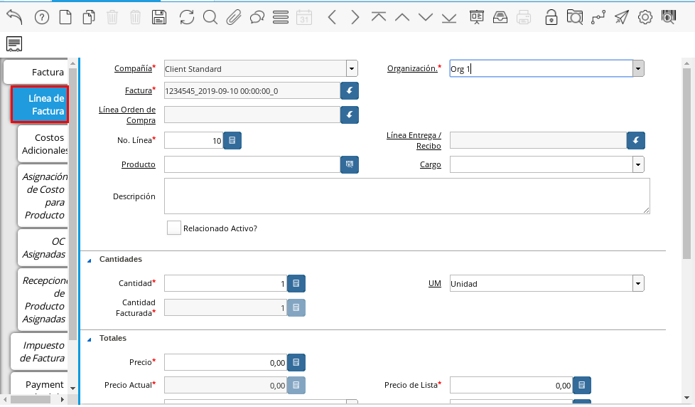
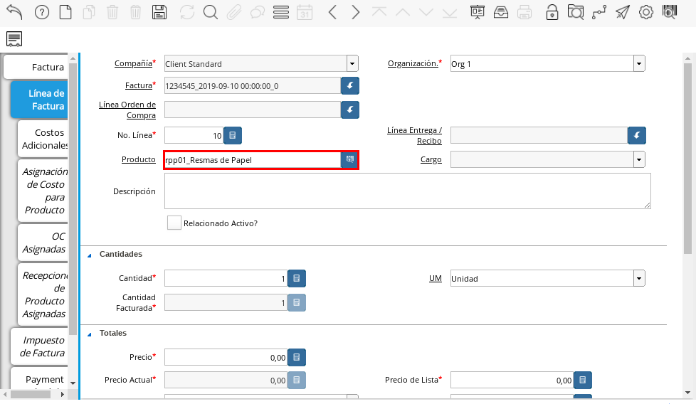
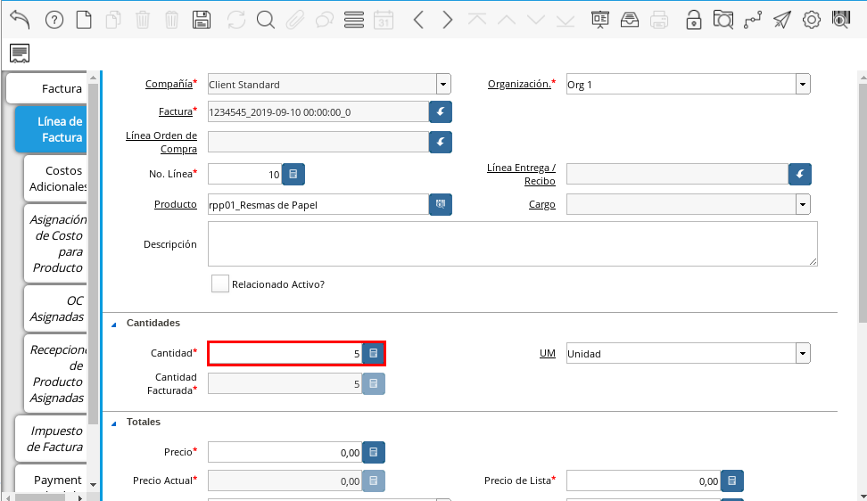
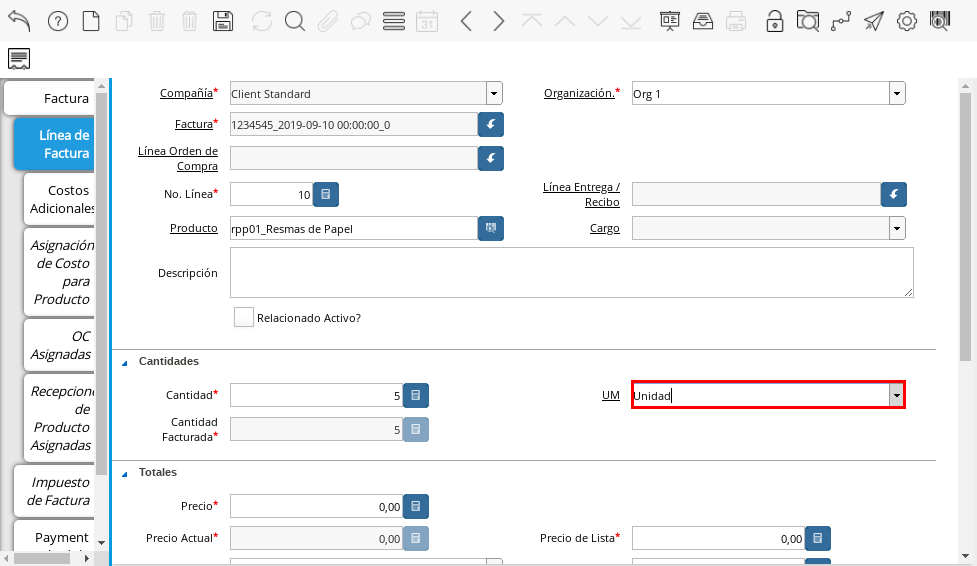
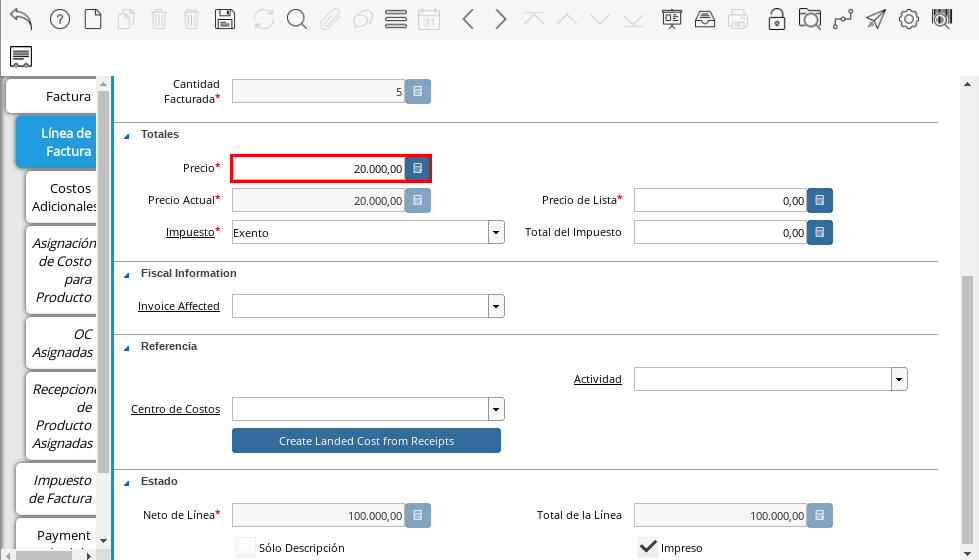
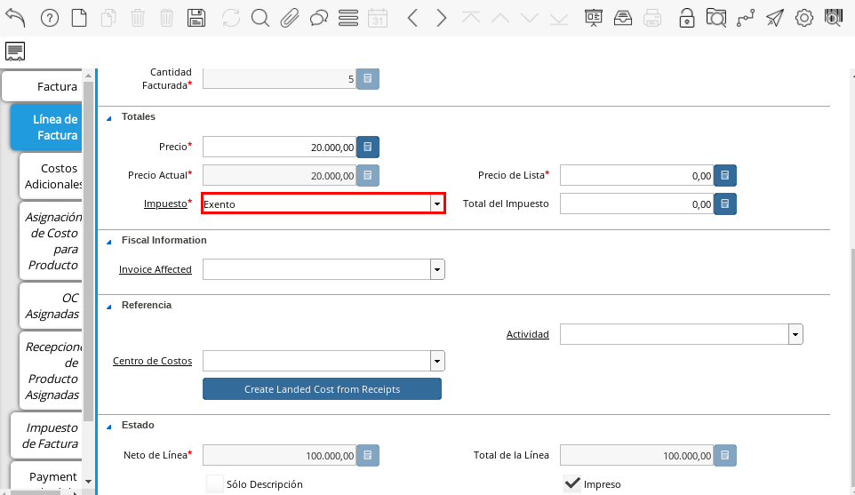
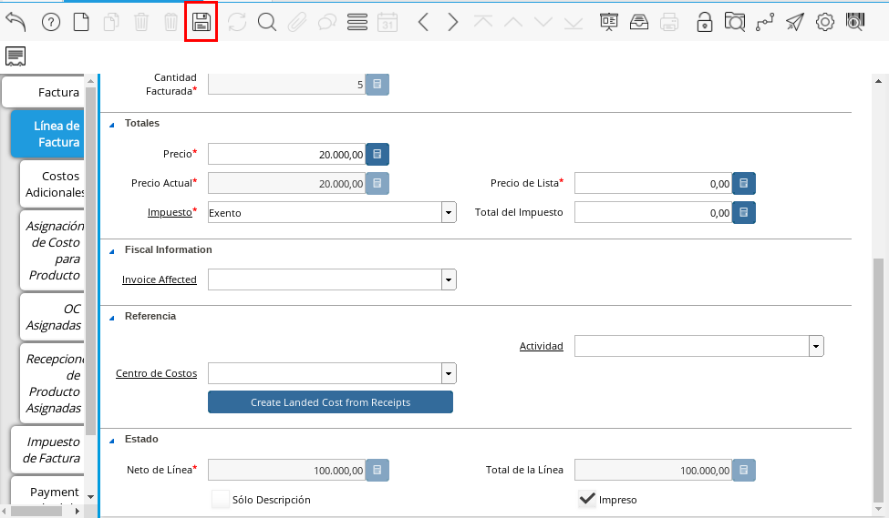
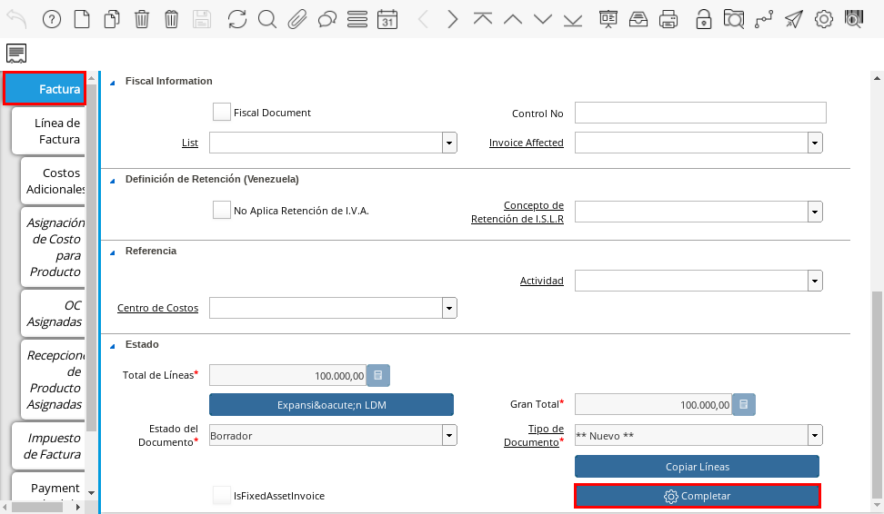
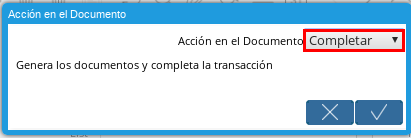

.. _documento/documento-por-pagar:

**Registro de Documento por Pagar**
===================================

#. Ubique en el menú de ADempiere la carpeta "**Gestión de Compras**", luego seleccione la ventana "**Documentos por Pagar**", adjunto imagen para referencia.

   |Menú de ADempiere|

   Imagen 1. Menú de ADempiere

#. Seleccione la opción "**Registro Nuevo**" en la barra de herramientas de ADempiere, para crear un documento nuevo.

   |Icono de Registro Nuevo|

   Imagen 2. Registro Nuevo

   #. Seleccione en el campo "**Organización**", la organización para la cual se esta realizando el documento por pagar de productos o servicios, el valor en el mismo debe ser diferente del símbolo (*).

      |Campo Organización|

      Imagen 3. Campo Organización

   #. Seleccione el tipo de documento a generar en el campo "**Tipo de Documento Destino**", la selección de este define el comportamiento del documento que se esta elaborando, dicho comportamiento se encuentra explicado en el documento :ref:`documento/tipo-documento` elaborado por `ERPyA`_.
   
      |Campo Tipo de Documento|

      Imagen 4. Campo Tipo de Documento

   #. Introduzca el número del documento en el campo "**No. de Documento**", el mismo no es obligatorio ya que ADempiere genera un número de secuencia automáticamente al ser guardado el registro del documento.

      |Campo Numero de Documento|

      Imagen 5. Campo Número de Documento

   #. Seleccione en el campo "**Fecha Facturación**", la fecha que posee el documento por pagar en físico.

      |Campo Fecha de Facturación|

      Imagen 6. Campo Fecha Facturación

   #. Seleccione en el campo "**Fecha Contable**", la fecha en la cual se esta realizando el documento por pagar en ADempiere.

      |Campo Fecha Contable|

      Imagen 7. Campo Fecha Contable

   #. Seleccione el socio del negocio proveedor en el campo "**Socio del Negocio**".

      |Campo Socio del Negocio|

      Imagen 8. Campo Socio del Negocio

   #. Seleccione la dirección del socio del negocio en el campo "**Dirección del Socio del Negocio**".

      |Campo Dirección del Socio del Negocio|

      Imagen 9. Campo Dirección del Socio del Negocio

#. Seleccione el icono "**Guardar**" de la barra de herramientas de ADempiere, para guardar los cambios realizados. 

   |Icono Guardar Cambios|

   Imagen 10. Guardar Cambios

#. Seleccione la pestaña "**Línea de Factura**" y proceda al llenado de los campos correspondientes.

   |Linea de Factura|

   Imagen 11. Línea de Factura

   #. Seleccione en el campo "**Producto**", el producto o servicio comprado.

      |Campo Producto|

      Imagen 12. Campo Producto

   #. Seleccione en el campo "**Cantidad**", la cantidad comprada del producto seleccionado.

      |Campo Cantidad|

      Imagen 13. Campo Cantidad

   #. Seleccione en el campo "**UM**", la unidad de medida del producto seleccionado.

      |Campo UM|

      Imagen 14. Campo UM

   #. Introduzca en el campo "**Precio**", el precio unitario del producto.

      |Campo Precio|

      Imagen 15. Campo Precio

   #. Seleccione en el campo "**Impuesto**", el impuesto a aplicar al documento.

      |Campo Impuesto|

      Imagen 16. Campo Impuesto

#. Guarde los cambios realizados seleccionando el icono "**Guardar**" de la barra de herramientas de ADempiere.

   |Icono Guardar Cambios de Linea de Factura|

   Imagen 17. Guardar Cambios

#. Regrese a la ventana principal "**Factura**" y seleccione la opción "**Completar**" ubicada en la parte inferior derecha del documento por pagar.

   |Ventana Factura y Opción Completar|

   Imagen 18. Opción Completar

#. Seleccione la acción "**Completar**" y la opción "**OK**" para completar el documento.

   |Completar Documento|

   Imagen 19. Completar Documento
