.. _ERPyA: http://erpya.com
.. |menú de adempiere| image:: resources/product-reception-menu.png
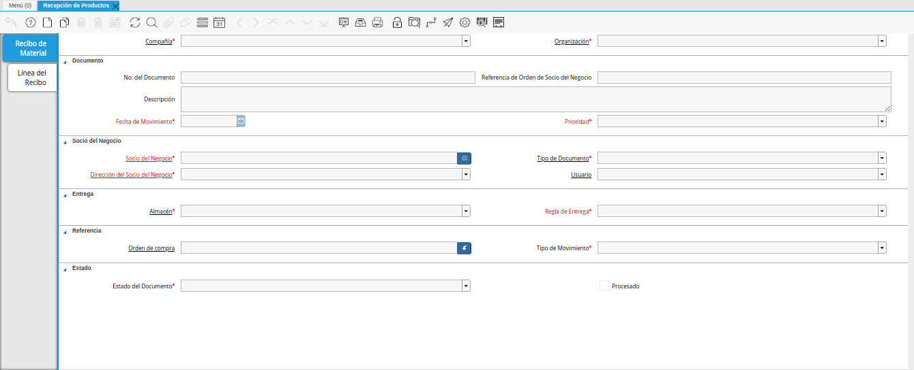

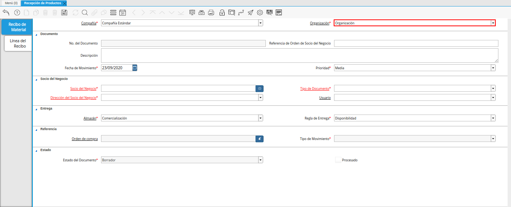
.. |campo nro del documento de la ventana recepción de productos| image:: resources/document-field-number-of-the-product-receipt-window.png
.. |campo referencia de orden de socio del negocio de la ventana recepción de productos| image:: resources/business-partner-order-reference-field-of-product-receipt-window.png
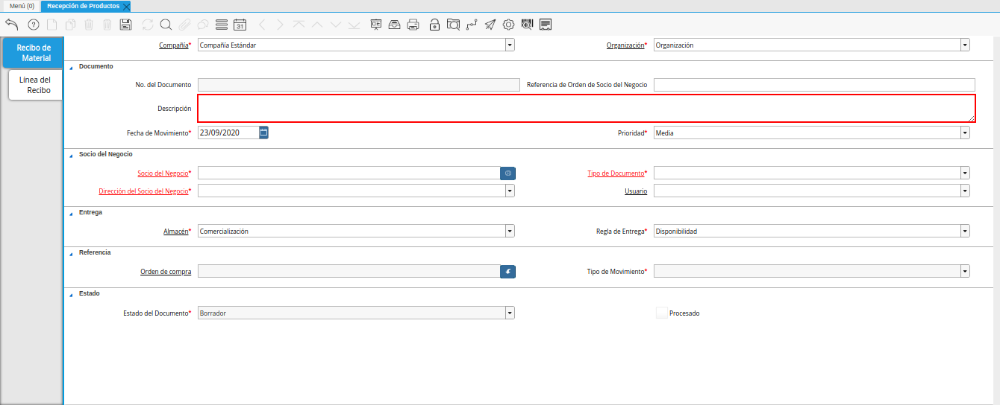
.. |campo fecha de movimiento de la ventana recepción de productos| image:: resources/movement-date-field-of-the-product-receipt-window.png
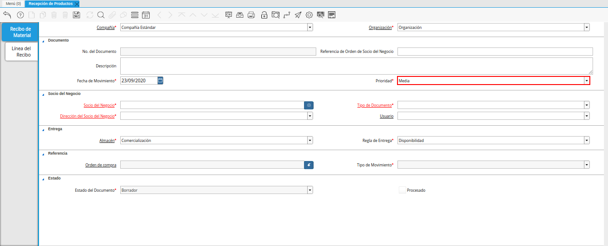
.. |campo socio del negocio de la ventana recepción de productos| image:: resources/business-partner-field-of-product-receipt-window.png
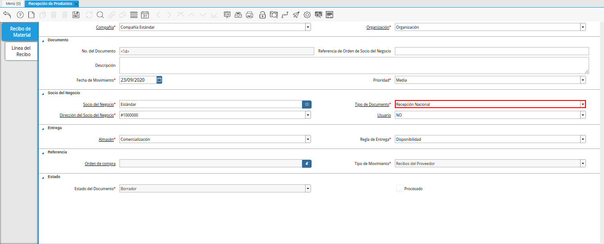
.. |campo dirección del socio del negocio de la ventana recepción de productos| image:: resources/business-partner-address-field-of-the-product-receipt-window.png
.. |campo usuario de la ventana recepción de productos| image:: resources/user-field-of-the-product-reception-window.png
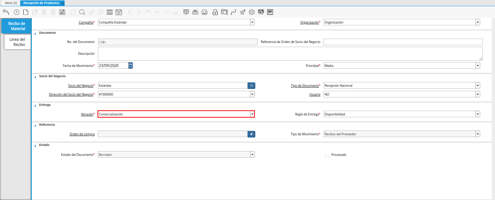
.. |campo regla de entrega de la ventana recepción de productos| image:: resources/delivery-rule-field-of-the-product-receipt-window.png
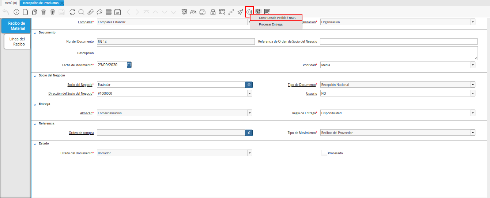
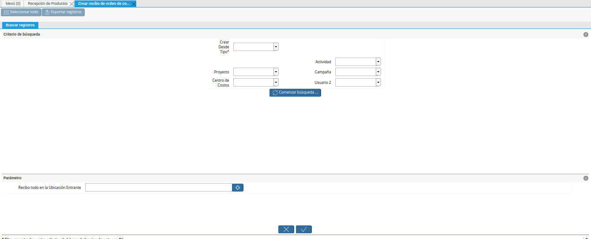
.. |campo crear desde tipo de la ventana crear recibo de orden de compra o rma| image:: resources/field-create-from-window-type-create-purchase-order-receipt-or-signature.png
.. |campo orden de venta de la ventana crear recibo de orden de compra o rma| image:: resources/sales-order-field-of-the-create-purchase-order-receipt-or-signature-window.png
.. |opcion comenzar busqueda de la ventana crear recibo de orden de compra o rma| image:: resources/option-start-window-search-create-purchase-order-receipt-or-rma.png
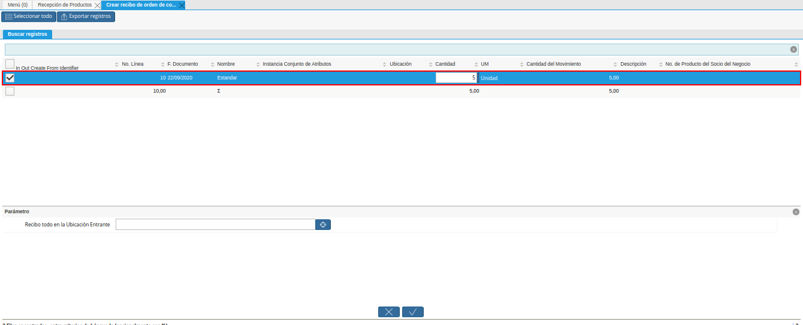
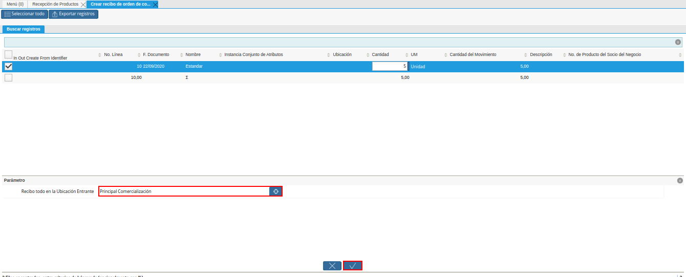
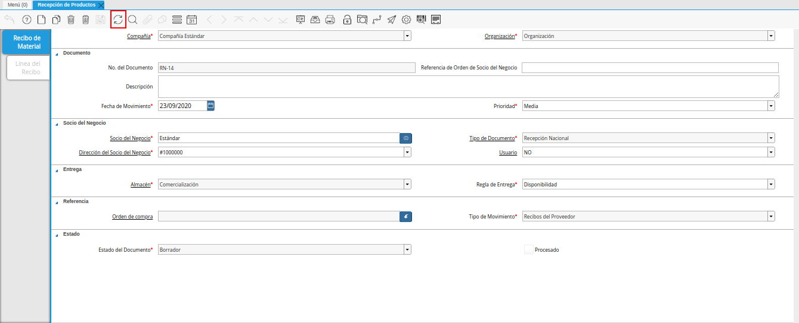
.. |campo orden de compra de la ventana recepción de productos| image:: resources/purchase-order-field-of-the-product-receipt-window.png
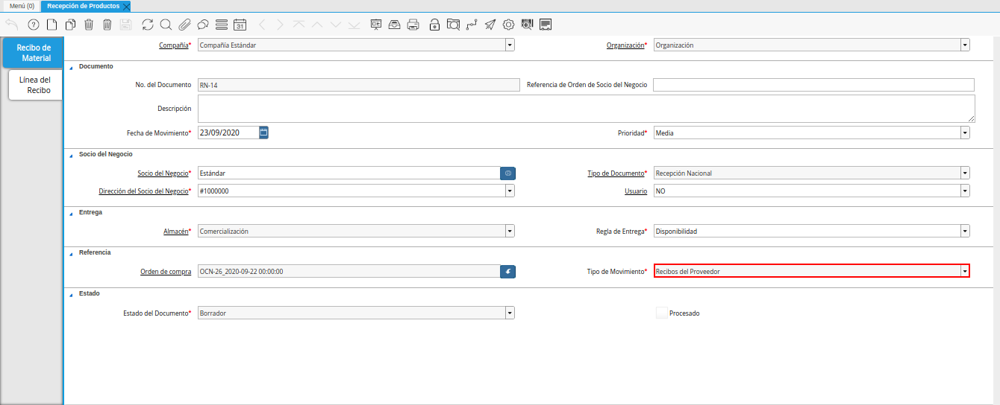
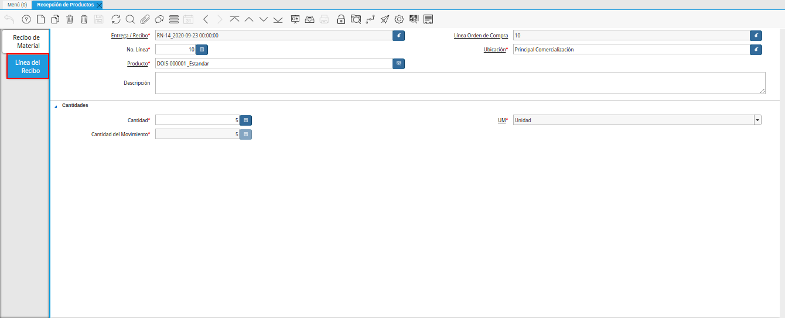
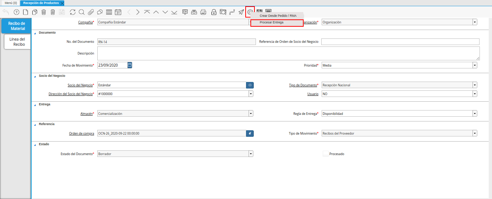
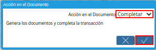

.. _documento/recepción-desde-orden:

**Registro de Recepción Desde Orden**
=====================================

#. Ubique en el menú de ADempiere la carpeta "**Gestión de Compras**", luego seleccione la ventana "**Recepción de Productos**", adjunto imagen para referencia.

    |menú de adempiere|

    Imagen 1. Menú de ADempiere

#. Podrá visualizar la ventana "**Recepción de Productos**", con todos los registros de recepciones en ADempiere.

    |ventana recepción de productos|

    Imagen 2. Ventana Recepción de Productos

#. Seleccione la opción "**Registro Nuevo**" en la barra de herramientas de ADempiere, para crear un documento nuevo.

    |icono de registro nuevo de la ventana recepción de productos|

    Imagen 3. Registro Nuevo

    #. Seleccione en el campo "**Organización**", la organización para la cual se esta realizando el documento de recepción de productos, el valor en el mismo debe ser diferente del símbolo (*).

        |campo organización de la ventana recepción de productos|

        Imagen 4. Campo Organización

    #. En el campo "**No. de Documento**", no es necesario ingresarlo en forma manual, al momento de realizar un registro, ADempiere genera un número de secuencia automáticamente para el documento, al seleccionar la opción guardar del nuevo registro de la recepción de productos.

        |campo nro del documento de la ventana recepción de productos|

        Imagen 5. Campo No. del Documento

    #. Introduzca en el campo "**Referencia de Orden de Socio del Negocio**", la referencia de orden del socio del negocio.

        |campo referencia de orden de socio del negocio de la ventana recepción de productos|

        Imagen 6. Campo Referencia de Orden de Socio del Negocio

    #. En el campo "**Descripción**", introduzca una breve descripción referente a la recepción de productos que se está realizando, este campo es opcional.

        |campo descripción de la ventana recepción de productos|

        Imagen 7. Campo Descripción

    #. Seleccione en el campo "**Fecha de Movimiento**", la fecha en la que se recepcionaron los productos.

        |campo fecha de movimiento de la ventana recepción de productos|

        Imagem 8. Campo Fecha de Movimiento

    #. Seleccione la prioridad de la recepción en el campo "**Prioridad**", este campo indica la urgencia de los productos incluidos en el documento, sin embargo, el documento trae predeterminado la opción "**Media**".

        |campo prioridad de la ventana recepción de productos|

        Imagen 9. Campo Prioridad

    #. Seleccione en el campo "**Socio del Negocio**", el socio del negocio proveedor del cual se estan recibiendo los productos.

        |campo socio del negocio de la ventana recepción de productos|

        Imagen 10. Campo Socio del Negocio

    #. Seleccione el tipo de documento a generar en el campo "**Tipo de Documento**", la selección de este define el comportamiento del documento que se esta elaborando, dicho comportamiento se encuentra explicado en el documento "**Tipo de Documento**" elaborado por `ERPyA`_. 

        |campo tipo de documento de la ventana recepción de productos|

        Imagen 11. Campo Tipo de Documento

    #. Podrá visualizar en el campo "**Dirección del Socio del Negocio**", la dirección de localización del socio del negocio seleccionado.

        |campo dirección del socio del negocio de la ventana recepción de productos|

        Imagen 12. Campo Dirección del Socio del Negocio

    #. Podrá visualizar en el campo "**Usuario**", el usuario del socio del negocio seleccionado.

        |campo usuario de la ventana recepción de productos|

        Imagen 13. Campo Usuario

    #. Seleccione en el campo "**Almacén**", el almacén en que cual se guardarán los productos que se estan recibiendo.

        |campo almacén de la ventana recepción de productos|

        Imagen 14. Campo Almacén

    #. Seleccione en el campo "**Regla de Entrega**", la regla de entrega utilizada para la recepción de los productos.

        |campo regla de entrega de la ventana recepción de productos|

        Imagen 15. Campo Regla de Entrega

    .. note::

        Recuerde guardar el registro de los campos de la ventana antes de cambiar a otra pestaña, seleccionando el icono "**Guardar Cambios**" ubicado en la barra de herramientas de ADempiere.

#. Seleccione la opción "**Crear Desde Pedido/RMA**", generada al seleccionar el icono "**Proceso**", ubicado en la barra de herramientas de ADempiere.

    |opción crear desde pedido rma del icono proceso|

    Imagen 16. Opción Crear Desde Pedido/RMA

    #. Podrá visualizar la ventana "**Crear Recibo de Orden de Compra o RMA**", con diferentes campos que permiten al usuario filtrar la búsqueda de la información en base a lo requerido por el mismo.

        |ventana crear recibo de orden de compra o rma|

        Imagen 17. Ventana Crear Recibo de Orden de Compra o RMA

    #. Seleccione en el campo "**Crear Desde Tipo**", la opción "**Orden**" para crear la recepción desde la orden de compra.

        |campo crear desde tipo de la ventana crear recibo de orden de compra o rma|

        Imagen 18. Campo Crear Desde Tipo

    #. Seleccione en el campo "**Orden de Venta**", la orden de compra desde la cual se va a generar el documento de recepción.

        |campo orden de venta de la ventana crear recibo de orden de compra o rma|

        Imagen 19. Campo Orden de Venta

    #. Seleccione la opción "**Comenzar Búsqueda**", para filtrar la información en base a lo seleccionado en los campos anteriormente explicados.

        |opcion comenzar busqueda de la ventana crear recibo de orden de compra o rma|

        Imagen 20. Opción Comenzar Búsqueda

    #. Seleccione la orden de compra desde la cual requiere generar el documento de recepción.

        |seleccion de orden de compra de la ventana crear recibo de orden de compra o rma|

        Imagen 21. Selección de la Orden de Compra

    #. Seleccione en el campo "**Recibo todo en la Ubicación Entrante**", la ubicación en la cual se almacenará lo recepcionado. Luego seleccione la opción "**OK**" para cargar a la ventana "**Recepción de Productos**" la información de la orden de venta seleccionada.

        |ubicacion de recibo de la ventana crear recibo de orden de compra o rma|

        Imagen 22. Campo Recibo todo en la Ubicación Entrante

#. Seleccione el icono "**Refrescar**", para refrescar la ventana y cargar a la misma, la información de la orden de compra seleccionada. 

    |icono refrescar de la ventana recepción de productos|

    Imagen 23. Icono Refrescar

#. En el campo "**Orden de Compra**", se muestra la orden de compra relacionada a recepción de los productos.

    |campo orden de compra de la ventana recepción de productos|

    Imagen 24. Campo Orden de Compra

#. Podrá visualizar en el campo "**Tipo de Movimiento**", el método de movimiento de inventario correspondiente a la recepción de los productos.

    |campo tipo de movimiento de la ventana recepción de productos|

    Imagen 25. Campo Tipo de Movimiento

#. Para revisar y confirmar la información cargada desde la orden de compra, seleccione la pestaña "**Línea del Recibo**".

    |pestaña línea del recibo de la ventana recepción de productos|

    Imagen 26. Pestaña Línea del Recibo

#. Regrese a la pestaña principal "**Recibo de Material**"  y seleccione la opción "**Procesar Orden**", desplegada por el icono "**Proceso**", ubicado en la barra de herramientas de ADempiere.

    |opción procesar recepción en el icono proceso|

    Imagen 27. Opción Procesar Recepción en el Icono Proceso

#. Seleccione la acción "**Completar**" y la opción "**OK**", para completar el documento "**Recepción de Productos**".

    |Opción Completar|

    Imagen 28. Opción Completar
