.. _ERPyA: http://erpya.com
.. |menú de adempiere| image:: resources/purchase-order-menu.png
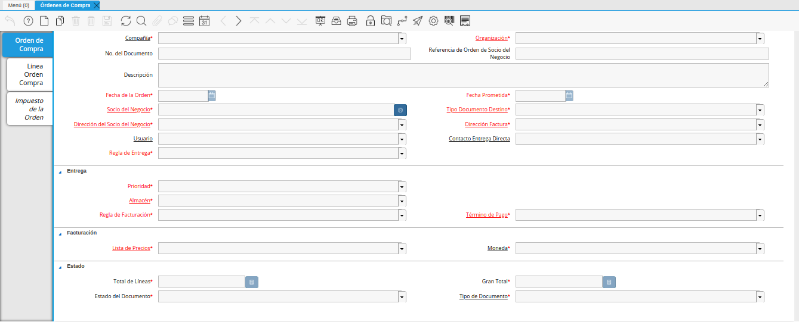
.. |icono de registro nuevo de la ventana órdenes de compra| image:: resources/new-record-icon-in-the-purchase-orders-window.png
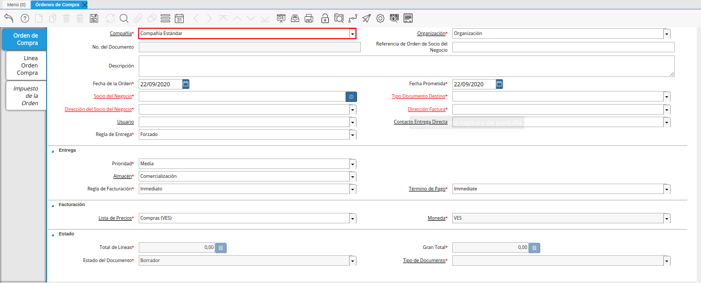
.. |campo organización de la ventana órdenes de compra| image:: resources/organization-field-of-the-purchase-orders-window.png
.. |campo nro del documento de la ventana órdenes de compra| image:: resources/document-number-field-of-the-purchase-orders-window.png
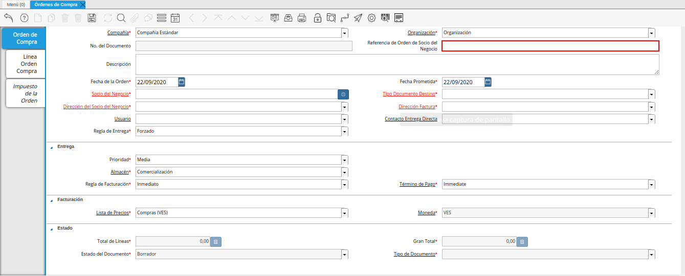
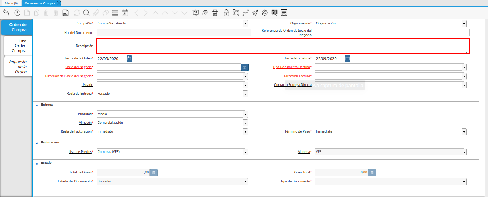
.. |campo fecha de la orden de la ventana órdenes de compra| image:: resources/order-date-field-of-the-purchase-orders-window.png
.. |campo fecha prometida de la ventana órdenes de compra| image:: resources/promised-date-field-of-the-purchase-orders-window.png
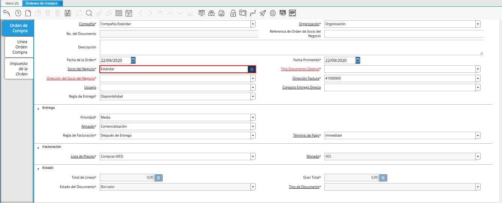
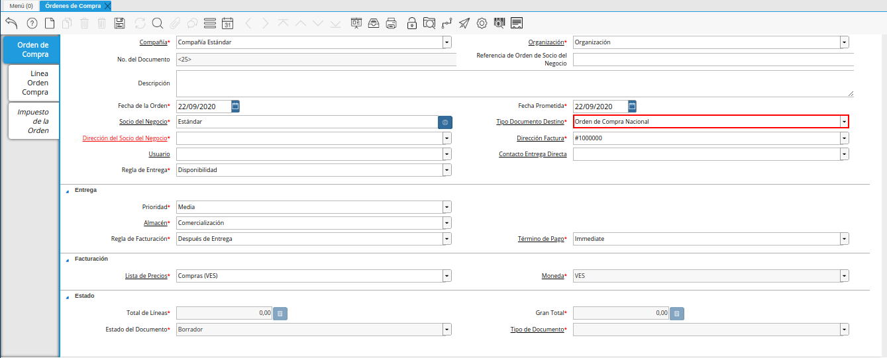
.. |campo dirección del socio del negocio de la ventana órdenes de compra| image:: resources/business-partner-address-field-of-the-purchase-orders-window.png
.. |campo dirección factura de la ventana órdenes de compra| image:: resources/invoice-address-field-of-the-purchase-orders-window.png
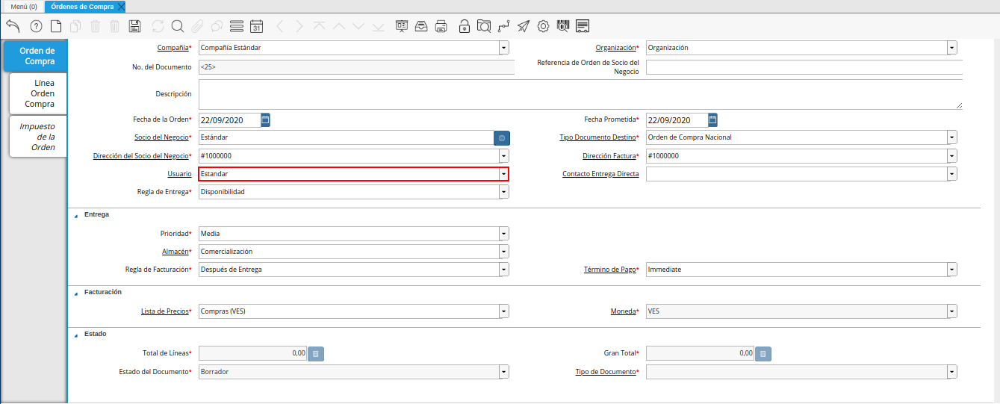
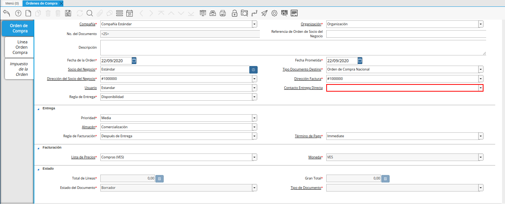
.. |campo regla de entrega de la ventana órdenes de compra| image:: resources/delivery-rule-field-of-the-purchase-orders-window.png
.. |campo prioridad de la ventana órdenes de compra| image:: resources/priority-field-of-the-purchase-orders-window.png
.. |campo almacen de la ventana órdenes de compra| image:: resources/warehouse-field-of-the-purchase-orders-window.png
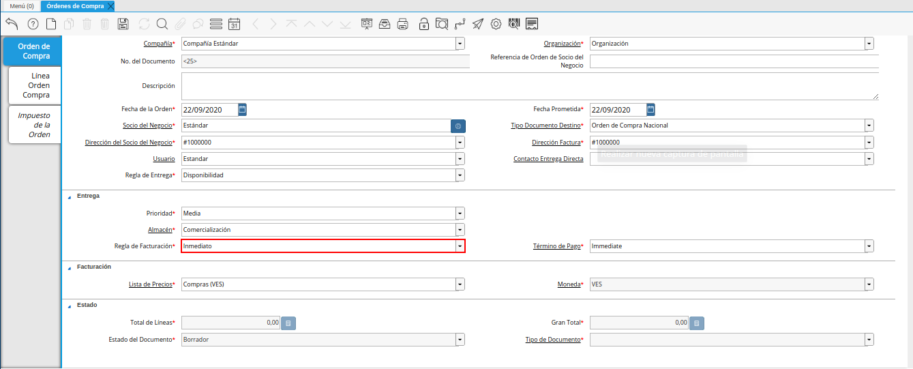
.. |campo término de pago de la ventana órdenes de compra| image:: resources/payment-term-field-of-the-purchase-orders-window.png
.. |campo lista de precios de la ventana órdenes de compra| image:: resources/price-list-field-of-the-purchase-orders-window.png
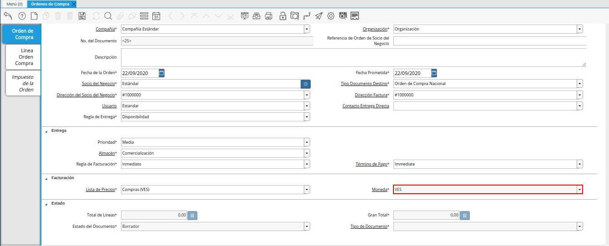
.. |línea de la orden de compra de la ventana órdenes de compra| image:: resources/purchase-order-line-in-the-purchase-orders-window.png
.. |campo producto de la ventana órdenes de compra| image:: resources/product-field-of-the-purchase-orders-window.png
.. |campo cargo de la ventana órdenes de compra| image:: resources/charge-field-of-the-purchase-orders-window.png
.. |campo cantidad de la ventana órdenes de compra| image:: resources/quantity-field-of-the-purchase-orders-window.png
.. |campo unidad de medida de la ventana órdenes de compra| image:: resources/unit-of-measure-field-of-the-purchase-orders-window.png
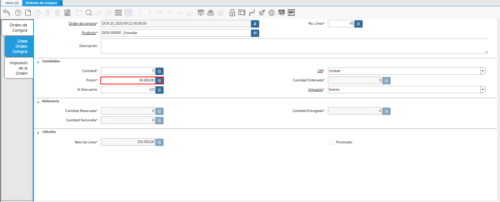
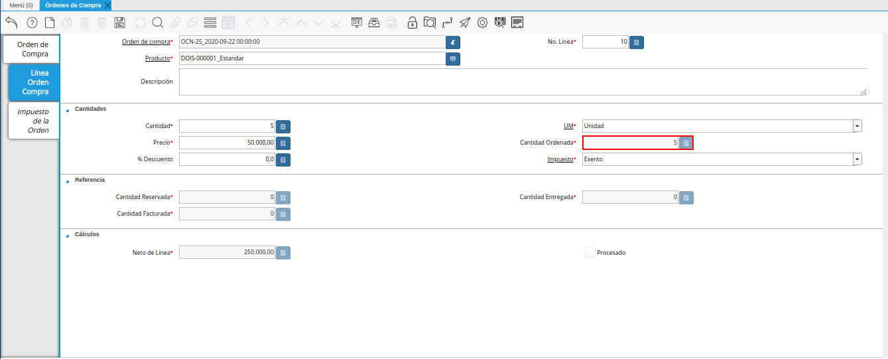
.. |campo descuento de la ventana órdenes de compra| image:: resources/discount-field-of-the-purchase-orders-window.png
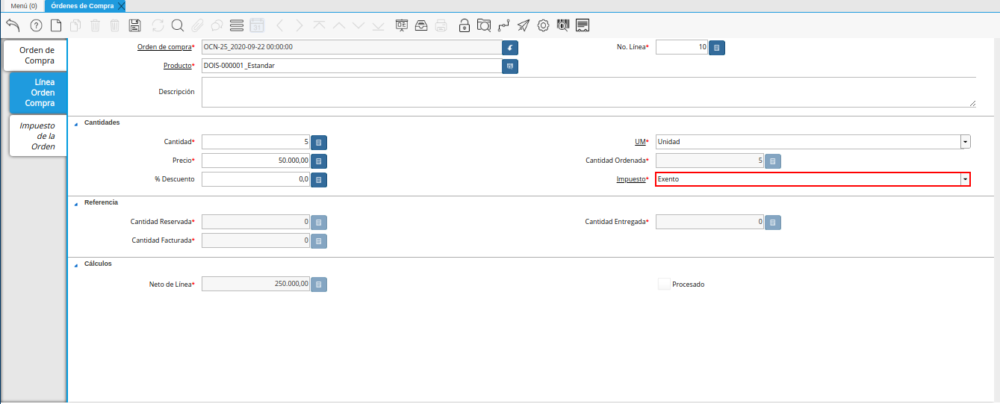
.. |campo cantidad reservada de la ventana órdenes de compra| image:: resources/reserved-quantity-field-of-the-purchase-orders-window.png
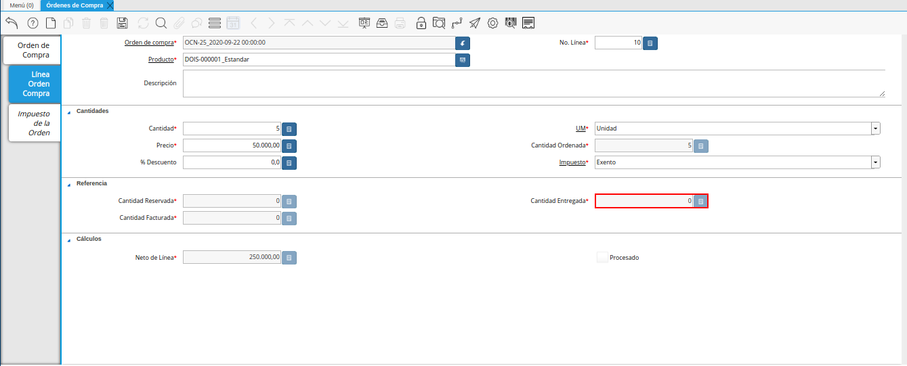
.. |campo cantidad facturada de la ventana órdenes de compra| image:: resources/invoiced-quantity-field-of-the-purchase-orders-window.png
.. |campo neto de línea de la ventana órdenes de compra| image:: resources/net-field-of-purchase-order-window-line.png
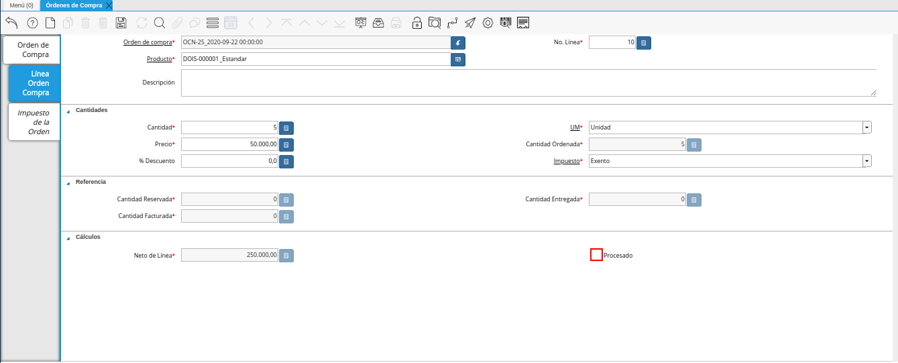
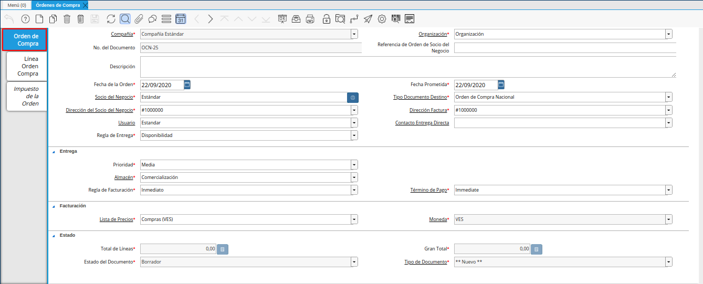
.. |campo total de líneas| image:: resources/total-field-of-lines.png
.. |campo gran total| image:: resources/grand-total-field.png
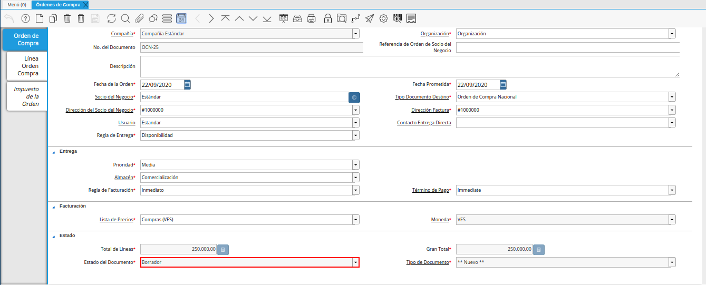
.. |campo tipo de documento| image:: resources/document-type-field.png
.. |opción procesar orden en el icono proceso| image:: resources/option-process-order-in-process-icon.png
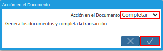

.. _documento/orden-de-compra:

**Registro de Orden de Compra Directa**
=======================================

Una Orden de Compra en ADempiere, es un tipo de documento emitido por la empresa para realizar pedidos a sus diferentes proveedores. En ella se detalla: la cantidad a comprar, el tipo de producto, precio y condiciones de pago, así como también la forma de entrega.

Para el registro de un documento en ADempiere debe tener en cuenta que existen campos que son de carácter obligatorio, estos campos están identificados con el carácter especial: (*) de color rojo.

.. warning::

    Asegúrese de que cada campo que se encuentre identificado como carácter obligatorio, contenga la información requerida, de lo contrario no podrá completar el registro.

#. Ubique en el menú de ADempiere la carpeta "**Gestión de Compras**", luego seleccione la ventana "**Órdenes de Compra**", adjunto imagen para referencia.

    |menú de adempiere|

    Imagen 1. Menú de ADempiere

#. Podrá visualizar la ventana "**Órdenes de Compra**", con los diferentes registros que contiene dicha ventana.

    |ventana órdenes de compra|

    Imagen 2. Ventana Órdenes de Compra

#. Seleccione el icono "**Registro Nuevo**" en la barra de herramientas de ADempiere para crear un nuevo documento.

    |icono de registro nuevo de la ventana órdenes de compra|

    Imagen 3. Registro Nuevo

    #. Seleccione en el campo "**Compañía**", el nombre de la compañía de la cual se emite el documento "**Orden de Compra**".

        |campo compañía de la ventana órdenes de compra|

        Imagen 4. Campo Compañía

    #. Seleccione en el campo "**Organización**", el nombre de la organización de la cual se está emitiendo el documento "**Orden de Compra**".

        |campo organización de la ventana órdenes de compra|

        Imagen 5. Campo Organización

    .. warning::

        El valor en el campo organización debe ser diferente del símbolo (*) ya que éste símbolo hace referencia a todas las organizaciones.

    #. En el campo "**No. de Documento**", no es necesario ingresarlo en forma manual, al momento de realizar un registro, ADempiere genera un número de secuencia automáticamente para el documento, al seleccionar la opción guardar del nuevo registro de orden de compra.

        |campo nro del documento de la ventana órdenes de compra|

        Imagen 6. Campo No. del Documento

    #. Introduzca en el campo "**Referencia de Orden de Socio del Negocio**", la referencia de orden del socio del negocio.

        |campo referencia de orden de socio del negocio de la ventana órdenes de compra|

        Imagen 7. Campo Referencia de Orden de Socio del Negocio

    #. En el campo "**Descripción**", Puede introduzca una breve descripción referente a la orden de compra que se está realizando, este campo es opcional.

        |campo descripción de la ventana órdenes de compra|

        Imagen 8. Campo Descripción

    #. Seleccione en el campo "**Fecha de la Orden**", la fecha de elaboración del documento "**Orden de Compra**".

        |campo fecha de la orden de la ventana órdenes de compra|

        Imagen 9. Campo Fecha de la Orden

    #. Seleccione en el campo "**Fecha Prometida**", la fecha de entrega de la orden, prometida por el proveedor.

        |campo fecha prometida de la ventana órdenes de compra|

        Imagen 10. Campo Fecha Prometida

    #. En el campo "**Socio del Negocio**", debe seleccionar el nombre del socio del negocio (proveedor) al que se le emite el documento "**Orden de Compra**".

        |campo socio del negocio de la ventana órdenes de compra|

        Imagen 11. Campo Socio del Negocio

    #. Seleccione el tipo de documento a generar, en el campo "**Tipo de Documento Destino**", la selección de éste define el comportamiento del documento que se está elaborando, dicho comportamiento se encuentra definido en el documento "**Tipo de Documento**" elaborado por `ERPyA`_

        |campo tipo de documento destino de la ventana órdenes de compra|

        Imagen 12. Campo Tipo de Documento Destino

    #. Si el socio del negocio, tiene más de una dirección registrada, debe seleccionar la dirección del socio del negocio, caso contrario, si posee dirección única, esta información se refleja automáticamente en el campo "**Dirección del Socio del Negocio**" una vez haya seleccionado el nombre del socio de negocio.

        |campo dirección del socio del negocio de la ventana órdenes de compra|

        Imagen 13. Campo Dirección del Socio del Negocio

    #. Si el socio de negocio, tiene más de una dirección a facturar registrada, debe seleccionar la dirección a facturar del socio del negocio, caso contrario, si posee dirección única, esta información se refleja automáticamente en el campo "**Dirección Factura**" una vez haya seleccionado el nombre del socio de negocio.

        |campo dirección factura de la ventana órdenes de compra|

        Imagen 14. Campo Dirección Factura

    #. Seleccione en el campo "**Usuario**", el usuario del socio del negocio.

        |campo usuario de la ventana órdenes de compra|

        Imagen 15. Campo Usuario

    #. Seleccione en el campo "**Contacto de Entrega Directa**", el contacto del socio del negocio establecido para la entrega.

        |campo contacto de entrega directa de la ventana órdenes de compra|

        Imagen 16. Campo Contacto de Entrega Directa

    #. Seleccione en el campo "**Regla de Entrega**", la regla establecida para la entrega de los productos.

        |campo regla de entrega de la ventana órdenes de compra|

        Imagen 17. Campo Regla de Entrega

    #. Seleccione la prioridad de la orden en el campo "**Prioridad**", este campo indica la urgencia de los productos o servicios que se están ordenando en el documento, sin embargo, el documento trae predeterminado la opción "**Media**".

        |campo prioridad de la ventana órdenes de compra|

        Imagen 18. Campo Prioridad

    #. Seleccione en el campo "**Almacén**, en el cual se requiere el producto o servicio (Es de Carácter Obligatorio).

        |campo almacen de la ventana órdenes de compra|

        Imagen 19. Campo Almacén

    #. Seleccione en el campo "**Regla de Facturación**", la regla establecida para la facturación de los productos.

        |campo regla de facturación de la ventana órdenes de compra|

        Imagen 20. Campo Regla de Facturación

    #. Seleccione en el campo "**Término de pago**", indica las condiciones, método y tiempo de pago de la compra.

        |campo término de pago de la ventana órdenes de compra|

        Imagen 21. Campo Término de Pago

    #. Seleccione en el campo "**Lista de Precios**", la lista de precios utilizada para la compra. 
    
        Esta siempre debe ser "**Compras**" y determina el precio, margen y costo de los artículos comprados.

        |campo lista de precios de la ventana órdenes de compra|

        Imagen 22. Campo Lista de Precios

    #. La "**Moneda**", dependerá del "**Tipo de Documento**" seleccionado, es decir, si el tipo de documento es: "**Orden de Compra Nacional**" la moneda será (VES) moneda nacional en curso. Caso contrario, "**Orden de Compra Importación**" la moneda será, cualquier moneda extranjera que sea utilizada por la compañía para realizar este tipo de compras, ejemplo: (USD, EUR, COP, entre otros).

        |campo moneda de la ventana órdenes de compra|

        Imagen 23. Campo Moneda

    .. warning::

        Recuerde guardar el registro de la ventana, seleccionando el icono "**Guardar Cambios**" ubicado en la barra de herramientas, una vez guardado el nuevo registro, podrá avanzar a la pestaña "**Línea Orden Compra**".

#. Seleccione la pestaña "**Línea Orden Compra**" y proceda a seleccionar el "**Producto o Servicio**" a ordenar. Si la orden de compra contiene varios productos, el campo "**Nro. de Línea**", indicará el orden y despliegue de los mismos dentro del documento. Una vez que guarde el primer producto, deberá seleccionar el icono "**Registro Nuevo**", incrementando así el número de líneas por productos en el documento.

    .. warning::

        El campo "**Orden de Compra**", viene precargado de la pestaña principal "**Orden de Compra**".

    |línea de la orden de compra de la ventana órdenes de compra|

    Imagen 24. Línea Orden Compra

    #. Seleccione en el campo "**Producto**", el producto por el cual se encuentra realizando la transacción de compra.

        |campo producto de la ventana órdenes de compra|

        Imagen 25. Campo Producto

        .. note::

            Al seleccionar un producto, el campo "**Cargo**" automáticamente cambia a sólo lectura.

    #. Seleccione en el campo "**Cargo**", el cargo por el cual se encuentra realizando la transacción de compra.

        |campo cargo de la ventana órdenes de compra|

        Imagen 26. Campo Cargo

        .. note::

            Al seleccionar un cargo, el campo "**Producto**" automáticamente cambia a sólo lectura.

    #. En la sección "**Cantidades**", se encuentra el siguiente grupo de campos: cantidad, unidad de medida, precio, cantidad ordenada, % descuento y impuesto.

        #. Seleccione en el campo "**Cantidad**", la cantidad a ordenar del producto o servicio seleccionado.
        
            El campo "**Cantidad**", indica la cantidad del producto en la compra.

            |campo cantidad de la ventana órdenes de compra|

            Imagen 27. Campo Cantidad

        #. Seleccione la unidad de medida del producto seleccionado en el campo "**UM**", esta puede ser unidad, gramos, kilos, toneladas, entre otras.
        
            El campo "**Unidad de Medida**, indica la unidad de medida del producto ordenado.

            |campo unidad de medida de la ventana órdenes de compra|

            Imagen 28. Campo Unidad de Medida

        #. Introduzca el precio unitario del producto seleccionando en el campo "**Precio**", este precio es el establecido por el socio del negocio proveedor.
        
            El campo "**Precio**", está basado en la unidad de medida.

            |campo precio de la ventana órdenes de compra|

            Imagen 29. Campo Precio

        #. El campo "**Cantidad Ordenada**", indica la cantidad de un producto que fue ordenada.

            |campo cantidad ordenada de la ventana órdenes de compra|

            Imagen 30. Campo Cantidad Ordenada

        #. Introduzca en el campo "**% Descuento**", el descuento aplicado a la compra.
        
            El campo "**% Descuento**", indica el descuento aplicado o tomado como un porcentaje.

            |campo descuento de la ventana órdenes de compra|

            Imagen 31. Campo Descuento

        #. Seleccione el impuesto en el campo "**Impuesto**", este puede variar dependiendo del impuesto aplicable al producto seleccionado.
        
            El campo "**Impuesto**", indica el tipo de impuesto para esta línea del documento.

            |campo impuesto de la ventana órdenes de compra|

            Imagen 32. Campo Impuesto

    #. En la sección "**Referencia**", se encuentra el siguiente grupo de campos: cantidad reservada, cantidad entregada y cantidad facturada.

        .. warning::
        
            Los campos de la sección referencia, presentaran movimientos sólo sí se se han realizado para la orden de compra, más de una recepción, en relación a la cantidad total de la compra.

        #. El campo "**Cantidad Reservada**, indica la cantidad del producto que ha sido reservado para otras órdenes.

            |campo cantidad reservada de la ventana órdenes de compra|

            Imagen 33. Campo Cantidad Reservada

        #. El campo "**Cantidad Entregada**, indica la cantidad de un producto que ha sido entregado.

            campo cantidad entregada de la ventana órdenes de compra

            Imagen 34. Campo Cantidad Entregada

        #. El campo "**Cantidad Facturada**, indica la cantidad de un producto que ha sido facturado.

            |campo cantidad facturada de la ventana órdenes de compra|

            Imagen 35. Campo Cantidad Facturada

    #. En la sección "**Totales**" se encuentran los siguientes grupos de campos: neto de línea y procesado.

        #. El campo "**Neto de Línea**, podrá visualizar el total neto de la línea basado en la cantidad y el precio. Cualquier cargo adicional o flete no es incluido.

            El campo "**Neto de Línea**", indica el total neto de la línea (cantidad * precio) sin fletes ni cargos.

            |campo neto de línea de la ventana órdenes de compra|

            Imagen 36. Campo Neto de Línea

        #. El checklkist "**Procesado**, indica que un documento ha sido procesado.

            |campo procesado de la ventana órdenes de compra|

            Imagen 37. Campo Procesado

    .. warning::

        Recuerde guardar el registro de la pestaña "**Línea Orden Compra**" con el icono "**Guardar Cambios**" de la barra de herramientas de ADempiere, antes de cambiar a la ventana principal "**Orden de Compra**".

#. Regrese a la pestaña principal "**Orden de Compra**" para completar el documento que se e.ncuentra realizando.

    |pestaña orden de compra|

    Imagen 38. Pestaña Orden de Compra

#. Podrá visualizar en el grupo de campos "**Estado**", los siguientes campos: total de líneas, gran total, estado del documento y tipo de documento.

    #. El campo "**Total de Líneas**", indica el total de todas las líneas en la moneda del documento.

        |campo total de líneas|

        Imagen 39. Campo Total del Líneas

    #. El campo "**Gran Total**", indica el total del documento incluyendo impuestos y totales de fletes.

        |campo gran total|

        Imagen 40. Campo Gran Total

    #. El campo "**Estado del Documento**", indica el estado del documento en este momento, para cambiar el estado del documento utilice la opción "**Procesar Orden**", desplegada por el icono "**Proceso**", ubicado en la barra de herramientas de ADempiere.

        |campo estado del documento|

        Imagen 41. Campo Estado de Documento

    #. El campo "**Tipo de Documento**", indica el tipo de documento que determina la secuencia del documento o las reglas del proceso.

        |campo tipo de documento|

        Imagen 42. Campo Tipo de Documento

#. Seleccione la opción "**Procesar Orden**", desplegada por el icono "**Proceso**", ubicado en la barra de herramientas de ADempiere.

    |opción procesar orden en el icono proceso|

    Imagen 43. Opción Procesar Orden en el Icono Proceso

#. Seleccione la acción "**Completar**" y la opción "**OK**", para completar el documento "**Orden de Compra**".

    |Opción Completar|

    Imagen 44. Opción Completar
