.. _ERPyA: http://erpya.com
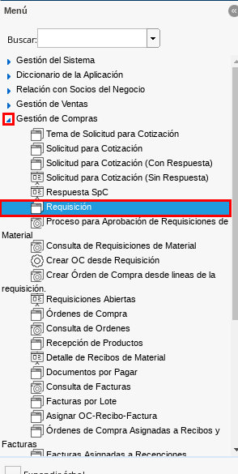

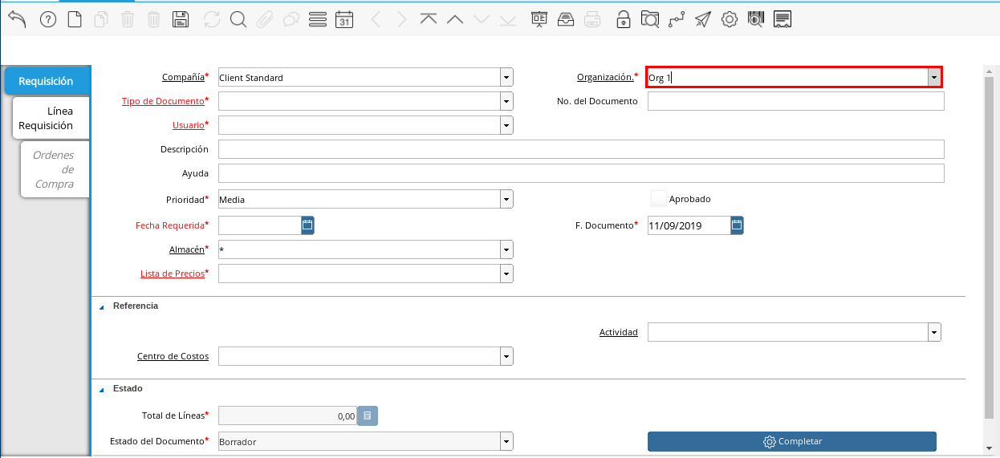
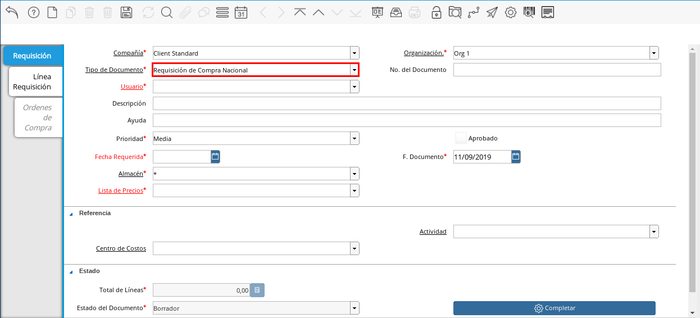
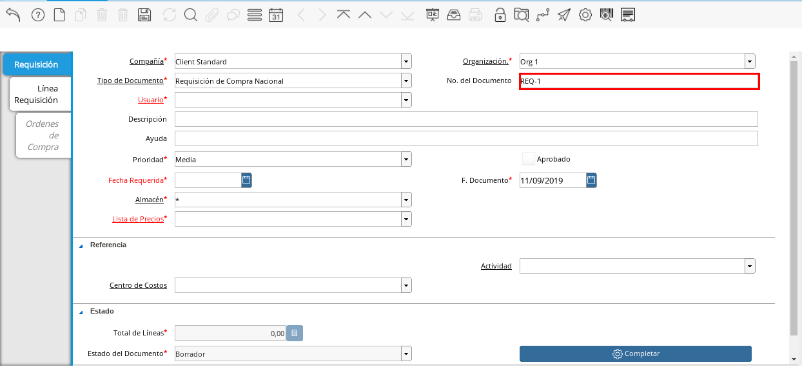
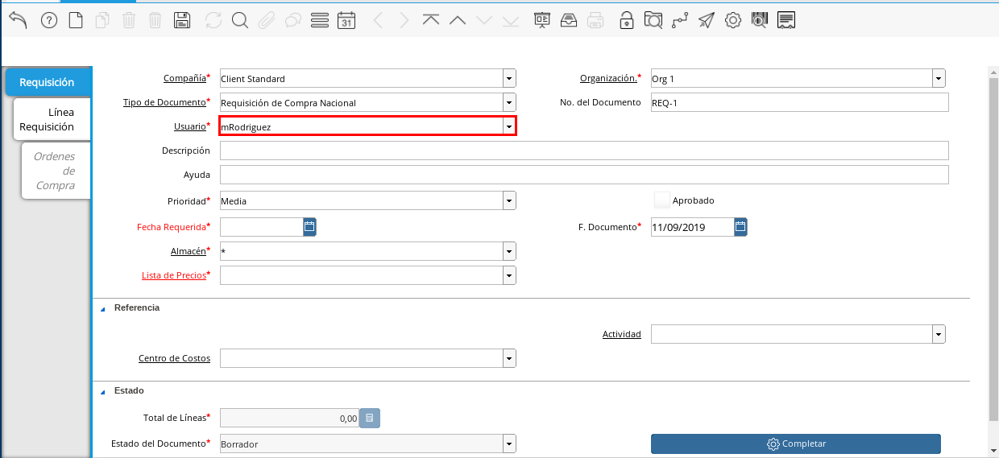
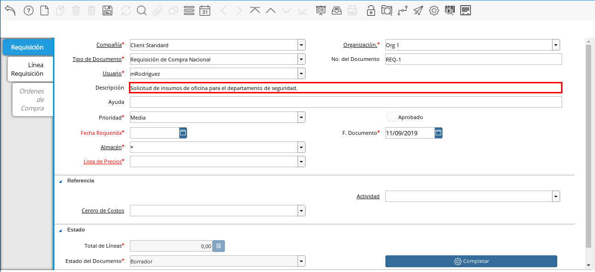
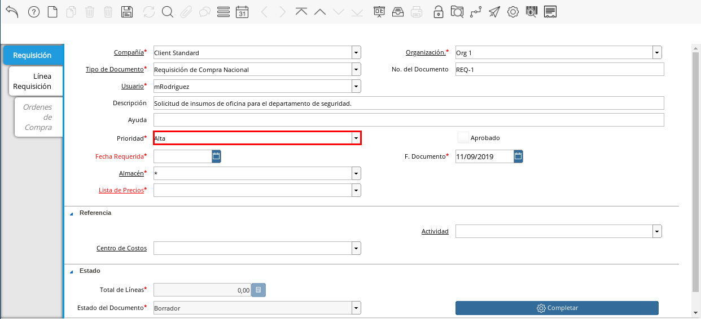
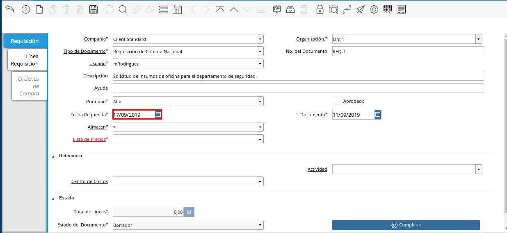
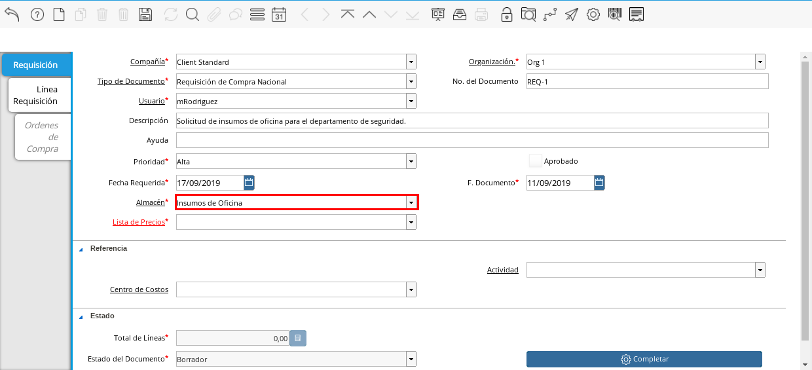
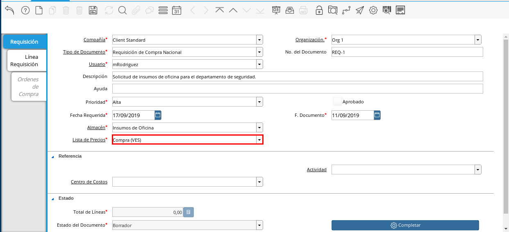
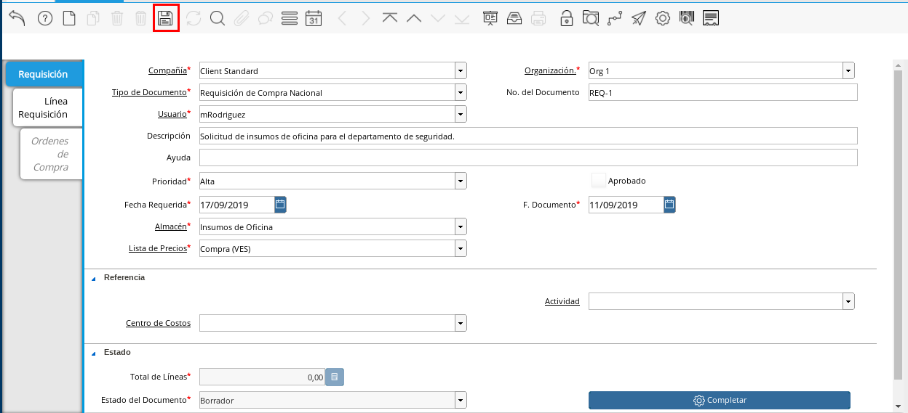
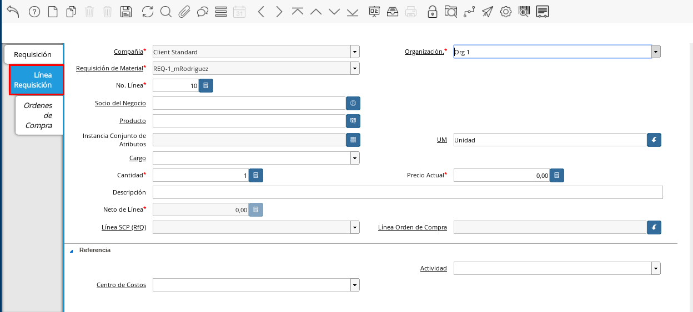
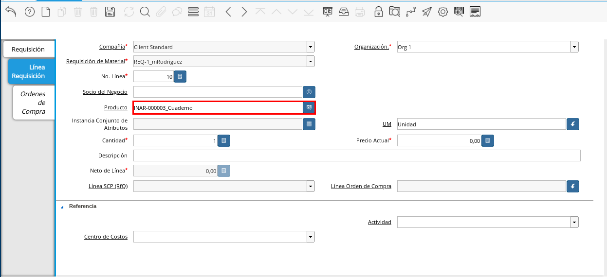
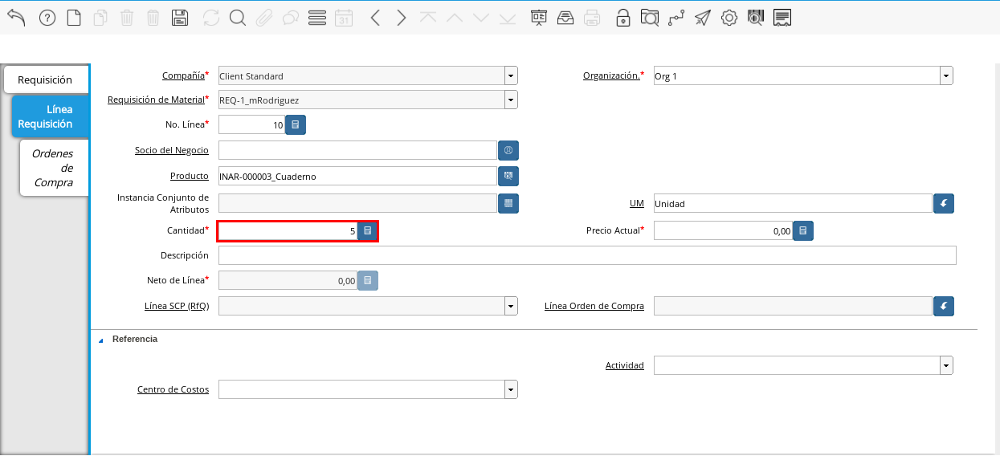
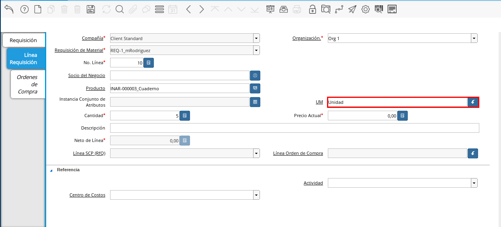
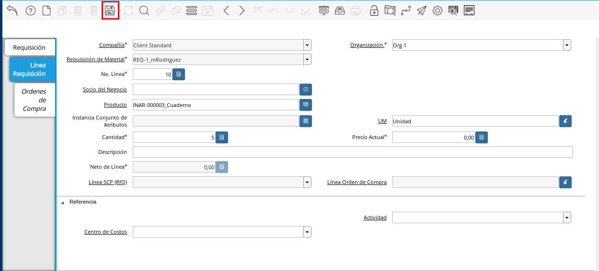
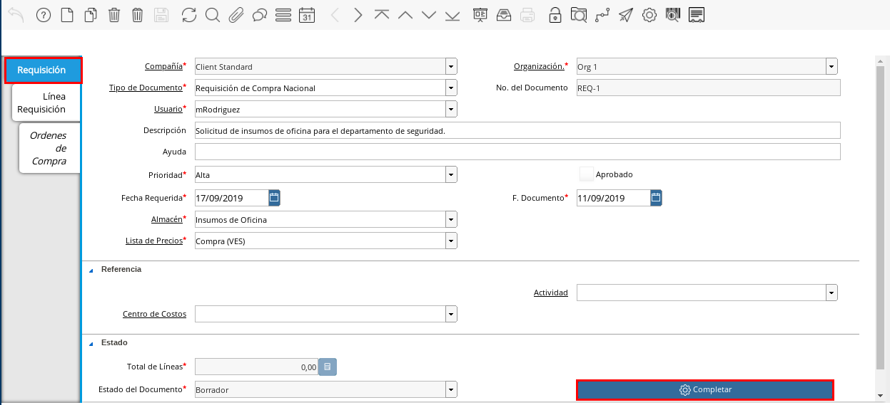
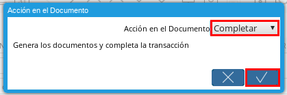

.. _documento/requisición-compra:

**Registro de Requisición a Compra**
====================================

#. Ubique en el menú de ADempiere la carpeta "**Gestión de Compras**", luego seleccione la ventana "**Requisición**", adjunto imagen para referencia.

    |Menú de ADempiere|
    
    Imagen 1. Menú de ADempiere

#. Seleccione el icono "**Registro Nuevo**" en la barra de herramientas de ADempiere, para crear un nuevo documento de requisición.

    |Icono Registro Nuevo|
    
    Imagen 2. Icono Registro Nuevo

#. Seleccione en el campo "**Organización**", la organización para la cual se esta realizando el documento de requisición de productos o servicios, el valor en el mismo debe ser diferente del símbolo (*). 

    |Campo Organización|
    
    Imagen 3. Campo Organización

#. Seleccione el tipo de documento a generar en el campo "**Tipo de Documento**", la selección de este define el comportamiento del documento que se esta elaborando, dicho comportamiento se encuentra explicado en el documento :ref:`documento/tipo-documento` elaborado por `ERPyA`_.

    |Campo Tipo de Documento|
    
    Imagen 4. Campo Tipo de Documento

#. Introduzca el número del documento en el campo "**No. de Documento**", el mismo no es obligatorio ya que ADempiere genera un número de secuencia automáticamente al ser guardado el registro del documento.

    |Campo Número de Documento|
    
    Imagen 5. Campo Número de Documento

#. Seleccione en el campo "**Usuario**", el nombre del usuario que esta realizando el documento de requisición.

    |Campo Usuario|
    
    Imagen 6. Campo Usuario

#. Introduzca una breve descripción de la requisición en el campo "**Descripción**", este campo es opcional.

    |Campo Descripción|
    
    Imagen 7. Campo Descripción

#. Seleccione la prioridad de la requisición en el campo "**Prioridad**", este campo indica la urgencia de los productos o servicios que se estan solicitando en el documento, sin embargo, el documento trae predeterminado la opción "**Media**".

    |Campo Prioridad|
    
    Imagen 8. Campo Prioridad

#. Seleccione en el campo "**Fecha Requerida**", la fecha en la que se requieren los productos y servicios en el departamento solicitante.

    |Campo Fecha Requerida|
    
    Imagen 9. Campo Fecha Requerida

#. Seleccione en el campo "**Almacén**", el lugar en el que se almacenarán los productos y servicios.

    |Campo Almacén|
    
    Imagen 10. Campo Almacén

#. Seleccione la lista de precios en el campo "**Lista de Precios**", para una requisición la lista siempre debe ser "**Compra**" y la moneda de la lista de precios "**Compra**" va a depender del tipo de documento seleccionado.

    |Campo Lista de Precios|
    
    Imagen 11. Campo Lista de Precios

#. Seleccione el icono "**Guardar**" de la barra de herramientas de ADempiere para guardar los cambios realizados.

    |Guardar Cambios|
    
    Imagen 12. Guardar Cambios

#. Seleccione la pestaña "**Línea Requisición**" y proceda al llenado de los campos correspondientes.

    |Línea Requisición|
    
    Imagen 13. Línea Requisición

#. Seleccione en el campo "**Producto**", el producto o servicio a solicitar.

    |Campo Producto|
    
    Imagen 14. Campo Producto

#. Seleccione en el campo "**Cantidad**", la cantidad de productos o servicios a solicitar.

    |Campo Cantidad|
    
    Imagen 15. Campo Cantidad

#. Seleccione la unidad de medida del producto a solicitar en el campo "**UM**", esta puede ser unidad, gramos, kilos, toneladas, entre otras.

    |Campo UM|
    
    Imagen 16. Campo UM
    
#. Seleccione el icono "**Guardar**" de la barra de herramientas de ADempiere para guardar los cambios realizados.

    |Guardar Cambios 2|
    
    Imagen 17. Guardar Cambios
    
    .. note::
    
        Si el departamento requiere diferentes productos o servicios, puede seleccionar en la pestaña "**Línea Requisición**", el icono "**Registro Nuevo**" en la barra de herramientas de ADempiere y proceder al llenado de los campos correspondientes explicados anteriormente.

#. Regrese a la ventana principal "**Requisición**" y seleccione la opción "**Completar**".

    |Opción Completar|
    
    Imagen 18. Opción Completar

#. Seleccione la acción "**Completar**" y la opción "**OK**" para completar el documento.

    |Completar Documento|
    
    Imagen 19. Completar Documento
