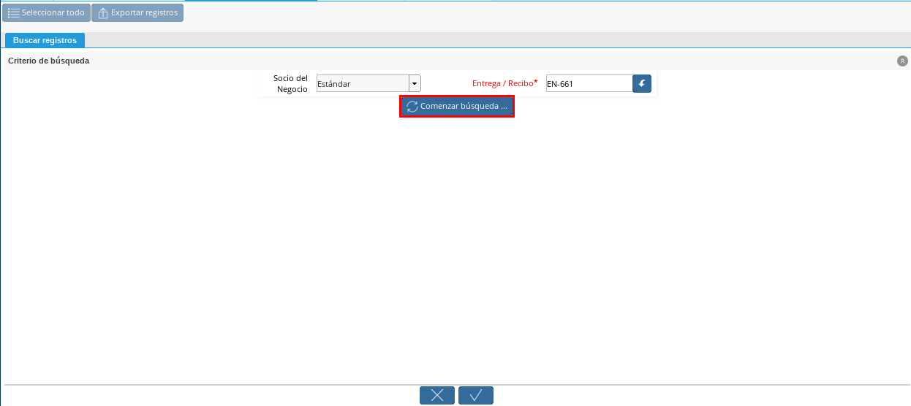

.. _documento/devolución-cliente:

**Autorización de Devolución (Cliente)**
========================================

#. Ubique y seleccione en el menú de ADempiere, la carpeta "**Gestión de Ventas**", luego seleccione la carpeta "**Órdenes de Venta**", por último seleccione la ventana "**Orden de Devolución (Cliente)**".

    |Menú de ADempiere|  
    
    Imagen 1. Autorización de Devolución (Cliente)

#. Seleccione el icono "**Registro Nuevo**", en la barra de herramientas de ADempiere y proceda al llenado de los campos correspondientes.

    |Icono Registro Nuevo|
    
    Imagen 2. Icono Registro Nuevo

    #. Seleccione en el campo "**Organización**", la organización para la cual esta realizando el documento "**Autorización de Devolución (Cliente)**".

        |Campo Organización|  
        
        Imagen 3. Campo Organización

    #. Seleccione el tipo de documento a generar en el campo "**Tipo de Documento Destino**", la selección de este define el comportamiento del documento que se esta elaborando, dicho comportamiento se encuentra explicado en el documento `Tipo de Documento <>`_ elaborado por la empresa ERPyA.

        |Campo Tipo de Documento Destino| 
        
        Imagen 4. Campo Tipo de Documento Destino

    #. Seleccione en el campo "**Fecha de la Orden**", la fecha en la que se esta realizando el documento.

        |Campo Fecha de la Orden| 
        
        Imagen 5. Campo Fecha de la Orden

    #. Seleccione en el campo "**Tipo Autorización Devolución**", el motivo por el cual son devueltos los productos. Para ejemplificar el registro es utilizada la opción "**Producto Erróneo**".

        |Campo Tipo Autorización Devolución| 
        
        Imagen 6. Campo Tipo Autorización Devolución

    #. Seleccione en el campo "**Socio del Negocio**", el socio del negocio cliente seleccionado en la orden de venta.

        |Campo Socio del Negocio| 
        
        Imagen 7. Campo Socio del Negocio

    #. Seleccione en el campo "**Dirección del Socio del Negocio**", la dirección del socio del negocio cliente seleccionado.

        |Campo Dirección del Socio del Negocio|  
        
        Imagen 8. Campo Dirección del Socio del Negocio

    #. Seleccione en el campo "**Almacén**", el almacén en el que serán ingresados los productos.

        |Campo Almacén| 
        
        Imagen 9. Campo Almacén

    #. Seleccione en el campo "**Lista de Precios**", la lista de precios seleccionada en la orden de venta.

        |Campo Lista de Precios|  
        
        Imagen 10. Campo Lista de Precios

    #. Seleccione en el campo "**Agente Comercial**", el vendedor que realiza la orden de venta.

        |Campo Agente Comercial| 
        
        Imagen 11. Campo Agente Comercial

#. Seleccione el icono "**Guardar Cambios**", para guardar el registro de los campos.

    |Icono Guardar Cambios| 
    
    Imagen 12. Icono Guardar Cambios

#. Seleccione el icono "**Proceso**" en la barra de herramientas.

    |Icono Proceso| 
    
    Imagen 13. Icono Proceso

    #. Podrá apreciar un menú desplegado por el icono "**Proceso**", en el cual debe seleccionar la opción "**Crear Orden de Devolución desde Entrega / Recibo**".

        |Menú del Icono Proceso|  
        
        Imagen 14. Menú del Icono Proceso

    #. Podrá apreciar la seguiente ventana de búsqueda inteligente en la cual debe seleccionar en el campo "**Entrega / Recibo**", el documento de entrega con ayuda del identificador.

        |Campo Entrega / Recibo|  
        
        Imagen 15. Campo Entrega / Recibo

    #. Seleccione el documento de entrega y luego seleccione la opción "**OK**".

        |Opción OK| 
        
        Imagen 16. Opción OK

    #. Seleccione la opción "**Comenzar Búsqueda**", para apreciar los productos entregados al cliente.

        |Opción Comenzar Búsqueda| 
        
        Imagen 17. Opción Comenzar Búsqueda

    #. Seleccione el producto de la devolución e introduzca la cantidad de la devolución en la columna cantidad.

        |Producto a Devolver| 
        
        Imagen 18. Producto a Devolver

    #. Seleccione la opción "**OK**", para cargar los productos a la pestaña "**Línea de Autorización**".

        |Opción OK 2| 
        
        Imagen 19. Opción OK

#. Seleccione la pestaña "**Línea de Autorización**", para verificar que las cantidades, el producto y el precio cargado sean los correctos.

    |Pestaña Línea de Autorización| 
    
    Imagen 20. Pestaña Línea de Autorización

#. Regrese a la ventana principal "**Autorización de Devolución**" y seleccione la opción "**Completar**" ubicada en la parte inferior derecha del documento.

    |Completar Documento| 
    
    Imagen 21. Completar Documento

    #. Seleccione la acción "**Completar**" y la opción "**OK**", para completar el documento.

        |Acción Completar| 
        
        Imagen 22. Acción Completar

**Devolución (Cliente)**
========================

#. Ubique y seleccione en el menú de ADempiere, la carpeta "**Gestión de Ventas**", luego seleccione la carpeta "**Entregas**", por último seleccione la ventana de búsqueda inteligente "**Generar Entregas Desde Líneas de Orden**".

    |Menú de ADempiere 2|
    
    Imagen 23. Menú de ADempiere

#. Seleccione en el campo "**Socio del Negocio**", el socio del negocio seleccionado en el documento de "**Orden de Devolución Cliente**".

    |Campo Socio del Negocio 2| 
    
    Imagen 24. Campo Socio del Negocio

#. Seleccione la opción "**Comenzar Búsqueda**", para buscar los documentos de ventas relacionados con el socio del negocio seleccionado.

    |Opción Comenzar Búsqueda 2| 
    
    Imagen 25. Opción Comenzar Búsqueda

#. Podrá apreciar las órdenes de ventas y las autorizaciones de devoluciones realizadas al socio del negocio seleccionado.

    |Órdenes y Autorizaciones al Socio| 
    
    Imagen 26. Órdenes y Autorizaciones al Socio

#. Ubique y seleccione el documento "**Orden de Devolución Cliente**" a utilizar para crear el documento "**Devolución (Cliente)**".

    |Seleccionar Orden de Devolución Cliente|
    
    Imagen 27. Seleccionar Orden de Devolución Cliente

#. Se mostrará las opciones del campo "**Acción de Documento**", como se visualiza en este ejemplo la acción "**Completar**", de esta manera se generará el documento con estado "**Completo**".

    |Acción del Documento| 
    
    Imagen 28. Acción del Documento

#. Seleccione la opción "**OK**", para generar el documento "**Devolución (Cliente)**" desde el documento "**Orden de Devolución Cliente**" seleccionado.

    |Opción OK 3| 
    
    Imagen 29. Opción OK

#. Seleccione en el menú de ADempiere, la carpeta "**Gestión de Devoluciones**", luego seleccione la ventana "**Devolución Cliente**".

    |Menú de ADempiere 3| 
    
    Imagen 30. Menú de ADempiere

#. Podrá apreciar el documento "**Devolución Cliente**", creado desde la ventana de búsqueda inteligente.

    |Documento Devolución Cliente| 
    
    Imagen 31. Documento Devolución Cliente

.. note::

    La elaboración de este proceso permite ingresar nuevamente los productos seleccionados anteriormente al almacén de la empresa.

**Nota de Crédito por Devolución (Cliente)**
============================================

#. Para generar el documento "**Nota de Crédito por Devolución (Cliente)**", debe existir obligatoriamente una factura para aplicar la nota de crédito. Para ejemplificar el registro de la devolución de cliente se utiliza la factura número "**84884**".

    |Factura 84884| 
    
    Imagen 32. Factura 84884

#. Ubique y seleccione en el menú de ADempiere, la carpeta "**Gestión de Ventas**", luego seleccione la carpeta "**Facturas de Ventas**", por último seleccione la ventana de búsqueda inteligente "**Generar Facturas desde Líneas de la Orden**".

    |Menú de ADempiere 4| 
    
    Imagen 33. Menú de ADempiere

#. Seleccione en el campo "**Socio del Negocio**", el socio del negocio del documento "**Autorización de Devolución (Cliente)**".

    |Campo Socio del Negocio 3| 
    
    Imagen 34. Campo Socio del Negocio 3

#. Seleccione la opción "**Comenzar Búsqueda**", para buscar los documentos relacionados con el socio del negocio seleccionado.

    |Opción Comenzar Búsqueda 3| 
    
    Imagen 35. Opción Comenzar Búsqueda

#. Seleccione el documento "**Autorización de Devolución (Cliente)**" a utilizar para crear el documento "**Nota de Crédito por Devolución (Cliente)**".

    |Seleccionar Autorización de Devolución Cliente| 
    
    Imagen 36. Seleccionar Autorización de Devolución Cliente

#. Se mostrará las opciones del campo "**Acción de Documento**", como se visualiza en este ejemplo la acción "**Completar**", de esta manera se generará el documento con estado "**Completo**".

    |Ación de Documento 2| 
    
    Imagen 37. Acción de Documento

#. Destilde el checklist "**Agregar Línea de Referencia en Factura**" para que no se genere una línea en el documento solo con la referencia de la transacción.

    |Checklist Agregar Línea de Referencia en Factura| 
    
    Imagen 38. Checklist Agregar Línea de Referencia en Factura

#. Seleccione la opción "**OK**", para que se genere el documento "**Nota de Crédito por Devolución (Cliente)**".

    |Opción OK 4|
    
    Imagen 39. Opción OK

#. Podrá visualizar el mensaje donde indica que se creó la nota de crédito desde la autorización de devolución "**ADCN-1000014**".

    |Mensaje de Creación de Nota de Crédito|

    Imagen 40. Mensaje de Creación de Nota de Crédito

#. Seleccione en el menú de ADempiere, la carpeta "**Gestión de Ventas**", luego seleccione la carpeta "**Facturas de Ventas**", por último seleccione la ventana "**Documentos por Cobrar**".

    |Menú de ADempiere 5| 
    
    Imagen 41. Menú de ADempiere

#. Podrá apreciar el documento "**Nota de Crédito por Devolución (Cliente)**", creado desde la ventana de búsqueda inteligente.

    |Documento Nota de Crédito| 
    
    Imagen 42. Documento Nota de Crédito

#. En la pestaña "**Línea de la Factura**", podrá visualizar la factura afectada número "**84884**".

    |Pestaña del Documento Nota de Crédito|
    
    Imagen 43. Pestaña del Documento Nota de Crédito

**Consultar Saldos Abiertos**
=============================

#. Al consultar saldos abiertos se verifica que la nota de crédito haya sido aplicada a la factura, generando con ello un descuento al saldo abierto del socio del negocio de la siguiente manera.

    |Consultar Saldos Abiertos| 
    
    Imagen 44. Consultar Saldos Abiertos
    
**Consultar Detalle de Transacciones**
======================================

#. Al consultar los detalles de transacciones se verifican los movimientos de salida de productos por medio de una entrega, generando con ello un descuento al total de productos. De igual manera es reflejada la entrada del mismo producto por medio de una devolución de cliente, generando con ello un aumento al total de productos en existencia.

    |Consultar Detalle de Transacciones|
    
    Imagen 45. Consultar Detalle de Transacciones