.. |Ventana Principal Socio del Negocio| image:: resources/ventana.png

.. |Campo Código| image:: resources/codigo.png

.. |Campo Nombre 2| image:: resources/nombre2.png

.. |Campo Saldo Actual| image:: resources/saldoac.png
.. |Campo Exento de Impuesto en Venta| image:: resources/exventa.png

.. |Campo Grupo de Impuestos| image:: resources/gruimpu.png

.. |Campo Valuación ABC| image:: resources/abc.png
.. |Campo Grupo de Socio del Negocio| image:: resources/grupo.png
.. |Campo Tipo de Cuenta| image:: resources/cuentasocio.png

.. |Campo Tipo de Industria| image:: resources/tipoindsocio.png

.. |Campo Grupo de Ventas| image:: resources/gruventas.png
.. |Campo Dirección Web| image:: resources/direccionpag.png

.. |Campo Liga Organización| image:: resources/ligaorg.png
.. |Campo Valor Esperado| image:: resources/esperado.png

.. |Campo Participación| image:: resources/participacion.png

.. |Campo Volumen de Ventas| image:: resources/ventas.png

.. |Campo Logo| image:: resources/logocliente.png

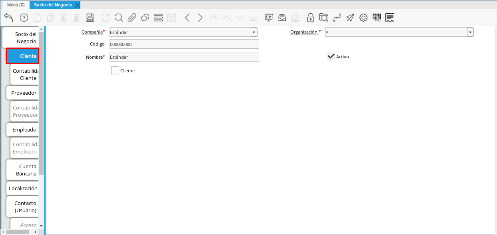
.. |Checklist Cliente| image:: resources/check.png
.. |Campo Copias del Documento| image:: resources/copias.png

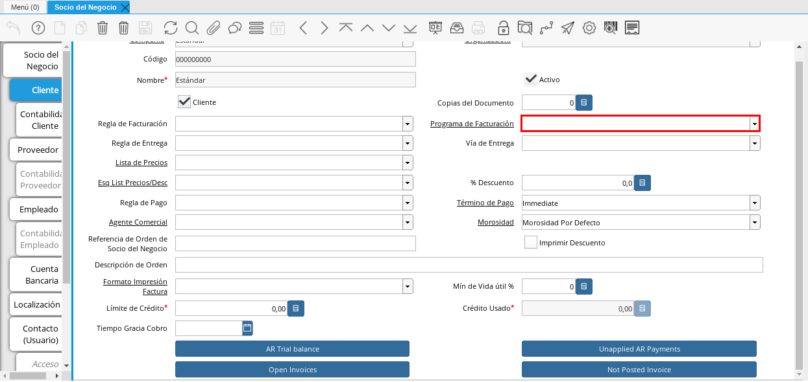
.. |Campo Regla de Entrega| image:: resources/entrega.png
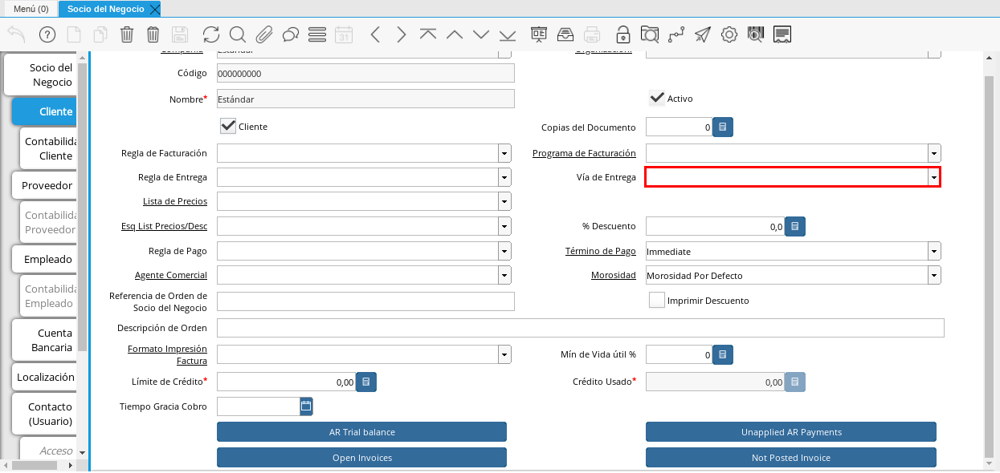
.. |Campo Lista de Precios| image:: resources/lista.png
.. |Campo Esq List Precios/Desc| image:: resources/esq.png

.. |Campo Regla de Pago| image:: resources/pago.png

.. |Campo Referencia de Orden de Socio del Negocio| image:: resources/referencia.png
.. |Campo Imprimir Descuento| image:: resources/imprimir.png
.. |Campo Descripción de Orden| image:: resources/orden.png
.. |Campo Formato de Impresión| image:: resources/formato.png
.. |Campo Mín de Vida útil %| image:: resources/util.png
.. |Campo Límite de Crédito| image:: resources/limite.png
.. |Campo Crédito Usado| image:: resources/credito.png
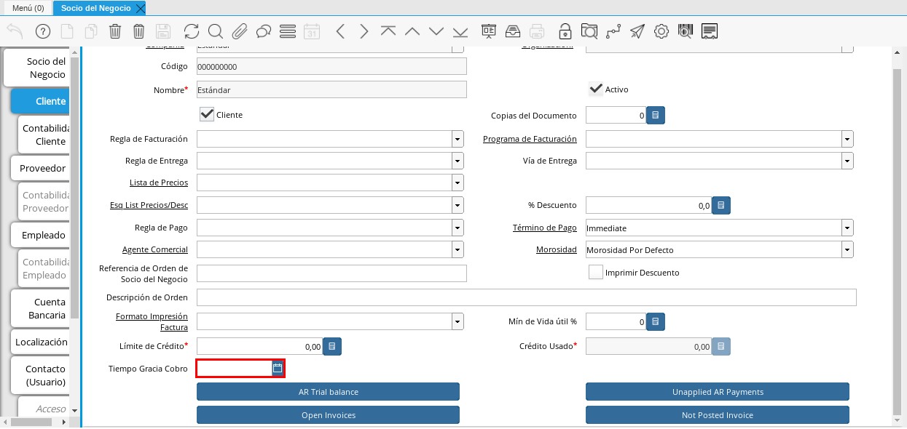

.. |Campo Tarjeta de Crédito| image:: resources/tarjetacredito.png
.. |Campo Número| image:: resources/numtarjeta.png
.. |Campo Código de Verificación| image:: resources/verificacion.png

.. |Campo Año de Expiración| image:: resources/anoexp.png
.. |Checklist ACH| image:: resources/ach.png
.. |Campo IBAN| image:: resources/iban.png

.. |Campo Tipo de Cuenta Bancaria| image:: resources/tipocuenta.png
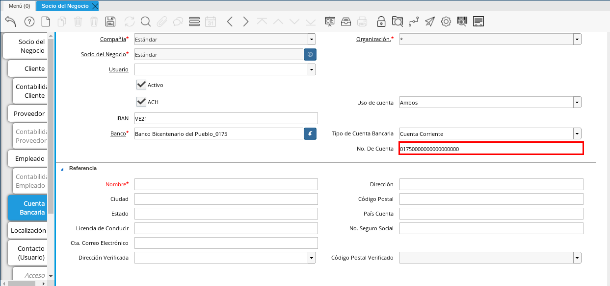
.. |Campo Nombre de Titular de Cuenta| image:: resources/nomcuenta.png
.. |Campo Dirección de Entidad Bancaria| image:: resources/dire.png
.. |Campo Ciudad de Entidad Bancaria| image:: resources/ciudadcuenta.png
.. |Campo Código Postal| image:: resources/postal.png
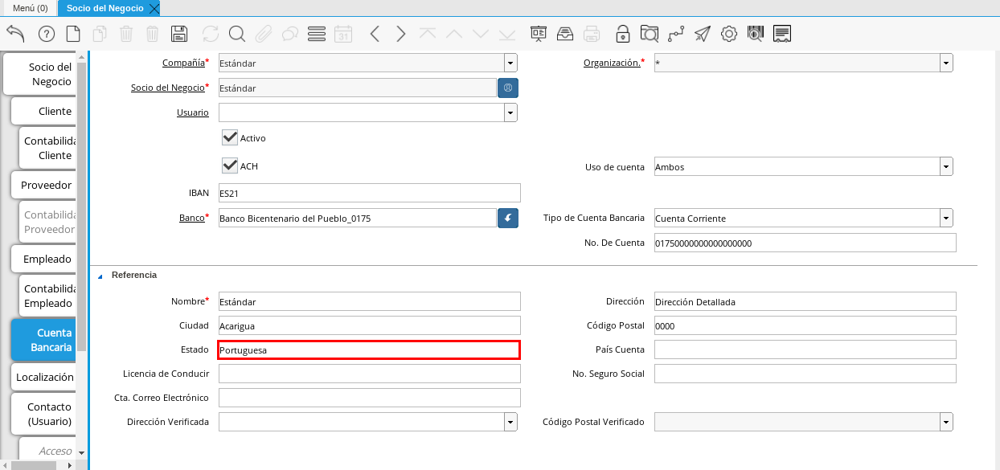

.. |Campo No. Seguro Social| image:: resources/sso.png

.. |Campo Dirección Verificada| image:: resources/direccionveri.png

.. |Pestaña Localización| image:: resources/localizacion.png
.. |Campo Localización / Dirección| image:: resources/identi.png
.. |Campo País| image:: resources/pais.png

.. |Campo Dirección 1| image:: resources/direccion.png

.. |Campo Teléfono Móvil| image:: resources/telemovil.png

.. |Campo ISDN| image:: resources/isdn.png
.. |Campo Dirección Entregar-A| image:: resources/direcentrega.png
.. |Campo Dirección Facturar-A| image:: resources/direcfactura.png
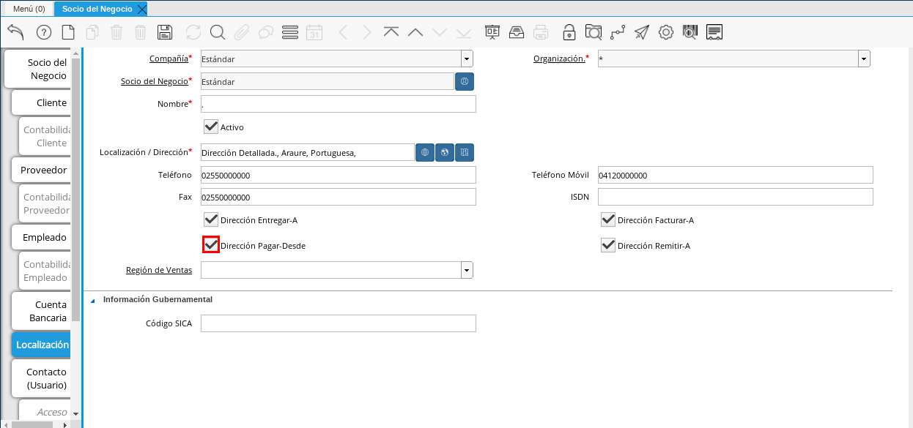
.. |Campo Dirección Remitir-A| image:: resources/direcremitir.png
.. |Campo Región de Ventas| image:: resources/region.png
.. |Campo Código SICA| image:: resources/sica.png
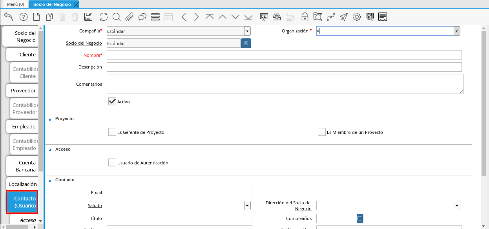

.. |Campo Descripción Persona| image:: resources/descricliente.png

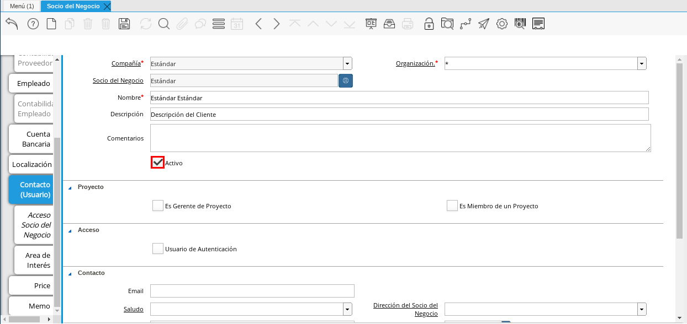
.. |Campo Es Gerente de Proyecto| image:: resources/gerente.png
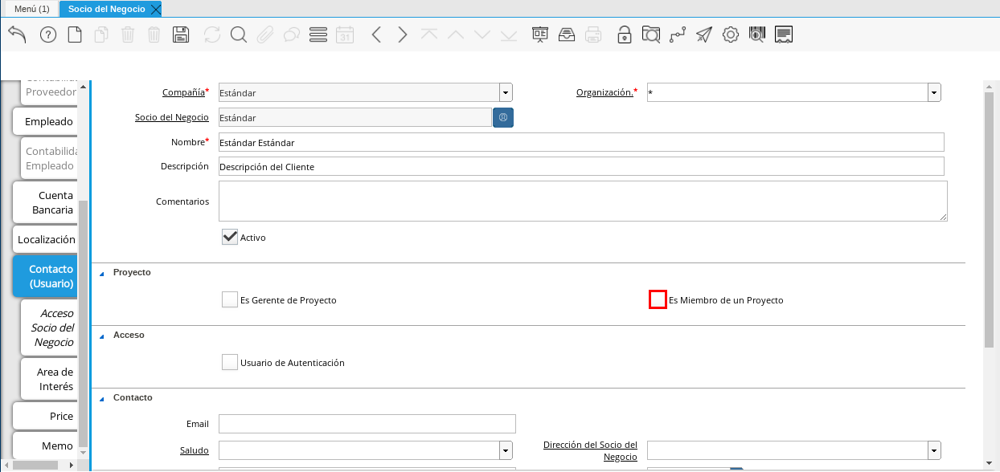
.. |Campo Usuario de Autenticación| image:: resources/usuario.png
.. |Campo Usuario Interno| image:: resources/interno.png

.. |Campo Contraseña| image:: resources/claveusuario.png
.. |Checklist Usuario de Tienda Web| image:: resources/tienda.png
.. |Campo Email| image:: resources/email.png
.. |Campo Saludo| image:: resources/saludo.png

.. |Campo Título| image:: resources/titulo.png
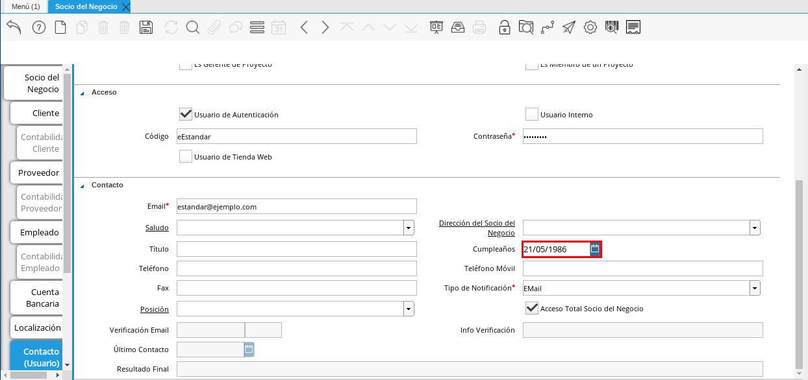
.. |Campo Teléfono de Contacto| image:: resources/tlf.png
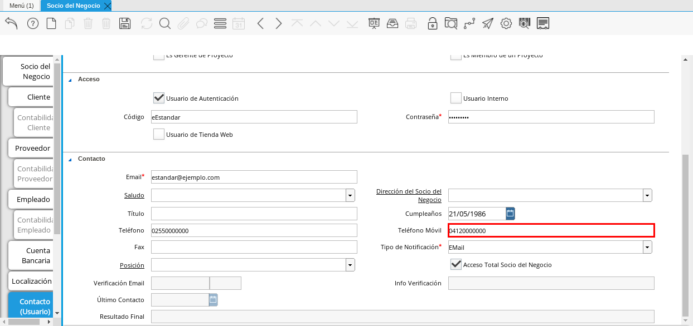

.. |Campo Tipo de Notificación| image:: resources/notificacion.png

.. |Campo Acceso Total Socio del Negocio| image:: resources/acceso.png

.. _ERPyA: http://erpya.com

.. _documento/socio-cliente:

===================================
**Socio de Negocio Cliente**
===================================

Si es usted un usuario en etapa de iniciación le recomendamos leer el capitulo anterior, Socios del Negocio de ADempiere, donde respondimos la interrogante común: **¿Qué es un Socio de Negocio?**, esto con la intención de proveer en este material una información más digerible.

Como resultado de lo anteriormente expuesto, se puede concluir que un socio de negocio que actua como cliente, es una entidad juridica o natural que adquiere productos o servicios provenientes de la empresa,estos pueden ser:

**Clientes Nacionales:** Realizan transacciones que generan ingresos a la empresa (Ventas) dentro del territorio.

**Clientes Internacionales:** Realizan transacciones que generan ingresos a la empresa(Ventas) fuera del territorio, esto se conoce como exportación.

Esta categorización en ADempiere es conocida como **Grupo de Socio de Negocio** y es la base contable (en su mayoría) para las operaciones emitidas a partir de este registro maestro, no obstante, el usuario tiene la opción de realizar configuraciones excepcionales para ciertos clientes.

Ahora bien, si es usted usuario de ADempiere, seguramente se ha hecho preguntas que le han complicado la operatividad de algún modo. Para facilitar su día a día `ERPyA`_ quiere responder algunas preguntas frecuentes con las que nos topamos en nuestra experiencia como consulteres e implementadores de ADempiere:

**¿Si un socio de negocio es proveedor o empleado, y ahora va a fugir como cliente, debo crearlo nuevamente?**

**¿Si la categoría es por ejemplo Cliente Nacional, como actua contablemente siendo proveedor?**

**¿Cómo agrupo por vendedor a mis clientes para emitir un reporte?**

**¿Que columnas configuradas en el cliente es información transferida a la orden de venta?**

**¿Cómo configuro un descuento para el cliente?**

**¿Cómo configuro la morosidad en ADempiere?**

**¿Cómo bloqueo el Limite de crédito para el cliente?**

**¿Cómo configuro un cliente excento de impuesto?**

Para concluir el preámbulo, le invitamos a tomar en cuenta cada una de estas acotaciones, de seguro serán de utilidad, y a futuro le garantizará un eficiente manejo de una herramienta tan potente como lo es ADempiere.

**Proceso de Registro del Socio del Negocio**
---------------------------------------------

#. En el menú de ADempiere, ubique y seleccione la carpeta "**Relación con Socio del Negocio**", luego seleccione la carpeta "**Reglas de Socios del Negocio**" y finalmente seleccione la ventana "**Socio del Negocio**".

    |Menú de ADempiere|

    Imagen 1. Menú de ADempiere

**Ventana Socio del Negocio**
-----------------------------

En esta ventana se registran los datos principales que la empresa requiere del socio del negocio cliente. Cada uno de los campos con el símbolo (*) son obligatorios para el registro.

#. A continuación visualizará la ventana "**Socio del Negocio**", dónde debe seleccionar el icono de "**Registro Nuevo**" que se encuentra ubicado en la barra de herramientas de ADempiere.

    |Ventana Principal Socio del Negocio|

    Imagen 2. Ventana Principal Socio del Negocio

#. Proceda al llenado de los campos necesarios que a continuación se detallan.

    #. Seleccione en el campo "**Organización**", la organización para la cual se esta registrando el socio del negocio cliente.

        |Campo Organización|

        Imagen 3. Campo Organización

        .. warning::

            Para que el socio del negocio este disponible para todas las organizaciones, el mismo deberá estar registrado con la organización en (*) de lo contrario el socio del negocio solo estará disponible para una sola organización.

    #. Introduzca el código de identificación, cédula o rif del socio del negocio en el campo "**Código**", el valor introducido en este campo automáticamente se reflejará en el campo "**Número Identificación**".

        |Campo Código|

        Imagen 4. Campo Código

        .. warning::

            Se recomienda que al ingresar el valor al campo "**Código**" no se ingrese ningún prefijo, punto, guion o cualquier otro carácter.

    #. Introduzca el nombre del socio del negocio cliente en el campo "**Nombre**".

        |Campo Nombre|

        Imagen 5. Campo Nombre

    #. Introduzca el apellido del socio del negocio cliente en el campo "**Nombre 2**".

        |Campo Nombre 2|

        Imagen 6. Campo Nombre 2

    #. Introduzca una breve descripción referente al socio del negocio cliente en el campo "**Descripción**".

        |Campo Descripción|

        Imagen 7. Campo Descripción

    #. Seleccione el checklist "**Entidad Acumulada**", para definir al socio del negocio como entidad sumaria.

        |Campo Entidad Acumulada|

        Imagen 8. Campo Entidad Acumulada

    #. Seleccione en el campo "**Estado de Crédito**", el estado del crédito que posee el socio del negocio cliente que esta registrando. Para ejemplificar el registro es utilizada la opción "**Crédito Correcto**".

        |Campo Estado de Crédito|

        Imagen 9. Campo Estado de Crédito

    #. Podra visualizar el saldo actual que posee el cliente en el campo "**Saldo Actual**.

        |Campo Saldo Actual|

        Imagen 10. Campo Saldo Actual

    #. Seleccione el checklist "**Exento de Impuesto en Venta**", para definir al socio del negocio como exento de impuesto.

        |Campo Exento de Impuesto en Venta|

        Imagen 11. Campo Exento de Impuesto en Venta

    #. Seleccione el checklist "**Exento de Impuesto en Compra**", para definir al socio del negocio como exento de impuesto.

        |Campo Exento de Impuesto en Compra|

        Imagen 12. Campo Exento de Impuesto en Compra

    #. Seleccione en el campo "**Grupo de Impuestos**", el grupo de impuestos.

        |Campo Grupo de Impuestos|

        Imagen 13. Campo Grupo de Impuestos

    #. Introduzca en el campo "**DUNS**", el código DUNS del socio del negocio cliente.

        |Campo DUNS|

        Imagen 14. Campo DUNS

    #. Introduzca en el campo "**No. de Referencia**", el número de socio del negocio cliente.

        |Campo No. de Referencia|

        Imagen 15. Campo No. de Referencia

    #. Introduzca en el campo "**NAICS/SIC**", el código NAICS o SIC del socio del negocio cliente.

        |Campo NAICS/SIC|

        Imagen 16. Campo NAICS/SIC

    #. Introduzca en el campo "**Valuación ABC**", la clasificación de importancia que posee el socio del negocio cliente.

        |Campo Valuación ABC|

        Imagen 17. Campo Valuación ABC

    #. Seleccione en el campo "**Grupo de Socio del Negocio**", el grupo de socio del negocio al que pertenezca el socio del negocio cliente que esta registrando, para este ejemplo el grupo utilizado es "**Clientes Nacionales**".

        |Campo Grupo de Socio del Negocio|

        Imagen 18. Campo Grupo de Socio del Negocio

    #. Seleccione en el campo "**Tipo de Cuenta**", el tipo de cuenta o negocio que posee el socio del negocio cliente.

        |Campo Tipo de Cuenta|

        Imagen 19. Campo Tipo de Cuenta

    #. Seleccione en el campo "**Lenguaje**", el lenguaje a utilizar en los documentos que serán generados al socio del negocio cliente.

        |Campo Lenguaje|

        Imagen 20. Campo Lenguaje

    #. Seleccione en el campo "**Tipo de Industria**", el tipo de industria que clasifica al socio del negocio empleado.

        |Campo Tipo de Industria|

        Imagen 21. Campo Tipo de Industria

    #. Seleccione en el campo "**Segmento**", el segmento del socio del negocio cliente.

        |Campo Segmento|

        Imagen 22. Campo Segmento

    #. Seleccione en el campo "**Grupo de Ventas**", el grupo de ventas del socio del negocio cliente.

        |Campo Grupo de Ventas|

        Imagen 23. Campo Grupo de Ventas

    #. Introduzca en el campo "**Dirección Web**", la dirección de la página web de contacto del socio del negocio cliente.

        |Campo Dirección Web|

        Imagen 24. Campo Dirección Web

    #. Seleccione el checklist "**Prospecto Activo**" si el socio del negocio cliente es un prospecto activo.

        |Campo Prospecto Activo|

        Imagen 25. Campo Prospecto Activo

    #. Seleccione la opción "**Liga Organización**", para integrar el socio del negocio a una organización.

        |Campo Liga Organización|

        Imagen 26. Campo Liga Organización

    #. Introduzca en el campo "**Valor Esperado**", el total de los ingresos esperados por parte del socio del negocio cliente.

        |Campo Valor Esperado|

        Imagen 27. Campo Valor Esperado

    #. Podrá visualizar en el campo "**Valor Total Transacciones**", el monto total de la primera venta realizada al socio del negocio cliente.

        |Campo Valor Total Transacciones|

        Imagen 28. Campo Valor Total Transacciones

    #. Introduzca en el campo "**Costo de Adquisición**", el costo asociado con hacer de este prospecto un cliente.

        |Campo Costo de Adquisición|

        Imagen 29. Campo Costo de Adquisición

    #. Introduzca en el campo "**Empleados**", la cantidad de empleados que posee el socio del negocio cliente.

        |Campo Empleados|

        Imagen 30. Campo Empleados

    #. Introduzca en el campo "**Participación**", el porcentaje del socio del negocio cliente.

        |Campo Participación|

        Imagen 31. Campo Participación

    #. Seleccione en el campo "**Tipo de Persona**, el tipo de persona al que pertenece el socio del negocio que esta registrando, este campo obligatorio permite la configuración esencial de las retenciones. Para ejemplificar el registro es utilizada la opción "**Persona Jurídica Domiciliada**".

        |Campo Tipo de Persona|

        Imagen 32. Campo Tipo de Persona

    #. Introduzca en el campo "**Volumen de Ventas**", el número de ventas total para un socio del negocio.

        |Campo Volumen de Ventas|

        Imagen 33. Campo Volumen de Ventas

    #. Podrá apreciar en el campo "**Primera Venta**", la fecha de la primera venta realizada al socio del negocio cliente.

        |Campo Primera Venta|

        Imagen 34. Campo Primera Venta

    #. Seleccione en el campo "**Logo**", el logo de la empresa del socio del negocio cliente que esta registrando.

        |Campo Logo|

        Imagen 35. Campo Logo

    #. Seleccione el icono "**Guardar Cambios**" ubicado en la barra de herramientas para guardar los datos ingresados.

        |Icono Guardar Cambios|

        Imagen 36. Icono Guardar Cambios

.. warning::

    Recuerde guardar el registro de los campos cada vez que se vaya a posicionar en una pestaña de la ventana socio del negocio.

**Pestaña Cliente**
*******************

En esta pestaña es registrada la información que la empresa requiere del socio del negocio cliente al momento de una venta al mismo. Cada uno de los campos que la misma contiene son necesarios en algún punto de la transacción de ventas.

#. Seleccione la pestaña "**Cliente**" que se encuentra del lado izquierdo de la ventana socio del negocio.

    |Pestaña Cliente|

    Imagen 37. Pestaña Cliente

#. A continuación visualizará la siguiente imagen, dónde debe tildar el checklist "**Cliente**".

    |Checklist Cliente|

    Imagen 38. Checklist Cliente

    .. warning::

        Al tildar el checklist "**Cliente**", podrá apreciar diferentes campos que establecen los términos o reglas para las transacciones de ventas al socio del negocio cliente que esta registrando. Dichos campos no son obligatorios porque pueden ser establecidos al momento de generar la orden de venta al socio del negocio.

    #. Introduzca en el campo "**Copias del Documento**", el número de copias a ser impresas de cada documento generado al socio del negocio cliente.

        |Campo Copias del Documento|

        Imagen 39. Campo Copias del Documento

    #. Seleccione en el campo "**Regla de Facturación**", la regla establecida para facturar al socio del negocio cliente.

        |Campo Regla de Facturación|

        Imagen 40. Campo Regla de Facturación

    #. Seleccione en el campo "**Programa de Facturación**", la frecuencia usada cuando se generan las facturas.

        |Campo Programa de Facturación|

        Imagen 41. Campo Programa de Facturación

    #. Seleccione en el campo "**Regla de Entrega**", la regla establecida para entregar al cliente los productos o servicios.

        |Campo Regla de Entrega|

        Imagen 42. Campo Regla de Entrega

    #. Seleccione en el campo "**Vía de Entrega**", como serán entregados los productos o servicios de la orden.

        |Campo Vía de Entrega|

        Imagen 43. Campo Vía de Entrega

    #. Seleccione en el campo "**Lista de Precios**", la lista de precios establecida para las ventas al socio del negocio cliente que esta registrando.

        |Campo Lista de Precios|

        Imagen 44. Campo Lista de Precios

    #. Seleccione en el campo "**Esq List Precios/Desc**", el esquema para calcular el porcentaje de descuento comercial.

        |Campo Esq List Precios/Desc|

        Imagen 45. Campo Esq List Precios/Desc

    #. Podrá apreciar en el campo "**% Descuento**", el porcentaje de descuento configurado en el esquema de descuento.

        |Campo % Descuento|

        Imagen 46. Campo % Descuento

    #. Seleccione en el campo "**Regla de Pago**", la forma de pago de las facturas establecida para el socio del negocio cliente que esta registrando.

        |Campo Regla de Pago|

        Imagen 47. Campo Regla de Pago

    #. Seleccione en el campo "**Término de Pago**", las condiciones de pago de las facturas establecida para el socio del negocio que esta registrando.

        |Campo Término de Pago|

        Imagen 48. Campo Término de Pago

    #. Seleccione en el campo "**Agente Comercial**", asignado a la región donde se encuentra el socio del negocio cliente.

        |Campo Agente Comercial|

        Imagen 49. Campo Agente Comercial

    #. Seleccione en el campo "**Morosidad**", la regla de morocidad para facturas vencidas.

        |Campo Morosidad|

        Imagen 50. Campo Morosidad

    #. Introduzca en el campo "**Referencia de Orden de Socio del Negocio**", el número estándar de referencia para las órdenes de compra.

        |Campo Referencia de Orden de Socio del Negocio|

        Imagen 51. Campo Referencia de Orden de Socio del Negocio

    #. Seleccione el checklist "**Imprimir Descuento**", si desea imprimir en la factura y en la orden de venta el descuento aplicado.

        |Campo Imprimir Descuento|

        Imagen 52. Campo Imprimir Descuento

    #. Introduzca en el campo "**Descripción de Orden**", una descripción estándar para se utilizadas en las órdenes a generar al socio del negocio cliente que esta registrando.

        |Campo Descripción de Orden|

        Imagen 53. Campo Descripción de Orden

    #. Seleccione en el campo "**Formato de Impresión**", el formato de impresión a utilizar en las facturas del socio del negocio cliente.

        |Campo Formato de Impresión|

        Imagen 54. Campo Formato de Impresión

    #. Introduzca en el campo "**Mín de Vida útil %**", tiempo mínimo de vida útil que tienen los productos.

        |Campo Mín de Vida útil %|

        Imagen 55. Campo Mín de Vida útil %

    #. Introduzca en el campo "**Límite de Crédito**", el límite de crédito establecido para el socio del negocio cliente que esta registrando.

        |Campo Límite de Crédito|

        Imagen 56. Campo Límite de Crédito

    #. Podrá visualizar en el campo "**Crédito Usado**", el crédito usado por el socio del negocio cliente que esta registrando.

        |Campo Crédito Usado|

        Imagen 57. Campo Crédito Usado

    #. Introduzca en el campo "**Tiempo Gracia Cobro**", los días de gracia que tiene el socio del negocio antes de que el agente comercial le realice el cobro.

        |Campo Tiempo de Gracia Cobro|

        Imagen 58. Campo Tiempo de Gracia Cobro

**Pestaña Cuenta Bancaria**
***************************

En esta pestaña se registran los datos bancarios del socio del negocio cliente, con el checklist "**Activo**" se pueden registrar los datos de la tarjeta de crédito del socio del negocio. Así mismo, con el checklist "**ACH**" se pueden registrar los datos de la cuenta bancaria del socio del negocio.

#. Seleccione la pestaña "**Cuenta Bancaria**" que se encuentra ubicada del lado izquierdo de la ventana socio del negocio. Por defecto se encuentra tildado el checklist "**Activo**".

    |Pestaña Cuenta Bancaria|

    Imagen 59. Pestaña Cuenta Bancaria

**Checklist Activo**
++++++++++++++++++++

#. Seleccione en el campo "**Tarjeta de Crédito**", el tipo de tarjeta de crédito que posee el socio del negocio cliente que esta registrando.

    |Campo Tarjeta de Crédito|

    Imagen 60. Campo Tarjeta de Crédito

#. Introduzca en el campo "**Número**", el número de tarjeta de crédito del socio del negocio cliente que esta registrando.

    |Campo Número|

    Imagen 61. Campo Número

#. Introduzca en el campo "**Código Verificación**", el código de verificación de la tarjeta de crédito del socio del negocio cliente que esta registrando, este código son los últimos tres números del reverso de la tarjeta.

    |Campo Código de Verificación|

    Imagen 62. Campo Código de Verificación

#. Introduzca en el campo "**Mes de Expiración**", el mes de expiración de la tarjeta de crédito del socio del negocio cliente que esta registrando.

    |Campo Mes de Expiración|

    Imagen 63. Campo Mes de Expiración

#. Introduzca el año de expiración de la tarjeta de crédito del socio del negocio cliente que esta registrando en el campo "**Año de Expiración**".

    |Campo Año de Expiración|

    Imagen 64. Campo Año de Expiración

    .. warning::

        Este proceso se realiza con la finalidad de registrar la tarjeta de crédito del socio del negocio.

**Checklist ACH**
+++++++++++++++++

#. Para registros de cuentas bancarias, tilde el checklist "**ACH**", a continuación se reflejarán los campos para el registro de la cuenta bancaria del socio del negocio.

    |Checklist ACH|

    Imagen 65. Checklist ACH

#. Introduzca en el campo "**IBAN**", el código IBAN conformado por el código del país (2 dígitos) más el código de control de la localidad donde se encuentra la sucursal del banco (2 dígitos). Para ejemplificar el registro es utilizado el código "**VE21**".

    |Campo IBAN|

    Imagen 66. Campo IBAN

#. En el campo "**Banco**" seleccione el banco a registrar con ayuda del ícono identificador (adjunto imagen).

    |Campo Banco|

    Imagen 67. Campo Banco

    #. A continuación visualizará la siguiente ventana con los diferentes bancos, dónde debe seleccionar el banco que posee el socio del negocio cliente y la opción "**OK**" para cargar los datos al formulario.

        |Opción OK|

        Imagen 68. Opción OK

#. Seleccione el tipo de cuenta correspondiente a la cuenta del socio del negocio cliente en el campo "**Tipo de Cuenta Bancaria**".

    |Campo Tipo de Cuenta Bancaria|

    Imagen 69. Campo Tipo de Cuenta Bancaria

#. Introduzca en el campo "**No. De Cuenta**", el número de cuenta del socio del negocio cliente que esta registrando.

    |Campo No. De Cuenta|

    Imagen 70. Campo No. De Cuenta

    .. warning::

        Este proceso se realiza con la finalidad de registrar la cuenta del socio del negocio.

#. Introduzca el nombre de referencia en el campo "**Nombre**", en este campo va el nombre del titular de la tarjeta de crédito o de la cuenta bancaria que esta registrando.

    |Campo Nombre de Titular de Cuenta|

    Imagen 71. Campo Nombre de Titular de Cuenta

#. Introduzca en el campo "**Dirección**", la dirección de la entidad bancaria poseedora de la tarjeta de crédito.

    |Campo Dirección de Entidad Bancaria|

    Imagen 72. Campo Dirección de Entidad Bancaria

#. Introduzca en el campo "**Ciudad**", el nombre de la ciudad donde se encuentra la entidad bancaria poseedora de la tarjeta de crédito.

    |Campo Ciudad de Entidad Bancaria|

    Imagen 73. Campo Ciudad de Entidad Bancaria

#. Introduzca en el campo "**Código Postal**", el código postal de la ciudad donde se encuentra la entidad bancaria poseedora de la tarjeta de crédito.

    |Campo Código Postal|

    Imagen 74. Campo Código Postal

#. Introduzca en el campo "**Estado**", el nombre del estado donde se encuentra la entidad bancaria poseedora de la tarjeta de crédito.

    |Campo Estado de Entidad Bancaria|

    Imagen 75. Campo Estado de Entidad Bancaria

#. Introduzca en el campo "**País Cuenta**", el nombre del país donde se encuentra la entidad bancaria poseedora de la tarjeta de crédito.

    |Campo País Cuenta|

    Imagen 76. Campo País Cuenta

#. Introduzca en el campo "**Licencia de Conducir**", el número de licencia de conducir del socio del negocio cliente que esta registrando.

    |Campo Licencia de Conducir|

    Imagen 77. Campo Licencia de Conducir

#. Introduzca en el campo "**No. Seguro Social**", el número de cédula del titular de la tarjeta de crédito o cuenta bancaria que esta registrando.

    |Campo No. Seguro Social|

    Imagen 78. Campo No. Seguro Social

#. Introduzca en el campo "**Cta. Correo Electrónico**", el correo electrónico asociado a la tarjeta de crédito o cuenta bancaria que esta registrando.

    |Campo Cta. Correo Electrónico|

    Imagen 79. Campo Cta. Correo Electrónico

#. Seleccione en el campo "**Dirección Verificada**", si la dirección de la entidad bancaria se encuentra verificada.

    |Campo Dirección Verificada|

    Imagen 80. Campo Dirección Verificada

#. Seleccione en el campo "**Código Postal Verificado**", si el código postal de la entidad bancaria se encuentra verificado.

    |Campo Código Postal Verificado|

    Imagen 81. Campo Código Postal Verificado

**Pestaña Localización**
************************

La localización de un socio del negocio cliente es muy importante por diferentes motivos, ya que las transacciones de ventas serán realizadas al mismo, en esta pestaña se deben registrar con exactitud los datos de la dirección del socio del negocio.

#. Seleccione la pestaña "**Localización**" que se encuentra ubicada del lado izquierdo de la ventana socio del negocio.

    |Pestaña Localización|

    Imagen 82. Pestaña Localización

#. Introduzca en el campo "**Localización / Dirección**", la dirección de localización del socio del negocio cliente con ayuda del identificador.

    |Campo Localización / Dirección|

    Imagen 83. Campo Localización / Dirección

    #. Seleccione en el campo "**País**", el país donde se encuentra domiciliado el socio del negocio que esta registrando.

        |Campo País|

        Imagen 84. Campo País

    #. Seleccione en el campo "**Estado**", el estado donde se encuentra domiciliado el socio del negocio que esta registrando.

        |Campo Estado|

        Imagen 85. Campo Estado

    #. Seleccione en el campo "**Ciudad**", la ciudad donde se encuentra domiciliado el socio del negocio que esta registrando.

        |Campo Ciudad|

        Imagen 86. Campo Ciudad

    #. Introduzca la dirección detallada del socio del negocio cliente en el campo "**Dirección 1**" y seleccione la opción "**OK**".

        |Campo Dirección 1|

        Imagen 87. Campo Dirección 1

#. Introduzca en el campo "**Teléfono**", el número de teléfono local para contactar al socio del negocio cliente.

    |Campo Teléfono|

    Imagen 88. Campo Teléfono

#. Introduzca en el campo "**Teléfono Móvil**", el número de teléfono móvil para contactar al socio del negocio cliente.

    |Campo Teléfono Móvil|

    Imagen 89. Campo Teléfono Móvil

#. Introduzca en el campo "**Fax**", el fax para contactar al socio del negocio cliente.

    |Campo Fax|

    Imagen 90. Campo Fax

#. Introduzca en el campo "**ISDN**", el ISDN para contactar al socio del negocio cliente.

    |Campo ISDN|

    Imagen 91. ISDN

#. Podrá apreciar tildados los checklist "**Dirección Entregar-A**", "**Dirección Facturar-A**", "**Dirección Pagar-Desde**" y "**Dirección Remitir-A**", indicando cada uno de ellos un comportamiento diferente.

    #. El checklist "**Dirección Entregar-A**" establece la localización ingresada como la dirección para embarcar los bienes.

        |Campo Dirección Entregar-A|

        Imagen 92. Campo Dirección Entregar-A

    #. El checklist "**Dirección Facturar-A**" establece la localización ingresada como la dirección para facturar.

        |Campo Dirección Facturar-A|

        Imagen 93. Campo Dirección Facturar-A

    #. El checklist "**Dirección Pagar-Desde**" establece la localización ingresada como la dirección desde donde paga las facturas el socio del negocio y donde son enviadas las cartas de morosidad.

        |Campo Dirección Pagar-Desde|

        Imagen 94. Campo Dirección Pagar-Desde

    #. El checklist "**Dirección Remitir-A**" establece la localización ingresada como la dirección para el envío de los pagos.

        |Campo Dirección Remitir-A|

        Imagen 95. Dirección Remitir-A

#. Seleccione en el campo "**Región de Ventas**", la región o área de ventas en la que se encuentra localizado el socio del negocio cliente.

    |Campo Región de Ventas|

    Imagen 96. Campo Región de Ventas

#. Introduzca en el campo "**Código SICA**", el código SICA del socio del negocio cliente.

    |Campo Código SICA|

    Imagen 97. Campo Código SICA

.. warning::

    Recuerde guardar el registro de los campos cada vez que se vaya a posicionar en una pestaña de la ventana socio del negocio.

**Pestaña Contacto**
********************

En esta pestaña se registran todos los datos de contacto que se posea el socio del negocio cliente. De igual manera, es creado su usuario de acceso en ADempiere.

#. Seleccione la pestaña "**Contacto**" que se encuentra ubicada del lado izquierdo de la ventana socio del negocio, para proceder a llenar los campos necesarios.

    |Pestaña Contacto|

    Imagen 98. Pestaña Contacto

    .. warning::

        El contacto (Usuario) permite registrar las diferentes personas de contacto que tiene la empresa con el socio del negocio cliente que esta registrando. Un ejemplo de esta pestaña puede ser, un jefe o persona de contacto por departamento para que a la hora de alguna venta de productos o servicios al socio del negocio cliente, se contacte a la persona correspondiente.

    #. Introduzca en el campo "**Nombre**", el nombre completo de la persona de contacto con el socio del negocio cliente que esta registrando.

        |Campo Nombre de Contacto|

        Imagen 99. Nombre de Contacto

    #. Introduzca en el campo "**Descripción**", una breve descripción de la persona de contacto con el socio del negocio cliente que esta registrando.

        |Campo Descripción Persona|

        Imagen 100. Campo Descripción

    #. Introduzca en el campo "**Comentarios**", los comentarios o información adicional sobre el registro de la persona de contacto con el socio del negocio cliente.

        |Campo Comentarios|

        Imagen 101. Campo Comentarios

    #. El checklist "**Activo**", indica que el registro se encuentra activo en el sistema.

        |Checklist Activo|

        Imagen 102. Checklist Activo

    #. Seleccione el checklist "**Es Gerente de Proyecto**", para indicar que la persona de contacto con el socio del negocio cliente es gerente de proyecto.

        |Campo Es Gerente de Proyecto|

        Imagen 103. Campo Es Gerente de Proyecto

    #. Seleccione el checklist "**Es Miembro de un Proyecto**", para indicar que la persona de contacto con el socio del negocio cliente es miembro de un proyecto.

        |Campo Es Miembro de un Proyecto|

        Imagen 104. Campo Es Miembro de un Proyecto

    #. Seleccione el checklist "**Usuario de Autenticación**" para que sean reflejados los campos necesarios para crear el usuario del socio del negocio cliente.

        |Campo Usuario de Autenticación|

        Imagen 105. Usuario de Autenticación

        #. Seleccione el checklist "**Usuario Interno**", para indicar que la persona de contacto con el socio del negocio cliente es usuario interno.

            |Campo Usuario Interno|

            Imagen 106. Campo Usuario Interno

        #. Introduzca en el campo **Código**, el usuario de la persona de contacto con el socio del negocio cliente para ingresar a ADempiere.

            |Campo Código Usuario|

            Imagen 107. Campo Código

            .. warning::

                ERP tiene establecido como estándar de creación de usuario y contraseña en ADempiere, la inicial del primer nombre en minúscula, seguido del primer apellido completo, con la primera letra del mismo en mayúscula.

        #. Introduzca en el campo "**Contraseña**", la contraseña de la persona de contacto con el socio del negocio cliente para ingresar a ADempiere.

            |Campo Contraseña|

            Imagen 108. Campo Contraseña

            .. warning::

                ERP tiene establecido como estándar de creación de usuario y contraseña en ADempiere, la inicial del primer nombre en minúscula, seguido del primer apellido completo, con la primera letra del mismo en mayúscula.

        #. Seleccione el checklist "**Usuario de Tienda Web**", para indicar que la persona de contacto con el socio del negocio es usuario de tienda web.

            |Checklist Usuario de Tienda Web|

            Imagen 109. Checklist Usuario de Tienda Web

    #. Introduzca en el campo "**Email**", el correo electrónico de la persona de contacto con el socio del negocio para las transacciones entre las empresas.

        |Campo Email|

        Imagen 110. Campo Email

    #. Seleccione en el campo "**Saludo**", la forma de saludar a la persona de contacto con el socio del negocio en los documentos a ser enviados.

        |Campo Saludo|

        Imagen 111. Campo Saludo

    #. Seleccione en el campo "**Dirección del Socio del Negocio**, la dirección de ubicación de la persona de contacto con el socio del negocio.

        |Campo Dirección del Socio del Negocio|

        Imagen 112. Campo Dirección del Socio del Negocio

    #. Introduzca en el campo "**Título**", el nombre del socio del negocio cliente.

        |Campo Título|

        Imagen 113. Campo Título

    #. Seleccione en el campo "**Cumpleaños**", la fecha de nacimiento de la persona de contacto con el socio del negocio.

        |Campo Cumpleaños|

        Imagen 114. Campo Cumpleaños

    #. Introduzca en el campo "**Teléfono**", el teléfono para localizar a la persona de contacto con el socio del negocio para las transacciones entre las empresas.

        |Campo Teléfono de Contacto|

        Imagen 115. Campo Teléfono de Contacto

    #. Introduzca en el campo "**Teléfono Móvil**", el teléfono móvil para localizar a la persona de contacto con el del socio del negocio.

        |Campo Teléfono Móvil Contacto|

        Imagen 116. Campo Teléfono Móvil

    #. Introduzca en el campo "**Fax**", el fax de contacto del socio del negocio.

        |Campo Fax Contacto|

        Imagen 117. Campo Fax

    #. Seleccione en el campo "**Tipo de Notificación**", la forma de enviar notificaciones a la persona de contacto con el socio del negocio.

        |Campo Tipo de Notificación|

        Imagen 118. Campo Tipo de Notificación

    #. Seleccione en el campo "**Posición**", la posición de trabajo de la persona de contacto con el socio del negocio.

        |Campo Posición|

        Imagen 119. Campo Posición

    #. Podrá apreciar el checklist "**Acceso Total Socio del Negocio**", que al estar tildado indica que la persona de contacto con el socio del negocio cliente posee acceso total a su rol.

        |Campo Acceso Total Socio del Negocio|

        Imagen 120. Campo Acceso Total Socio del Negocio

    #. Seleccione el icono "**Guardar Cambios**" en la barra de herramientras de ADempiere, para guardar el registro de los campos.

        |Icono Guardar Cambios2|

        Imagen 121. Icono Guardar Cambios

.. note::

    Este procedimiento realizado aplica solo para los **Socios del Negocio** que cumplan el rol de **Cliente**.
