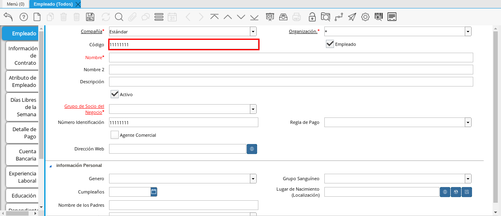
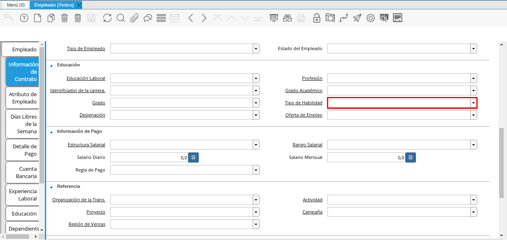
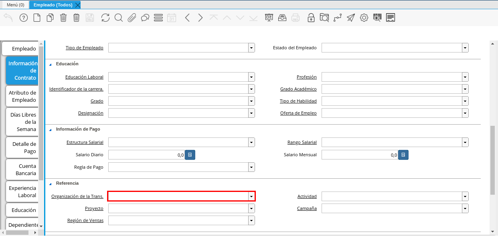
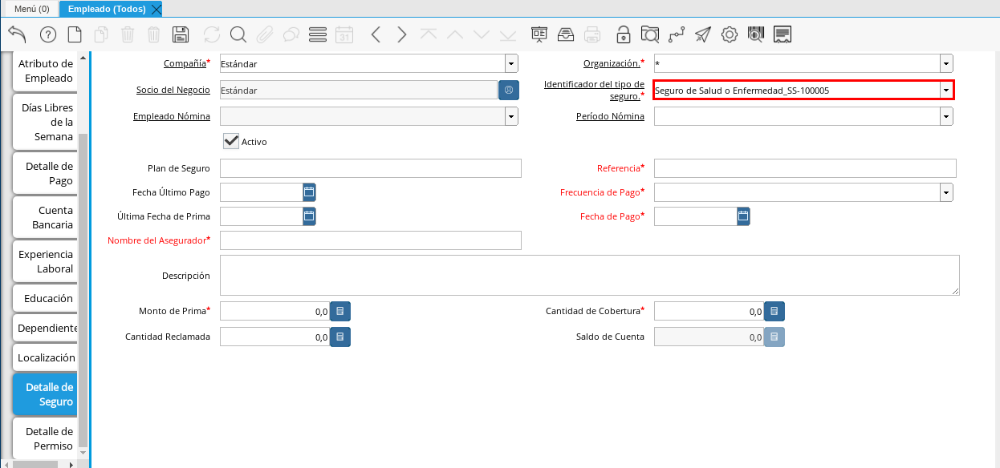

.. |Campo Nombre 2| image:: resources/nombre2.png 

.. |Opción OK| image:: resources/ok.png 

.. |Campo Fecha de Nacimiento de Esposo(a)| image:: resources/naciesposo.png 

.. |Campo Estado del Empleado| image:: resources/estadoem.png 

.. |Campo Profesión| image:: resources/profe.png 

.. |Campo Proyecto| image:: resources/proyecto.png 

.. |Campo Valor Mínimo| image:: resources/minimo.png 

.. |Campo Teléfono Localización| image:: resources/telelocal.png 

.. _documento/socio-empleado:

Proceso de Registro del Socio del Negocio Empleado
--------------------------------------------------

#. En el menú de ADempiere, ubique y seleccione la carpeta "**Gestión de Recursos Humanos y Nómina**", luego seleccione la carpeta "**Recursos Humanos**", por último seleccione la carpeta "**Configuración de Empleado**" y la ventana "**Empleado (Todos)**".

    |Menú de ADempiere| image:: resources/menu.png 
    
    Imagen 1. Menú de ADempiere

Ventana Principal Empleado
--------------------------

En la ventana "**Empleado (Todos)**", se registran todos los datos personales y laborales que la empresa requiere del socio del negocio empleado, los mismos son utilizados y actualizados a lo largo de su período laboral en dicha empresa. La información del empleado desde el momento en el que inicia su período laboral, hasta el momento actual o el momento en el que termina, se encuentra distribuida en la ventana principal "**Empleado**" y sus (11) once pestañas, explicadas a continuación. 

.. note::

    Cada uno de los campos con el símbolo (*) son obligatorios para el registro.

#. A continuación podrá apreciar la ventana "**Empleado (Todos)**", dónde debe seleccionar el icono de "**Registro Nuevo**" que se encuentra ubicado en la barra de herramientas de ADempiere.

    |Ventana Principal Empleados (Todos)| image:: resources/ventana.png 
    
    Imagen 2. Ventana Principal Empleados (Todos)

#. Proceda al llenado de los campos necesarios que a continuación se detallan.

    #. Seleccione en el campo "**Compañía**", la compañía para la cual esta registrando el socio del negocio empleado.

        |Campo Compañía| image:: resources/comp.png 
        
        Imagen 3. Campo Compañía
    
    #. Seleccione en el campo "**Organización**", la organización para la cual esta registrando el socio del negocio empleado.

        |Campo Organización| image:: resources/organizacion.png 
        
        Imagen 4. Campo Organización

        .. warning:: 

            Para que el socio del negocio este disponible para todas las organizaciones, el mismo deberá estar registrado con la organización en (*), de lo contrario el socio del negocio solo estará disponible para una sola organización. 
    
    #. Introduzca el código de identificación, cédula o rif del socio del negocio en el campo "**Código**", el valor introducido en este campo automáticamente se reflejará en el campo "**Número Identificación**".
        
        |Campo Código| image:: resources/codigo.png 
        
        Imagen 5. Campo Código
    
        .. warning:: 

            Se recomienda que al ingresar el valor al campo "**Código**" no se ingrese ningún prefijo, punto, guion o cualquier otro carácter.

    #. Introduzca los (2) dos nombres del socio del negocio empleado en el campo "**Nombre**".

        |Campo Nombre| image:: resources/nombre.png 
        
        Imagen 6. Campo Nombre

        .. note:: 

            Si el socio del negocio que esta registrando posee solo un nombre, se debe ingresar solo ese nombre que posee.

    #. Introduzca en el campo "**Nombre 2**", los (2) dos apellidos del socio del negocio empleado.

        |Campo Nombre 2| image:: resources/nombre2.png 
        
        Imagen 7. Campo Nombre 2

        .. note:: 

            Si el socio del negocio que esta registrando posee solo un apellido, se debe ingresar solo ese apellido que posee.

    #. Introduzca en el campo "**Descripción**", una descripción corta con respecto al socio del negocio empleado.

        |Campo Descripción| image:: resources/descripcion.png 
        
        Imagen 8. Campo Descripción

    #. Seleccione el grupo de socio del negocio al que pertenezca el socio del negocio que esta registrando, para este ejemplo el grupo utilizado es "**Empleados**".

        |Campo Grupo de Socio del Negocio| image:: resources/grupo.png 
        
        Imagen 9. Campo Grupo de Socio del Negocio

    #. Seleccione en el campo "**Regla de Pago**" la forma de pago para las facturas, este campo indica de que forma serán pagadas las facturas al socio del negocio empleado.

        |Campo Regla de Pago| image:: resources/regla.png 
        
        Imagen 10. Campo Regla de Pago

    #. Introduzca en el campo "**Dirección Web**", la dirección web para contactar al empleado, ya que es muy común que un empleado no posea una página web se puede ingresar una cuenta linkedin, bumeran, entre otros.

        |Campo Dirección Web| image:: resources/web.png 
        
        Imagen 11. Campo Dirección Web

    #. Seleccione en el campo "**Genero**", el genero del socio del negocio que esta registrando. Para ejemplificar el registro se utiliza el genero "**Femenino**".

        |Campo Genero| image:: resources/genero.png 
        
        Imagen 12. Campo Genero

    #. Seleccione en el campo "**Grupo Sanguíneo**", el grupo sanguíneo del socio del negocio que esta registrando. Para ejemplificar el registro se utiliza el grupo sanguíneo "**B +**".

        |Campo Grupo Sanguíneo| image:: resources/sangre.png 
        
        Imagen 13. Campo Grupo Sanguíneo

    #. Seleccione en el campo "**Cumpleaños**", la fecha de nacimiento del socio del negocio que esta registrando.

        |Campo Cumpleaños| image:: resources/cumples.png 
        
        Imagen 14. Campo Cumpleaños

    #. Ingrese en el campo "**Lugar de Nacimiento (Localización)**", el lugar de nacimiento del socio del negocio que esta registrando, con ayuda del identificador.

        |Campo Lugar de Nacimiento (Localización)| image:: resources/nacim.png 
        
        Imagen 15. Campo Lugar de Nacimiento (Localización)

        #. Seleccione en el campo "**País**", el país donde nació el socio del negocio que esta registrando. Para ejemplificar el registro se utiliza el país "**Venezuela**".

            |Campo País| image:: resources/pais.png 
            
            Imagen 16. Campo País

        #. Seleccione en el campo "**Estado**", el estado donde nació el socio del negocio que esta registrando. Para ejemplificar el registro se utiliza el estado "**Portuguesa**".

            |Campo Estado| image:: resources/estado.png 
            
            Imagen 17. Campo Estado

        #. Seleccione en el campo "**Ciudad**", la ciudad donde nació el socio del negocio que esta registrando. Para ejemplificar el registro se utiliza la ciudad "**Araure**".

            |Campo Ciudad| image:: resources/ciudad.png 
            
            Imagen 18. Campo Ciudad

        #. Introduzca en el campo "**Dirección 1**", la dirección detallada del lugar donde nació el socio del negocio que esta registrando. Para ejemplificar el registro se utiliza la dirección "**Av Dr Rafael Caldera**".

            |Campo Dirección 1| image:: resources/direccion.png 
            
            Imagen 19. Campo Dirección 1

        #. Introduzca en el campo "**Dirección 2**", el nombre del lugar donde nació el socio del negocio que esta registrando. Para ejemplificar el registro se utiliza el nombre "**Hospital J.M. Casal Ramos**".

            |Campo Dirección 2| image:: resources/direccion2.png 
            
            Imagen 20. Campo Dirección 2

        #. Introduzca en el campo "**Código Postal**", el código postal de la ciudad donde nació el socio del negocio que esta registrando. Para ejemplificar el registro se utiliza el código "**3301**".

            |Campo Código Postal| image:: resources/postal.png 
            
            Imagen 21. Campo Código Postal

        #. Seleccione la opción "**OK**", para cargar el registro al campo "**Lugar de Nacimiento**".

            |Opción OK| image:: resources/ok.png 
            
            Imagen 22. Opción OK

    #. Seleccione en el campo "**Estado Marital**", el estado civil del socio del negocio que esta registrando. Para ejemplificar el registro se utiliza el estado marital "**Casado**".

        |Campo Estado Marital| image:: resources/marital.png 
        
        Imagen 23. Campo Estado Marital

#. Seleccione el icono "**Guardar Cambios**" ubicado en la barra de herramientas para guardar los datos ingresados.

    |Icono Guardar Cambios1| image:: resources/guardar.png 
    
    Imagen 24. Icono Guardar Cambios

.. warning:: 

    Recuerde guardar el registro de los campos cada vez que se vaya a posicionar en una pestaña de la ventana empleado (todos). 

Pestaña Información de Contrato
*******************************

La información ingresada en esta pestaña puede variar al momento de la elaboración del contrato, dependiendo de la situación en la que se encuentre el socio del negocio que esta registrando. Un mismo socio del negocio puede tener un "**Estado Marital**" en un contrato y otro en su siguiente contrato, lo mismo sucede con cada uno de los grupos de campos que contiene la pestaña "**Información de Contrato**".

#. Seleccione la pestaña "**Información de Contrato**" y proceda al llenado de los campos correspondientes.

    |Pestaña Información de Contrato| image:: resources/ventcontrato.png 
    
    Imagen 25. Pestaña Información de Contrato

    #. Introduzca en el campo "**Nombre**", los (2) dos nombres de la persona a quien va emitido el contrato.

        |Campo Nombre Contrato| image:: resources/nomcontrato.png 
        
        Imagen 26. Campo Nombre

        .. note:: 

            Se ingresa la información del representante legal del socio del negocio empleado, cuando este es menor de edad al momento de la elaboración del contrato de trabajo.

    #. Introduzca en el campo "**Nombre 2**", los (2) dos apellidos de la persona a quien va emitido el contrato.

        |Campo Nombre 2 Contrato| image:: resources/apecontrato.png 
        
        Imagen 27. Campo Nombre 2 

        .. note:: 

            Se ingresa la información del representante legal del socio del negocio empleado, cuando este es menor de edad al momento de la elaboración del contrato de trabajo.

    #. Introduzca en el campo "**Código Nacional**", el código que identifica al socio del negocio empleado, este código es diferente a la cédula.
            
        |Campo Código Nacional| image:: resources/codcontrato.png 
        
        Imagen 28. Campo Código Nacional
        
        .. warning:: 

            Se recomienda que al ingresar el valor al campo "**Código Nacional**" no se ingrese ningún prefijo, punto, guion o cualquier otro carácter.
                
    #. Introduzca en el campo "**Código Seguridad Social**", el código del seguro social de la persona a quien va emitido el contrato.

        |Campo Seguridad Social| image:: resources/codseguro.png 

        Imagen 29. Campo Código Seguridad Social

        .. note::  

            El código de seguridad social se refiere al código del seguro social del empleado, es decir, la cédula del empleado.

    #. Seleccione en el campo "**Nacionalidad**", la nacionalidad de la persona a quien va emitido el contrato. Para ejemplificar el registro se utiliza la nacionalidad "**Venezuela**".

        |Campo Nacionalidad| image:: resources/nacionalidad.png 
        
        Imagen 30. Campo Nacionalidad

    #. Introduzca en el campo "**Marca de Identificación**", una descripción que identifica al socio del negocio empleado. Para ejemplificar el registro es utilizada la descripción "**Alta con tatuaje en todo el brazo**".

        |Campo Marca de Identificación| image:: resources/marcaiden.png  
        
        Imagen 31. Campo Marca de Identificación

    #. Introduzca en el campo "**Estado Marital**", el estado marital de la persona a quien va emitido el contrato. Para ejemplificar el registro se utiliza el estado marital "**Casado**".

        |Campo Estado Marital2| image:: resources/maritalcon.png 
        
        Imagen 32. Campo Estado Marital

    #. Introduzca en el campo "**Nombre de Esposo(a)**", el nombre del esposo(a) de la persona a quien va emitido el contrato.

        |Campo Nombre de Esposo(a)| image:: resources/esposo.png 
        
        Imagen 33. Campo Nombre de Esposo(a)

    #. Seleccione en el campo "**Fecha de Aniversario de Matrimonio**", la fecha en la que se realizó el matrimonio.

        |Campo Fecha de Aniversario de Matrimonio| image:: resources/fematrimonio.png 
        
        Imagen 34. Campo Fecha de Aniversario de Matrimonio

    #. Seleccione en el campo "**Fecha de Nacimiento de Esposo(a)**", la fecha en la que nació el esposo(a).

        |Campo Fecha de Nacimiento de Esposo(a)| image:: resources/naciesposo.png 
        
        Imagen 35. Campo Fecha de Nacimiento de Esposo(a)

    #. Introduzca en el campo "**Código de Validación**", el código de marcaje del empleado en la empresa. Para ejemplificar el registro es utilizado el código "**0001**".

        |Campo Código de Validación| image:: resources/valida.png 
        
        Imagen 36. Código de Validación

    #. Seleccione en el campo "**Nómina**", la nómina a ser pagada al socio del negocio empleado que se esta registrando.

        |Campo Nómina| image:: resources/nomina.png 
        
        Imagen 37. Campo Nómina

    #. Seleccione en el campo "**Departamento Nómina**", el departamento al que pertenece el socio del negocio que esta resgistrando.

        |Campo Departamento Nómina| image:: resources/departamento.png 
        
        Imagen 38. Campo Departamento Nómina

    #. Introduzca en el campo "**Fecha de Inicio**", la fecha de inicio del contrato que se esta creando.

        |Campo Fecha de Inicio| image:: resources/inicio.png 
        
        Imagen 39. Fecha de Inicio

    #. Seleccione en el campo "**Puesto Nómina**", el puesto que tiene el socio del negocio que esta registrando.

        |Campo Puesto Nómina| image:: resources/puesto.png 
        
        Imagen 40. Campo Puesto Nómina

    #. Seleccione en el campo "**Tipo de Trabajo**", el trabajo a desempeñar por el empleado en la empresa.

        |Campo Tipo de Trabajo| image:: resources/tipo.png 
        
        Imagen 41. Campo Tipo de Trabajo

    #. Seleccione en el campo "**Fecha Final**", la fecha de culminación del contrato del socio del negocio que esta registrando.

        |Campo Fecha Final| image:: resources/final.png 
        
        Imagen 42. Campo Fecha Final

        .. warning:: 

            La fecha final del contrato depende del lapso de duración de contratos que las empresas tengan establecido como políticas de contratación.

    #. Seleccione el checklist "**Gerente**", para indicar que el socio del negocio que esta registrando es un gerente.

        |Campo Gerente| image:: resources/gerente.png 
        
        Imagen 43. Campo Gerente

    #. Seleccione en el campo "**Grupo de Trabajo**", el grupo de trabajo al que pertenece el socio del negocio que esta registrando.

        |Campo Grupo de Trabajo| image:: resources/grupot.png 
        
        Imagen 44. Campo Grupo de Trabajo

    #. Seleccione en el campo "**Tipo de Empleado**", el tipo de empleado al que pertenece el socio del negocio que esta registrando.

        |Campo Tipo de Empleado| image:: resources/tipoem.png 
        
        Imagen 45. Campon Tipo de Empleado

    #. Seleccione en el campo "**Grupo de Turno**", el grupo de turno al que pertenece el socio del negocio que esta registrando.

        |Campo Grupo de Turno| image:: resources/grupotur.png 
        
        Imagen 46. Campo Grupo de Turno

    #. Seleccione en el campo "**Estado del Empleado**", el estado en el que se encuentra el empleado durante la fecha de inicio y final del contrato.

        |Campo Estado del Empleado| image:: resources/estadoem.png 
        
        Imagen 47. Campo Estado del Empleado

    #. Seleccione en el campo "**Educación Laboral**", la educación laboral del socio del negocio que esta registrando.

        |Campo Educación Laboral| image:: resources/edulabo.png 
        
        Imagen 48. Campo Educación Laboral

    #. Seleccione en el campo "**Identificador de la Carrera**", la carrera del socio del negocio que esta registrando.

        |Campo Identificador de la carrera| image:: resources/iden.png 
        
        Imagen 49. Campo Identificador de la Carrera

    #. Seleccione en el campo "**Grado**", el grado de instrucción del socio del negocio que esta registrando.

        |Campo Grado| image:: resources/grado.png 
        
        Imagen 50. Campo Grado

    #. Seleccione en el campo "**Designación**", la designación del socio del negocio que esta registrando.

        |Campo Designación| image:: resources/desig.png 
        
        Imagen 51. Campo Designación

    #. Seleccione en el campo "**Profesión**", la profesión del socio del negocio que esta registrando.

        |Campo Profesión| image:: resources/profe.png 
        
        Imagen 52. Campo Profesión

    #. Seleccione en el campo "**Grado Académico**", nivel de instrucción del socio del negocio que esta registrando.

        |Campo Grado Académico| image:: resources/gradoaca.png 
        
        Imagen 53. Campo Grado Académico

    #. Seleccione en el campo "**Tipo de Habilidad**", el tipo de habilidad del socio del negocio que esta registrando.

        |Campo Tipo de Habilidad| image:: resources/habilidad.png 
        
        Imagen 54. Campo Tipo de Habilidad

    #. Seleccione en el campo "**Oferta de Empleo**", la oferta de empleo del socio del negocio que esta registrando.

        |Campo Oferta de Empleo| image:: resources/oferta.png 
        
        Imagen 55. Campo Oferta de Empleo

    #. Seleccione en el campo "**Estructura Salarial**", la estructura salarial del socio del negocio que esta registrando.

        |Campo Estructura Salarial| image:: resources/estructura.png 
        
        Imagen 56. Campo Estructura Salarial

    #. Introduzca en el campo "**Salario Diario**", el salario diario que le corresponde al socio del negocio que esta registrando.

        |Campo Salario Diario| image:: resources/salario.png 
        
        Imagen 57. Campo Salario Diario

    #. Seleccione en el campo "**Regla de Pago**", la regla de pago establecida para el socio del negocio que esta registrando.

        |Campo Regla de Pago2| image:: resources/reglapago.png 
        
        Imagen 58. Campo Regla de Pago

    #. Seleccione en el campo "**Rango Salarial**", el rango salarial del socio del negocio que esta registrando.

        |Campo Rango Salarial| image:: resources/rango.png 
        
        Imagen 59. Campo Rango Salarial

    #. Introduzca en el campo "**Salario Mensual**", el salario mensual del socio del negocio que esta registrando.

        |Campo Salario Mensual| image:: resources/salariomen.png 
        
        Imagen 60. Campo Salario Mensual

    #. Seleccione en el campo "**Organización de la Transacción**", la organización de la transacción.

        |Campo Organización de la Transacción| image:: resources/orgtran.png 
        
        Imagen 61. Campo Organización de la Transacción

    #. Seleccione en el campo "**Proyecto**", el proyecto financiero.

        |Campo Proyecto| image:: resources/proyecto.png 
        
        Imagen 62. Campo Proyecto

    #. Seleccione en el campo "**Región de Ventas**", la región de ventas asignada al socio del negocio empleado para cubrir las transacciones que la empresa posee en dicha región.

        |Campo Región de Ventas| image:: resources/region.png 
        
        Imagen 63. Campo Región de Ventas

    #. Seleccione la actividad en el campo "**Actividad**".

        |Campo Actividad| image:: resources/actividad.png 
        
        Imagen 64. Campo Actividad

    #. Seleccione la campaña en el campo "**Campaña**".

        |Campo Campaña| image:: resources/campana.png 
        
        Imagen 65. Campo Campaña

    #. Seleccione en el campo "**Imagen del Empleado**", la foto o imagen del socio del negocio empleado que esta registrando.

        |Campo Imagen del Empleado| image:: resources/imaempleado.png 
        
        Imagen 66. Campo Imagen del Empleado

    #. Introduzca en el campo "**Dirección Web**", la dirección web de la foto o imagen del socio del negocio que esta registrando.

        |Campo Dirección Web2| image:: resources/direccionweb.png 
        
        Imagen 67. Campo Dirección Web

    #. Seleccione en el campo "**Imagen del Pulgar**", la imagen del pulgar del socio del negocio que esta registrando.

        |Campo Imagen del Pulgar| image:: resources/pulgar.png 
        
        Imagen 68. Campo Imagen del Pulgar

    #. Seleccione en el campo "**Logo**", el logo de la empresa.

        |Logo| image:: resources/logo.png 
        
        Imagen 69. Logo

.. warning:: 

    Recuerde guardar el registro de los campos cada vez que se vaya a posicionar en una pestaña de la ventana empleado (todos). 

Pestaña Atributo de Empleado
****************************

En una empresa los empleados presentan atributos diferentes, los mismos son definidas en la pestaña "**Atributo de Empleado**" para que sean aplicados a la nómina al momento de la ejecución. Los valores de algunos factores de la nómina varían según el socio del negocio empleado, dichos valores son utilizados para aplicar algún concepto de asignación o deducción a la nómina del mismo.

#. Seleccione la pestaña "**Atributo de Empleado**" y proceda al llenado de los campos correspondientes.

    |Pestaña Atributo de Empleado| image:: resources/pestatributo.png 
    
    Imagen 70. Pestaña Atributo de Empleado

    #. Seleccione en el campo "**Relación con Socios del Negocio**", el socio del negocio correspondiente.

        |Campo Relación con Socios del Negocio| image:: resources/relacion.png 
        
        Imagen 71. Campo Relación con Socios del Negocio

    #. Seleccione en el campo "**Concepto Nómina**", las asignaciones o deducciones que definen la nómina del socio del negocio que esta registrando.

        |Campo Concepto Nómina| image:: resources/concepto.png 
        
        Imagen 72. Campo Concepto Nómina

        .. warning:: 

            Al seleccionar cualquier valor en este campo podrá apreciar un grupo de campos necesarios para el registro de atributos del socio del negocio que se esta registrando.

    #. Introduzca en el campo "**Descripción**", una breve descripción del registro de concepto de nómina que esta realizando.

        |Campo Descripción Concepto| image:: resources/des.png 
        
        Imagen 73. Campo Descripción

    #. Introduzca en el campo "**No. de Referencia**", el número de referencia del socio del negocio que esta registrando.

        |Campo No. de Referencia| image:: resources/referencia.png 
        
        Imagen 74. Campo No. de Referencia

    #. Introduzca en el campo "**Monto**", el monto correspondiente al registro que esta realizando.

        |Campo Monto| image:: resources/monto.png 
        
        Imagen 75. Campo Monto

    #. Introduzca en el campo "**Valor Máximo**", el valor máximo para el registro que esta realizando.

        |Campo Valor Máximo| image:: resources/maximo.png 
        
        Imagen 76. Campo Valor Máximo

    #. Introduzca en el campo "**Valor Mínimo**", el valor mínimo para el registro que esta realizando.

        |Campo Valor Mínimo| image:: resources/minimo.png 
        
        Imagen 77. Campo Valor Mínimo

    #. Seleccione en el campo "**Válido Desde**", la fecha de inicio de aplicación del registro que esta realizando.

        |Campo Válido Desde| image:: resources/desde.png 
        
        Imagen 78. Campo Válido Desde

    #. Seleccione en el campo "**Válido Hasta**", la fecha final de aplicación del registro que se esta realizando.

        |Campo Válido Hasta| image:: resources/hasta.png 
        
        Imagen 79. Campo Válido Hasta

.. warning:: 

    Recuerde guardar el registro de los campos cada vez que se vaya a posicionar en una pestaña de la ventana empleado (todos). 

Pestaña Días Libres de la Semana
********************************

Según lo establecido en el artículo 173 de la LOTTT, una jornada de trabajo no excederá de cinco días a la semana y el trabajador o trabajadora tendrá derecho a dos días de descanso, continuos y remunerados durante cada semana de labor.

En la pestaña "**Días Libres de la Semana**" se deben seleccionar los checklist de los días libres que le corresponden al socio del negocio empleado que esta registrando.

#. Seleccione la pestaña "**Días Libres de la Semana**" y proceda al llenado de los campos correspondientes.

    |Pestaña Días Libres de la Semana| image:: resources/pestdias.png 
    
    Imagen 80. Pestaña Días Libres de la Semana

    #. Introduzca en el campo "**Descripción**", una breve descripción de los días libres que le corresponden al socio del negocio que esta registrando. Este campo es opcional, sin embargo, sirve de referencia para el registro del socio del negocio empleado en la empresa cuando se utilizan turnos rotativos.

        |Campo Descripción2| image:: resources/desdias.png 
        
        Imagen 81. Campo Descripción

    #. Seleccione los checklist correspondientes a los días libres del socio del negocio empleado que esta registrando. Para ejemplificar el registro se tildan los días "**Sábado**" y "**Domingo**".

        |Checklist Días Libres de la Semana| image:: resources/dias.png 
        
        Imagen 82. Checklist Días Libres de la Semana

.. warning:: 

    Recuerde guardar el registro de los campos cada vez que se vaya a posicionar en una pestaña de la ventana empleado (todos). 

Pestaña Detalle de Pago
***********************

La pestaña "**Detalle de Pago**", muestra de forma resumida la información de pago seleccionada para el socio del negocio empleado que esta registrando. Cualquier modificación que se realice en los campos de esta pestaña modificará el valor de esos campos en la pestaña "**Información de Contrato**" y viceversa. 

#. Seleccione la pestaña "**Detalle de Pago**" y podrá apreciar la información de pago del socio del negocio empleado ingresada en la pestaña "**Información de Contrato**".  

    |Pestaña Detalle de Pago| image:: resources/pestdetallepago.png 
    
    Imagen 83. Pestaña Detalle de Pago

#. Si es necesario modificar los campos que contiene la ventana, proceda a realizar el siguiente procedimiento.

    #. Introduzca en el campo "**Salario Mensual**", el salario mensual que le corresponde al socio del negocio empleado que esta registrando.

        |Campo Salario Mensual Detalle| image:: resources/detallemensual.png 
        
        Imagen 84. Campo Salario Mensual 

    #. Introduzca en el campo "**Salario Diario**", el salario diario que le corresponde al socio del negocio empleado que esta registrando.

        |Campo Salario Diario Detalle| image:: resources/detallediario.png 
        
        Imagen 85. Campo Salario Diario 

    #. Seleccione en el campo "**Regla de Pago**", la forma de pago establecida para el socio del negocio empleado que esta registrando.

        |Campo Regla de Pago Detalle| image:: resources/detalleregla.png 
        
        Imagen 86. Campo Regla de Pago

    .. warning:: 

        Recuerde guardar el registro de los campos cada vez que se vaya a posicionar en una pestaña de la ventana empleado (todos).

#. Regrese a la pestaña "**Información de Contrato**" para que pueda apreciar el comportamiento de los cambios realizados en la pestaña "**Detalle de Pago**"

    |Pestaña Información de Contrato Detalle| image:: resources/cambios.png 
    
    Imagen 87. Pestaña Información de Contrato 

Pestaña Cuenta Bancaria
***********************

En esta pestaña se registran los datos bancarios del socio del negocio empleado, esta información es necesaria para cancelar al empleado las remuneraciones correspondientes por los servicios prestados a la empresa.

#. Seleccione la pestaña "**Cuenta Bancaria**" que se encuentra ubicada del lado izquierdo de la ventana socio del negocio y proceda al llenado de los campos correspondientes.

    |Pestaña Cuenta Bancaria| image:: resources/pestcuenta.png 
    
    Imagen 88. Pestaña Cuenta Bancaria

    #. En el campo "**Banco**" seleccione el banco a registrar con ayuda del ícono identificador (adjunto imagen).

        |Campo Banco| image:: resources/identibanco.png 
        
        Imagen 89. Campo Banco

        #. A continuación podrá apreciar la siguiente ventana con los diferentes bancos, dónde debe seleccionar el banco que posee el socio del negocio empleado y la opción "**OK**" para cargar los datos al formulario.

            |Opción Ok| image:: resources/selecbanco.png 
            
            Imagen 90. Opción OK

    #. Seleccione en el campo "**Tipo de Cuenta Bancaria**", el tipo de cuenta bancaria correspondiente a la cuenta que esta registrando. Para ejemplificar el registro es utilizado el tipo de cuenta corriente.

        |Campo Tipo de Cuenta Bancaria| image:: resources/tipocuenta.png 
        
        Imagen 91. Campo Tipo de Cuenta Bancaria

    #. Introduzca en el campo "**No. De Cuenta**", el número de cuenta bancaria que esta registrando.

        |Campo No. De Cuenta| image:: resources/numcuenta.png 
        
        Imagen 92. Campo No. De Cuenta

    #. Introduzca el código de identificación, cédula o rif del titular de la cuenta bancaria que esta registrando, en el campo "**No. Seguro Social**".

        |Campo No. Seguro Social Cuenta| image:: resources/cedutitular.png 
        
        Imagen 93. Campo No. Seguro Social

        .. warning:: 

            Se recomienda que al ingresar el valor al campo "**No. Seguro Social**" no se ingrese ningún prefijo, punto, guion o cualquier otro carácter.    

    #. Introduzca el nombre de referencia en el campo "**Nombre**", en este campo va el nombre del titular de la cuenta bancaria que esta registrando.

        |Campo Nombre Titular| image:: resources/titularcuenta.png 
        
        Imagen 94. Campo Nombre Titular

    #. Introduzca en el campo "**Cta. Correo Electrónico**", el correo electrónico asociado a la cuenta bancaria que esta registrando.

        |Campo Cta. Correo Electrónico| image:: resources/correocuenta.png 
        
        Imagen 95. Campo Cta. Correo Electrónico

#. Seleccione el icono "**Guardar Cambios**" en la barra de herramientas de ADempiere.

    |Icono Guardar Cambios2| image:: resources/guardarcuenta.png 
    
    Imagen 96. Icono Guardar Cambios

.. warning:: 

    Si el empleado posee otra cuenta bancaria para registrar, seleccione el icono "**Registro Nuevo**" en la barra de herramientas de ADempiere en la pestaña "**Cuenta Bancaria**" y proceda al llenado de los campos explicados anteriormente.

Pestaña Experiencia Laboral
***************************

La experiencia laboral de las personas forman su hoja de vida laboral, en cada empresa la persona adquiere conocimientos referente al entorno que las rodea y las actividades que en la misma se realizan. En la pestaña "**Experiencia Laboral**", se registran las diferentes experiencias laborales que ha tenido el socio del negocio empleado que esta registrando.

#. Seleccione la pestaña "**Experiencia Laboral**" y proceda al llenado de los campos correspondientes.

    |Pestaña Experiencia Laboral| image:: resources/pestexperiencia.png 
    
    Imagen 97. Pestaña Experiencia Laboral

    #. Introduzca en el campo "**Compañía**", el nombre de la empresa en la cual trabajo el socio del negocio empleado que esta registrando.

        |Campo Compañía Experiencia| image:: resources/empresareferen.png 
        
        Imagen 98. Campo Compañía

    #. Seleccione en el campo "**Desde Fecha**", la fecha en la cual comenzo a realizar sus actividades laborales en la empresa.

        |Campo Desde Fecha| image:: resources/desdereferen.png 
        
        Imagen 99. Campo Desde Fecha

    #. Seleccione en el campo "**A Fecha**", la fecha en la cual termino de realizar sus actividades laborales en la empresa.

        |Campo A Fecha| image:: resources/hastareferen.png 
        
        Imagen 100. Campo A Fecha

    #. Introduzca en el campo "**Designación (Enlazado)**", 

        |Campo Designación (Enlazado)| image:: resources/designacionenla.png 
        
        Imagen 101. Campo Designación (Enlazado)

    #. Introduzca en el campo "**Designación (Retirado)**", 

        |Campo Designación (Retirado)| image:: resources/designacionreti.png 
        
        Imagen 102. Campo Designación (Retirado)

    #. Introduzca en el campo "**Comentarios**", cualquier información relevante con respecto a la experiencia en la empresa.

        |Campo Comentarios| image:: resources/comentariosreferen.png 
        
        Imagen 103. Campo Comentarios

#. Seleccione el icono "**Guardar Cambios**" en la barra de herramientas de ADempiere, para guardar los cambios realizados en la pestaña "**Experiencia Laboral**".

    |Icono Guardar Cambios3| image:: resources/guardarexperiencia.png 
    
    Imagen 104. Icono Guardar Cambios

.. warning:: 
    
    Si el empleado posee otras referencias laborales para registrar, seleccione el icono "**Registro Nuevo**" en la barra de herramientas de ADempiere en la pestaña "**Experiencia Laboral**" y proceda al llenado de los campos explicados anteriormente.

Pestaña Educación
*****************

La ley órganica de educación en su artículo 4 de educación y cultura, establece la educación como derecho humano y deber social fundamental orientada al desarrollo del potencial creativo de cada ser humano en condiciones históricamente determinadas, constituye el eje central en la creación, transmisión y reproducción de las diversas manifestaciones y valores culturales, invenciones, expresiones, representaciones y características propias para apreciar, asumir y transformar la realidad.

El Estado asume la educación como proceso esencial para promover, fortalecer y difundir los valores culturales de la venezolanidad. 

#. Seleccione la pestaña "**Educación**" y proceda al llenado de los campos correspondientes.

    |Pestaña Educación| image:: resources/pesteducacion.png 
    
    Imagen 105. Pestaña Educación

    #. Seleccione en el campo "**Grado Académico**", del grado académico del socio del negocio empleado que esta registrando.

        |Campo Grado Académico2| image:: resources/gradoacade.png 
        
        Imagen 106. Campo Grado Académico

    #. Introduzca en el campo "**Colegio**", el nombre de la institución o colegio donde obtuvo el grado académico que esta registrando.

        |Campo Colegio| image:: resources/colegioacade.png 
        
        Imagen 107. Campo Colegio

    #. Introduzca en el campo "**Dirección de Escuela / Colegio**", la dirección de la institución o colegio donde obtuvo el grado académico que esta registrando.

        |Campo Dirección de Escuela / Colegio| image:: resources/direacade.png 
        
        Imagen 108. Campo Dirección de Escuela / Colegio

    #. Introduzca en el campo "**Duración**", el tiempo de duración para obtener el grado académico seleccionado.

        |Campo Duración| image:: resources/anoacade.png 
        
        Imagen 109. Campo Duración

    #. Introduzca en el campo "**Fecha de Finalización**", el año en el cual obtuvo el grado académico seleccionado.

        |Campo Fecha de Finalización| image:: resources/finalacade.png 
        
        Imagen 110. Campo Fecha de Finalización

    #. Introduzca en el campo "**Comentarios**", cualquier información relevante para el registro.

        |Campo Comentario| image:: resources/comenacade.png 
        
        Imagen 111. Campo Comentarios

.. warning:: 

    Recuerde guardar el registro de los campos cada vez que se vaya a posicionar en una pestaña de la ventana empleado (todos). 

Pestaña Dependientes
********************

En esta pestaña se registran los datos de cada uno de los familiares que dependen o no del socio del negocio empleado que esta registrando, esta información es utilizada por la empresa para asuntos de seguros, actividades recreativas y sociales, becas, donaciones, pagos, entre otros motivos.

#. Seleccione la pestaña "**Dependientes**" y proceda al llenado de los campos correspondientes.

    |Pestaña Dependientes| image:: resources/pestdependientes.png 
    
    Imagen 112. Pestaña Dependientes

    #. Seleccione en el campo "**Relación de Empleados**", la relación que tiene el dependiente con el socio del negocio empleado que esta registrando. Para ejemplificar el registro es utilizada la opción "**Hijo (a)**".

        |Campo Relación de Empleados| image:: resources/relaciondepen.png 
        
        Imagen 113. Campo Relación de Empleados

    #. Introduzca el código de identificación, cédula o rif del dependiente que esta registrando, en el campo "**Código**".

        |Campo Código2| image:: resources/codidependiente.png 
        
        Imagen 114. Campo Código

        .. warning:: 

            Se recomienda que al ingresar el valor al campo "**Código**" no se ingrese ningún prefijo, punto, guion o cualquier otro carácter.

    #. Introduzca en el campo "**Nombre**", el nombre completo del dependiente que esta registrando.

        |Campo Nombre Dependiente| image:: resources/nomdependiente.png 
        
        Imagen 115. Campo Nombre Dependiente

    #. Seleccione en el campo "**Socio del Negocio Relacionado**", el socio del negocio empleado que esta registrando.

        |Campo Socio del Negocio Relacionado| image:: resources/socioreladepen.png 

        Imagen 116. Campo Socio del Negocio Relacionado

    .. warning:: 

        El campo "**Socio del Negocio Relacionado**", es utilizado cuando se va a realizar algún pago a un dependiente del socio del negocio empleado que esta registrando. Se selecciona el socio del negocio empleado porque sus datos bancarios se encuentran registrados y validados.

    #. Seleccione en el campo "**Cumpleaños**", la fecha de nacimiento del dependiente que esta registrando.

        |Campo Cumpleaños Dependiente| image:: resources/nacidepen.png 
        
        Imagen 117. Campo Cumpleaños Dependiente
    
    #. Seleccione en el campo "**Genero**", el genero del dependiente que esta registrando.

        |Campo Genero Dependiente| image:: resources/genedepen.png 
        
        Imagen 118. Campo Genero

    #. Seleccione en el campo "**Profesión**", la profesión del dependiente que esta registrando. Esta opción no es obligatoria, debe ser seleccionada si el dependiente posee cualquiera de las opciones que contiene este campo.

        |Campo Profesión Dependiente| image:: resources/profedepen.png 
        
        Imagen 119. Campo Profesión

    #. Seleccione en el campo "**Identificador de la Carrera**", la carrera del dependiente que esta registrando. Esta opción no es obligatoria, debe ser seleccionada si el dependiente posee cualquiera de las opciones que contiene este campo.

        |Campo Identificador de la Carrera Dependiente| image:: resources/idencadepen.png 
        
        Imagen 120. Campo Identificador de la Carrera

    #. Seleccione en el campo "**Grado Académico**", el grado académico del dependiente que esta registrando. Esta opción no es obligatoria, debe ser seleccionada si el dependiente posee cualquiera de las opciones que contiene este campo.

        |Campo Grado Académico3| image:: resources/gradoacadepen.png 
        
        Imagen 121. Campo Grado Académico

    #. Seleccione en el campo "**Grado**", el grado de instrucción del dependiente que esta registrando. Esta opción no es obligatoria, debe ser seleccionada si el dependiente posee cualquiera de las opciones que contiene este campo.

        |Campo Grado Dependiente| image:: resources/gradodepen.png 
        
        Imagen 122. Campo Grado Dependiente

    #. Tilde el checklist "**Estudiante Activo**", si el dependiente que esta registrando se encuentra cursando estudios en la actualidad. Esta opción no es obligatoria, debe ser seleccionada solo si el dependiente se encuentra estudiando.

        |Checklist Estudiante Activo| image:: resources/estudepen.png 
        
        Imagen 123. Checklist Estudiante Activo

    #. Tilde el checklist "**Becado**", si el dependiente que esta registrando se encuentra becado. Esta opción no es obligatoria, debe ser seleccionada solo si el dependiente se encuentra becado.

        |Checklist Becado| image:: resources/becadepen.png 
        
        Imagen 124. Checklist Becado

.. warning:: 

    Recuerde guardar el registro de los campos cada vez que se vaya a posicionar en una pestaña de la ventana empleado (todos). 

Pestaña Localización
********************

La localización de un socio del negocio es muy importante para una empresa por diferentes motivos. Si el socio del negocio es un empleado de la misma, se deben registrar con exactitud los datos de la dirección por alguna situación fuera de control como una emergencia o otro suceso capaz de afectar el funcionamiento cotidiano de la empresa, así como también, el rendimiento del empleado en la misma.

#. Seleccione la pestaña "**Localización**" y proceda al llenado de los campos correspondientes.

    |Pestaña Localización| image:: resources/localizacion.png 
    
    Imagen 125. Pestaña Localización

    #. Seleccione en el campo "**Tipo de Contacto**", el tipo de contacto de la localización a registrar para el socio del negocio empleado. Para ejemplificar el registro es utilizada la opción "**Primaria**".

        |Campo Tipo de Contrato| image:: resources/tipocontacto.png 
        
        Imagen 126. Campo Tipo de Contrato

        .. note:: 

            En esta pestaña el campo "**Tipo de Contacto**" posee dos opciones, la opción "**Primaria**" se utiliza para registrar la dirección principal del socio del negocio empleado que esta registrando, esta opción también es utilizada para registrar la dirección de residencia o hospedaje temporal del empleado cuando el mismo posee otra dirección fija. En el caso de la dirección fija, la misma es registrada con la opción "**Emergencia**".

    #. Introduzca en el campo "**Persona de Contacto**", el nombre de la persona de contacto de la localización a registrar para el socio del negocio empleado.

        |Campo Persona de Contacto| image:: resources/perconta.png 
        
        Imagen 127. Campo Persona de Contacto

    #. Seleccione en el campo "**Localización / Dirección**" con ayuda del identificador, la localización referente al tipo de contacto seleccionado.

        |Campo Localización / Dirección| image:: resources/locadirec.png 
        
        Imagen 128. Campo Localización / Dirección

        #. Seleccione en el campo "**País**", el país donde se encuentra domiciliado el socio del negocio que esta registrando.

            |Campo País Localización| image:: resources/pais.png 
            
            Imagen 129. Campo País Localización

        #. Seleccione en el campo "**Estado**", el estado donde se encuentra domiciliado el socio del negocio que esta registrando.

            |Campo Estado Localización| image:: resources/estado.png 
            
            Imagen 130. Campo Estado Localización

        #. Seleccione en el campo "**Ciudad**", la ciudad donde se encuentra domiciliado el socio del negocio que esta registrando.

            |Campo Ciudad Localización| image:: resources/ciudad.png 
            
            Imagen 131. Campo Ciudad Localización

        #. Introduzca la dirección detallada del socio del negocio empleado en el campo "**Dirección 1**" y seleccione la opción "**OK**".

            |Campo Dirección 1 Localización| image:: resources/direccionlocali.png 
            
            Imagen 132. Campo Dirección 1 Localización

    #. Introduzca en el campo "**Teléfono**", el número de teléfono local de la dirección seleccionada.

        |Campo Teléfono Localización| image:: resources/telelocal.png 
        
        Imagen 133. Campo Teléfono

    #. Introduzca en el campo "**Teléfono Móvil**", el número de teléfono móvil de la persona de contacto.

        |Campo Teléfono Móvil Localización| image:: resources/telemovil.png 
        
        Imagen 134. Campo Teléfono Móvil

    #. Introduzca en el campo "**Teléfono Móvil**", el número de teléfono móvil alternativo de la persona de contacto.

        |Campo Teléfono Móvil Alternativo| image:: resources/telefmovil.png 
        
        Imagen 135. Campo Teléfono Móvil Alternativo

    #. Introduzca en el campo "**Fax**", el fax de la persona de contacto.

        |Campo Fax Localización| image:: resources/fax.png 
        
        Imagen 136. Campo Fax Localización

    #. Introduzca en el campo "**Email**", el email de la persona de contacto.

        |Campo Email Localización| image:: resources/email.png 
        
        Imagen 137. Campo Email Localización

#. Seleccione el icono "**Guardar Cambios**" en la barra de herramientas de ADempiere, para guardar los cambios realizados en la pestaña "**Localización**".

    |Icono Guardar Cambios4| image:: resources/guardarloca.png 
    
    Imagen 138. Icono Guardar Cambios

.. warning:: 
                
    Si el empleado posee otra dirección de localización para registrar, seleccione el icono "**Registro Nuevo**" en la barra de herramientas de ADempiere en la pestaña "**Localización**" y proceda al llenado de los campos explicados anteriormente.

Pestaña Detalle de Seguro
*************************

En esta pestaña se registra toda la información del socio del negocio empleado, con respecto a los diferentes seguros que pueda tener. En la misma se detallan los montos de cobertura, el saldo disponible del seguro y otros detalles de igual importancia. 

#. Seleccione la pestaña "**Detalle de Seguro**" y proceda al llenado de los campos correspondientes.

    |Pestaña Detalle de Seguro| image:: resources/pestdetalleseg.png 
    
    Imagen 139. Pestaña Detalle de Seguro

    #. Seleccione en el campo "**Identificador del Tipo de Seguro**", el tipo de seguro que esta registrando al socio del negocio empleado. Para ejemplificar el registro es utilizado el tipo de seguro "**Seguro de Salud o Enfermedad_SS-100005**".

        |Campo Identificador del Tipo de Seguro| image:: resources/tiposeguro.png 
        
        Imagen 140. Campo Identificador del Tipo de Seguro

    #. Seleccione en el campo "**Período Nómina**", el período de la nómina. Para ejemplificar el registro es utilizado el período de nómina "**01/10/2019 Hacia 31/10/2019**".

        |Campo Período Nómina| image:: resources/periseguro.png 
        
        Imagen 141. Campo Período Nómina

    #. Introduzca en el campo "**Plan de Seguro**", el plan de seguro que esta registrando al socio del negocio empleado.

        |Campo Plan de Seguro| image:: resources/planseguro.png 
        
        Imagen 142. Campo Plan de Seguro

    #. Introduzca en el campo "**Referencia**", la referencia del seguro que esta registrando al socio del negocio empleado. Para ejemplificar el registro es utilizada la cédula del socio del negocio empleado.

        |Campo Referencia| image:: resources/refereseguro.png 
        
        Imagen 143. Campo Referencia

    #. Seleccione en el campo "**Fecha Último Pago**", la fecha del último pago realizado al seguro.

        |Campo Fecha Último Pago| image:: resources/upagoseguro.png 
        
        Imagen 144. Campo Fecha Último Pago

    #. Seleccione en el campo "**Frecuencia de Pago**", la frecuencia establecida para pagar el seguro.

        |Campo Frecuencia de Pago| image:: resources/frecuseguro.png 
        
        Imagen 145. Campo Frecuencia de Pago 

    #. Seleccione en el campo "**Última Fecha de Prima**", la última fecha de pago de la prima.

        |Campo Última Fecha de Prima| image:: resources/primaseguro.png 
        
        Imagen 146. Campo Última Fecha de Prima

    #. Introduzca en el campo "**Nombre del Asegurador**", el nombre de la empresa que ofrece el seguro.

        |Campo Nombre del Asegurador| image:: resources/nombreseguro.png 
        
        Imagen 147. Campo Nombre del Asegurador
    
    #. Seleccione en el campo "**Fecha de Pago**", la proxima fecha establecida para pagar el seguro.

        |Campo Fecha de Pago| image:: resources/pagoseguro.png 
        
        Imagen 148. Campo Fecha de Pago

    #. Introduzca en el campo "**Descripción**", una breve descripción del registro del seguro.

        |Campo Descripción3| image:: resources/descseguro.png 
        
        Imagen 149. Campo Descripción

    #. Introduzca en el campo "**Monto de Prima**", el monto establecido para pagar frecuentemente. El valor de este campo varía según el asegurador y el contrato de seguro.

        |Campo Monto de Prima| image:: resources/montoseguro.png 
        
        Imagen 150. Campo Monto de Prima

    #. Introduzca en el campo "**Cantidad de Cobertura**", el monto total establecido por el seguro para la disposición del empleado cuando lo necesite. El valor de este campo varía según el asegurador y el contrato de seguro.

        |Campo Cantidad de Cobertura| image:: resources/cantiseguro.png 
        
        Imagen 151. Campo Cantidad de Cobertura

    #. Introduzca en el campo "**Cantidad Reclamada**", el monto total utilizado por el empleado.

        |Campo Cantidad Reclamada| image:: resources/reclaseguro.png 
        
        Imagen 152. Campo Cantidad Reclamada

    #. Podrá apreciar en el campo "**Saldo de Cuenta**", el monto total restante para la disposición del empleado cuando lo necesite. El valor de este campo es el resultante de la resta entre el valor del campo "**Cantidad de Cobertura**" y el valor del campo "**Cantidad Reclamada**".

        |Campo Saldo de Cuenta| image:: resources/saldoseguro.png 
        
        Imagen 153. Campo Saldo de Cuenta

#. Seleccione el icono "**Guardar Cambios**" en la barra de herramientas de ADempiere para guardar el registro de la pestaña.

    |Icono Guardar Cambios5| image:: resources/guardarseguro.png 
    
    Imagen 154. Icono Guardar Cambios

.. warning:: 

    Si el empleado posee otro seguro para registrar, seleccione el icono "**Registro Nuevo**" en la barra de herramientas de ADempiere en la pestaña "**Detalle de Seguro**" y proceda al llenado de los campos explicados anteriormente.

Pestaña Detalle de Permiso
**************************

En esta pestaña se registran los diferentes permisos solicitados por el socio del negocio empleado, así como las suspenciones del mismo. En cada registro de permiso o suspención se detallan los días exactos para cada uno.

#. Seleccione la pestaña "**Detalle de Permiso**" y proceda al llenado de los campos correspondientes.

    |Pestaña Detalle de Permiso| image:: resources/pestpermiso.png
    
    Imagen 155. Pestaña Detalle de Permiso

#. Seleccione en el campo "**Tipo de Permiso**", el tipo de permiso solicitado por el socio del negocio empleado. Para ejemplificar el registro es utilizada la opción "**Permiso por Paternidad_PPAT**".

    |Campo Tipo de Permiso| image:: resources/tipopermiso.png 
    
    Imagen 156. Campo Tipo de Permiso

#. Seleccione en el campo "**Válido Desde**", la fecha de inicio del permiso solicitado por el socio del negocio empleado. Para ejemplificar el registro es utilizada la fecha "**24/10/2019**".

    |Campo Válido Desde Permiso| image:: resources/desdepermiso.png 
    
    Imagen 157. Campo Válido Desde

#. Seleccione en el campo "**Válido Hasta**", la fecha de culminación del permiso solicitado por el socio del negocio empleado. Para ejemplificar el registro es utilizada la fecha "**06/11/2019**".

    |Campo Válido Hasta Permiso| image:: resources/hastapermiso.png 
    
    Imagen 158. Campo Válido Hasta

#. Introduzca en el campo "**Número de Permisos Asignados**", el número de días correspondientes al permiso solicitado por el socio del negocio empleado. Existen tipos de permisos que tienen configurado el número de días correspondientes, como es el caso del tipo de permiso utilizado para este ejemplo.

    |Campo Número de Permisos Asignados| image:: resources/numpermiso.png 
    
    Imagen 159. Campo Número de Permisos Asignados

    .. warning:: 

        Al seleccionar un tipo de permiso sin número de días configurado e ingresar un valor en el campo "**Número de Permisos Asignados**", los campos "**Total de Permisos**" y "**Balance**", toman automáticamente dicho valor. De igual manera, los campos "**Permisos Usados**" y "**Última Fecha de Ejecución**" se definen como campos de sólo lectura. 

#. Seleccione el icono "**Guardar Cambios**", para guardar el registro de la pestaña "**Detalle de Permiso**".

    |Icono Guardar Cambios6| image:: resources/guardarpermiso.png 
    
    Imagen 160. Icono Guardar Cambios

!!! note "**NOTA:**"
        
    Este procedimiento realizado aplica solo para los **Socios del Negocio** que cumplan el rol de **Empleado** en una compañía.
