.. |Menú de ADempiere| image:: resources/menu.png
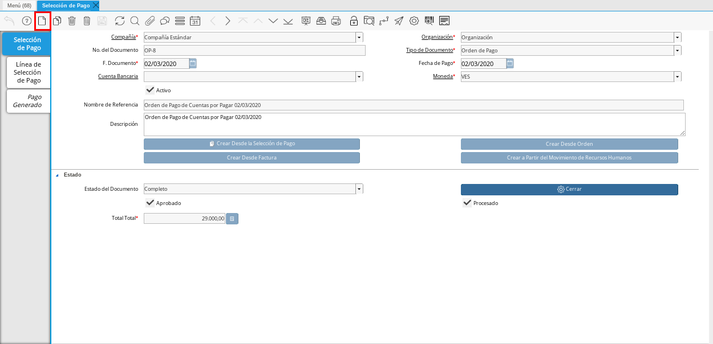
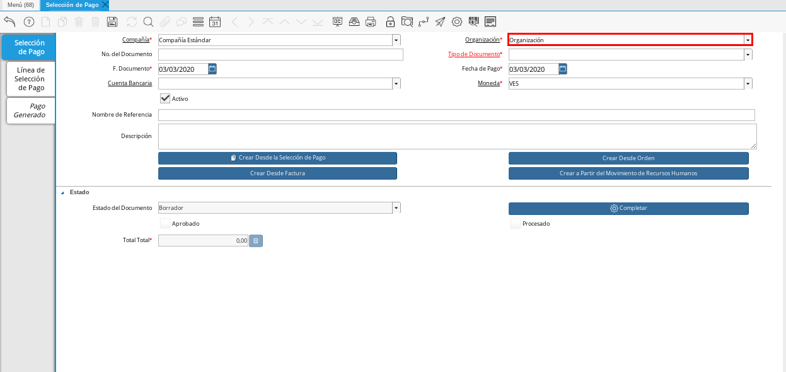
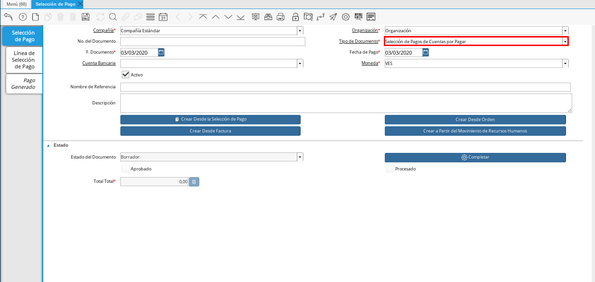
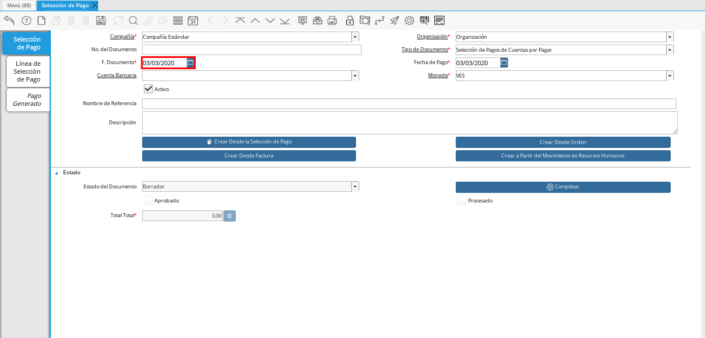
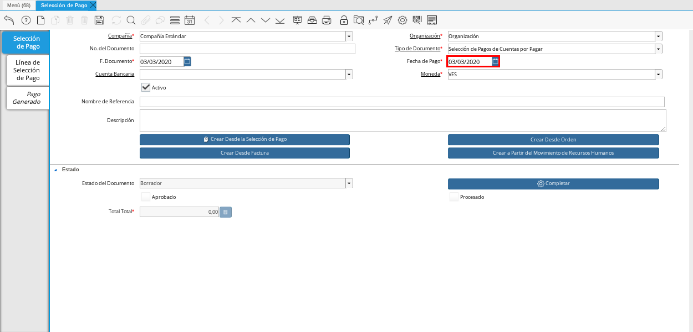
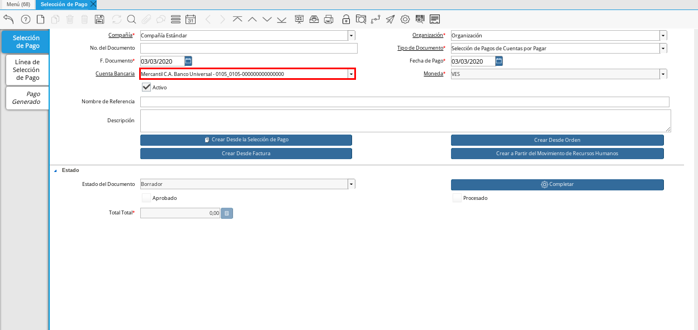
.. |Campo Nombre de Referencia 1| image:: resources/nom-ref2.png
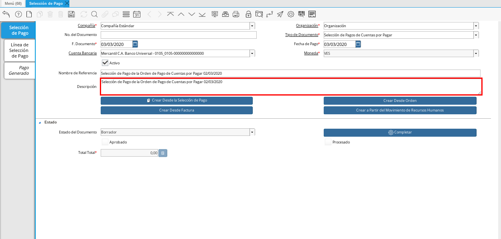
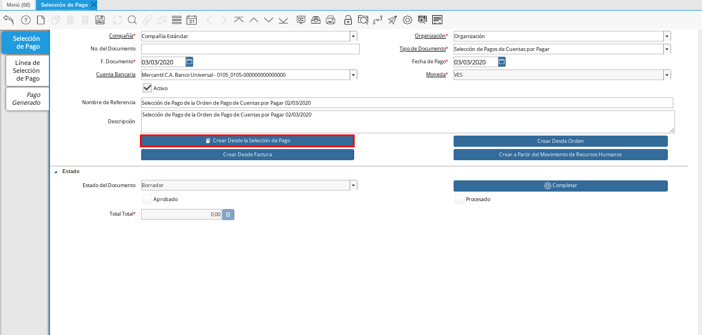
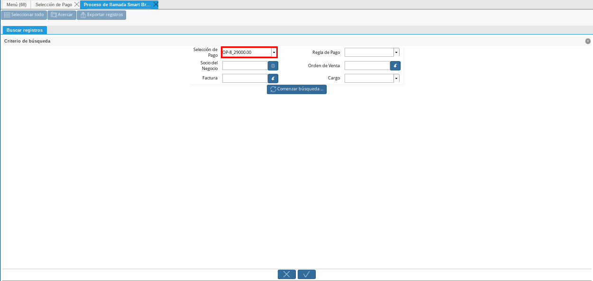
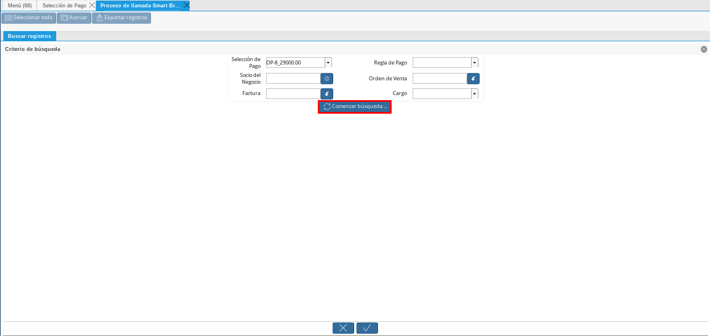
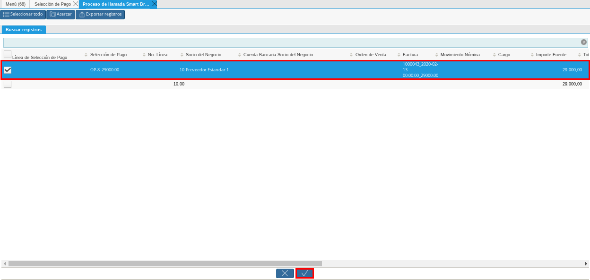
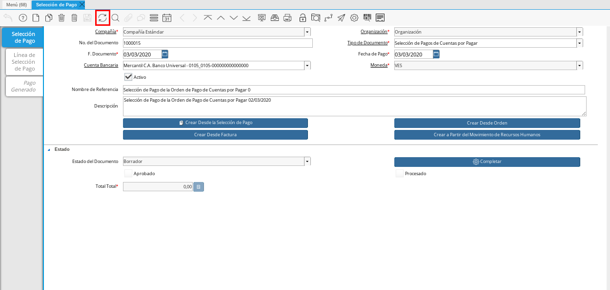
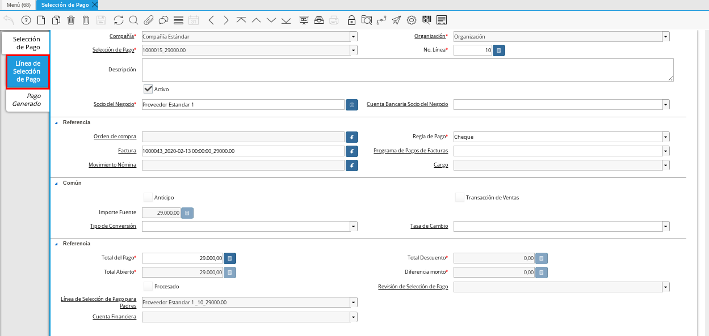
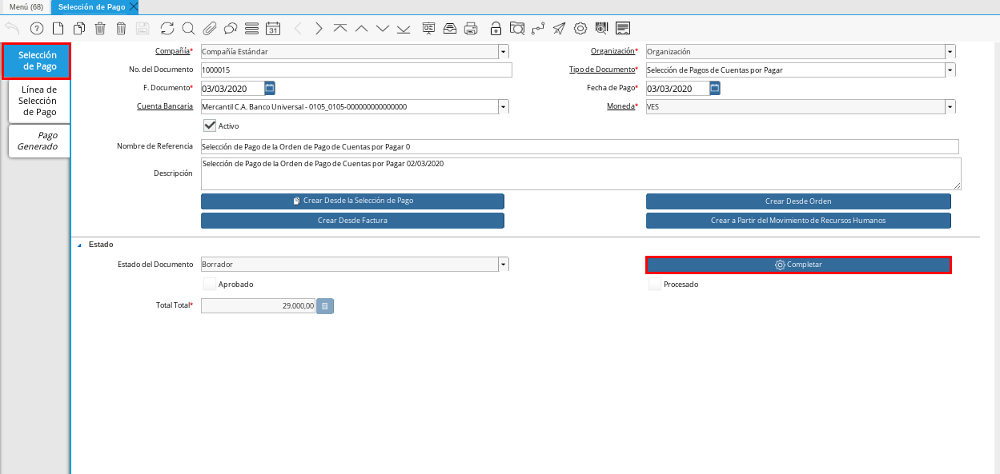
.. |Acción Completar| image:: resources/accion-completar.png

.. _documento/selección-de-pago:

**Selección de Pago de Cuentas por Pagar**
------------------------------------------

#. Ubique y seleccione en el menú de ADempiere, la carpeta "**Gestión de Saldos Pendientes**", luego seleccione la ventana "**Selección de Pagos**".

    |Menú de ADempiere|

    Imagen 1. Menú de ADempiere

    #. Podrá visualizar la ventana "**Selección de Pago**", en la cual debe seleccionar el icono "**Registro Nuevo**" ubicado en la barra de herramientas de ADempiere.

        |Icono Registro Nuevo 1|

        Imagen 2. Icono Registro Nuevo

    #. Seleccione en el campo "**Organización**", la organización para la cual está realizando el documento "**Selección de Pago**".

        |Campo Organización 1|

        Imagen 3. Campo Organización

    #. Seleccione el tipo de documento a generar en el campo "**Tipo de Documento**", la selección de este define el comportamiento del documento que se está elaborando, dicho comportamiento se encuentra explicado en el documento :ref:`tipo-documento` elaborado por ERPyA. Para ejemplificar el registro es utilizado el tipo de documento "**Selección de Pagos de Cuentas por Pagar**".

        |Campo Tipo de Documento 1|

        Imagen 4. Campo Tipo de Documento

    #. Seleccione en el campo "**F. Documento**", la fecha en la cual se está generando el documento de selección de pago.

        |Campo F. Documento 1|

        Imagen 5. Campo F. Documento

    #. Seleccione en el campo "**Fecha de Pago**", la fecha en la cual se debe realizar el pago.

        |Campo Fecha de Pago 1|

        Imagen 6. Campo Fecha de Pago

    #. Seleccione en el campo "**Cuenta Bancaria**", la cuenta bancaria desde la cual se le realizará el pago al socio del negocio proveedor. Para ejemplificar el registro es utilizada la cuenta "**Mercantil C.A. Banco Universal - 0105_0105-000000000000000**".

        |Campo Cuenta Bancaria 1|

        Imagen 7. Campo Cuenta Bancaria

    #. Introduzca en el campo "**Nombre de Referencia**", un nombre de referencia de la selección de pago que está realizando.

        |Campo Nombre de Referencia 1|

        Imagen 8. Campo Nombre de Referencia

    #. Introduzca en el campo "**Descripción**", una breve descripción referente a la selección de pago que está realizando.

        |Campo Descripción 1|

        Imagen 9. Campo Descripción

    #. Seleccione la opción "**Crear Desde Selección de Pago**", para crear la selección de pago desde la solicitud de pago creada anteriormente.

        |Opción Crear Desde Selección de Pago 1|

        Imagen 10. Opción Crear Desde Selección de Pago

        #. Seleccione en el campo "**Selección de Pago**", la solicitud de pago realizada anteriormente. Para ejemplificar el registro es utilizada la solicitud de pago "**OP-8_29000,00**".

            |Campo Selección de Pago 1|

            Imagen 11. Campo Selección de Pago

        #. Seleccione la opción "**Comenzar Búsqueda**", para buscar las facturas de los socios del negocio proveedores.

            |Opción Comenzar Búsqueda 1|

            Imagen 12. Opción Comenzar Búsqueda

        #. Seleccione la solicutud de pago y la opción "**OK**", para cargar a la pestaña "**Línea de Selección de Pago**" la información de la solicitud de pago realizada anteriormente.

            |Seleccionar Factura y Opción OK 1|

            Imagen 13. Seleccionar Factura y Opción OK

    #. Seleccione el icono "**Refrescar**", ubicado en la barra de herramientas de ADempiere para refrescar la ventana y pueda visualizar la información cargada desde la opción "**Crear Desde Selección de Pago**".

        |Icono Refrescar 1|

        Imagen 14. Icono Refrescar

#. Seleccione la pestaña "**Línea de Selección de Pago**", para verificar que la información cargada desde la opción "**Crear Desde Selección de Pago**" sea correcta.

    |Pestaña Línea de Selección de Pago 1|

    Imagen 15. Pestaña Línea de Selección de Pago

#. Regrese a la ventana principal "**Selección de Pago**" y seleccione la opción "**Completar**", ubicada en la parte inferior del documento.

    |Opción Completar 1|

    Imagen 16. Opción Completar

    #. Seleccione la acción "**Completar**" y la opción "**OK**", para completar el documento.

        |Acción Completar|

        Imagen 17. Acción Completar