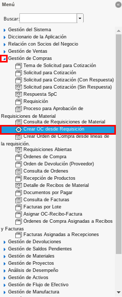
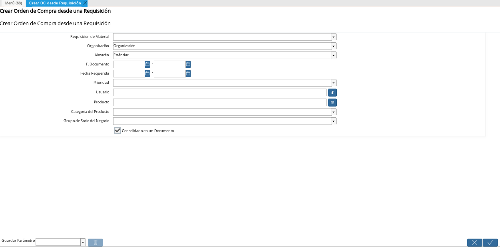
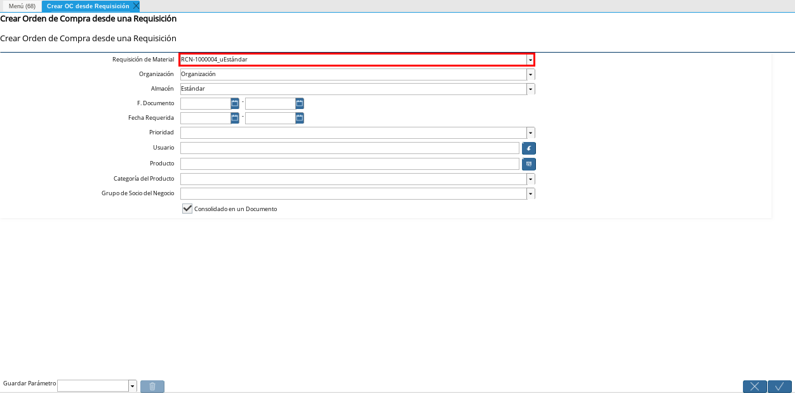
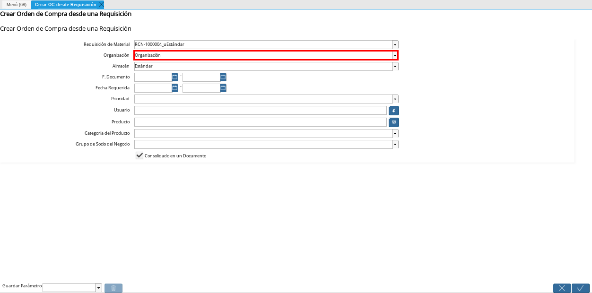
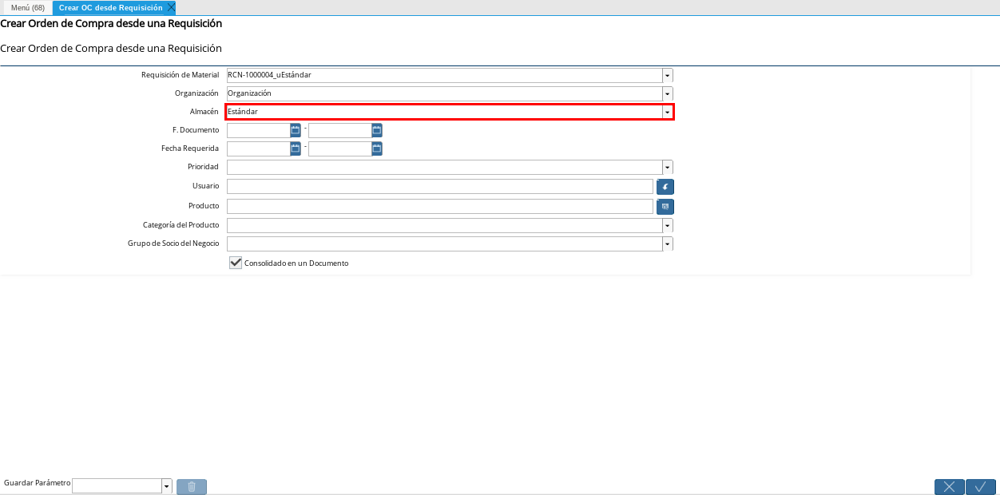
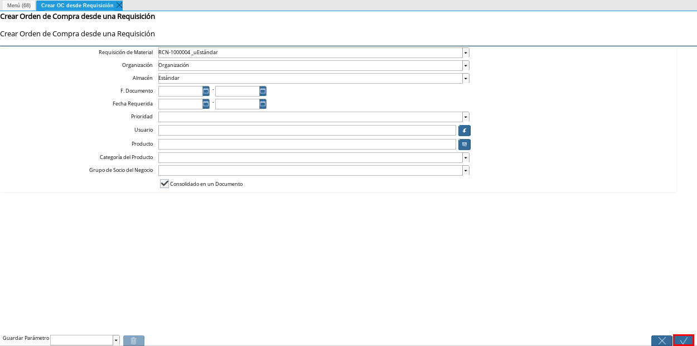
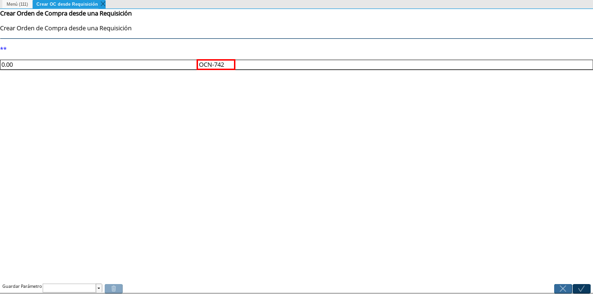
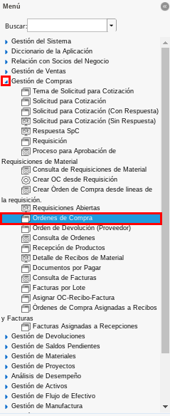
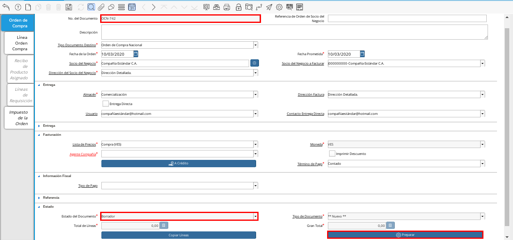
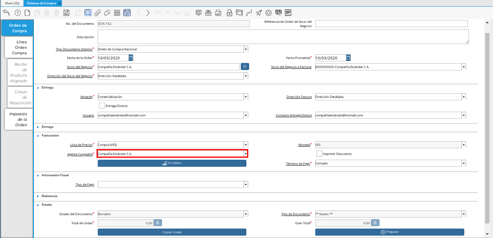
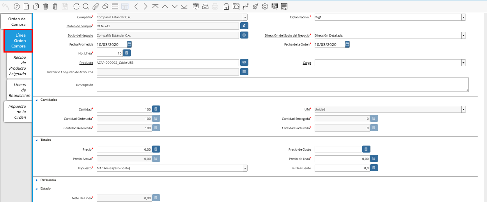
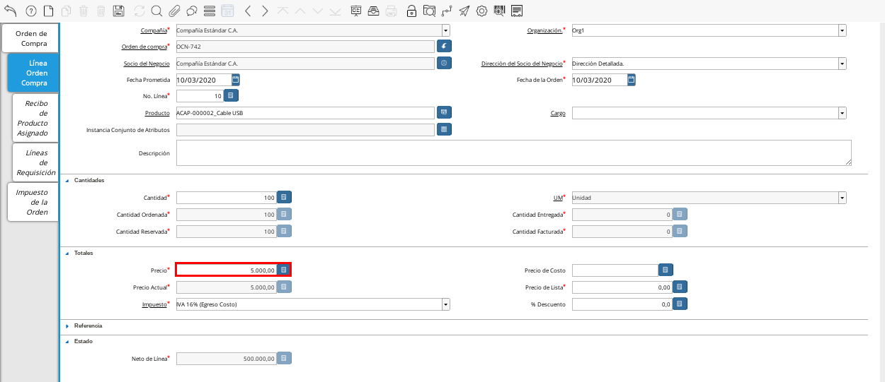
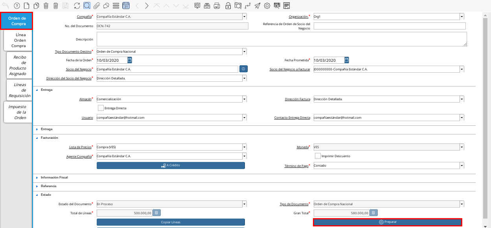
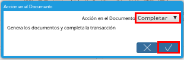
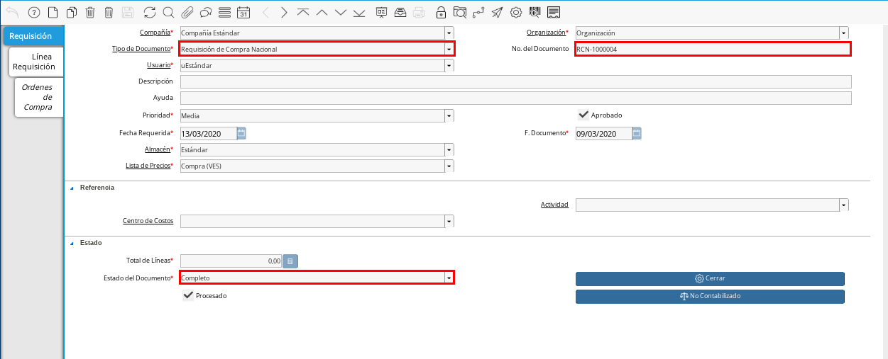

.. _documento/crear-orden-compra-desde-requisición:

**Procedimiento para Crear Orden de Compra desde Requisición**
==============================================================

#. Para ejemplificar el registro de crear orden de compra desde requisición, es utilizado el documento de requisición "**RCN-1000004**".

    |Documento de Requisición|

    Imagen 1. Documento de Requisición

#. Ubique y seleccione en el menú de ADempiere, la carpeta "**Gestión de Compras**", luego seleccione el proceso "**Crear OC desde Requisición**".

    |Menú de ADempiere 1|
    
    Imagen 2. Menú de ADempiere

#. Podrá visualizar la ventana del proceso "**Crear OC desde Requisición**" con diferentes campos que pueden ser utilizados para generar la orden de compra según lo requerido por el usuario.

    |Ventana del Proceso Crear OC desde Requisición|

    Imagen 3. Ventana del Proceso Crear OC desde Requisición

    #. Seleccione en el campo "**Requisición de Material**", el documento de requisición por el cual será generado el documento de "**Orden de Compra**". 

        |Campo Requisición de Material|

        Imagen 4. Campo Requisición de Material

    #. Seleccione en el campo "**Organización**", la organización para la cual esta realizando el documento "**Orden de Compra**".

        |Campo Organización|

        Imagen 5. Campo Organización

    #. Seleccione en el campo "**Almacén**", el nombre del almacén donde serán almacenados los productos registrados en el documento de requisición seleccionado.

        |Campo Almacén|

        Imagen 6. Campo Almacén

    .. note::
        
        Para generar una orden de compra desde una requisición determinada, los campos principales son "**Requisición de Material**", "**Organización**" y "**Almacén**". La selección de los campos "**F. Documento**", "**Fecha Requerida**", "**Prioridad**", "**Usuario**", "**Producto**", "**Categoría del Producto**" y "**Grupo de Socio del Negocio**", quedan a criterio de lo requerido por el usuario. De igual forma el checklist "**Consolidado en un Documento**".

#. Seleccione la opción "**OK**", para generar la orden de compra desde la requisición seleccionada anteriormente.

    |Opción OK|

    Imagen 7. Opción OK

#. Podrá visualizar en la ventana del proceso "**Crear OC desde Requisición**", el número del documento de "**Orden de Compra**" generado.

    |Ventana del Proceso Crear OC desde Requisición con el Número de Documento Generado|

    Imagen 8. Ventana del Proceso Crear OC desde Requisición con el Número de Documento Generado

**Consultar y Completar Orden de Compra Generada**
==================================================

#. Ubique y seleccione en el menú de ADempiere, la carpeta "**Gestión de Compras**", luego seleccione la ventana "**Órdenes de Compra**".

    |Menú de ADempiere 2|

    Imagen 9. Menú de ADempiere 

#. Al buscar el documento "**Orden de Compra**" con ayuda del número de documento generado en la ventana del proceso "**Crear OC desde Requisición**", se puede visualizar el mismo de la siguiente manera.

    |Orden de Compra Generada desde el Proceso Crear OC desde Requisición|

    Imagen 10. Orden de Compra Generada desde el Proceso Crear OC desde Requisición

    .. note::

        El proceso genera el documento "**Orden de Compra**" en estado "**Borrador**" y la opción establecida de estado del documento es "**Preparar**".

#. Seleccione en el campo "**Agente Compañía**", el usuario que esta realizando la orden de compra. Para ejemplificar el registro es utilizado el agente de compañía "**Compañía Estándar C.A.**".

    |Campo Agente Compañía|

    Imagen 11. Campo Agente Compañía

#. Seleccione la pestaña "**Línea Orden Compra**", para ingresar el precio unitario de los productos solicitados.

    |Pestaña Línea Orden Compra|

    Imagen 12. Pestaña Línea Orden Compra

#. Introduzca en el campo "**Precio**", el precio unitario de los productos solicitados en el documento "**Requisición**".

    |Campo Precio|

    Imagen 13. Campo Precio

#. Seleccione la pestaña "**Orden de Compra**" para regresar a la ventana principal del registro, luego seleccione la opción "**Preparar**", ubicado en la parte inferior derecha del documento para completar el mismo.

    |Pestaña Orden de Compra y Opción Completar|

    Imagen 14. Opción Preparar

    #. Seleccione la acción "**Completar**" y la opción "**OK**", para completar el documento "**Orden de Compra**". 
    
        |Acción Completar|

        Imagen 15. Acción Completar y Opción OK