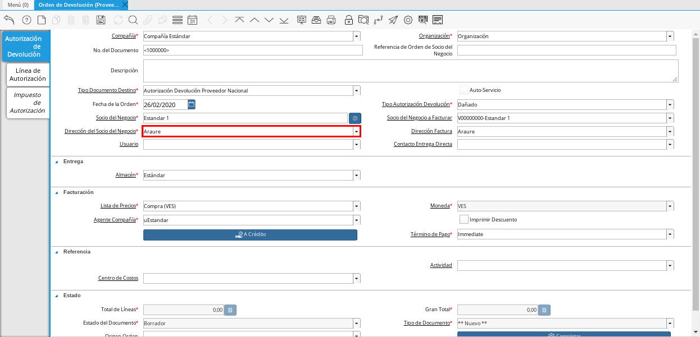

.. |Factura de Compra 1| image:: resources/factura-pagar1.png

.. |Opción Completar 1| image:: resources/completar1.png

.. |Campo Organización 2| image:: resources/org2.png

.. |Opción Completar 3| image:: resources/completar3.png

.. _documento/devolucion-proveedor:

**Autorización de Devolución a Proveedor**
------------------------------------------

Es el documento elaborado por la empresa luego de una evaluación de la condición de los productos comprados o servicios adquiridos del proveedor, cuando estos no se encuentran en buenas condiciones o simplemente no cumplen con lo requerido, el mismo autoriza la devolución de uno, varios, o todos los productos o servicios adquiridos del proveedor. 

Para realizar una devolución a proveedor deben existir los documentos "**Orden de Compra**", "**Documento por Pagar**" y "**Recepción**". Para ejemplificar el registro de la devolución a proveedor se tienen los siguientes documentos.

    #. Puede visualizar el documento "**Orden de Compra**" en estado "**Completo**", con monto "**10.000.000,00**".

        |Orden de Compra 1|

        Imagen 1. Documento Orden de Compra

    #. Puede visualizar el "**Documento por Pagar**" en estado "**Completo**", con monto "**10.000.000,00**".

        |Factura de Compra 1|

        Imagen 2. Documento por Pagar

    #. Puede visualizar el documento de "**Recepción**" en estado "**Completo**", con monto "**10.000.000,00**".

        |Recepción 1|

        Imagen 3. Documento de Recepción

Al consultar saldos abiertos se puede visualizar el saldo correspondiente al monto del documento por pagar mostrado anteriormente.

    |Saldos Abiertos a la Fecha 1|

    Imagen 4. Saldos Abiertos

A continuación se define el proceso para la creación de una autorización de devolución a proveedor en ADempiere.

#. Ubique en el menú de ADempiere la ventana "**Gestión de Compras**", luego seleccione la ventana "**Orden de Devolución (Proveedor)**".

    |Menú de ADempiere 1|

    Imagen 5. Menú de ADempiere

#. Seleccione el icono "**Registro Nuevo**" en la barra de herramientas de ADempiere y proceda al llenado de los campos correspondientes.

    |Icono Registro Nuevo 1|

    Imagen 6. Icono de Registro Nuevo

    .. warning::
   
        Recuerde que cada campo es necesario e importante para obtener el registro exitoso del documento en ADempiere.

    #. Seleccione en el campo "**Organización**", la organización para la cual esta realizando el documento "**Autorización de Devolución a Proveedor**".

        |Campo Organización 1|

        Imagen 7. Campo Organización

    #. Seleccione el tipo de documento a generar en el campo "**Tipo de Documento Destino**", la selección de este define el comportamiento del documento que se esta elaborando, dicho comportamiento se encuentra explicado en el documento :ref:`tipo-documento` elaborado por ERPyA. Para este ejemplo el tipo de documento es "**Autorización Devolución Proveedor Nacional**".

        |Campo Tipo de Documento 1|

        Imagen 8. Campo Tipo de Documento

    #. Seleccione en el campo "**Tipo Autorización Devolución**", el motivo o la condición del producto por el cual es requerida una autorización de devolución. Para este ejemplo el tipo de autorización es "**Dañado**".

        |Campo Tipo Autorización Devolución 1|

        Imagen 9. Campo Tipo Autorización Devolución

    #. Seleccione en el campo "**Socio del Negocio**", el socio del negocio proveedor al cual se le realizará la devolución.
 

        |Campo Socio del Negocio 1| 

        Imagen 10. Campo Socio del Negocio

    #. Seleccione la dirección de localización del socio del negocio, en el campo "**Dirección del Socio del Negocio**".

        |Campo Dirección del Socio del Negocio 1|

        Imagen 11. Dirección del Socio del Negocio

        .. warning:: 
      
            Recuerde guardar los cambios realizados en cada pestaña del documento con ayuda del icono "**Guardar**" en la barra de herramientas de ADempiere, al guardar los cambios realizados se asigna automáticamente el número del documento en el campo "**No. del Documento**".

    #. Seleccione el icono "**Proceso**" ubicado en la barra de herramientas de ADempiere, luego seleccione la opción "**Crear Orden de Devolución desde Entrega / Recibo**" para crear la orden de devolución desde la recepción del producto.

        |Icono Proceso 1|

        Imagen 12. Icono Proceso

        #. Podrá visualizar la siguiente ventana del proceso, donde debe seleccionar el documento de recepción donde se encuentra el producto.

            |Ventana del Proceso 1|

            Imagen 13. Ventana del Proceso y Selección del Documento de Recepción

        #. Seleccione la opción "**Comenzar Búsqueda**" para buscar las líneas del documento de recepción seleccionado.

            |Opción Comenzar Búsqueda 1|

            Imagen 14. Opción Comenzar Búsqueda

        #. Seleccione la línea del documento de recepción donde se encuentra el producto que se va a devolver, luego seleccione la opción "**OK**" para cargar el registro a la pestaña "**Línea de Autorización**".

            |Seleccionar Recepción y Opción OK 1|

            Imagen 15. Seleccionar Línea con el Producto a Devolver

        .. warning::
        
            Recuerde actualizar el registro de la ventana con ayuda del icono "**Refrescar**" ubicado en la barra de herramientas de ADempiere.

    #. Seleccione la pestaña "**Línea de Autorización**" para verificar que los datos fueron cargados correctamente.

        |Pestaña Línea de Autorización 1|

        Imagen 16. Pestaña Línea de Autorización

    .. note::

        Si la cantidad de productos a devolver es menor a la cantidad de productos recepcionados, recuerde ingresar en el campo "**Cantidad**", el valor o la cantidad de productos a devolver.

#. Regrese a la ventana principal "**Autorización Devolución Proveedor**", seleccione la opción "**Completar**" en la parte inferior del documento.

    |Opción Completar 1|

    Imagen 17. Opción Completar

#. Seleccione la acción "**Completar**" y la opción "**OK**" para completar el documento.

    |Acción Completar 1|

    Imagen 18. Acción Completar

**Devolución a Proveedor**
--------------------------

Es el documento que refleja la devolución de uno, varios, o todos los productos comprados o servicios adquiridos de un proveedor determinado. A continuación se define el proceso para la creación de una devolución a proveedor en ADempiere.

#. Ubique en el menú de ADempiere la ventana "**Gestión de Devoluciones**" y seleccione la ventana "**Devolución a Proveedor**".

    |Menú de ADempiere 2|

    Imagen 19. Menú de ADempiere

#. Seleccione el icono "**Registro Nuevo**" en la barra de herramientas de ADempiere y proceda al llenado de los campos correspondientes.

    |Icono Registro Nuevo 2|

    Imagen 20. Icono Registro Nuevo

    .. warning::
   
        Recuerde que cada campo es necesario e importante para obtener el registro exitoso del documento en ADempiere.

    #. Seleccione en el campo "**Organización**", la organización para la cual esta realizando el documento "**Devolución a Proveedor**".

        |Campo Organización 2|

        Imagen 21. Campo Organización

    #. Seleccione el tipo de documento a generar en el campo "**Tipo de Documento Destino**", la selección de este define el comportamiento del documento que se esta elaborando, dicho comportamiento se encuentra explicado en el documento :ref:`tipo-documento` elaborado por ERPyA. Para este ejemplo el tipo de documento es "**Devolución a Proveedor Nacional**".

        |Campo Tipo de Documento 2|

        Imagen 22. Campo Tipo de Documento

    #. Seleccione en el campo "**Socio del Negocio**", el socio del negocio proveedor al cual se le ralizará la devolución del producto.

        |Campo Socio del Negocio 2|

        Imagen 23. Campo Socio del Negocio

        .. warning::
   
            Recuerde guardar los cambios realizados en cada pestaña del documento con ayuda del icono "**Guardar**" en la barra de herramientas de ADempiere, al guardar los cambios realizados se asigna automáticamente el número del documento en el campo "**No. del Documento**".

    #. Seleccione el icono "**Proceso**" ubicado en la barra de herramientas de ADempiere, luego seleccione la opción "**Crear Orden de Devolución desde Entrega / Recibo**" para crear la devolución a proveedor desde la orden de devolución del producto.

        |Icono Proceso 2|

        Imagen 24. Icono Proceso

        #. Podrá visualizar la siguiente ventana del proceso, donde debe seleccionar el documento de autorización de devolución creado anteriormente.

            |Ventana del Proceso 2|

            Imagen 25. Ventana del Proceso y Selección del Documento de Recepción

        #. Seleccione la opción "**Comenzar Búsqueda**" para buscar las líneas del documento de autorización seleccionado.

            |Opción Comenzar Búsqueda 2|

            Imagen 26. Opción Comenzar Búsqueda

        #. Seleccione la línea del documento de autorización de devolución donde se encuentra el producto que se va a devolver, luego seleccione la opción "**OK**" para cargar el registro a la pestaña "**Línea de Devolución**".

            |Seleccionar Recepción y Opción OK 2|

            Imagen 27. Seleccionar Línea con el Producto a Devolver

        .. warning::
        
            Recuerde actualizar el registro de la ventana con ayuda del icono "**Refrescar**" ubicado en la barra de herramientas de ADempiere.

    #. Seleccione la pestaña "**Línea de Autorización**" para verificar que los datos fueron cargados correctamente.

        |Pestaña Línea de Autorización 2|

        Imagen 28. Pestaña Línea de Autorización

#. Regrese a la ventana principal "**Devolución a Proveedor**", seleccione la opción "**Completar**" en la parte inferior del documento.

    |Opción Completar|

    Imagen 29. Opción Completar

#. Seleccione la acción "**Completar**" y la opción "**OK**" para completar el documento.

    |Acción Completar 1|

    Imagen 30. Acción Completar

#. Seleccione la opción "**Generar Facturas desde Recibos**", para generar el documento "**Nota de Crédito**" desde la ventana "**Devolución a Proveedor**".

    |Generar Facturas desde Recibos 1|

    Imagen 31. Generar Facturas desde Recibos

    #. Podrá visualizar la siguiente ventana donde debe seleccionar la opción "**OK**".

        |Ventana Generar Facturas desde Recibos y Seleccionar Opción OK|

        Imagen 32. Ventana Generar Facturas desde Recibos y Seleccionar Opción OK

.. note::

    El documento "**Nota de Crédito**" es generado en estado "**Borrador**", el número del mismo se puede visualizar en la parte inferior derecha de la ventana "**Devolución a Proveedor**".

**Completar Nota de Crédito Generada**
--------------------------------------

#. Podrá visualizar el documento "**Nota de Crédito**" generado desde la ventana "**Devolución a Proveedor**", al buscar el mismo con número de documento "**1000080**".

    |Nota de Crédito 1|

    Imagen 33. Nota de Crédito

    #. Seleccione en el campo "**Factura Afectada**", el documento por pagar al cual le será aplicada la nota de crédito. Para ejemplificar el registro, es seleccionada la factura "**1000076**".

        |Campo Documento Afectado|

        Imagen 34. Campo Factura Afectada

    #. Seleccione la opción "**Completar**" ubicada en la parte inferior derecha del documento.

        |Opción Completar 3|

        Imagen 35. Opción Completar

        #. Seleccione la acción "**Completar**" y la opción "**OK**", para completar el documento "**Nota de Crédito**".

            |Acción Completar 1|

            Imagen 36. Acción Completar

**Consultar Saldos Abiertos**
-----------------------------

#. Al consultar saldos abiertos se verifica que la nota de crédito haya sido aplicada a la factura, generando un descuento al saldo abierto de la factura de cuentas por pagar de la siguiente manera.

    |Saldos Abiertos a la Fecha 2|

    Imagen 37. Saldos Abiertos a la Fecha

**Consultar Detalle de Transacciones**
--------------------------------------

#. Al consultar los detalles de transacciones se verifican los movimientos de entrada de productos por medio de una recepción, generando con ello un aumento al total de productos. De igual manera es reflejada la salida de productos por medio de una devolución a proveedor, generando con ello un descuento al total de productos en existencia.

    |Detalle de Transacciones|

    Imagen 38. Detalle de Transacciones
