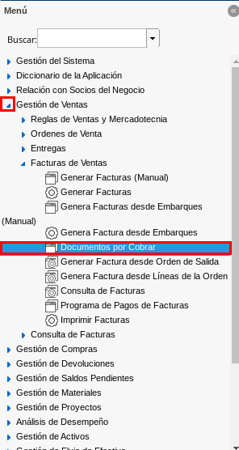
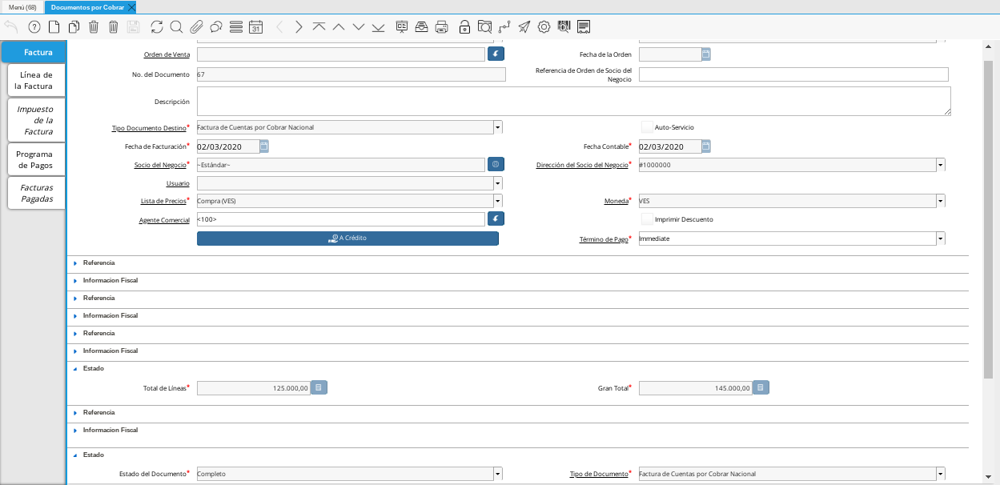
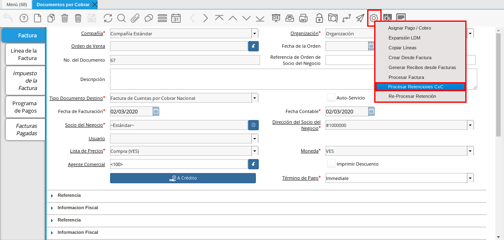
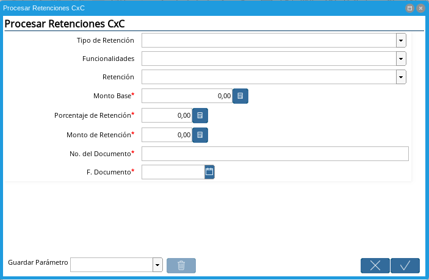
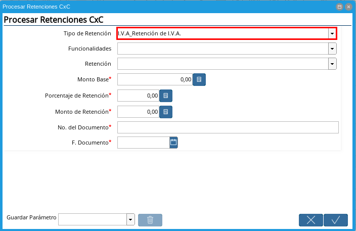
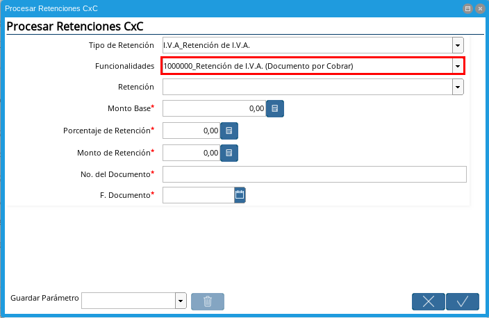
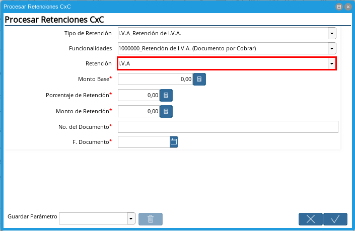
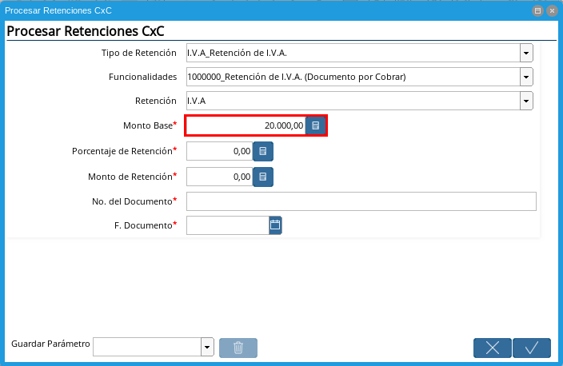
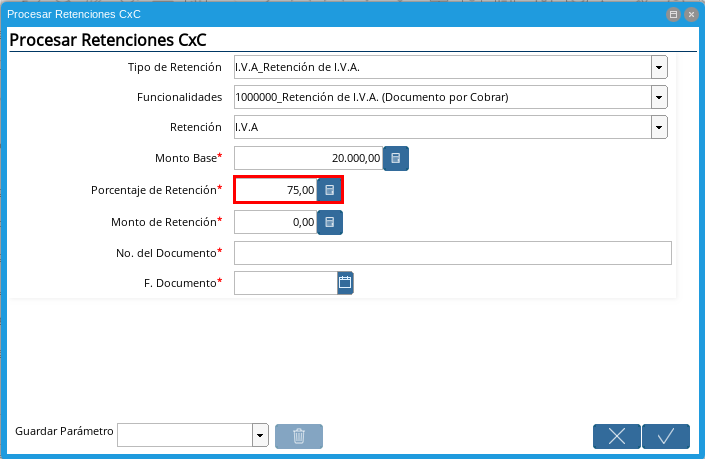
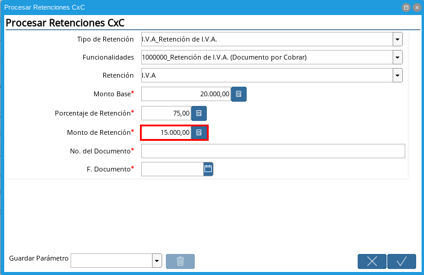
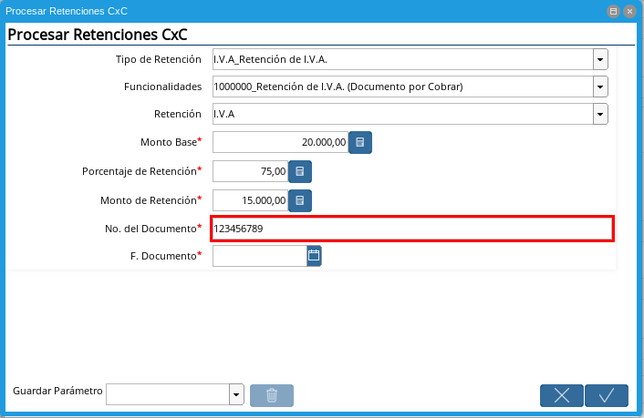
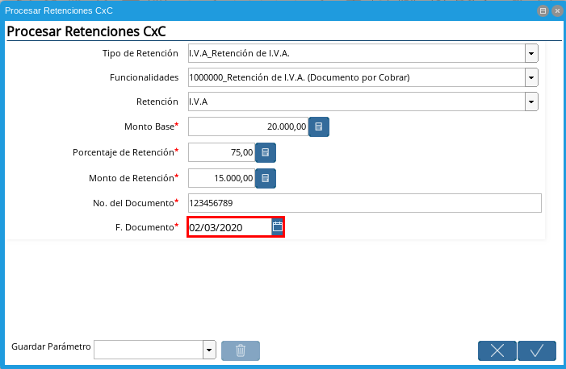
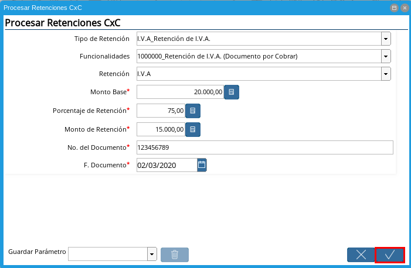
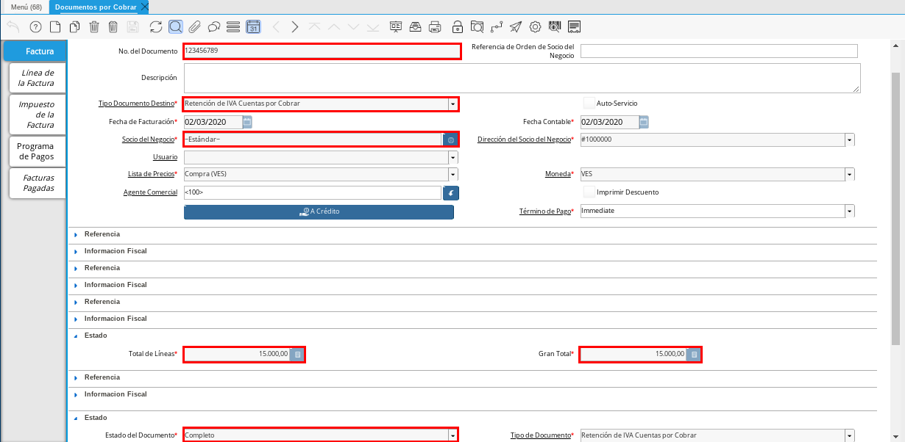
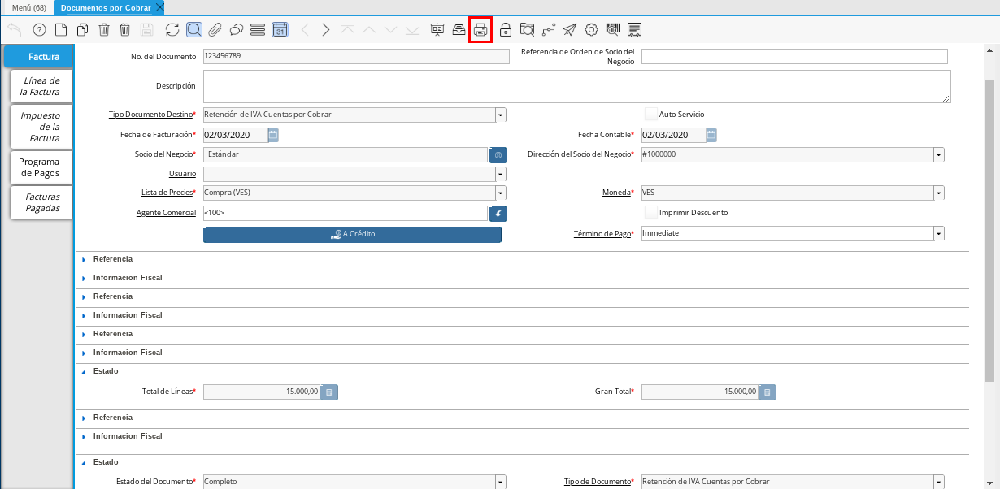
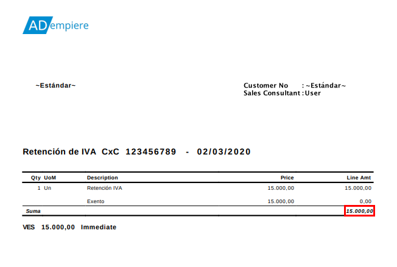

.. _documento/retenciones-cxc:

**Retención de IVA de Cuentas por Cobrar**
==========================================

**Documento por Cobrar**
------------------------

#. Ubique y seleccione en el menú de ADempiere, la carpeta "**Gestión de Ventas**", luego seleccione la ventana "**Documento por Cobrar**".

    |Menú de ADempiere 1|

    Imagen 1. Menú de ADempiere

#. Ubique el documento por cobrar al cual se le aplicará la retención de IVA, correspondiente a la factura de la venta realizada.

    |Factura de CxC 1|

    Imagen 2. Factura de Cuentas por Cobrar

    #. Seleccione el icono "**Proceso**", en la barra de herramientas de ADempiere para desplegar el menú del icono con sus diferentes opciones, luego seleccione la opción "**Procesar Retenciones CxC**".

        |Icono Proceso|

        Imagen 3. Icono Proceso

    #. Podrá visualizar la ventana "**Procesar Retenciones CxC**" con los campos necesarios para generar el documento de retención.

        |Opción Procesar Retención de CxC|

        Imagen 4. Opción Procesar Retención de CxC

    #. Seleccione en el campo "**Tipo de Retención**", el tipo de retención a aplicar a la factura por cobrar.

        |Campo Tipo de Retención 1|

        Imagen 5. Campo Tipo de Retención

        .. note::

            El campo cuenta con tres opciones que son "**IM_Retencion de Impuesto Municipal**, "**ISLR_Retención de I.S.L.R.**" y "**I.V.A_Retención de I.V.A.**". Recuerde que la selección de este campo va a depender de la retención que se va a aplicar a la factura de cuentas por cobrar.

    #. Seleccione en el campo "**Funcionalidades**", la configuración en ADempiere de la retención a aplicar a la factura de cuentas por cobrar.

        |Campo Funcionalidades|

        Imagen 6. Campo Funcionalidades

        .. note::

            El valor de este campo va a depender de lo seleccionado en el campo "**Tipo de Retención**".

    #. Seleccione en el campo "**Retención**", la retención a aplicar a la factura por cobrar.

        |Campo Retención 1|

        Imagen 7. Campo Retención

        .. note::

            El valor de este campo va a depender de lo seleccionado en el campo "**Tipo de Retención**", se debe seleccionar la opción referente al tipo de retención seleccionado.

    #. Introduzca en el campo "**Monto Base**", el monto total del IVA correspondiente a la factura de cuentas por cobrar.

        |Campo Monto Base|

        Imagen 8. Campo Monto Base

        .. note::

            El valor ingresado en este campo debe ser el mismo valor que se encuentra en el campo "**Total del Impuesto**" de la pestaña "**Impuesto de la Factura**", de la ventana "**Documento por Cobrar**".

    #. Introduzca en el campo "**Porcentaje de Retención**", el porcentaje que se va a retener al monto base. Para ejemplificar el registro es utilizado el porcentaje "**75**", que equivale en monto a "**0,75**".

        |Campo Porcentaje de Retención|

        Imagen 9. Campo Porcentaje de Retención

    #. Introduzca en el campo "**Monto de Retención**", el monto de retención que se va a aplicar a la factura de cuentas por cobrar.

        |Monto de Retención|

        Imagen 10. Campo Monto de Retención

        .. note::

            El valor de este campo es el resultado de la multiplicación del monto base por el porcentaje de retención. Ejemplo: 20.000,00 * 75% = 15.00,00 o también puede ser 20.000,00 * 0,75 = 15.00,00.

    #. Introduzca en el campo "**No. del Documento**", el número del documento del comprobante de retención facilitado por el socio del negocio cliente que aplico la retención.
    
        |Campo No. del Documento|

        Imagen 11. Campo No. del Documento

    #. Introduzca en el campo "**F. Documento**", la fecha del comprobante de retención facilitado por el socio del negocio cliente que aplico la retención.
    
        |Campo F. Documento|

        Imagen 12. Campo F. Documento

    #. Seleccione la opción "**OK**", para procesar la retención y generar en la ventana "**Documento por Cobrar**", el documento de retención con las indicaciones ingresadas en la ventana del proceso "**Procesar Retenciones CxC**", con el número de documento ingresado en el campo "**No. del Documento**".

        |Opción OK|

        Imagen 13. Campo Opción OK

**Consultar e Imprimir el Documento por Cobrar Generado**
---------------------------------------------------------

#. El documento generado desde la ventana del proceso "**Procesar Retenciones CxC**", se puede visualizar de la siguiente manera al buscarlo en la ventana "**Documento por Cobrar**", con el número de documento ingresado en el campo "**No. del Documento**" del proceso. Para ejemplificar el registro es utilizado el número de documento "**123456789**".

    |Retención de IVA Cuentas por Cobrar|

    Imagen 14. Documento de Retención de IVA Cuentas por Cobrar Generado.

    .. note::

        El documento es generado en estado "**Completo**" y con las especificaciones ingresadas en la ventana del proceso "**Procesar Retenciones CxC**". Adicional a ello, toma el socio del negocio que se encuentra en la factura por cobrar desde donde se realizó el proceso. 

#. Seleccione en el icono "**Imprimir**" ubicado en la barra de herramientas de ADempiere, para visualizar el documento en PDF y poder imprimir el mismo.

    |Icono Imprimir|

    Imagen 15. Icono Imprimir

#. El PDF del documento "**Retención de IVA CxC**" quedaría de la siguiente manera.

    |PDF Retención de IVA CxC|

    Imagen 16. PDF del Documento Retención de IVA CxC

.. note::

    El procedimiento para generar en ADempiere las retenciones de ISLR y municipales de cuentas por cobrar es el mismo explicado en el presente documento, tomando en cuenta las notas con relación a ellas en la descripción de los campos "**Tipo de Retención**", "**Funcionalidades**" y "**Retención**".