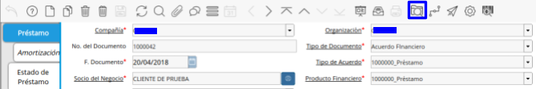

.. |Consulta de Amortización| image:: resources/invoice-window-preview.png
.. |Para Selección de Cuotas| image:: resources/invoice-result-preview.png
.. |Interpretando la Ventana| image:: resources/invoice-parameters-preview.png
.. |Menú de Factura| image:: resources/invoice-menu.png
.. |Generar Factura| image:: resources/invoice-generate-preview.png
.. |Comenzar Búsqueda| image:: resources/invoice-init-search.png
.. |Resultado de Búsqueda| image:: resources/invoice-search-result.png
.. |Llenando Datos| image:: resources/invoice-fill-values.png
.. |Datos para Facturar| image:: resources/invoice-action-search.png
.. |Documentos Generados| image:: resources/invoice-generated.png
.. |Factura| image:: resources/invoice-generated-menu.png
.. |Ventana de Factura| image:: resources/invoice-window.png
.. |Buscar Factura| image:: resources/invoice-search-icon.png
.. |Diálogo de Búsqueda| image:: resources/invoice-search-dialog.png

.. |Lista de Referencias| image:: resources/invoice-search-reference-list.png
.. |Lista de Referencias Seleccionadas| image:: resources/invoice-search-reference-list-selected.png
.. |Búsqueda| image:: resources/pay-selection-init-search.png
.. |OK| image:: resources/loan-ok-icon.png
.. |cancelar| image:: resources/loan-cancel-icon.png  
 

.. _documento/generar-factura-préstamo:

Generar Factura desde Préstamo
==============================

El documento por cobrar a generar (Fiscal o no Fiscal) será emitido por concepto de cuota vencida, con los siguientes conceptos dependiendo del préstamo inicial solicitado(Producto Financiero) y su configuración **(Vea Configuración de Producto Financiero (Préstamo))**:

-  Préstamo con Interés Gravado:
-  Capital
-  Interés + IVA
-  Préstamo con Interés Exento:
-  Capital
-  Interés
-  Préstamo sin Interés:
-  Capital

Sin embargo existen casos en los cuales el solicitante retarda la cancelación de cuotas vencidas en estos casos ADempiere calcula intereses moratorios sobre la cuota vencida generando así una línea más en el documento.

Interpretando la Ventana
========================

Panel de Parámetros de **Consulta de Amortización:** En este panel dispone de los parámetros que serán de filtro para consultar las cuotas pendientes por Facturar.

 |Consulta de Amortización|

 Imagen 1. Consulta de Amortización

Panel de resultados **Para Selección de Cuotas**: En este panel seleccionará las cuotas pendientes por Facturar.

 |Para Selección de Cuotas|
 
 Imagen 2. Para Selección de Cuotas

Panel de **Datos para Generar la Factura**: En este panel indicará los datos para generar la factura.

 |Interpretando la Ventana|

 Imagen 3. Interpretando la Ventana

Generar Factura desde Préstamo
==============================

**Generar Factura desde Préstamo**

Se creó un Smart Browser permitiendo al usuario seleccionar múltiples cuotas de un préstamo en específico y generar de manera eficiente y segura, agrupando varias cuotas en una factura, ó discriminando por cuota si el usuario así lo desea de esta forma será generada una factura por cuota.

Vaya a la ventana Generar Factura (Desde Préstamo) (Adjunto Imagen)

 |Menú de Factura|

 Imagen 4. Menú de Factura

A continuación se desplegará la siguiente ventana (Adjunto Imagen)

 |Generar Factura|

 Imagen 5. Generar Factura

Proceda a llenar los Parámetros de **Consulta de Cuotas** necesarios para generar la factura:

**Socio de Negocio:** Es un parámetro obligatorio, filtrará los préstamos pendientes por cobrar con el Socio del Negocio indicado.

**Acuerdo Financiero(Préstamo):** Es un parámetro obligatorio, filtrará las cuotas pendientes por cobrar del Préstamos indicado.

**Fecha Inicio:** filtrará las cuotas pendientes por cobrar en el Rango de fecha indicada.

**Fecha Final:** filtrará las cuotas pendientes por cobrar en el Rango de fecha indicada.

**Fecha de Vencimiento:** filtrará las cuotas pendientes por cobrar en el Rango de fecha indicada.

Vencido: Si selecciona la opción SI, filtrará las cuotas vencidas, Si selecciona la opción NO, filtrará las cuotas no vencidas.

**Seleccione la opción comenzar búsqueda** 

 |Búsqueda|

 Imagen 6. Búsqueda

A continuación verá los siguientes resultados:

 |Comenzar Búsqueda|

 Imagen 7. Comenzar Búsqueda

Seleccione la cuota que desea facturar:

 |Resultado de Búsqueda|

 Imagen 8. Resultado de Búsqueda

Proceda a llenar los ***Datos para Generar la Factura***.

 |Llenando Datos|

 Imagen 9. Llenando Datos

**Tipo de Documento Destino:** Seleccione el tipo de Documento con el que desea sea generada el Documento por Cobrar.

**Fecha de Facturación:** Indique la fecha en la cual será facturada la cuota.

**Dividir Factura:** Esta opción debe ser marcada si desea dividir las facturas por cuota, de lo contrario se generará una factura consolidada con las cuotas seleccionadas.

**Acción de Documento:** Indique la acción de documento con la cual desea generar la selección.

 |Datos para Facturar|

 Imagen 10. Datos para Facturar

Si desea generar la selección de pago seleccione la opción ok |OK|, caso contrario seleccione la opción cancelar |cancelar|

Si seleccionó la opción OK el sistema generará la(s) factura(s) de forma exitosa generando el siguiente mensaje indicando el número(s) de la(s) factura(s) generada.

 |Documentos Generados|

 Imagen 11. Documentos Generados

Consulta de Factura de Préstamo
===============================

Existen dos posibles formas de consultar las facturas generadas asociadas a un préstamo, a continuación serán explicadas.

Ventanas en Documento por Cobrar

Vaya a la ventana Documento por Cobrar (Adjunto Imagen)

 |Factura|

 Imagen 12. Menú de Factura

A continuación se desplegará la siguiente ventana (Adjunto Imagen).

 |Ventana de Factura|

 Imagen 13. Ventana de Factura

Busque el registro desde la opción “**Encontrar Registro**” ubicada en la barra de herramientas.

 |Buscar Factura|

 Imagen 14. Buscar Factura

A continuación se desplegará el siguiente dialogo

 |Diálogo de Búsqueda|

 Imagen 15. Diálogo de Búsqueda

Ingrese el número de la selección generada en el proceso **Generar Factura (Desde Préstamo)**

**Ventana de Préstamo:**

Una vez en la ventana de Préstamo

Vaya a la opción “**Visualiza Detalle(Donde es Usado)**” ubicada en la barra de herramientas.

 |Referencias de Factura|

 Imagen 16. Referencias de Factura

A continuación se desplegará el siguiente dialogo

 |Lista de Referencias|

 Imagen 17. Lista de Referencias

Seleccione la opción “**Documento por Cobrar de Cuota **”

 |Lista de Referencias Seleccionadas|

 Imagen 18. Lista de Referencias Seleccionadas

Esta opción lo llevará automáticamente a los pagos asociados a este préstamo.

Contabilidad del Proceso
========================

ADempiere contabilizará el Documento por Cobrar dependiendo de la definición del producto financiero (**Vea Configuración de Producto Financiero (Préstamo)**), a continuación se detalla:

**Capital:** Contabilidad definida en el producto asociado en producto financiero.

**Interés:** Contabilidad definida en el cargo asociado en la tasa financiera relacionada en el producto financiero.

**IVA:** Contabilidad definida en la tasa de impuesto asociada en el cargo perteneciente a la tasa financiera relacionada en el producto financiero.

.. raw:: html

   <table>

.. raw:: html

   <tr>

.. raw:: html

   <td>

Cuenta

.. raw:: html

   </td>

.. raw:: html

   <td>

Débito Contabilizado

.. raw:: html

   </td>

.. raw:: html

   <td>

Crédito Contabilizado

.. raw:: html

   </td>

.. raw:: html

   </tr>

.. raw:: html

   <tr>

.. raw:: html

   <td>

12410 - Prestamos por Cobrar

.. raw:: html

   </td>

.. raw:: html

   <td>

.. raw:: html

   

0,00

.. raw:: html

   

.. raw:: html

   </td>

.. raw:: html

   <td>

.. raw:: html

   

1.522,36

.. raw:: html

   

.. raw:: html

   </td>

.. raw:: html

   </tr>

.. raw:: html

   <tr>

.. raw:: html

   <td>

12410 - Interés por Cobrar

.. raw:: html

   </td>

.. raw:: html

   <td>

.. raw:: html

   

0,00

.. raw:: html

   

.. raw:: html

   </td>

.. raw:: html

   <td>

.. raw:: html

   

316,48

.. raw:: html

   

.. raw:: html

   </td>

.. raw:: html

   </tr>

.. raw:: html

   <tr>

.. raw:: html

   <td>

22000 - IVA

.. raw:: html

   </td>

.. raw:: html

   <td>

.. raw:: html

   

0,00

.. raw:: html

   

.. raw:: html

   </td>

.. raw:: html

   <td>

.. raw:: html

   

69,6256

.. raw:: html

   

.. raw:: html

   </td>

.. raw:: html

   </tr>

.. raw:: html

   <tr>

.. raw:: html

   <td>

12110 - Cuentas por Cobrar Comerciales

.. raw:: html

   </td>

.. raw:: html

   <td>

.. raw:: html

   

1908,4656

.. raw:: html

   

.. raw:: html

   </td>

.. raw:: html

   <td>

.. raw:: html

   

0,00

.. raw:: html

   

.. raw:: html

   </td>

.. raw:: html

   </tr>

.. raw:: html

   <tr>

.. raw:: html

   <td>

Total

.. raw:: html

   </td>

.. raw:: html

   <td>

.. raw:: html

   

1908,4656

.. raw:: html

   

.. raw:: html

   </td>

.. raw:: html

   <td>

.. raw:: html

   

1908,4656

.. raw:: html

   

.. raw:: html

   </td>

.. raw:: html

   </tr>

.. raw:: html

   </table>

