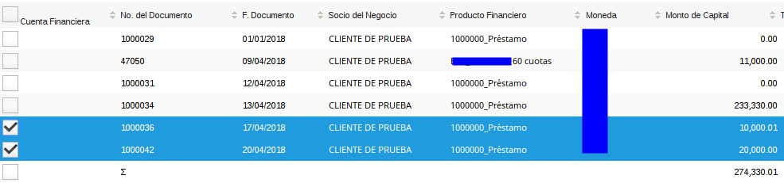
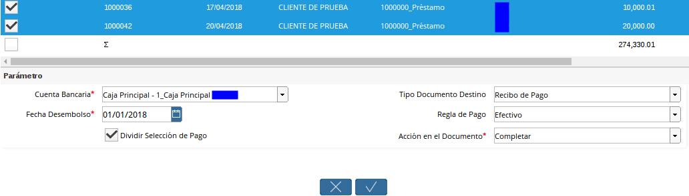
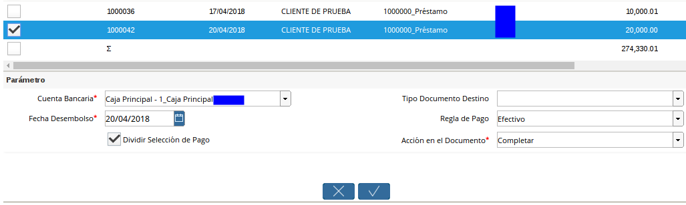
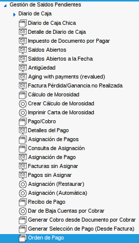

Generar Selección de Pago
=========================

La selección de pago en ADempiere actúa como una orden de pago,
agrupando varios préstamos pendientes por cancelar, la funcionalidad o
simplicidad del proceso dependerá de la configuración del documento en
la cuenta bancaria o cuenta de caja (***Vea Configuración Esencial para
el Proceso de Préstamo***).

Fué creado un Smart Browser permitiendo al usuario seleccionar múltiples
préstamos y generar de manera eficiente y segura un pago o varios pagos
discriminando por préstamo si el usuario así lo desea.

Interpretando la Ventana
========================

Panel de Parámetros de ***Consulta de Préstamos:*** En este panel
dispone de los parámetros que serán de filtro para consultar los
préstamos pendientes por cancelar.

.. figure:: resources/pay-selection-search.png
   :alt: Búsqueda de Selección de Pagos

   Búsqueda de Selección de Pagos

Panel de resultados ***Para Selección de Préstamos***: En este panel
seleccionará los préstamos a pagar.

.. figure:: resources/pay-selection-result.png
   :alt: Resultado de Selección de Pagos

   Resultado de Selección de Pagos

Panel de ***Datos para Generar la Selección de Pago***: En este panel
indicará los datos para generar la selección de pago.

.. figure:: resources/pay-selection-process.png
   :alt: Proceso de Selección de Pagos

   Proceso de Selección de Pagos

Selección de Pago
=================

Vaya a la ventana de Préstamo(Adjunto Imagen)

.. figure:: resources/pay-selection-menu.png
   :alt: Menú de Selección de Pagos

   Menú de Selección de Pagos

A continuación se desplegará la siguiente ventana (Adjunto Imagen)

.. figure:: resources/pay-selection-generate.png
   :alt: Generar Selección de Pagos

   Generar Selección de Pagos

Proceda a llenar los Parámetros de ***Consulta de Préstamos***
necesarios para generar la selección de pagos:

**Socio de Negocio:** Filtrará los préstamos pendientes por pagar con el
Socio del Negocio indicado.

**Tipo de Acuerdo:** Filtrará los préstamos pendientes por pagar con el
Tipo de Acuerdo indicado.

**Tipo de Documento:** Filtrará los préstamos pendientes por pagar con
el Tipo de Documento indicado.

**Producto Financiero:** Filtrará los préstamos pendientes por pagar con
el Producto Financiero indicado.

**F. Documento:** Filtrará los préstamos pendientes por pagar en el
Rango de fecha indicada.

**Si no indica parámetros el sistema buscará todos los préstamos
pendientes por pagar.**

**Seleccione la opción comenzar búsqueda** |Comenzar Búsqueda|

.. figure:: resources/pay-selection-search-button.png
   :alt: Comenzar Búsqueda

   Comenzar Búsqueda

A continuación verá los siguientes resultados:

.. figure:: resources/pay-selection-search-result.png
   :alt: Resultado de Búsqueda

   Resultado de Búsqueda

Seleccione los préstamos que desea cancelar:

   Selección de Préstamo

Proceda a llenar los ***Datos para Generar la Selección de Pago***.

   Selección de Préstamo

**Cuenta Bancaria:** Seleccione la cuenta bancaria ó caja previamente
configurada\*\* (Vea *Configuraciones Esenciales para el Proceso de
Préstamo*)\*\* de la cual egresa el dinero del pago del préstamo, si la
cuenta seleccionada es una caja o una cuenta bancaria determinará el
comportamiento y consulta del pago generado.

**Tipo de Documento Destino:** Seleccione el tipo de Documento.

**Fecha de Desembolso:** Indique la fecha en la cual egresa el dinero.

**Regla de Pago:** Indique la regla de pago.

**Dividir Selección de Pago:** Esta opción debe ser marcada si desea
dividir los pagos por prestamo de lo contrario se generarán el pago
consolidado en la seleccion de pago.

**Acción de Documento:** Indique la acción de documento con la cual
desea generar la selección.

   Acción de Documento

Si desea generar la selección de pago seleccione la opción ok |Opción
Aceptar|, caso contrario seleccione la opción cancelar |Opción Cancelar|

Si seleccionó la opción OK el sistema generará la(s) selección(es) de
forma exitosa generando el siguiente mensaje indicando el número(s) del
pago generado.

.. figure:: resources/pay-selection-generated.png
   :alt: Selección de Pagos Generada

   Selección de Pagos Generada

Consulta de Selección de Pago de Préstamo
=========================================

Existen dos posibles formas de consultar las selecciones de pago
asociadas a un préstamo, a continuación serán explicadas:

Ventana Selección de Pago:

Vaya a la ventana de Selección de Pago (Adjunto Imagen)

   Consulta de Selección de Pagos

A continuación se desplegará la siguiente ventana (Adjunto Imagen)

.. figure:: resources/pay-selection-window.png
   :alt: Selección de Pagos Generada

   Selección de Pagos Generada

Busque el registro desde la opción “\ ***Encontrar Registro***\ ”
ubicada en la barra de herramientas.

.. figure:: resources/pay-selection-search-window.png
   :alt: Selección de Pagos Generada

   Selección de Pagos Generada

A continuación se desplegará el siguiente dialogo

.. figure:: resources/pay-selection-search-dialog.png
   :alt: Selección de Pagos Generada

   Selección de Pagos Generada

Ingrese el número de la selección generada en el proceso `Generar
Selección de Pago (Desde Préstamo) <generate-payment-selection.md>`__.

**Ventana de Préstamo:**

`Una vez en la ventana de Préstamo <loan.md>`__

Vaya a la opción “\ ***Visualiza Detalle(Donde es Usado)***\ ” ubicada
en la barra de herramientas.

.. figure:: resources/pay-selection-reference-icon.png
   :alt: Selección de Pagos Generada

   Selección de Pagos Generada

A continuación se desplegará el siguiente dialogo

.. figure:: resources/pay-selection-search-reference.png
   :alt: Selección de Pagos Generada

   Selección de Pagos Generada

Seleccione la opción “\ ***Selección de Pago de Préstamos***\ ”

.. figure:: resources/pay-selection-search-reference-zoom.png
   :alt: Selección de Pagos Generada

   Selección de Pagos Generada

Esta opción lo llevará automáticamente a las selecciones de pago
asociadas a este préstamo.

.. |Comenzar Búsqueda| image:: resources/pay-selection-init-search.png
.. |Opción Aceptar| image:: resources/loan-ok-icon.png
.. |Opción Cancelar| image:: resources/loan-cancel-icon.png
