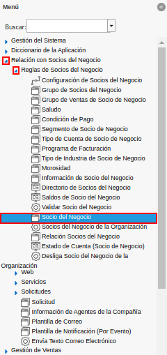
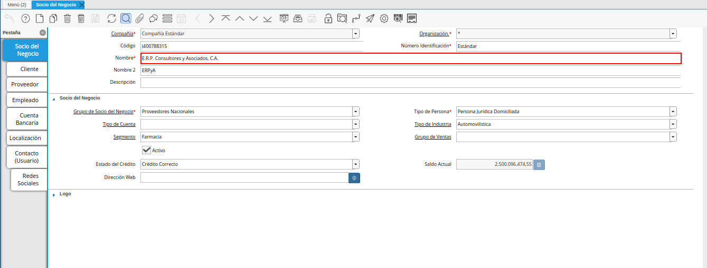
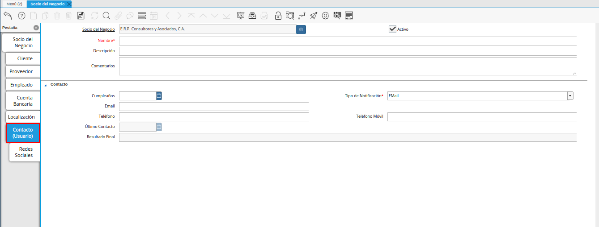
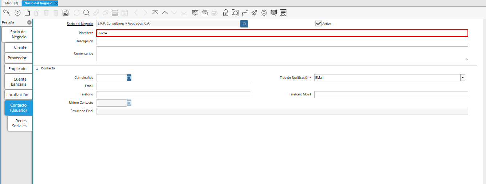
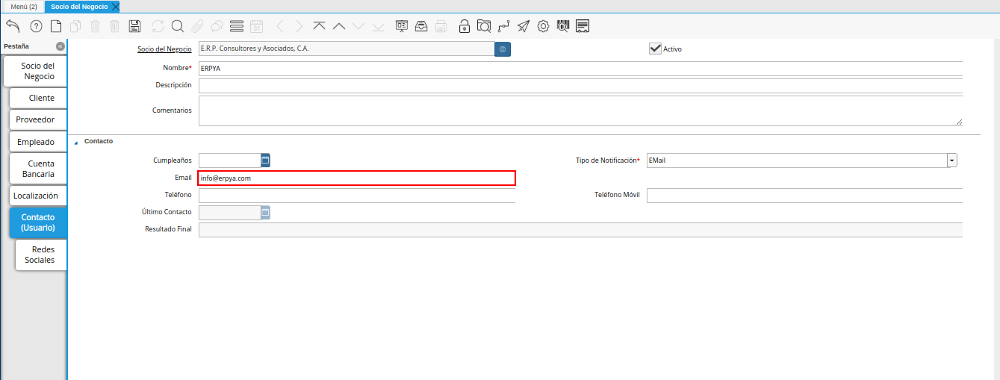
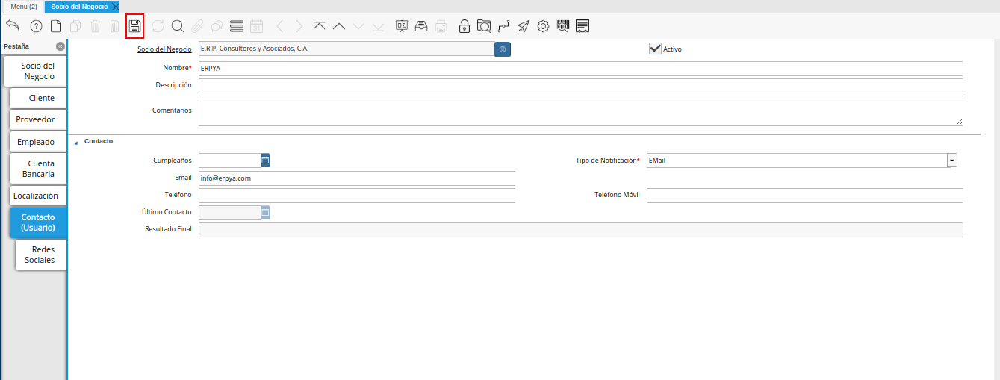
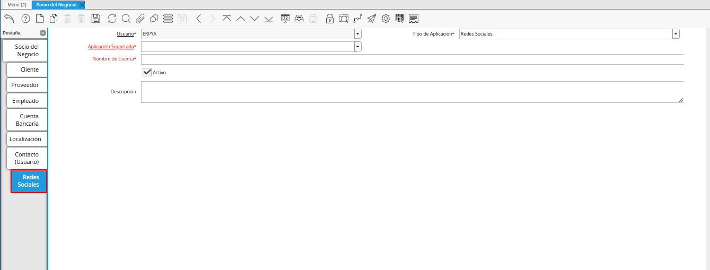
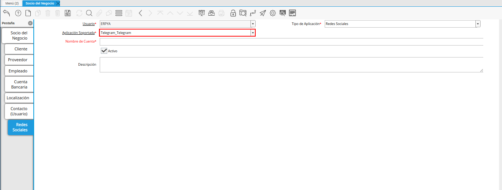
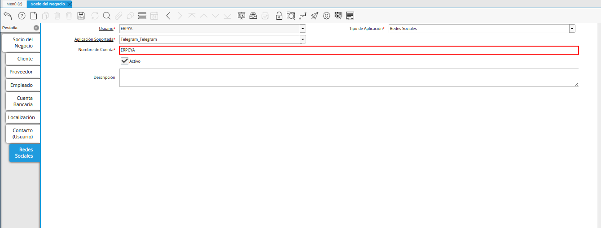
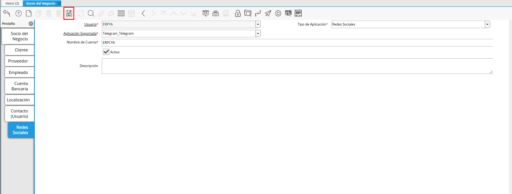

.. _documento/configuración-de-bot-en-adempiere:

**Configuración en ADempiere**
==============================

Para configurar un usuario de telegram en ADempiere, se debe realizar de manera obligatoria el siguiente procedimiento. 

Ubique en el menú de ADempiere, la carpeta "**Relación con Socios del Negocio**", luego seleccione la carpeta "**Reglas de Socios del Negocio**", por último seleccione la ventana "**Socio del Negocio**".

    |menú de socio del negocio|

    Imagen 1. Menú de ADempiere

Ubique en la ventana "**Socio del Negocio**", el registro del socio que requiere configurar.

    |registro del socio del negocio|

    Imagen 2. Registro del Socio del Negocio

Seleccione la pestaña "**Contacto (Usuario)**" de la ventana "**Socio del Negocio**".

    |pestaña contacto usuario de la ventana socio del negocio|

    Imagen 3. Pestaña Contacto (Usuario)

Introduzca en el campo "**Nombre**", el nombre de contacto del usuario.

    |campo nombre de la pestaña contacto usuario de la ventana socio del negocio|

    Imagen 4. Campo Nombre 

Introduzca en el campo "**Email**", la dirección de correo electrónico del usuario.

    |campo email de la pestaña contacto usuario de la ventana socio del negocio|

    Imagen 5. Campo Email 

Guarde el registro de los campos seleccionando el icono "**Guardar Cambios**", ubicado en la barra de herramientas de ADempiere.

    |icono guardar cambios de la pestaña contacto usuario de la ventana socio del negocio|

    Imagen 6. Icono Guardar Cambios

Seleccione la pestaña "**Redes Sociales**" de la ventana "**Socio del Negocio**".

    |pestaña redes sociales de la ventana socio del negocio|

    Imagen 7. Pestaña Redes Sociales

Seleccione en el campo "**Aplicación Soportada**", la opción "**Telegram**", para registar el usuario de telegram del socio del negocio.

    |campo aplicación soportada de la pestaña redes sociales de la ventana socio del negocio|

    Imagen 8. Campo Aplicación Soportada

Introduzca en el campo "**Nombre de Cuenta**", el nombre de usuario de la cuenta en telegram del socio del negocio.

    |campo nombre de cuenta de la pestaña redes sociales de la ventana socio del negocio|

    Imagen 9. Campo Nombre de Cuenta

Guarde el registro de los campos seleccionando el icono "**Guardar Cambios**", ubicado en la barra de herramientas de ADempiere.

    |icono guardar cambios de la pestaña redes sociales de la ventana socio del negocio|

    Imagen 10. Icono Guardar Cambios
