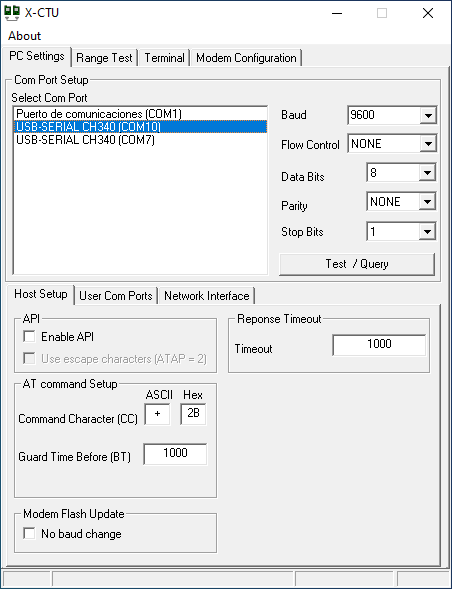
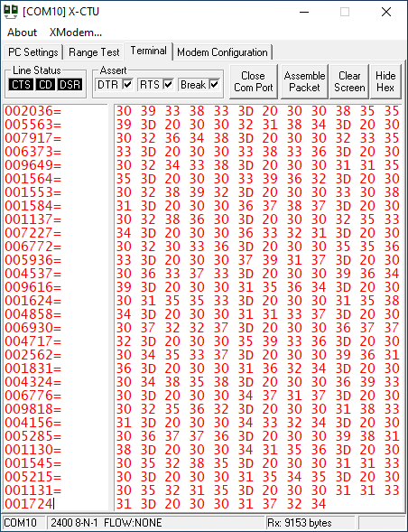
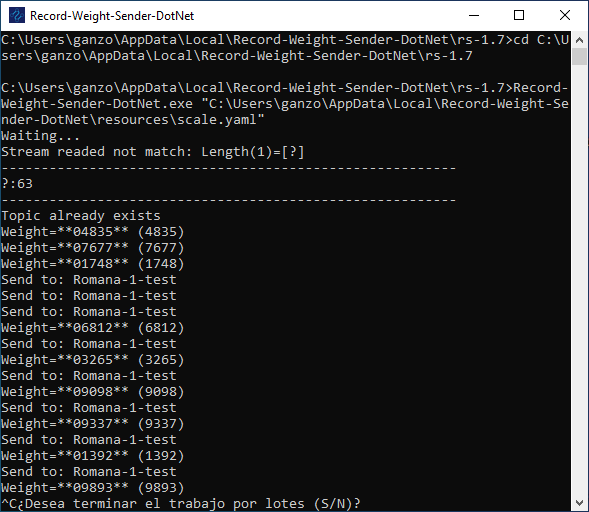
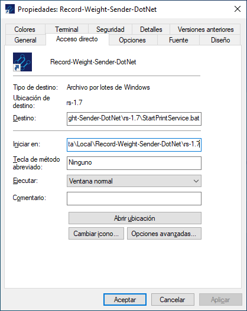
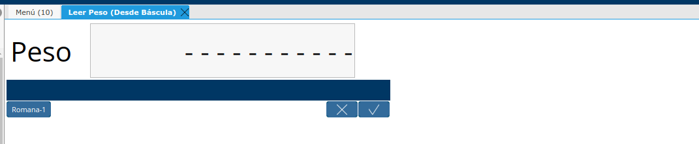
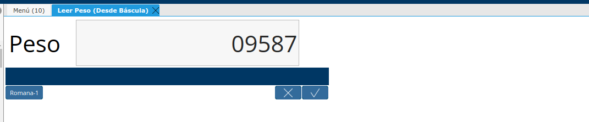
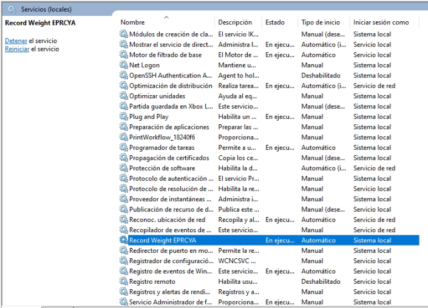
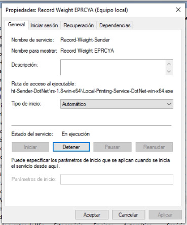
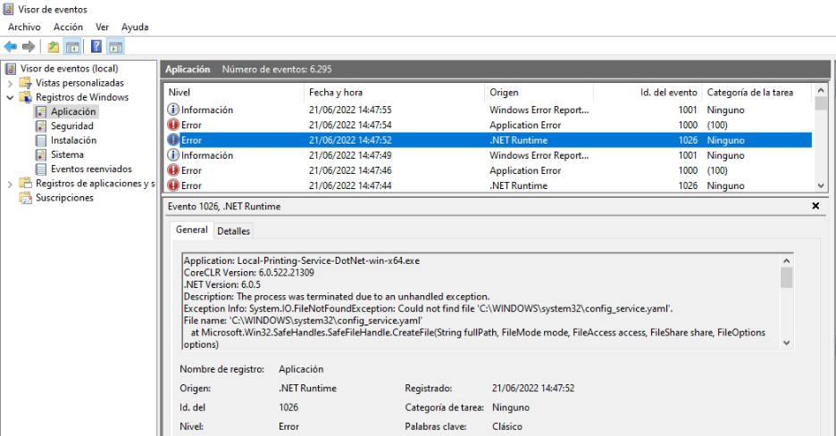

.. |Acceso directo| image:: resources/weight-sender-desktop-shortcut.PNG
.. |Archivo para inicar la aplicación| image:: resources/weight-sender-start_app_file.PNG
.. |XCTU| image:: resources/weight-sender-xctu.PNG

.. _XCTU: https://erpya.ams3.digitaloceanspaces.com/public/XCTU_5.2.8.exe
.. _documento/verificar-record-weight-sender:

Verificar el funcionamiento del Cliente de Lectura de Peso
==========================================================

Verificar que la Aplicacion este ejecutando la version correcta
---------------------------------------------------------------

Verificar que existe un Servicio de Windows con el Nombre de **Record Weight EPRCYA**

|Servicio de Windows|

|Propiedades Servicio de Windows|

    Para verificar que el servicio funcione, abrir las Propiedades del servicio y presionar el boton iniciar el estado del servicio debe mantenerse **En Ejecución**, ademas la **Ruta de Acceso al Ejecutable** debe coincidir con la version instalada.

    ::

        C:\Users\(Usuario de Windows)\AppData\Local\Record-Weight-Sender-DotNet\rs-1.8-win-x64\Local-Printing-Service-DotNet-win-x64.exe

Verificar que la Romana este enviando datos
-------------------------------------------

Para hacer esto se debe conocer en que puerto COM esta conectada la Romana puedes usar una aplicacion como HyperTerminal o `_XCTU`_ , para leer el puerto Serial.

Para este caso se demostrara como hacerlo usando la aplicacion `_XCTU`_:

1. Abrimos la aplicacion **XCTU**.

|XCTU|

2. Selecionar el Puerto Serial, y ajustar la Velocidad de transmisión (Baud)

|Ventana de XCTU|

3. Ir a la Pestaña terminal y presionar boton Open COM Port si esta funcionando correctamente, podras ver el peso que se obtiene desde la romana en pantalla.

|Terminal de XCTU|

Es importante cerrar el puerto usando el boton Close COM port.

Problemas al momento de leer el puerto Serial
^^^^^^^^^^^^^^^^^^^^^^^^^^^^^^^^^^^^^^^^^^^^^

- Verificar si el dispositivo esta conectado o encendido.
- Verificar que el puerto serial no este ocupado por otra aplicacion.
- Verificar que la Velocidad de transmision serial se la correcta.

Verificar que Cliente de Lectura de Peso reciba datos desde el Puerto Serial
----------------------------------------------------------------------------

1. Para ello necesitamos ejecutar manualmente la aplicación **Record-Weight-Sender-DotNet**, es necesario ingresar a la siguiente ruta: **C:\Users\(Usuario de Windows)\AppData\Local\Record-Weight-Sender-DotNet\rs-1.8-win-x64**
2. Ubicar el archivo **StartPrintService.bat** y ejecutarlo.
3. Se abrira la consola de windows, y mostrara lo siguiente

.. code-block:: batch

    Waiting...
    Topic already exists
    Weight=**06812** (6812)
    Send to: Romana-1-test
    Weight=**03265** (3265)
    Send to: Romana-1-test
    Weight=**09098** (9098)
    Send to: Romana-1-test
    Weight=**09337** (9337)
    Send to: Romana-1-test
    Weight=**01392** (1392)
    Send to: Romana-1-test

- **Lectura de peso**: Weight=**Peso Actual** (Peso Actual)
- **Enviar a cola de impresion**: Send to: Romana-1-test

Problemas al momento de leer el puerto Serial
^^^^^^^^^^^^^^^^^^^^^^^^^^^^^^^^^^^^^^^^^^^^^

Si al momento de leer el puerto serial muestra un mensaje como el siguiente:

.. code-block:: batch

    Topic already exists
    Stream readed not match: Length(96)=[ 009476= 006473= 006480= 006951= 008470= 005076= 005454= 009694= 003362= 009119= 002792= 005188=]
    ---------------------------------------------------------
    :32|0:48|0:48|9:57|4:52|7:55|6:54|=:61| :32|0:48|0:48|6:54|4:52|7:55|3:51|=:61| :32|0:48|0:48|6:54|4:52|8:56|0:48|=:61| :32|0:48|0:48|6:54|9:57|5:53|1:49|=:61| :32|0:48|0:48|8:56|4:52|7:55|0:48|=:61| :32|0:48|0:48|5:53|0:48|7:55|6:54|=:61| :32|0:48|0:48|5:53|4:52|5:53|4:52|=:61| :32|0:48|0:48|9:57|6:54|9:57|4:52|=:61| :32|0:48|0:48|3:51|3:51|6:54|2:50|=:61| :32|0:48|0:48|9:57|1:49|1:49|9:57|=:61| :32|0:48|0:48|2:50|7:55|9:57|2:50|=:61| :32|0:48|0:48|5:53|1:49|8:56|8:56|=:61
    ---------------------------------------------------------

Esto significa que la trama de datos no esta correctamente configurada en el archivo scale.yaml para este caso esto puede estar determinado por alguno de los siguientes parametro:

- start_character: 60
- end_character: 13
- start_word: ""
- end_word: ""

El mensaje que se muestra en la consola puede ayudar a corregir la situacion.

- **Datos obtenidos desde el puerto Serial**: Stream readed not match: Length(longuitud de trama leida)=[Datos leidos desde el puerto Serial]

Ejemplo:

En la siguiente trama no esta configurado correctamente el caracter de inicio(start_character)

.. code-block:: batch

    Topic already exists
    Stream readed not match: Length(96)=[ 009476= 006473= 006480= 006951= 008470= 005076= 005454= 009694= 003362= 009119= 002792= 005188=]
    ---------------------------------------------------------
    :32|0:48|0:48|9:57|4:52|7:55|6:54|=:61| :32|0:48|0:48|6:54|4:52|7:55|3:51|=:61| :32|0:48|0:48|6:54|4:52|8:56|0:48|=:61| :32|0:48|0:48|6:54|9:57|5:53|1:49|=:61| :32|0:48|0:48|8:56|4:52|7:55|0:48|=:61| :32|0:48|0:48|5:53|0:48|7:55|6:54|=:61| :32|0:48|0:48|5:53|4:52|5:53|4:52|=:61| :32|0:48|0:48|9:57|6:54|9:57|4:52|=:61| :32|0:48|0:48|3:51|3:51|6:54|2:50|=:61| :32|0:48|0:48|9:57|1:49|1:49|9:57|=:61| :32|0:48|0:48|2:50|7:55|9:57|2:50|=:61| :32|0:48|0:48|5:53|1:49|8:56|8:56|=:61
    ---------------------------------------------------------

- En la siguiente linea se ve que datos se estan recibiendo:

.. code-block:: batch

    Stream readed not match: Length(96)=[ 009476= 006473= 006480= 006951= 008470= 005076= 005454= 009694= 003362= 009119= 002792= 005188=]

Observando atentamente se puede ver que en la trama se repite el siguiente simbolo "=" , por lo tanto este debe corresponder a el caracter de inicio o de finalización, en nuestro caso corresponde al caracter de inicio. Lo siguiente es identificar el valor decimal del carcater ASCII la siguiente linea puede facilitar esto, corresponde al valor decimal de todos los carateres ASCII de la trama:

.. code-block:: batch

    ---------------------------------------------------------
    :32|0:48|0:48|9:57|4:52|7:55|6:54|=:61| :32|0:48|0:48|6:54|4:52|7:55|3:51|=:61| :32|0:48|0:48|6:54|4:52|8:56|0:48|=:61| :32|0:48|0:48|6:54|9:57|5:53|1:49|=:61| :32|0:48|0:48|8:56|4:52|7:55|0:48|=:61| :32|0:48|0:48|5:53|0:48|7:55|6:54|=:61| :32|0:48|0:48|5:53|4:52|5:53|4:52|=:61| :32|0:48|0:48|9:57|6:54|9:57|4:52|=:61| :32|0:48|0:48|3:51|3:51|6:54|2:50|=:61| :32|0:48|0:48|9:57|1:49|1:49|9:57|=:61| :32|0:48|0:48|2:50|7:55|9:57|2:50|=:61| :32|0:48|0:48|5:53|1:49|8:56|8:56|=:61
    ---------------------------------------------------------

Identificar el Caracter se hace de la siguiente manera "|=:61|" a la izquierda se encuentra el Caracter de la trama y a la derecha el valor Decimal del mismo, para corregir se modifica el parametro en el archivo scale.yaml

- start_character: 61

Verificar Lectura de Peso en ADempiere
--------------------------------------

1. Ingrese al formulario Leer Peso (Desde Báscula)

|Leer peso(Désde Báscula)|

2. Selecione una de las Romanas configuradas, inmediatamente mostrara la lectura peso Actual.

|Leer peso|

Problemas al momento de leer el puerto Serial
^^^^^^^^^^^^^^^^^^^^^^^^^^^^^^^^^^^^^^^^^^^^^

Si luego de escoger una de las Romanas se mantiene de la siguiente manera en la ventana:

|Leer peso(Désde Báscula)|

Eso indico que no se esta recibiendo datos desde la Balanza, se deben prestar atencion a lo siguiente:

- El equipo en el que esta instalada la aplicacion, verificar si la misma se esta ejecutando.
- La aplicación esta capturando adecuadamente el peso en la terminal.
- El equipo en el que esta instalada la aplicacion, posee una conexión a la red local o a internet dependiendo de cual sea el caso.