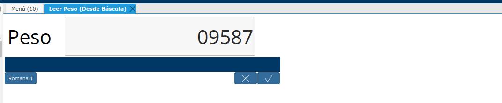

.. |Parámetro tiempo de refresco| image:: resources/weight-sender-folder-refresh-time.png
.. |Leer peso(Désde Báscula)| image:: resources/weight-sender-folder-read-from-scale.png

.. _documento/configurar-record-weight-sender-adempiere:

Configuración Cliente de Lectura de Peso en ADempiere
=====================================================

En ADempiere la Configuración (Record-Weight-Sender-DotNet) se realiza en la ventana Registro de Aplicación.

Configurar la aplicación para Leer Peso de la balanza desde ADempiere
---------------------------------------------------------------------

1. Dirijase a la ventana registros de aplicación y cree un nuevo registro llenando los siguientes campos.

|Registro de Aplicación|

- **Código**: Codigo Descriptivo para identificar la Balanza o Romana.
- **Tipo de Aplicación**:   Lector de Báscula
- **Aplicación Soportada**: RWS_Weight Scale Reader
- **Nombre**: Nombre Descriptivo para identificar la Balanza o Romana.
- **Descripción**: En está sección se puede Decribir la balanza o la ubicación de la misma para un mejor referencia para identificarla
- **Servidor**: Dominio o Dirección IP donde se encuentra ejecutandose el servicio de cola de Kafka.
- **Puerto**: Puerto por el cual responde el servicio de cola de Kafka.

2. Una vez llenos los campos anteriores se debe ingresar en la pestaña paramteros, alli deben crear 2 registros **default_refresh_time_ms** y **default_waiting_time_ms**.

Dentro de la pestaña paramteros crear un nuevo registro y en el campo tipo de parametro seleccionar constante, luego en el campo nombre de parametro colocar lo siguiente:

- **default_refresh_time_ms**: Corresponde al tiempo que la cola de impresion va a retener los mensajes este valor se expresa en ms y de ajustar al valor 500.

|Parámetro tiempo de refresco|

- **default_waiting_time_ms**: Corresponde al tiempo de espera maximo de espera de la aplicacion por espera de una respuesta del servicio de kafka. El valor se expresa en ms, colocar en este campo 20000

|Parámetro tiempo de espera|

1. Prueba de Lectura de Peso:

Este paso solo se debe hacer, luego de realizar la configuración en Windows de la aplicación. Dirijase al formulario **Leer Peso (Desde Báscula)** al iniciarlo se debe mostra la siguiente ventana.

|Leer peso(Désde Báscula)|

Luego de esto seleccionar la Romana o Báscula previamente configurada, e inmediatamente esta mostrara el peso que esta leyendo visualizando la ventana como se muestra a continuación.

|Leer peso|
