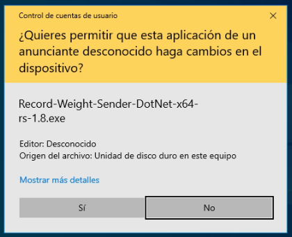
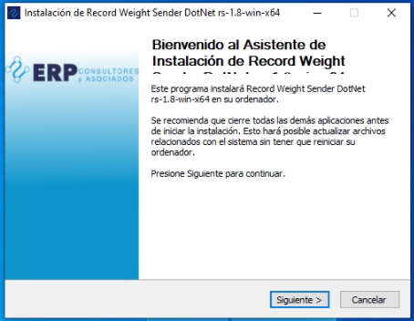
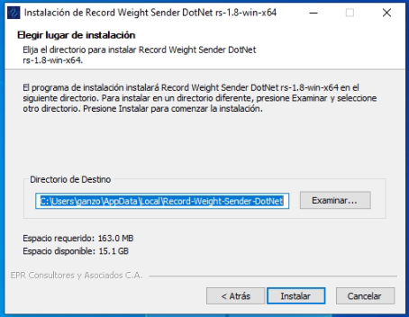
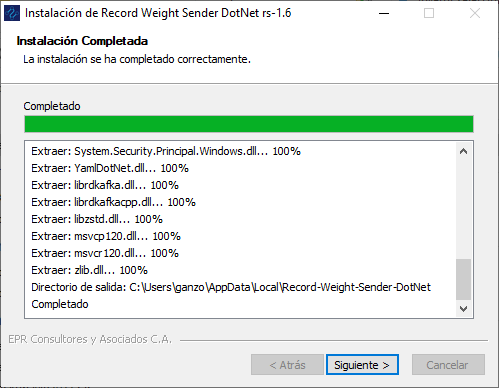
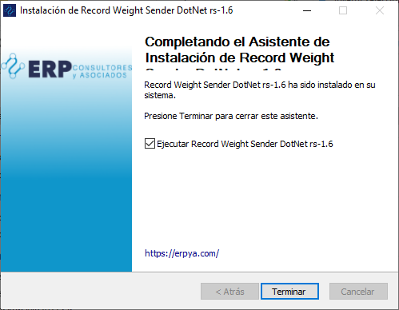
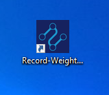
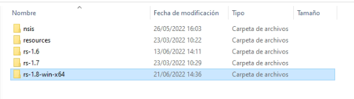
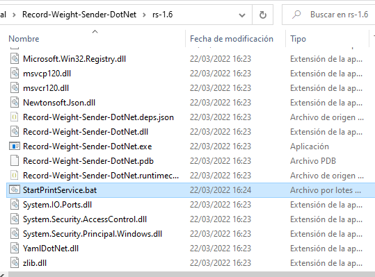

.. |Ejecutar instalador| image:: resources/weight-sender-start-installer.PNG

.. |Ventana de licencia| image:: resources/weight-sender-license.PNG

.. _Dotnet SDK 3.1: https://dotnet.microsoft.com/en-us/download/dotnet/3.1
.. _documento/instalar-record-weight-sender:

Instalar Cliente de Lectura de Peso
===================================

Esta aplicación capturar la Lectura de peso proveniente de una balanza a conectada a un equipo por medio de una interfaz RS-232.

Requisitos
----------

-  Sistema operativo Windows 10
-  `Dotnet SDK 3.1`_

Instalación
-----------

Para efectos demostrativos se instala la versión de **Record-Weight-Sender-DotNet-rs-1.6**, para las versiónes posteriores se deben seguir los mismos pasos.

1. Ejecutar el instalador

   Ejecutar Instalador

    |Ejecutar instalador|

   Permisos de Instalación

    |Permisos|

   Ventana de Bienvenida

    |Ventana de Bienvenida|

2. Licencia de la aplicación

    |Ventana de licencia|

3. Ruta de Instalación

    La aplicación se instala por defecto en la siguiente ubicación:

    ::

        C:\Users\(Usuario de Windows)\AppData\Local\Record-Weight-Sender-DotNet

    |Ruta de instalación|

4. Progreso Instalación

    |Progreso de Instalación|

5. Finalizar Instalación

    |Finalizar instalación|

6. Icono creado en el Escritorio de Windows.

    |Acceso directo|

Configurar la aplicación para Imprimir
--------------------------------------

La aplicaión se configura en dos etapas la primera en el servicio de ADempiere y la segunda comprende a actualizar los datos de la apliación instalada, Siendo el orden el que se muestra a continuación.

.. toctree::
    :maxdepth: 2
    config-record-weight-sender-adempiere
    config-record-weight-sender-windows

Problemas luego instalar
------------------------

En Caso de que no se cree el icono en el escritorio luego de instalar, se debe verificar si el usuario con el que se realizo la Instalación tiene permisologia de Administrador.

Se deben seguir los siguientes pasos:

1. Verificar que este creada la siguiente Ruta: **C:\Users\(Usuario de Windows)\AppData\Local\Record-Weight-Sender-DotNet** y a su vez en dicha ubicación existan los siguientes directorios:

    |Estrutura de Carpetas|

    Debe Existir la carpeta *resources* y una carpeta que en su nombre incluya las siguientes siglas *rs-* (Ej. rs-2.3)

2. Si el directorio existe se debe ingresar a la carpeta **rs-x.x** y ubicar el archivo **StartPrintService.bat**, y proceder a crear un acceso directo en el escritorio de ese archivo.

    |Archivo para inicar la aplicación|