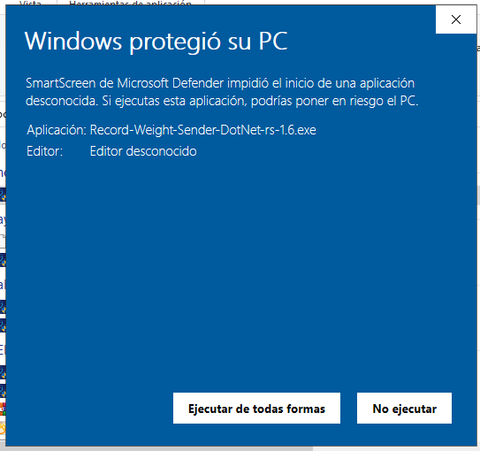
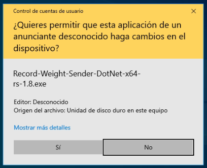
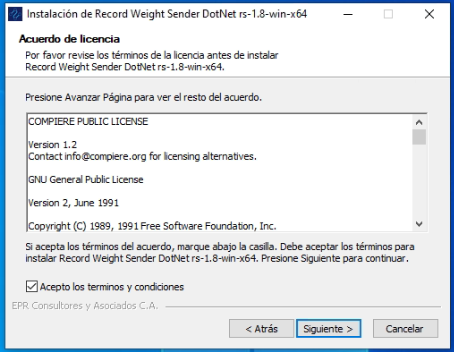
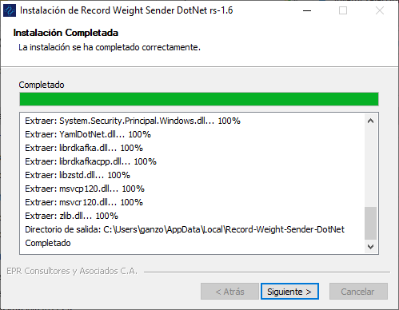

.. |Ventana de Bienvenida| image:: resources/weight-sender-welcome.PNG

.. |Ruta de instalación| image:: resources/weight-sender-install-path.PNG

.. |Finalizar instalación| image:: resources/weight-sender-install-finish.PNG
.. |Acceso directo| image:: resources/weight-sender-desktop-shortcut.PNG
.. |Estrutura de Carpetas| image:: resources/weight-sender-folder-structure.PNG
.. |Archivo para inicar la aplicación| image:: resources/weight-sender-start_app_file.PNG
.. |Copiar Acceso Directo| image:: resources/weight-sender-folder-copy-shortcut.PNG
.. _Record-Weight-Sender-DotNet-x86: https://erpya.ams3.digitaloceanspaces.com/public/Record-Weight-Sender-DotNet-x86-rs-1.8.exe
.. _Record-Weight-Sender-DotNet-x64: https://erpya.ams3.digitaloceanspaces.com/public/Record-Weight-Sender-DotNet-x64-rs-1.8.exe
.. _documento/actualizar-record-weight-sender:

Actualizar el Cliente de Lectura de Peso
========================================

Esta aplicación capturar la Lectura de peso proveniente de una balanza a conectada a un equipo por medio de una interfaz RS-232.

Requisitos
----------

-  Instalador `Record-Weight-Sender-DotNet-x86`_ ó `Record-Weight-Sender-DotNet-x64`_

Instalación
-----------

Para efectos demostrativos se instala la versión de **Record-Weight-Sender-DotNet-x64-rs-1.8**, para las versiónes posteriores se deben seguir los mismos pasos, es importante recalcar que al actualizar se mantienen los datos de configuración previos, por esa razon no es necescario configurar nuevamente la aplicación.

1. Ejecutar el instalador

   Ejecutar Instalador

    |Ejecutar instalador|

   Permisos de Instalación

    |Permisos|

   Ventana de Bienvenida

    |Ventana de Bienvenida|

2. Licencia de la aplicación

    |Ventana de licencia|

3. Ruta de Instalación

    La aplicación se instala por defecto en la siguiente ubicación:

    ::

        C:\Users\(Usuario de Windows)\AppData\Local\Record-Weight-Sender-DotNet

    |Ruta de instalación|

4. Progreso Instalación

    |Progreso de Instalación|

5. Finalizar Instalación

    |Finalizar instalación|

6. Icono creado en el Escritorio de Windows.

    |Acceso directo|

7. Al Finalizar la instalación se actualizara automaticamente el servio de Windows.

    |Servicio de Windows|

    |Propiedades Servicio de Windows|

    Modificando la **Ruta de Acceso al Ejecutable** con la siguiente ruta:

    ::

        C:\Users\(Usuario de Windows)\AppData\Local\Record-Weight-Sender-DotNet\rs-1.8-win-x64\Local-Printing-Service-DotNet-win-x64.exe

