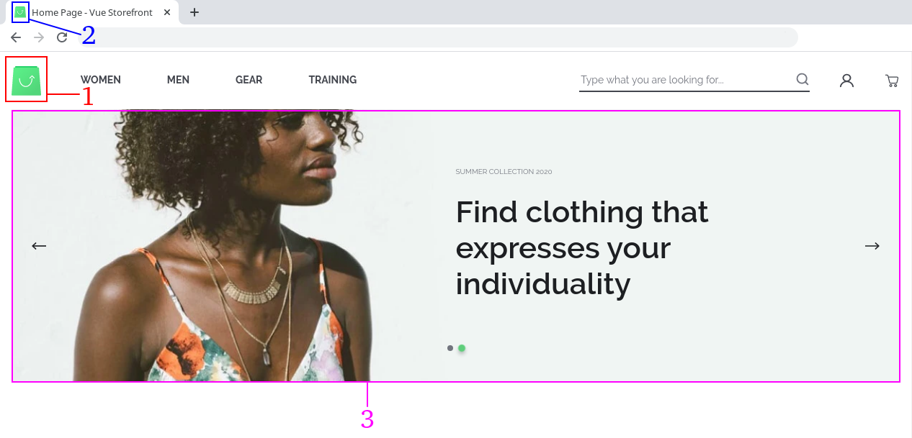
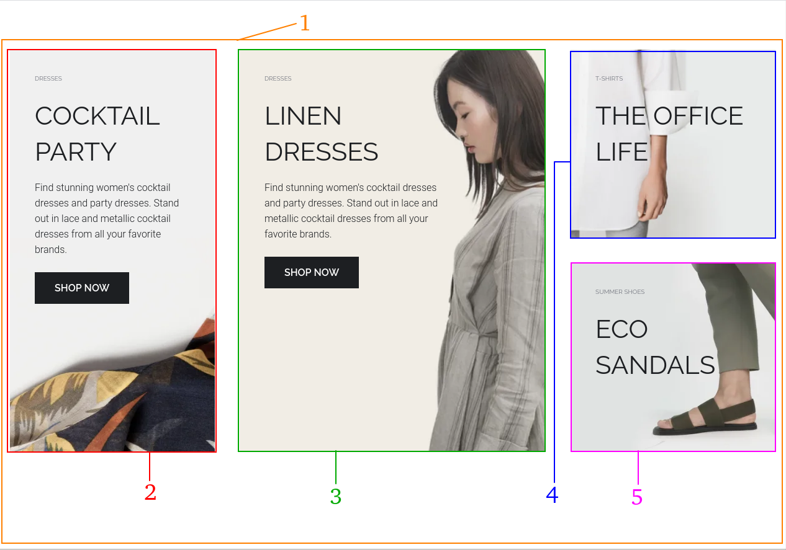
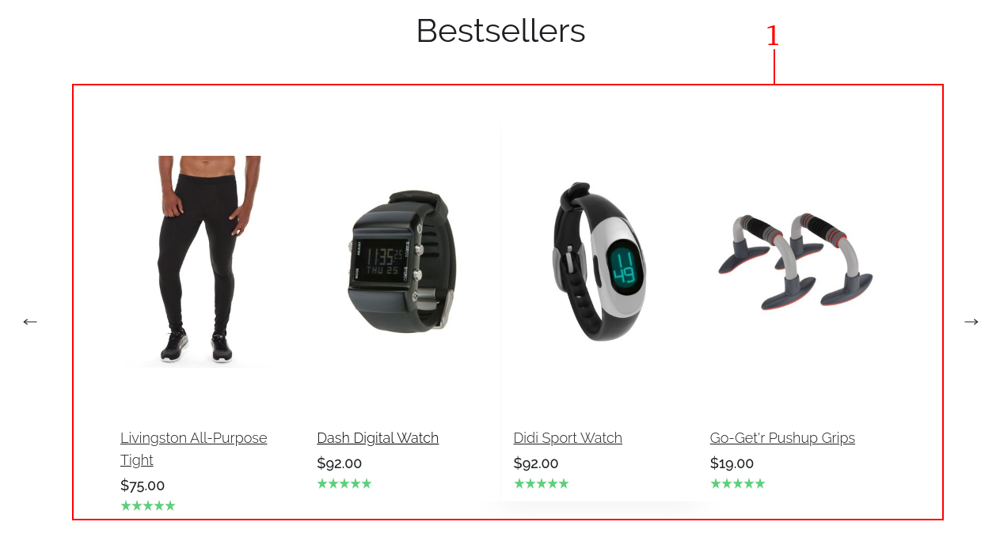
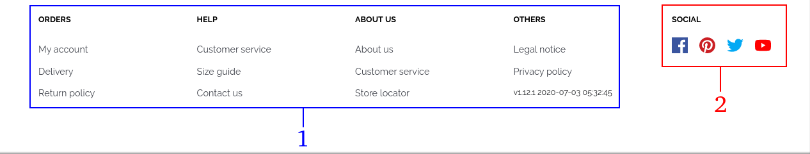

.. |image10| image:: resources/11.png
   :width: 6.5in
   :height: 4.45833in

.. _documento/tema-personalizado:

**Tema personalizado**
======================

    |image6|

    +------------+----------------------------------------------------------------+
    | **Número** | **Archivo de configuración**                                   |
    +============+================================================================+
    | 1          | /theme/assets/logo.png                                         |
    +------------+----------------------------------------------------------------+
    | 2          | /theme/assets/favicon-16x16.png                                |
    |            |                                                                |
    |            | /theme/assets/favicon-32x32.png                                |
    +------------+----------------------------------------------------------------+
    | 3          | /theme/resource/main-images.json                               |
    |            |                                                                |
    |            | -  Título                                                      |
    |            | -  Subtítulo                                                   |
    |            | -  Color de fondo                                              |
    |            | -  Nombre de clase                                             |
    |            | -  Imágenes:                                                   |
    |            |                                                                |
    |            |    -  Imagen en formato .WEBP                                  |
    |            |    -  Imagen en formato .PNG con resolución de 1239x584 px     |
    |            |                                                                |
    |            | Ubicación de las imágenes:                                     |
    |            |                                                                |
    |            | -  /theme/assets/banner/webp/full_width_banner2.webp           |
    |            | -  /theme/assets/banner/png/full_width_banner2.png             |
    +------------+----------------------------------------------------------------+

    |image7|

    +-----------------------------------+--------------------------------------------------------+
    | **Número**                        | **Archivo de configuración**                           |
    +===================================+========================================================+
    |1                                  |/theme/resource/promoted_offers.json                    |
    |                                   |sección “mainBanners”                                   |
    |                                   |                                                        |
    |                                   |-  Título                                               |
    |                                   |-  Subtítulo                                            |
    |                                   |-  Descripción                                          |
    |                                   |-  Texto del botón                                      |
    |                                   |-  Enlace a donde dirige                                |
    |                                   |-  Nombre del Slot                                      |
    |                                   |-  Los Slots disponibles son:                           |
    |                                   |                                                        |
    |                                   |   -  banner-A                                          |
    |                                   |   -  banner-B                                          |
    |                                   |   -  banner-C                                          |
    |                                   |   -  banner-D                                          |
    +-----------------------------------+--------------------------------------------------------+
    | 2                                 | Imágenes:                                              |
    |                                   |                                                        |
    |                                   | -  Imagen en formato .WEBP                             |
    |                                   | -  Imagen en formato .PNG con resolución de 330x660 px |
    |                                   |                                                        |
    |                                   | Ubicación de las imágenes:                             |
    |                                   |                                                        |
    |                                   | -  /theme/assets/banner/webp/bannerF.webp              |
    |                                   | -  /theme/assets/banner/png/bannerF.png                |
    +-----------------------------------+--------------------------------------------------------+
    | 3                                 | Imágenes:                                              |
    |                                   |                                                        |
    |                                   | -  Imagen en formato .WEBP                             |
    |                                   | -  Imagen en formato .PNG con resolución de 500x660 px |
    |                                   |                                                        |
    |                                   | Ubicación de las imágenes:                             |
    |                                   |                                                        |
    |                                   | -  /theme/assets/banner/webp/bannerE.webp              |
    |                                   | -  /theme/assets/banner/png/bannerE.png                |
    +-----------------------------------+--------------------------------------------------------+
    | 4                                 | Imágenes:                                              |
    |                                   |                                                        |
    |                                   | -  Imagen en formato .WEBP                             |
    |                                   | -  Imagen en formato .PNG con resolución de 1234x398 px|
    |                                   |                                                        |
    |                                   | Ubicación de las imágenes:                             |
    |                                   |                                                        |
    |                                   | -  /theme/assets/banner/webp/bannerC.webp              |
    |                                   | -  /theme/assets/banner/png/bannerC.png                |
    +-----------------------------------+--------------------------------------------------------+
    | 5                                 | Imágenes:                                              |
    |                                   |                                                        |
    |                                   | -  Imagen en formato .WEBP                             |
    |                                   | -  Imagen en formato .PNG con resolución de 330x310 px |
    |                                   |                                                        |
    |                                   | Ubicación de las imágenes:                             |
    |                                   |                                                        |
    |                                   | -  /theme/assets/banner/webp/bannerG.webp              |
    |                                   | -  /theme/assets/banner/png/bannerG.png                |
    +-----------------------------------+--------------------------------------------------------+

    |image8|

    +------------+------------------------------------------------------------+
    | **Número** | **Archivo de configuración**                               |
    +============+============================================================+
    | 1          | /theme/components/organisms/o-newsletter.vue               |
    |            | Imágenes utilizadas:                                       |
    |            |                                                            |
    |            | -  /theme/assets/newsletter/webp/newsletter.webp           |
    |            | -  /theme/assets/newsletter/png/newsletter.png             |
    +------------+------------------------------------------------------------+

    |image9|

    +-----------------------------------+-----------------------------------+
    | **Número**                        | **Archivo de configuración**      |
    +===================================+===================================+
    | 1                                 | Esta sección se carga             |
    |                                   | dinámicamente del gestor de       |
    |                                   | tienda (Magento) muestra los 8    |
    |                                   | productos nuevos según la         |
    |                                   | información del campo “ Set       |
    |                                   | Product as New From To”           |
    |                                   | suministrada al momento de        |
    |                                   | registrar el producto.            |
    +-----------------------------------+-----------------------------------+

    |image10|

    +------------+-------------------------------------------------+
    | **Número** | **Archivo de configuración**                    |
    +============+=================================================+
    | 1          | /theme/resource/instagram-images.json           |
    |            |                                                 |
    |            | Imágenes utilizadas en formato WEBP:            |
    |            |                                                 |
    |            | -  /theme/assets/ig/webp/ig01.webp              |
    |            | -  /theme/assets/ig/webp/ig02.webp              |
    |            | -  /theme/assets/ig/webp/ig03.webp              |
    |            | -  /theme/assets/ig/webp/ig04.webp              |
    |            | -  /theme/assets/ig/webp/ig05.webp              |
    |            | -  /theme/assets/ig/webp/ig06.webp              |
    |            |                                                 |
    |            | Imágenes utilizadas en formato JPG:             |
    |            |                                                 |
    |            | -  /theme/assets/ig/jpg/ig01.jpg                |
    |            | -  /theme/assets/ig/jpg/ig02.jpg                |
    |            | -  /theme/assets/ig/jpg/ig03.jpg                |
    |            | -  /theme/assets/ig/jpg/ig04.jpg                |
    |            | -  /theme/assets/ig/jpg/ig05.jpg                |
    |            | -  /theme/assets/ig/jpg/ig06.jpg                |
    +------------+-------------------------------------------------+

    |image11|

    +-----------------------------------+-------------------------------------------------------+
    | **Número**                        | **Archivo de configuración**                          |
    +===================================+=======================================================+
    | 1                                 | La información de estas páginas                       |
    |                                   | se obtienen desde el gestor de la                     |
    |                                   | tienda (Magento)                                      |
    +-----------------------------------+-------------------------------------------------------+
    | 2                                 | Los enlaces de redes sociales se                      |
    |                                   | configuran directamente en el                         |
    |                                   | código fuente en el archivo                           |
    |                                   | /theme/components/organisms/o-footer.vue              |
    |                                   | La imagen utilizada se encuentra en:                  |
    |                                   | /theme/assets/newsletter/png/newsletter.png           |
    +-----------------------------------+-------------------------------------------------------+

**Listado de imágenes y resolución**
------------------------------------

.. note::

    A continuación le dejamos un :download:`ejemplo <resources/assets-capybara.zip>` de la estructura de las imágenes.

    +----------------------------------------+--------------------------------------------------+-----------------------+
    | **Nombre del archivo**                 | **Ruta del archivo**                             | **Resolución**        |
    +========================================+==================================================+=======================+
    | “BEACH BAGS” Menú Principal Móvil      | /theme/assets/banner/png/bannerBeachBag-full.png | 318x120 px            |
    +----------------------------------------+--------------------------------------------------+-----------------------+
    | “BEACH BAGS” Menú Principal            | /theme/assets/banner/png/bannerBeachBag.png      | 252x252 px            |
    +----------------------------------------+--------------------------------------------------+-----------------------+
    | “THE OFFICE LIFE”                      | /theme/assets/banner/png/bannerC.png             | 1234x398 px           |
    +----------------------------------------+--------------------------------------------------+-----------------------+
    | “LINEN DRESSES”                        | /theme/assets/banner/png/bannerE.png             | 500x660 px            |
    +----------------------------------------+--------------------------------------------------+-----------------------+
    | “COCKTAIL PARTY”                       | /theme/assets/banner/png/bannerF.png             | 330x660 px            |
    +----------------------------------------+--------------------------------------------------+-----------------------+
    | “ECO SANDALS”                          | /theme/assets/banner/png/bannerG.png             | 330x310 px            |
    +----------------------------------------+--------------------------------------------------+-----------------------+
    |                                        | /theme/assets/banner/png/bannerK.png             | 750x250 px            |
    +----------------------------------------+--------------------------------------------------+-----------------------+
    | “Last pairs left” Menú Principal Móvil | /theme/assets/banner/png/bannerSandals-full.png  | 320x121 px            |
    +----------------------------------------+--------------------------------------------------+-----------------------+
    | “Last pairs left” Menú Principal       | /theme/assets/banner/png/bannerSandals.png       | 252x252 px            |
    +----------------------------------------+--------------------------------------------------+-----------------------+
    | Slide Principal en Home Page           | /theme/assets/banner/png/full_width_banner.png   | 1239x584 px           |
    +----------------------------------------+--------------------------------------------------+-----------------------+
    | Slide Principal en Home Page           | /theme/assets/banner/png/full_width_banner2.png  | 1239x584 px           |
    +----------------------------------------+--------------------------------------------------+-----------------------+
    | Grid “Share Your Look”                 | /theme/assets/ig/jpg/ig01.jpg                    | 486x486 px            |
    +----------------------------------------+--------------------------------------------------+-----------------------+
    | Grid “Share Your Look”                 | /theme/assets/ig/jpg/ig02.jpg                    | 486x486 px            |
    +----------------------------------------+--------------------------------------------------+-----------------------+
    | Grid “Share Your Look”                 | /theme/assets/ig/jpg/ig03.jpg                    | 486x486 px            |
    +----------------------------------------+--------------------------------------------------+-----------------------+
    | Grid “Share Your Look”                 | /theme/assets/ig/jpg/ig04.jpg                    | 486x486 px            |
    +----------------------------------------+--------------------------------------------------+-----------------------+
    | Grid “Share Your Look”                 | /theme/assets/ig/jpg/ig05.jpg                    | 486x486 px            |
    +----------------------------------------+--------------------------------------------------+-----------------------+
    | Grid “Share Your Look”                 | /theme/assets/ig/jpg/ig06.jpg                    | 486x486 px            |
    +----------------------------------------+--------------------------------------------------+-----------------------+
    | Icono de instalación                   | /theme/assets/android-icon-48x48.png             | 48x48 px              |
    +----------------------------------------+--------------------------------------------------+-----------------------+
    | Icono de instalación                   | /theme/assets/android-icon-72x72.png             | 72x72 px              |
    +----------------------------------------+--------------------------------------------------+-----------------------+
    | Icono de instalación                   | /theme/assets/android-icon-96x96.png             | 96x96 px              |
    +----------------------------------------+--------------------------------------------------+-----------------------+
    | Icono de instalación                   | /theme/assets/android-icon-144x144.png           | 144x144 px            |
    +----------------------------------------+--------------------------------------------------+-----------------------+
    | Icono de instalación                   | /theme/assets/android-icon-168x168.png           | 168x168 px            |
    +----------------------------------------+--------------------------------------------------+-----------------------+
    | Icono de instalación                   | /theme/assets/android-icon-192x192.png           | 192x192 px            |
    +----------------------------------------+--------------------------------------------------+-----------------------+
    | Icono de instalación                   | /theme/assets/android-icon-512x512.png           | 512x512 px            |
    +----------------------------------------+--------------------------------------------------+-----------------------+
    | Imagen de fondo al iniciar aplicación  | /theme/assets/apple_splash_640.png               | 640x1136 px           |
    | instalable                             |                                                  |                       |
    +----------------------------------------+--------------------------------------------------+-----------------------+
    | Imagen de fondo al iniciar aplicación  | /theme/assets/apple_splash_750.png               | 750x1334 px           |
    | instalable                             |                                                  |                       |
    +----------------------------------------+--------------------------------------------------+-----------------------+
    | Imagen de fondo al iniciar aplicación  | /theme/assets/apple_splash_1125.png              | 1125x2436 px          |
    | instalable                             |                                                  |                       |
    +----------------------------------------+--------------------------------------------------+-----------------------+
    | Imagen de fondo al iniciar aplicación  | /theme/assets/apple_splash_1242.png              | 1242x2208 px          |
    | instalable                             |                                                  |                       |
    +----------------------------------------+--------------------------------------------------+-----------------------+
    | Imagen de fondo al iniciar aplicación  | /theme/assets/apple_splash_1536.png              | 1536x2048 px          |
    | instalable                             |                                                  |                       |
    +----------------------------------------+--------------------------------------------------+-----------------------+
    | Imagen de fondo al iniciar aplicación  | /theme/assets/apple_splash_1668.png              | 1668x2224 px          |
    | instalable                             |                                                  |                       |
    +----------------------------------------+--------------------------------------------------+-----------------------+
    | Imagen de fondo al iniciar aplicación  | /theme/assets/apple_splash_2048.png              | 2048xx2732 px         |
    | instalable                             |                                                  |                       |
    +----------------------------------------+--------------------------------------------------+-----------------------+
    | Icono de la aplicación instalable iOS  | /theme/assets/apple-touch-icon.png               | 180x180 px            |
    +----------------------------------------+--------------------------------------------------+-----------------------+
