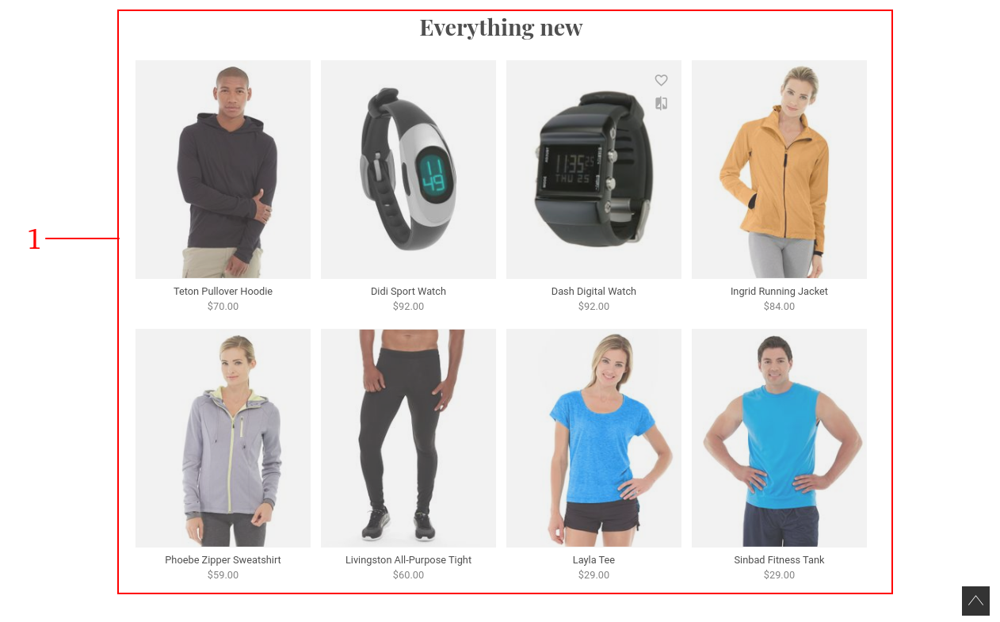
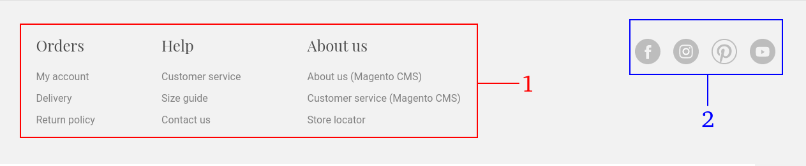

.. |image0| image:: resources/1.png
   :width: 6.5in
   :height: 3.97222in
.. |image1| image:: resources/2.png
   :width: 6.5in
   :height: 4.16667in

.. |image3| image:: resources/4.png
   :width: 6.5in
   :height: 3.84722in
.. |image4| image:: resources/5.png
   :width: 6.5in
   :height: 0.48611in

.. _documento/tema-por-defecto:

**Tema por defecto**
====================

|image0|

+-----------------------------------+----------------------------------------------+
| **Número**                        | **Archivo de configuración**                 |
+===================================+==============================================+
| 1                                 | /theme/resource/main-image.json              |
|                                   |                                              |
|                                   | -  Título                                    |
|                                   | -  Subtítulo                                 |
|                                   | -  Imagen con resolución de 2000x838 px      |
|                                   |                                              |
|                                   | La ubicación de la imagen es:                |
|                                   | /theme/assets/full_width_banner.jpg          |
+-----------------------------------+----------------------------------------------+
| 2                                 | /theme/assets/logo.png                       |
+-----------------------------------+----------------------------------------------+
| 3                                 | (carpetaPrincipal)/config/local.json         |
+-----------------------------------+----------------------------------------------+

|image1|

+------------+----------------------------------------------------------------+
| **Número** | **Archivo de configuración**                                   |
+============+================================================================+
| 1          | /theme/resource/promoted_offers.json                           |
|            |                                                                |
|            | -  Título                                                      |
|            | -  Subtítulo                                                   |
|            | -  Imagen con resolución de 600 x 800 px                       |
|            | -  Enlace a donde dirige                                       |
|            |                                                                |
|            | La ubicación de la imagen es: /theme/assets/ban1.jpg           |
+------------+----------------------------------------------------------------+
| 2          | /theme/resource/promoted_offers.json                           |
|            |                                                                |
|            | -  Título                                                      |
|            | -  Subtítulo                                                   |
|            | -  Imagen con resolución de 600 x 400 px                       |
|            | -  Enlace a donde dirige                                       |
|            |                                                                |
|            | La ubicación de la imagen es: /theme/assets/ban2.jpg           |
+------------+----------------------------------------------------------------+
| 3          | /theme/resource/promoted_offers.json                           |
|            |                                                                |
|            | -  Título                                                      |
|            | -  Subtítulo                                                   |
|            | -  Imagen con resolución 600 x 400 px                          |
|            | -  Enlace a donde dirige                                       |
|            |                                                                |
|            | La ubicación de la imagen es: /theme/assets/ban3.jpg           |
+------------+----------------------------------------------------------------+

|image2|

+-----------------------------------+-----------------------------------+
| **Número**                        | **Archivo de configuración**      |
+===================================+===================================+
| 1                                 | Esta sección se carga             |
|                                   | dinamicamente del gestor de       |
|                                   | tienda (Magento) y muestra los 8  |
|                                   | productos nuevos según la         |
|                                   | información del campo “Set        |
|                                   | Product as New From To”           |
|                                   | suministrada al momento de        |
|                                   | registrar el producto.            |
+-----------------------------------+-----------------------------------+

|image3|

+-----------------------------------+--------------------------------------------------------------+
| **Número**                        | **Archivo de configuración**                                 |
+===================================+==============================================================+
| 1                                 | Estas imagenes se cargan estáticamente desde el archivo      |
|                                   | /theme/components/theme/blocks/TileLinks/TileLinks           |
|                                   |                                                              |
|                                   | La ubicación de las imagenes es:                             |
|                                   |                                                              |
|                                   | -  /theme/assets/ig/ig01.png                                 |
|                                   | -  /theme/assets/ig/ig02.png                                 |
|                                   | -  /theme/assets/ig/ig03.png                                 |
|                                   | -  /theme/assets/ig/ig04.png                                 |
|                                   | -  /theme/assets/ig/ig05.png                                 |
|                                   | -  /theme/assets/ig/ig06.png                                 |
|                                   |                                                              |
|                                   | Todas con resolución 372 x 372 px                            |
+-----------------------------------+--------------------------------------------------------------+

|image4|

+-----------------------------------+------------------------------------------+
| **Número**                        | **Archivo de configuración**             |
+===================================+==========================================+
| 1                                 | Este texto se cambia en los              |
|                                   | archivos de traducción ubicado en        |
|                                   | /theme/resource/i18n/en-US.csv           |
|                                   |                                          |
|                                   | **NOTA:** El nombre del archivo          |
|                                   | puede variar según el idioma             |
|                                   | configurado                              |
+-----------------------------------+------------------------------------------+
| 2                                 | El texto dentro del botón se             |
|                                   | configura en el archivo de               |
|                                   | traducción.                              |
|                                   |                                          |
|                                   | /theme/resource/i18n/en-US.csv           |
|                                   |                                          |
|                                   | **NOTA:** El nombre del archivo          |
|                                   | puede variar según el idioma             |
|                                   | configurado                              |
+-----------------------------------+------------------------------------------+

|image5|

+-----------------------------------+-----------------------------------------------------------+
| **Número**                        | **Archivo de configuración**                              |
+===================================+===========================================================+
| 1                                 | La información de estas páginas                           |
|                                   | se obtienen desde el gestor de la                         |
|                                   | tienda (Magento)                                          |
+-----------------------------------+-----------------------------------------------------------+
| 2                                 | Los enlaces de redes sociales se                          |
|                                   | configuran directamente en el                             |
|                                   | código fuente en el archivo                               |
|                                   | /theme/components/core/blocks/Footer/Footer.vue           |
+-----------------------------------+-----------------------------------------------------------+

Listado de imágenes y resolución

+-----------------------+----------------------------------------+-----------------------+
| **Nombre del archivo**| **Ruta del archivo**                   | **Resolución**        |
+=======================+========================================+=======================+
| Grid “Get Inspired”   | /theme/assets/ig/ig01.png              | 372x372 px            |
+-----------------------+----------------------------------------+-----------------------+
| Grid “Get Inspired”   | /theme/assets/ig/ig02.png              | 372x372 px            |
+-----------------------+----------------------------------------+-----------------------+
| Grid “Get Inspired”   | /theme/assets/ig/ig03.png              | 372x372 px            |
+-----------------------+----------------------------------------+-----------------------+
| Grid “Get Inspired”   | /theme/assets/ig/ig04.png              | 372x372 px            |
+-----------------------+----------------------------------------+-----------------------+
| Grid “Get Inspired”   | /theme/assets/ig/ig05.png              | 372x372 px            |
+-----------------------+----------------------------------------+-----------------------+
| Grid “Get Inspired”   | /theme/assets/ig/ig06.png              | 372x372 px            |
+-----------------------+----------------------------------------+-----------------------+
| Icono de instalación  | /theme/assets/android-icon-48x48.png   | 48x48 px              |
+-----------------------+----------------------------------------+-----------------------+
| Icono de instalación  | /theme/assets/android-icon-72x72.png   | 72x72 px              |
+-----------------------+----------------------------------------+-----------------------+
| Icono de instalación  | /theme/assets/android-icon-96x96.png   | 96x96 px              |
+-----------------------+----------------------------------------+-----------------------+
| Icono de instalación  | /theme/assets/android-icon-144x144.png | 144x144 px            |
+-----------------------+----------------------------------------+-----------------------+
| Icono de instalación  | /theme/assets/android-icon-168x168.png | 168x168 px            |
+-----------------------+----------------------------------------+-----------------------+
| Icono de instalación  | /theme/assets/android-icon-192x192.png | 192x192 px            |
+-----------------------+----------------------------------------+-----------------------+
| Icono de instalación  | /theme/assets/android-icon-512x512.png | 512x512 px            |
+-----------------------+----------------------------------------+-----------------------+
| Imagen de fondo al    | /theme/assets/apple_splash_640.png     | 640x1136 px           |
| iniciar aplicación    |                                        |                       |
| instalable            |                                        |                       |
+-----------------------+----------------------------------------+-----------------------+
| Imagen de fondo al    | /theme/assets/apple_splash_750.png     | 750x1334 px           |
| iniciar aplicación    |                                        |                       |
| instalable            |                                        |                       |
+-----------------------+----------------------------------------+-----------------------+
| Imagen de fondo al    | /theme/assets/apple_splash_1125.png    | 1125x2436 px          |
| iniciar aplicación    |                                        |                       |
| instalable            |                                        |                       |
+-----------------------+----------------------------------------+-----------------------+
| Imagen de fondo al    | /theme/assets/apple_splash_1242.png    | 1242x2208 px          |
| iniciar aplicación    |                                        |                       |
| instalable            |                                        |                       |
+-----------------------+----------------------------------------+-----------------------+
| Imagen de fondo al    | /theme/assets/apple_splash_1536.png    | 1536x2048 px          |
| iniciar aplicación    |                                        |                       |
| instalable            |                                        |                       |
+-----------------------+----------------------------------------+-----------------------+
| Imagen de fondo al    | /theme/assets/apple_splash_1668.png    | 1668x2224 px          |
| iniciar aplicación    |                                        |                       |
| instalable            |                                        |                       |
+-----------------------+----------------------------------------+-----------------------+
| Imagen de fondo al    | /theme/assets/apple_splash_2048.png    | 2048xx2732 px         |
| iniciar aplicación    |                                        |                       |
| instalable            |                                        |                       |
+-----------------------+----------------------------------------+-----------------------+
| Imagen de fondo al    | /theme/assets/apple-touch-icon.png     | 180x180 px            |
| iniciar aplicación    |                                        |                       |
| instalable            |                                        |                       |
+-----------------------+----------------------------------------+-----------------------+
| “Office casual        | /theme/assets/ban1.jpg                 | 600x800 px            |
| Collection”           |                                        |                       |
+-----------------------+----------------------------------------+-----------------------+
| “Shine On Collection” | /theme/assets/ban2.jpg                 | 600x400 px            |
|                       |                                        |                       |
+-----------------------+----------------------------------------+-----------------------+
| “Spring is Coming”    | /theme/assets/ban3.jpg                 | 600x400 px            |
+-----------------------+----------------------------------------+-----------------------+
|                       | /theme/assets/collection.jpg           | 459x569 px            |
+-----------------------+----------------------------------------+-----------------------+
| Icono del navegador   | /theme/assets/favicon-16x16.png        | 313x300 px            |
+-----------------------+----------------------------------------+-----------------------+
| Icono del navegador   | /theme/assets/favicon-32x32.png        | 32x32 px              |
+-----------------------+----------------------------------------+-----------------------+
| Imagen Principal Home | /theme/assets/full_width_banner.jpg    | 2000x838 px           |
| Page                  |                                        |                       |
+-----------------------+----------------------------------------+-----------------------+
| Logo de home page     | /theme/assets/logo.png                 | 200x200 px            |
+-----------------------+----------------------------------------+-----------------------+
| Logo de home page     | /theme/assets/logo.svg                 |                       |
+-----------------------+----------------------------------------+-----------------------+
| Imagen de carga de    | /theme/assets/placeholder.jpg          | 242x300 px            |
| producto              |                                        |                       |
+-----------------------+----------------------------------------+-----------------------+
| Imagen de carga de    | /theme/assets/placeholder.svg          |                       |
| producto              |                                        |                       |
+-----------------------+----------------------------------------+-----------------------+
| Lupa para alejar la   | /theme/assets/search-minus.png         | 48x48 px              |
| imagen del producto   |                                        |                       |
+-----------------------+----------------------------------------+-----------------------+
| Lupa para acercar la  | /theme/assets/search-plus.png          | 48x48 px              |
| imagen del producto   |                                        |                       |
+-----------------------+----------------------------------------+-----------------------+
| Imagen de Slider en   | /theme/assets/slide_01.jpg             | 1440x640              |
| Home Page (Oculto por |                                        |                       |
| defecto)              |                                        |                       |
+-----------------------+----------------------------------------+-----------------------+
| Imagen de Slider en   | /theme/assets/slide_02.jpg             | 1440x640              |
| Home Page (Oculto por |                                        |                       |
| defecto)              |                                        |                       |
+-----------------------+----------------------------------------+-----------------------+
| Imagen de Slider en   | /theme/assets/slide_03.jpg             | 1440x640              |
| Home Page (Oculto por |                                        |                       |
| defecto)              |                                        |                       |
+-----------------------+----------------------------------------+-----------------------+
