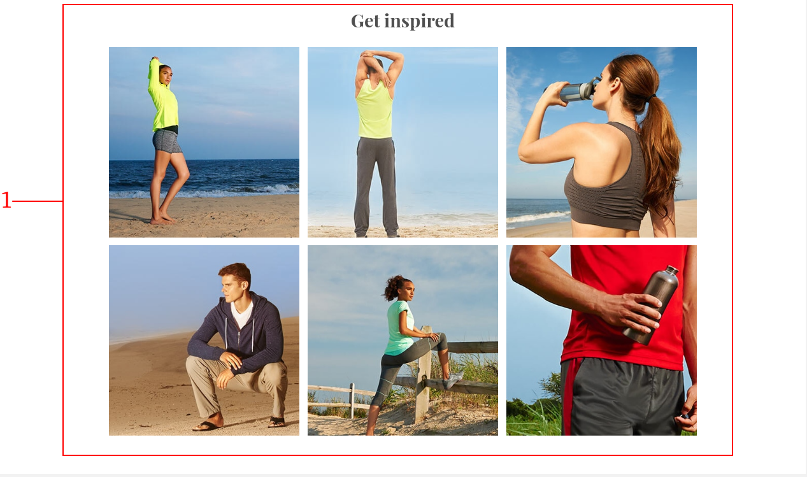

.. |image2| image:: resources/3.png
   :width: 6.5in
   :height: 4.04167in

.. |image4| image:: resources/5.png
   :width: 6.5in
   :height: 0.48611in
.. |image5| image:: resources/6.png
   :width: 6.5in
   :height: 1.34722in
.. |image6| image:: resources/7.png
   :width: 6.5in
   :height: 3.125in
.. |image7| image:: resources/8.png
   :width: 6.5in
   :height: 4.55556in
.. |image8| image:: resources/9.png
   :width: 6.5in
   :height: 1.56944in
.. |image9| image:: resources/10.png
   :width: 6.5in
   :height: 3.59722in
.. |image10| image:: resources/11.png
   :width: 6.5in
   :height: 4.45833in
.. |image11| image:: resources/12.png
   :width: 6.5in
   :height: 1.25in

.. _documento/E-commerce:

**Tema por defecto**
====================

|image0|

+-----------------------------------+-----------------------------------+
| **Número**                        | **Archivo de configuración**      |
+===================================+===================================+
| 1                                 | (carpetaDelTema)/resource/main-im |
|                                   | age.json                          |
|                                   |                                   |
|                                   | -  Título                         |
|                                   |                                   |
|                                   | -  Subtítulo                      |
|                                   |                                   |
|                                   | -  Imagen con resolución de 2000  |
|                                   |       x 838 px                    |
|                                   |                                   |
|                                   | La ubicación de la imagen es:     |
|                                   | (carpetaDelTema)/assets/full_widt |
|                                   | h_banner                          |
|                                   |                                   |
|                                   | .jpg                              |
+-----------------------------------+-----------------------------------+
| 2                                 | (carpetaDelTema)/assets/logo.png  |
+-----------------------------------+-----------------------------------+
| 3                                 | (carpetaPrincipal)/config/local.j |
|                                   | son                               |
+-----------------------------------+-----------------------------------+

|image1|

+------------+----------------------------------------------------------------+
| **Número** | **Archivo de configuración**                                   |
+============+================================================================+
| 1          | (carpetaDelTema)/resource/promoted_offers.json                 |
|            |                                                                |
|            | -  Título                                                      |
|            |                                                                |
|            | -  Subtítulo                                                   |
|            |                                                                |
|            | -  Imagen con resolución de 600 x 800 px                       |
|            |                                                                |
|            | -  Enlace a donde dirige                                       |
|            |                                                                |
|            | La ubicación de la imagen es: (carpetaDelTema)/assets/ban1.jpg |
+------------+----------------------------------------------------------------+
| 2          | (carpetaDelTema)/resource/promoted_offers.json                 |
|            |                                                                |
|            | -  Título                                                      |
|            |                                                                |
|            | -  Subtítulo                                                   |
|            |                                                                |
|            | -  Imagen con resolución de 600 x 400 px                       |
|            |                                                                |
|            | -  Enlace a donde dirige                                       |
|            |                                                                |
|            | La ubicación de la imagen es: (carpetaDelTema)/assets/ban2.jpg |
+------------+----------------------------------------------------------------+
| 3          | (carpetaDelTema)/resource/promoted_offers.json                 |
|            |                                                                |
|            | -  Título                                                      |
|            |                                                                |
|            | -  Subtítulo                                                   |
|            |                                                                |
|            | -  Imagen con resolución 600 x 400 px                          |
|            |                                                                |
|            | -  Enlace a donde dirige                                       |
|            |                                                                |
|            | La ubicación de la imagen es: (carpetaDelTema)/assets/ban3.jpg |
+------------+----------------------------------------------------------------+

|image2|

+-----------------------------------+-----------------------------------+
| **Número**                        | **Archivo de configuración**      |
+===================================+===================================+
| 1                                 | Esta sección se carga             |
|                                   | dinamicamente del gestor de       |
|                                   | tienda (Magento) muestra los 8    |
|                                   | productos nuevos según la         |
|                                   | información del campo “ Set       |
|                                   | Product as New From To”           |
|                                   | suministrada al momento de        |
|                                   | registrar el producto.            |
+-----------------------------------+-----------------------------------+

|image3|

+-----------------------------------+----------------------------------------+
| **Número**                        | **Archivo de configuración**           |
+===================================+========================================+
| 1                                 | Estas imagenes se cargan               |
|                                   | estáticamente desde el archivo         |
|                                   | (carpetaDelTema)/components/theme      |
|                                   | /blocks/TileLinks/TileLinks            |
|                                   |                                        |
|                                   | La ubicación de las imagenes es:       |
|                                   |                                        |
|                                   | -  (carpetaDelTema)/assets/ig/ig01.png |
|                                   |                                        |
|                                   | -  (carpetaDelTema)/assets/ig/ig02.png |
|                                   |                                        |
|                                   | -  (carpetaDelTema)/assets/ig/ig03.png |
|                                   |                                        |
|                                   | -  (carpetaDelTema)/assets/ig/ig04.png |
|                                   |                                        |
|                                   | -  (carpetaDelTema)/assets/ig/ig05.png |
|                                   |                                        |
|                                   | -  (carpetaDelTema)/assets/ig/ig06.png |
|                                   |                                        |
|                                   | Todas con resolución 372 x 372 px      |
+-----------------------------------+----------------------------------------+

|image4|

+-----------------------------------+-----------------------------------+
| **Número**                        | **Archivo de configuración**      |
+===================================+===================================+
| 1                                 | Este texto se cambia en los       |
|                                   | archivos de traducción ubicado en |
|                                   | (carpetaDelTema)/resource/i18n/en |
|                                   | -US.csv                           |
|                                   |                                   |
|                                   | **NOTA:** El nombre del archivo   |
|                                   | puede variar según el idioma      |
|                                   | configurado                       |
+-----------------------------------+-----------------------------------+
| 2                                 | El texto dentro del botón se      |
|                                   | configura en el archivo de        |
|                                   | traducción.                       |
|                                   |                                   |
|                                   | (carpetaDelTema)/resource/i18n/en |
|                                   | -US.csv                           |
|                                   |                                   |
|                                   | **NOTA:** El nombre del archivo   |
|                                   | puede variar según el idioma      |
|                                   | configurado                       |
+-----------------------------------+-----------------------------------+

|image5|

+-----------------------------------+-----------------------------------+
| **Número**                        | **Archivo de configuración**      |
+===================================+===================================+
| 1                                 | La información de estas páginas   |
|                                   | se obtienen desde el gestor de la |
|                                   | tienda (Magento)                  |
+-----------------------------------+-----------------------------------+
| 2                                 | Los enlaces de redes sociales se  |
|                                   | configuran directamente en el     |
|                                   | código fuente en el archivo       |
|                                   | (carpetaDelTema)/components/core/ |
|                                   | blocks/Footer/Footer.vue          |
+-----------------------------------+-----------------------------------+

Listado de imágenes y resolución

+-----------------------+-----------------------+-----------------------+
| **Nombre del          | **Ruta del archivo**  | **Resolución**        |
| archivo**             |                       |                       |
+=======================+=======================+=======================+
| Grid “Get Inspired”   | (carpetaDelTema)/asse | 372x372 px            |
|                       | ts/ig/ig01.png        |                       |
+-----------------------+-----------------------+-----------------------+
| Grid “Get Inspired”   | (carpetaDelTema)/asse | 372x372 px            |
|                       | ts/ig/ig02.png        |                       |
+-----------------------+-----------------------+-----------------------+
| Grid “Get Inspired”   | (carpetaDelTema)/asse | 372x372 px            |
|                       | ts/ig/ig03.png        |                       |
+-----------------------+-----------------------+-----------------------+
| Grid “Get Inspired”   | (carpetaDelTema)/asse | 372x372 px            |
|                       | ts/ig/ig04.png        |                       |
+-----------------------+-----------------------+-----------------------+
| Grid “Get Inspired”   | (carpetaDelTema)/asse | 372x372 px            |
|                       | ts/ig/ig05.png        |                       |
+-----------------------+-----------------------+-----------------------+
| Grid “Get Inspired”   | (carpetaDelTema)/asse | 372x372 px            |
|                       | ts/ig/ig06.png        |                       |
+-----------------------+-----------------------+-----------------------+
| Icono de instalación  | (carpetaDelTema)/asse | 48x48 px              |
|                       | ts/android-icon-48x48 |                       |
|                       | .png                  |                       |
+-----------------------+-----------------------+-----------------------+
| Icono de instalación  | (carpetaDelTema)/asse | 72x72 px              |
|                       | ts/android-icon-72x72 |                       |
|                       | .png                  |                       |
+-----------------------+-----------------------+-----------------------+
| Icono de instalación  | (carpetaDelTema)/asse | 96x96 px              |
|                       | ts/android-icon-96x96 |                       |
|                       | .png                  |                       |
+-----------------------+-----------------------+-----------------------+
| Icono de instalación  | (carpetaDelTema)/asse | 144x144 px            |
|                       | ts/android-icon-144x1 |                       |
|                       | 44.png                |                       |
+-----------------------+-----------------------+-----------------------+
| Icono de instalación  | (carpetaDelTema)/asse | 168x168 px            |
|                       | ts/android-icon-168x1 |                       |
|                       | 68.png                |                       |
+-----------------------+-----------------------+-----------------------+
| Icono de instalación  | (carpetaDelTema)/asse | 192x192 px            |
|                       | ts/android-icon-192x1 |                       |
|                       | 92.png                |                       |
+-----------------------+-----------------------+-----------------------+
| Icono de instalación  | (carpetaDelTema)/asse | 512x512 px            |
|                       | ts/android-icon-512x5 |                       |
|                       | 12.png                |                       |
+-----------------------+-----------------------+-----------------------+
| Imagen de fondo al    | (carpetaDelTema)/asse | 640x1136 px           |
| iniciar aplicación    | ts/apple_splash_640.p |                       |
| instalable            | ng                    |                       |
+-----------------------+-----------------------+-----------------------+
| Imagen de fondo al    | (carpetaDelTema)/asse | 750x1334 px           |
| iniciar aplicación    | ts/apple_splash_750.p |                       |
| instalable            | ng                    |                       |
+-----------------------+-----------------------+-----------------------+
| Imagen de fondo al    | (carpetaDelTema)/asse | 1125x2436 px          |
| iniciar aplicación    | ts/apple_splash_1125. |                       |
| instalable            | png                   |                       |
+-----------------------+-----------------------+-----------------------+
| Imagen de fondo al    | (carpetaDelTema)/asse | 1242x2208 px          |
| iniciar aplicación    | ts/apple_splash_1242. |                       |
| instalable            | png                   |                       |
+-----------------------+-----------------------+-----------------------+
| Imagen de fondo al    | (carpetaDelTema)/asse | 1536x2048 px          |
| iniciar aplicación    | ts/apple_splash_1536. |                       |
| instalable            | png                   |                       |
+-----------------------+-----------------------+-----------------------+
| Imagen de fondo al    | (carpetaDelTema)/asse | 1668x2224 px          |
| iniciar aplicación    | ts/apple_splash_1668. |                       |
| instalable            | png                   |                       |
+-----------------------+-----------------------+-----------------------+
| Imagen de fondo al    | (carpetaDelTema)/asse | 2048xx2732 px         |
| iniciar aplicación    | ts/apple_splash_2048. |                       |
| instalable            | png                   |                       |
+-----------------------+-----------------------+-----------------------+
| Imagen de fondo al    | (carpetaDelTema)/asse | 180x180 px            |
| iniciar aplicación    | ts/apple-touch-icon.p |                       |
| instalable            | ng                    |                       |
+-----------------------+-----------------------+-----------------------+
| “Office casual        | (carpetaDelTema)/asse | 600x800 px            |
| Collection”           | ts/ban1.jpg           |                       |
+-----------------------+-----------------------+-----------------------+
| “Shine On Collection” | (carpetaDelTema)/asse | 600x400 px            |
|                       | ts/ban2.jpg           |                       |
+-----------------------+-----------------------+-----------------------+
| “Spring is Coming”    | (carpetaDelTema)/asse | 600x400 px            |
|                       | ts/ban3.jpg           |                       |
+-----------------------+-----------------------+-----------------------+
|                       | (carpetaDelTema)/asse | 459x569 px            |
|                       | ts/collection.jpg     |                       |
+-----------------------+-----------------------+-----------------------+
| Icono del navegador   | (carpetaDelTema)/asse | 313x300 px            |
|                       | ts/favicon-16x16.png  |                       |
+-----------------------+-----------------------+-----------------------+
| Icono del navegador   | (carpetaDelTema)/asse | 32x32 px              |
|                       | ts/favicon-32x32.png  |                       |
+-----------------------+-----------------------+-----------------------+
| Imagen Principal Home | (carpetaDelTema)/asse | 2000x838 px           |
| Page                  | ts/full_width_banner. |                       |
|                       | jpg                   |                       |
+-----------------------+-----------------------+-----------------------+
| Logo de home page     | (carpetaDelTema)/asse | 200x200 px            |
|                       | ts/logo.png           |                       |
+-----------------------+-----------------------+-----------------------+
| Logo de home page     | (carpetaDelTema)/asse |                       |
|                       | ts/logo.svg           |                       |
+-----------------------+-----------------------+-----------------------+
| Imagen de carga de    | (carpetaDelTema)/asse | 242x300 px            |
| producto              | ts/placeholder.jpg    |                       |
+-----------------------+-----------------------+-----------------------+
| Imagen de carga de    | (carpetaDelTema)/asse |                       |
| producto              | ts/placeholder.svg    |                       |
+-----------------------+-----------------------+-----------------------+
| Lupa para alejar la   | (carpetaDelTema)/asse | 48x48 px              |
| imagen del producto   | ts/search-minus.png   |                       |
+-----------------------+-----------------------+-----------------------+
| Lupa para acercar la  | (carpetaDelTema)/asse | 48x48 px              |
| imagen del producto   | ts/search-plus.png    |                       |
+-----------------------+-----------------------+-----------------------+
| Imagen de Slider en   | (carpetaDelTema)/asse | 1440x640              |
| Home Page (Oculto por | ts/slide_01.jpg       |                       |
| defecto)              |                       |                       |
+-----------------------+-----------------------+-----------------------+
| Imagen de Slider en   | (carpetaDelTema)/asse | 1440x640              |
| Home Page (Oculto por | ts/slide_02.jpg       |                       |
| defecto)              |                       |                       |
+-----------------------+-----------------------+-----------------------+
| Imagen de Slider en   | (carpetaDelTema)/asse | 1440x640              |
| Home Page (Oculto por | ts/slide_03.jpg       |                       |
| defecto)              |                       |                       |
+-----------------------+-----------------------+-----------------------+

**Tema Capybara**

|image6|

+------------+----------------------------------------------------------------+
| **Número** | **Archivo de configuración**                                   |
+============+================================================================+
| 1          | (carpetaDelTema)/assets/logo.png                               |
+------------+----------------------------------------------------------------+
| 2          | (carpetaDelTema)/assets/favicon-16x16.png                      |
|            |                                                                |
|            | (carpetaDelTema)/assets/favicon-32x32.png                      |
+------------+----------------------------------------------------------------+
| 3          | (carpetaDelTema)/resource/main-images.json                     |
|            |                                                                |
|            | -  Título                                                      |
|            |                                                                |
|            | -  Subtítulo                                                   |
|            |                                                                |
|            | -  Color de fondo                                              |
|            |                                                                |
|            | -  Nombre de clase                                             |
|            |                                                                |
|            | -  Imágenes:                                                   |
|            |                                                                |
|            |    -  Imagen en formato .WEBP                                  |
|            |                                                                |
|            |    -  Imagen en formato .PNG con resolución de 1239x584 px     |
|            |                                                                |
|            | Ubicación de las imágenes:                                     |
|            |                                                                |
|            | -  (carpetaDelTema)/assets/banner/webp/full_width_banner2.webp |
|            |                                                                |
|            | -  (carpetaDelTema)/assets/banner/png/full_width_banner2.png   |
+------------+----------------------------------------------------------------+

|image7|

+-----------------------------------+-----------------------------------------------------+
| **Número**                        | **Archivo de configuración**                        |
+===================================+=====================================================+
| 1                                 | (carpetaDelTema)/resource/promote                   |
|                                   | d_offers.json                                       |
|                                   | sección “mainBanners”                               |
|                                   |                                                     |
|                                   | -  Título                                           |
|                                   |                                                     |
|                                   | -  Subtítulo                                        |
|                                   |                                                     |
|                                   | -  Descripción                                      |
|                                   |                                                     |
|                                   | -  Texto del botón                                  |
|                                   |                                                     |
|                                   | -  Enlace a donde dirige                            |
|                                   |                                                     |
|                                   | -  Nombre del Slot (Los Slots                       |
|                                   |       disponibles son: banner-A,                    |
|                                   |       banner-B, banner-C,                           |
|                                   |       banner-D)                                     |
+-----------------------------------+-----------------------------------------------------+
| 2                                 | Imágenes:                                           |
|                                   |                                                     |
|                                   | -  Imagen en formato .WEBP                          |
|                                   |                                                     |
|                                   | -  Imagen en formato .PNG con                       |
|                                   |       resolución de 330x660 px                      |
|                                   |                                                     |
|                                   | Ubicación de las imágenes:                          |
|                                   |                                                     |
|                                   | -  (carpetaDelTema)/assets/banner/webp/bannerF.webp |
|                                   |                                                     |
|                                   | -  (carpetaDelTema)/assets/banner/png/bannerF.png   |
|                                   |                                                     |
+-----------------------------------+-----------------------------------------------------+
| 3                                 | Imágenes:                                           |
|                                   |                                                     |
|                                   | -  Imagen en formato .WEBP                          |
|                                   |                                                     |
|                                   | -  Imagen en formato .PNG con                       |
|                                   |       resolución de 500x660 px                      |
|                                   |                                                     |
|                                   | Ubicación de las imágenes:                          |
|                                   |                                                     |
|                                   | -  (carpetaDelTema)/assets/banner/webp/bannerE.webp |
|                                   |                                                     |
|                                   | -  (carpetaDelTema)/assets/banner/png/bannerE.png   |
|                                   |                                                     |
+-----------------------------------+-----------------------------------------------------+
| 4                                 | Imágenes:                                           |
|                                   |                                                     |
|                                   | -  Imagen en formato .WEBP                          |
|                                   |                                                     |
|                                   | -  Imagen en formato .PNG con                       |
|                                   |       resolución de 1234x398 px                     |
|                                   |                                                     |
|                                   | Ubicación de las imágenes:                          |
|                                   |                                                     |
|                                   | -  (carpetaDelTema)/assets/banner/webp/bannerC.webp |
|                                   |                                                     |
|                                   | -  (carpetaDelTema)/assets/banner/png/bannerC.png   |
|                                   |                                                     |
+-----------------------------------+-----------------------------------------------------+
| 5                                 | Imágenes:                                           |
|                                   |                                                     |
|                                   | -  Imagen en formato .WEBP                          |
|                                   |                                                     |
|                                   | -  Imagen en formato .PNG con                       |
|                                   |       resolución de 330x310 px                      |
|                                   |                                                     |
|                                   | Ubicación de las imágenes:                          |
|                                   |                                                     |
|                                   | -  (carpetaDelTema)/assets/banner/webp/bannerG.webp |
|                                   |                                                     |
|                                   | -  (carpetaDelTema)/assets/banner/png/bannerG.png   |
|                                   |                                                     |
+-----------------------------------+-----------------------------------------------------+

|image8|

+------------+------------------------------------------------------------+
| **Número** | **Archivo de configuración**                               |
+============+============================================================+
| 1          | (carpetaDelTema)/components/organisms/o-newsletter.vue     |
|            |                                                            |
|            | Imagenes utilizadas:                                       |
|            |                                                            |
|            | -  (carpetaDelTema)/assets/newsletter/webp/newsletter.webp |
|            |                                                            |
|            | -  (carpetaDelTema)/assets/newsletter/png/newsletter.png   |
+------------+------------------------------------------------------------+

|image9|

+-----------------------------------+-----------------------------------+
| **Número**                        | **Archivo de configuración**      |
+===================================+===================================+
| 1                                 | Esta sección se carga             |
|                                   | dinamicamente del gestor de       |
|                                   | tienda (Magento) muestra los 8    |
|                                   | productos nuevos según la         |
|                                   | información del campo “ Set       |
|                                   | Product as New From To”           |
|                                   | suministrada al momento de        |
|                                   | registrar el producto.            |
+-----------------------------------+-----------------------------------+

|image10|

+------------+-------------------------------------------------+
| **Número** | **Archivo de configuración**                    |
+============+=================================================+
| 1          | (carpetaDelTema)/resource/instagram-images.json |
|            |                                                 |
|            | Imagenes utilizadas en formato WEBP:            |
|            |                                                 |
|            | -  (carpetaDelTema)/assets/ig/webp/ig01.webp    |
|            |                                                 |
|            | -  (carpetaDelTema)/assets/ig/webp/ig02.webp    |
|            |                                                 |
|            | -  (carpetaDelTema)/assets/ig/webp/ig03.webp    |
|            |                                                 |
|            | -  (carpetaDelTema)/assets/ig/webp/ig04.webp    |
|            |                                                 |
|            | -  (carpetaDelTema)/assets/ig/webp/ig05.webp    |
|            |                                                 |
|            | -  (carpetaDelTema)/assets/ig/webp/ig06.webp    |
|            |                                                 |
|            | Imagenes utilizadas en formato JPG:             |
|            |                                                 |
|            | -  (carpetaDelTema)/assets/ig/jpg/ig01.jpg      |
|            |                                                 |
|            | -  (carpetaDelTema)/assets/ig/jpg/ig02.jpg      |
|            |                                                 |
|            | -  (carpetaDelTema)/assets/ig/jpg/ig03.jpg      |
|            |                                                 |
|            | -  (carpetaDelTema)/assets/ig/jpg/ig04.jpg      |
|            |                                                 |
|            | -  (carpetaDelTema)/assets/ig/jpg/ig05.jpg      |
|            |                                                 |
|            | -  (carpetaDelTema)/assets/ig/jpg/ig06.jpg      |
+------------+-------------------------------------------------+

|image11|

+-----------------------------------+----------------------------------------------------+
| **Número**                        | **Archivo de configuración**                       |
+===================================+====================================================+
| 1                                 | La información de estas páginas                    |
|                                   | se obtienen desde el gestor de la                  |
|                                   | tienda (Magento)                                   |
+-----------------------------------+----------------------------------------------------+
| 2                                 | Los enlaces de redes sociales se                   |
|                                   | configuran directamente en el                      |
|                                   | código fuente en el archivo                        |
|                                   | (carpetaDelTema)/components/organisms/o-footer.vue |
+-----------------------------------+----------------------------------------------------+

+-----------------------------------+---------------------------------------------+
| **Imagen en la aplicación**       | **Ruta de imagen en directorio**            |
+===================================+=============================================+
| Logo de home page                 | /assets/logo.png                            |
+-----------------------------------+---------------------------------------------+
| Slider principal                  | /assets/banner/webp/full_width_banner.webp  |
|                                   | | &                                         |
|                                   | | /assets/banner/png/full_width_banner.png  |
+-----------------------------------+---------------------------------------------+
| Cocktail Party                    | /assets/banner/webp/bannerF.webp            |
+-----------------------------------+---------------------------------------------+
| Linen Dresses                     | /assets/banner/webp/bannerE.webp            |
+-----------------------------------+---------------------------------------------+
| THE OFFICE LIFE                   | /assets/banner/webp/bannerC.webp            |
+-----------------------------------+---------------------------------------------+
| ECO SANDALS                       | /assets/banner/webp/bannerK.webp            |
+-----------------------------------+---------------------------------------------+
| newsletter Image                  | /assets/newsletter/webp/newsletter.webp     |
+-----------------------------------+---------------------------------------------+
| Banner Grid                       | /assets/ig/webp/ig01.webp                   |
|                                   |                                             |
|                                   | /assets/ig/webp/ig02.webp                   |
|                                   |                                             |
|                                   | /assets/ig/webp/ig03.webp                   |
|                                   |                                             |
|                                   | /assets/ig/webp/ig04.webp                   |
|                                   |                                             |
|                                   | /assets/ig/webp/ig05.webp                   |
|                                   |                                             |
|                                   | /assets/ig/webp/ig06.webp                   |
+-----------------------------------+---------------------------------------------+
| Menu expansible de Categorias     | /assets/banner/webp/bannerSandals-full.webp |
|                                   | /assets/banner/webp/bannerBeachBag-full.webp|
+-----------------------------------+---------------------------------------------+
| Nombre de la empresa              | /config/local.json en la sección            |
|                                   | “seo”                                       |
+-----------------------------------+---------------------------------------------+
