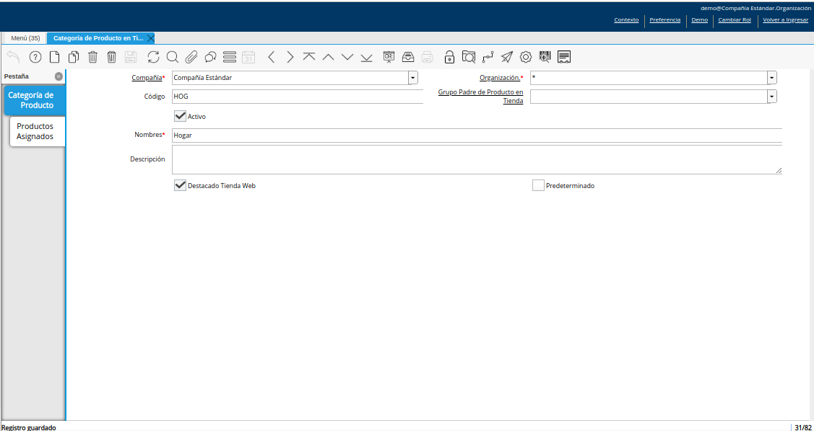
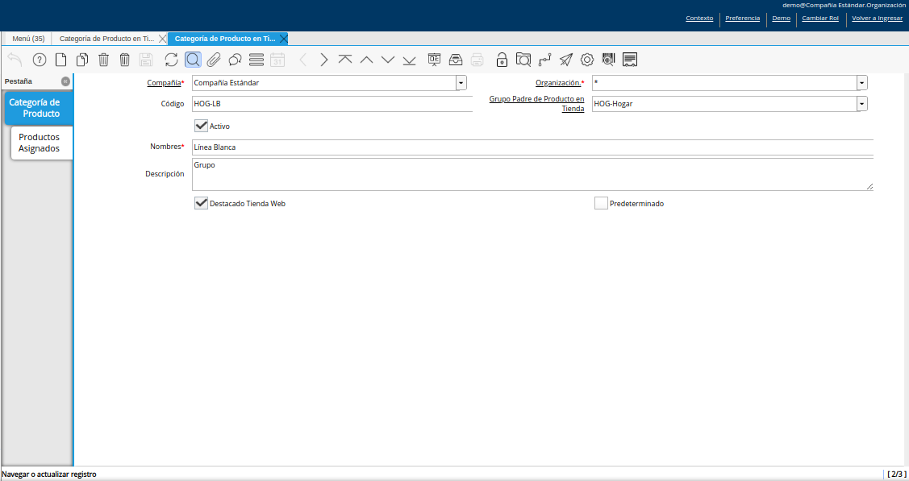
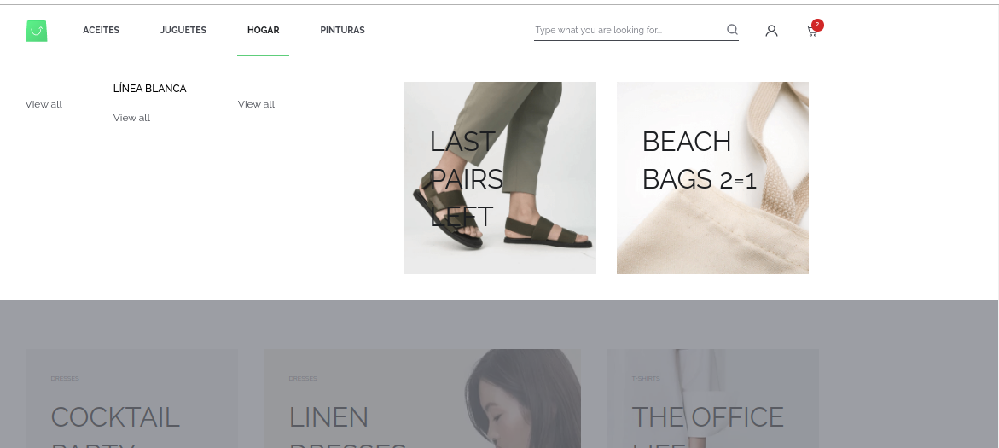
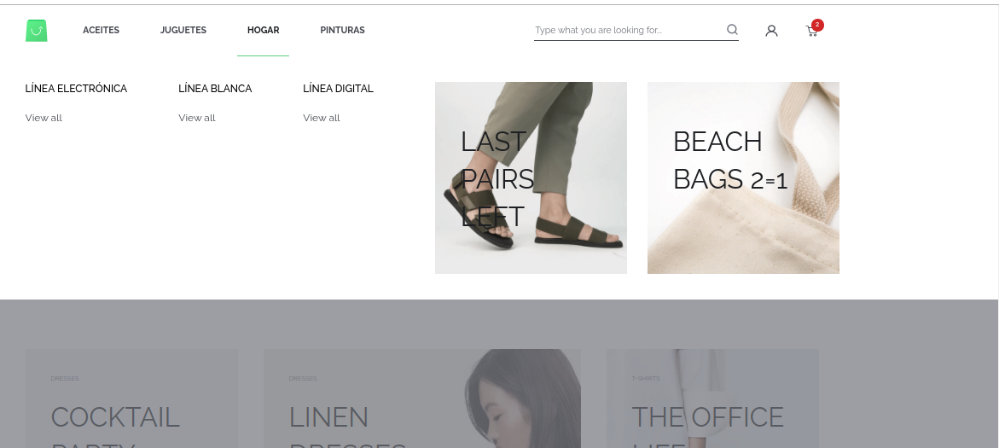
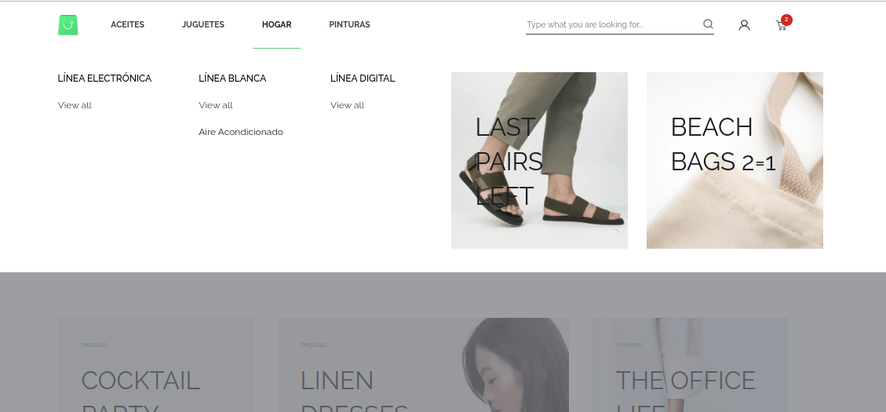
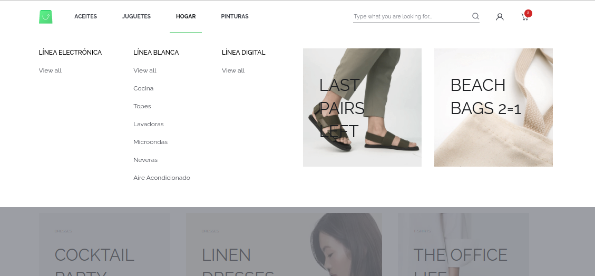
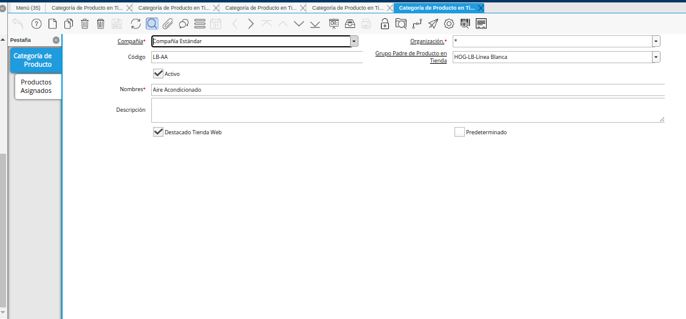
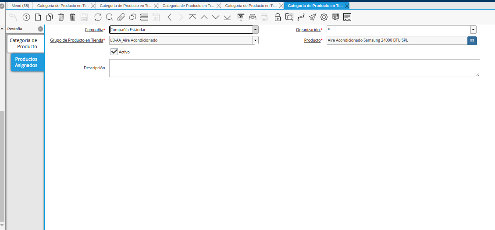

.. |menú de categoría de producto en tienda| image:: resources/product-category-menu-in-store.png

.. |categorías padres en el ecommerce| image:: resources/parent-categories-in-ecommerce.png

.. |registro de categoría hija o subgrupo| image:: resources/child-or-subgroup-category-record.png

.. |consulta de productos en el ecommerce| image:: resources/product-consultation-in-ecommerce.png

.. _documento/configuración-de-categorías-del-ecommerce-desde-adempiere:

**Configuración de Categorías desde ADempiere**
===============================================

Ubique y seleccione en el menú de ADempiere, la carpeta "**Definición de Tienda Web**", luego seleccione la ventana "**Categoría de Producto en Tienda**".

    |menú de categoría de producto en tienda|

    Imagen 1. Menú de ADempiere

Para ejemplificar en el presente documento el procedimiento de configuración del e-commerce desde ADempiere, se continua con el ejemplo expuesto anteriormente en la definición de las categorías del :ref:`e-Commerce`. Por lo tanto, se procede a crear las mismas de la siguiente manera:

.. _proceso/creación-de-categorías-padres:

**Creación de Categorías Padres**
---------------------------------

Al ubicarse en la ventana "**Categoría de Producto en Tienda**", se procede a crear en primera instancia las categorías padres asignando los siguientes datos:

    - "**Campo Código**": Para este caso se suele ingresar como código las iniciales de la categoría a registrar. Si está la compone varias palabras se agregan las iniciales, pero si se compone de una palabra se agregan las tres primeras letras, ejemplo:

        - Hogar: El código sería "HOG".

    - "**Campo Nombre**": Se agrega el nombre de la categoría, el mismo debe ser preciso y conciso ya que este será el nombre a mostrar en el e-commerce, ejemplo: 

        - Hogar.

    - "**Check Destacado Tienda Web**": Este check siempre debe estar activo para que dicho registro se pueda mostrar en el e-commerce.

    |registro de categoría padre|

    Imagen 2. Registro de Categoría Padre

.. note::

    En este punto no se asociaran los productos ya que este es una categoría padre, el cual será utilizada más adelante para asociar categorías hijas .

Al realizar dicho registro se procede a consultar el servicio donde se encuentra el e-commerce, donde se podrá observar la primera categoría padre.

    |consulta de categoría padre en el ecommerce|

    Imagen 3. Consulta de Categoría Padre en el e-commerce

Seguidamente, al haber registrado la primera categoría padre se pueden registrar las demás categorías padres que se deseen; continuando con la estructura de la megatienda, el menú del e-commerce quedaría de la siguiente forma.

    |categorías padres en el ecommerce|

    Imagen 4. Consulta de las Categorías Padres en el e-commerce

.. _proceso/creación-de-categorías-hijas-grupos:

**Creación de Categorías Hijas ó Grupos de Productos**
------------------------------------------------------

Luego de la creación de las categorías padres, se debe crear la categoría hija o los grupos de cada una de las categorías padres. Para ello, se ingresa el valor correspondiente en los siguientes campos de la ventana "**Categoría de Producto en Tienda**". En este ejemplo se crearan las categorías hijas de la categoría padre "**Hogar**".

    - "**Campo Código**": Se agrega el código de la categoría padre más el código de la categoría hija o grupo de producto que se esta registrando. El código debe seguir el mismo estándar si es una palabra se tomán las tres primera letras de la palabra, si este esta conformado por mas de una palabra se toman las iniciales, ejemplo:

        - La categoría hija a registrar es "**Línea Blanca**" y este pertenece a la categoría padre de "**Hogar**", por lo que el código a registrar en este caso sería: HOG-LB

    - "**Campo Nombre**": Se agrega el nombre de la categoría hija o grupo de producto, el mismo debe ser preciso y conciso ya que este será el nombre a mostrar en el e-commerce, ejemplo:

        - Línea Blanca

    - "**Campo Grupo Padre de Producto en Tienda**": Se debe asignar o llamar a la categoría padre, para este ejemplo la categoría padre es "Hogar". Este campo es el que definirá que la categoría a registrar es una categoría hija y esta asociada a una categoría padre.

    |registro de categoría hija|

    Imagen 5. Registro de Categoría Hija o Grupo de Producto

Una vez creada la categoría hija o grupo de producto, se procede a consultar el servicio del e-commerce donde se podrá observar la categoría hija.

    |consulta de categoría hija en el ecommerce|

    Imagen 6. Consulta de Categoría Hija en el e-commerce

Seguidamente, al haber registrado la primera categoría hija se pueden registrar las demás categorías hijas o grupos de productos que se deseen observar; continuando con la estructura de la megatienda, el menú del e-commerce quedaría de la siguiente forma.

    |categorías hijas en el ecommerce|

    Imagen 7. Consulta de las Categorías Hijas en el e-commerce

.. _proceso/creación-de-categorías-hijas-subgrupos:

**Creación de Categorías Hijas o Subgrupos de Productos**
---------------------------------------------------------

Al culminar el registro las categorías hijas o grupos de productos, en el caso de que las mismas contengan subgrupos, se deben registrar las categorías hijas o subgrupos de productos. Para ello, se ingresa el valor correspondiente en los siguientes campos de la ventana "**Categoría de Producto en Tienda**".

- "**Campo Código**": Se agrega el código de la categoría hija o grupo de producto que en este caso se comportaría como una categoría padre, más el código de la categoría hija o subgrupo de producto que se esta registrando. El código debe seguir el mismo estándar si es una palabra se tomán las tres primera letras de la palabra, si este esta conformado por más de una palabra se toman las iniciales, ejemplo:

    - La subcategoría hija a registrar es "**Aire Acondicionado**" el cual va a pertenecer a la categoría hija "**Línea Blanca**", el código a registrar en este caso sería: LB-AA

- "**Campo Nombre**": Se agrega el nombre de la subcategoría hija o subgrupo de producto, el mismo debe ser preciso y conciso ya que este será el nombre a mostrar en el e-commerce, ejemplo:

    - Aire Acondicionado.

- "**Campo Grupo Padre de Producto en Tienda**": Se debe asignar o llamar a la categoría hija o grupo de productos, para este ejemplo el grupo de productos es "Línea Blanca". Este campo es el que definirá que la categoría a registrar es una subcategoría hija y esta asociada a otra categoría hija.

    |registro de categoría hija o subgrupo|

    Imagen 8. Registro de Categoría Hija o Subgrupo de Producto

Una vez creada la categoría hija o subgrupo de producto, se procede a consultar el servicio del e-commerce donde se podrá observar la categoría hija.

    |consulta de categorías hijas o subgrupos de productos|

    Imagen 9. Consulta de Categoría Hija en el e-commerce

Seguidamente, al haber registrado la primera subcategoría hija se pueden registrar las demás subcategorías hijas o grupos de productos que se deseen observar; continuando con la estructura de la megatienda, el menú del e-commerce quedaría de la siguiente forma.

    |categorías hijas o subgrupos en el ecommerce|

    Imagen 10. Consulta de las Categorías Hijas en el e-commerce

.. _proceso/asociar-productos-a-categorías-hijas:

**Asociar Productos a las Categorías Hijas o Subgrupos de Productos**
---------------------------------------------------------------------

Si la categoría hija o subgrupo de productos mostrará el detalle de cada uno de los productos, estos deben ser asociadas en la pestaña "**Productos Asignados**" de cada subcategoría que se encuentre en la ventana "**Categoría de Producto en Tienda**", para este caso se deben realizar los siguientes pasos:

Ubicar en la ventana "**Categoría de Producto en Tienda**" la subcategoría hija a la que serán asociados los productos. Para este ejemplo se agregarán los productos a la subcategoría "**Aire Acondicionado**".

    |registro de categoría para asociar productos|

    Imagen 11. Registro de Categoría

Una vez ubicado en el registro de la categoría, seleccione la pestaña "**Productos Asignados**". Luego seleccione en el campo "**Producto**", el producto que requiere asociar a la categoría.

    |pestaña productos asignados y campo producto|

    Imagen 12. Pestaña Productos Asignados y Campo Producto

    .. note::

        Cada producto a asociar debe contar con una previa configuración personalizada, la misma se debe realizar desde la ventana "**Producto**", del servicio de ADempiere, ya que esto permite que muestre las imágenes, precio, nombre y descripción asociados al producto, como se indica en el proceso :ref:`documento/configuración-de-productos-del-ecommerce-desde-adempiere`.

Al asociar los productos a la subcategoría, se procede a consultar el servicio del e-commerce donde se podrá observar el producto.

    |consulta de productos en el ecommerce|

    Imagen 13. Consulta de Productos en el e-commerce