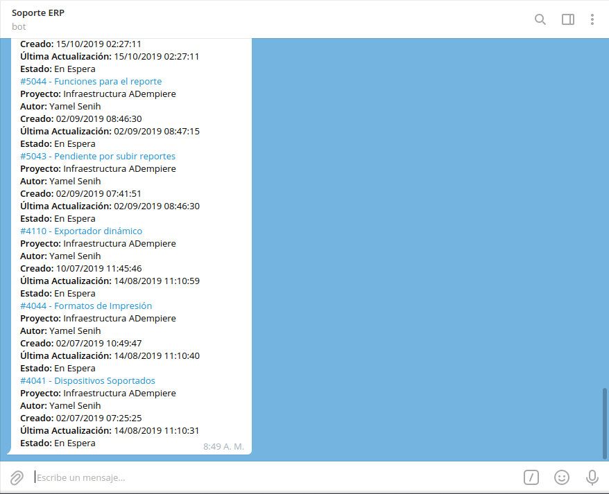

.. |mensaje principal por favor indique un comando| image:: resources/main-message-please-enter-a-command.png
.. |icono barra para indicar comando a ejecutar| image:: resources/bar-icon-to-indicate-command-to-execute.png
.. |opción consultar ticket| image:: resources/option-check-ticket.png
.. |criterios de búsqueda de la opción consultar ticket| image:: resources/search-criteria-for-the-option-check-ticket.png

.. _documento/consultar-tareas: 

**Consultar Tareas**
====================

Al abrir la conversación de **Soporte ERP**, seleccione la opción "**INICIAR**", ubicada en la parte inferior de la conversación. Posteriormente podrá visualizar un mensaje donde el bot indica que **Por favor ejecute un comando**.

    |mensaje principal por favor indique un comando|

    Imagen 1. Mensaje Principal "Por favor indique un comando"

Si desconoce el número de tarea que requiere consultar o simplemente requiere consultar todas las tareas que contiene el proyecto cuyos ticket se encuentran abiertos o cerrados. Puede realizar el siguiente procedimiento.

Se debe seleccionar el icono "**/**", ubicado del lado derecho del campo "**Mensaje**".

    |icono barra para indicar comando a ejecutar|

    Imagen 2. Icono Barra "/"

Luego de seleccionar el icono "**/**", podrá visualizar tres (3) opciones que representan diferentes comandos dentro de la conversación de **Soporte ERP**. Debe seleccionar la opción "**/consultar_ticket**", para consultar los diferentes ticket del proyecto según lo requerido por el usuario.

    |opción consultar ticket|

    Imagen 4. Opciones de Comandos a Ejecutar

Posteriormente, recibirá el mensaje "**Por favor seleccione un criterio de búsqueda**", con la finalidad de filtrar la información por "**Tickets Abiertos**", "**Tickets Cerrados**", "**Buscar por Estado**" o "**Asignado A**". 

    |criterios de búsqueda de la opción consultar ticket|

    Imagen 5. Criterios de Búsqueda

Al seleccionar cualquiera de los criterios de búsqueda, recibirá los mensajes con la información de las tareas según lo requerido por el usuario. 

    .. note::

        Para el presente ejmplo, fue seleccionado el criterio de búsqueda "**Tickets Abiertos**".

    |resultado de la consulta de las tareas|

    Imagen 6. Resultado de la Consulta